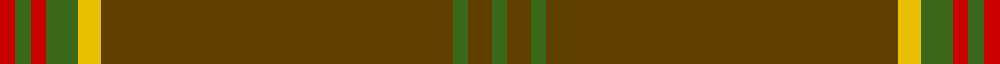

This is one **variant** — a specific cloth: this exact thread count and colourway, with its own
provenance below. It is one weaving of the [sett](/tartans/w/we/welsh-stanly-gpa/) (the scale-free proportion — the
same cloth at any scale or shade), whose colour order is pattern [GGGGYGRGR](/stripes/ggggygrgr/).

Part of the [Welsh, Stanly-Gpa](/tartans/w/we/welsh-stanly-gpa/) tartan — the named design grouping this sett with its other cloths.

Sourced from tartans-authority.  It is a [9 stripe tartan](/stripes/stripes9/).

Original link <code>http://www.tartansauthority.com/tartan-ferret/display/10388/</code> — retired · [Internet Archive copy](https://web.archive.org/web/*/http://www.tartansauthority.com/tartan-ferret/display/10388/*)

Dataset <small>— provenance for this record, inherited from the source manifest</small>

<dl class="dataset-prov">
<dt>source</dt><dd><a href="/sources/tartans-authority/">Scottish Tartans Authority</a></dd>
<dt>data captured from</dt><dd><a href="https://github.com/thetartan/tartan-database/blob/master/data/tartans-authority/data.csv">https://github.com/thetartan/tartan-database/blob/master/data/tartans-authority/data.csv</a></dd>
<dt>data date</dt><dd>10th March 2011 <small>(this record)</small></dd>
<dt>licence</dt><dd><a href="https://creativecommons.org/licenses/by-nc-nd/4.0/">CC BY-NC-ND 4.0</a></dd>
</dl>

Capture chain <small>— the hands this data passed through, oldest first; each capture carries its own licence</small>

<ol class="capture-chain">
<li><a href="https://www.tartansauthority.com/">Scottish Tartans Authority</a> <small>the heritage body’s archive — its tartan-ferret record browser is retired; dead record links are shown unlinked, with an Internet Archive copy (ITI numbers are not SRT references)</small></li>
<li><a href="https://github.com/thetartan/tartan-database">thetartan/tartan-database</a> <small>2016-2017</small> · <a href="https://creativecommons.org/licenses/by-nc-nd/4.0/">CC BY-NC-ND 4.0</a> <small>Levko Kravets's frozen compilation — the capture we vendored, and where its CC licence text came from</small></li>
<li>this dictionary <small>captured 2026-06-10 · commit 5bf86c7566</small> <small>each re-capture is a git commit to data/sources</small></li>
</ol>

## Register references

External register numbers recorded for this tartan.

- Scottish Register of Tartans: [10388](https://www.tartanregister.gov.uk/tartanDetails?ref=10388)
- Scottish Tartans Authority (ITI): 10388

## Thread count
R/4 G4 R4 G8 LY6 DY90 G4 DY6 G/4

One full sett is **252 threads**.

## Palette
<table><thead><tr><th>Colour</th><th>Shade</th><th>OKLCh</th></tr></thead><tbody><tr><td>G</td><td><code style="background-color:#008B2A;">#008B2A</code> <small style="color:#888">#008B2A</small></td><td><small style="color:#888">oklch(55.4% 0.170 145.9)</small></td></tr><tr><td>R</td><td><code style="background-color:#D60020;">#D60020</code> <small style="color:#888">#D60020</small></td><td><small style="color:#888">oklch(55.2% 0.224 25.5)</small></td></tr><tr><td>DY</td><td><code style="background-color:#3A2B0D;">#3A2B0D</code> <small style="color:#888">#3A2B0D</small></td><td><small style="color:#888">oklch(30.0% 0.049 82.0)</small></td></tr><tr><td>LY</td><td><code style="background-color:#DCBC32;">#DCBC32</code> <small style="color:#888">#DCBC32</small></td><td><small style="color:#888">oklch(80.0% 0.150 95.2)</small></td></tr></tbody></table>

# Sample pattern

## Nearest tartan variants

The nearest existing variants by ΔTartan distance, with this cloth at the top so the swatches line up against it.

ΔTartan

Threads

Variant

Sett

—

252

<a href="/variants/s9/r2g2r2g4ly3dy45g2dy3g2~x2/">Welsh, Stanly-Gpa (Personal)</a>

<a href="/ttd/edit/#slug=r2g2r2g4y3dy45g2dy3g2~x2&amp;base=r2g2r2g4ly3dy45g2dy3g2~x2" title="compare in the TTD">0.03</a>

252

<a href="/variants/s9/r2g2r2g4y3dy45g2dy3g2~x2/">Welsh Stanley–Gpa (Personal)</a>

<a href="/ttd/edit/#slug=y36dg4k1y2k1dg4k4dg60dr4dg4~x2&amp;base=r2g2r2g4ly3dy45g2dy3g2~x2" title="compare in the TTD">1.90</a>

400

<a href="/variants/s10/y36dg4k1y2k1dg4k4dg60dr4dg4~x2/">Orvis Sports Company (Corporate)</a>

<a href="/ttd/edit/#slug=dg5r3dg3ly2dg1lyi8dg24ly2~x2~ly2705081-lyi3104101&amp;base=r2g2r2g4ly3dy45g2dy3g2~x2" title="compare in the TTD">2.17</a>

178

<a href="/variants/s8/dg5r3dg3ly2dg1lyi8dg24ly2~x2~ly2705081-lyi3104101/">St. Christopher (Corporate)</a>

<a href="/ttd/edit/#slug=dg48r4dg2r4dg6r2dg3r9~x2&amp;base=r2g2r2g4ly3dy45g2dy3g2~x2" title="compare in the TTD">3.68</a>

198

<a href="/variants/s8/dg48r4dg2r4dg6r2dg3r9~x2/">Menzies (Clan)</a>

## Neighbour map

Every grey dot is one of 13656 variants placed by the first two principal components of the ΔTartan feature space (42% of its variance). Red is this tartan; blue dots are its nearest — click one to open its page. The map is a flat projection of a many-dimensional space — [how to read it](/posts/neighbourhood-maps/).

<svg viewBox="0 0 640 380" role="img" style="max-width:100%;height:auto;border:1px solid #e0e0e0;border-radius:4px;display:block" xmlns="http://www.w3.org/2000/svg"><image href="/nn/cloud.v1.png" width="640" height="380"/><a href="/variants/s9/r2g2r2g4y3dy45g2dy3g2~x2/"><circle cx="546.3" cy="128.3" r="4" fill="#3465a4"><title>Welsh Stanley–Gpa (Personal)</title></circle></a><a href="/variants/s10/y36dg4k1y2k1dg4k4dg60dr4dg4~x2/"><circle cx="442.0" cy="95.2" r="4" fill="#3465a4"><title>Orvis Sports Company (Corporate)</title></circle></a><a href="/variants/s8/dg5r3dg3ly2dg1lyi8dg24ly2~x2~ly2705081-lyi3104101/"><circle cx="414.0" cy="143.0" r="4" fill="#3465a4"><title>St. Christopher (Corporate)</title></circle></a><a href="/variants/s8/dg48r4dg2r4dg6r2dg3r9~x2/"><circle cx="560.8" cy="157.8" r="4" fill="#3465a4"><title>Menzies (Clan)</title></circle></a><circle cx="513.3" cy="117.3" r="5" fill="#c00000"/><text x="320" y="376" text-anchor="middle" font-size="11" fill="#999">ground</text><text x="11" y="190" text-anchor="middle" font-size="11" fill="#999" transform="rotate(-90 11 190)">complexity</text></svg>

ID: /variants/s9/r2g2r2g4ly3dy45g2dy3g2~x2/
