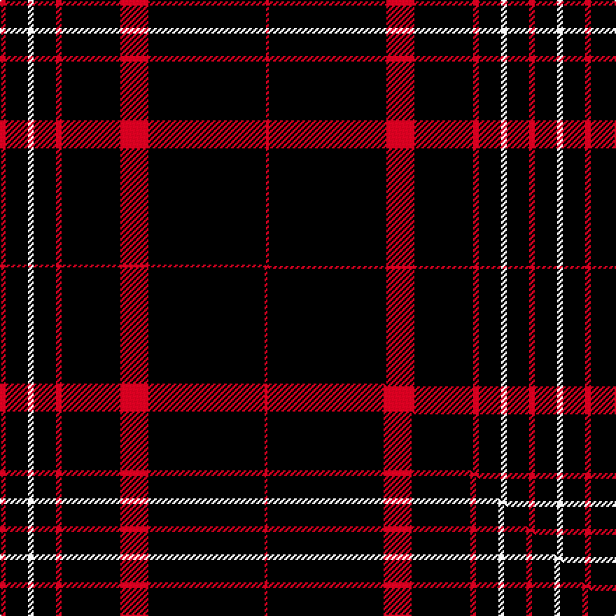

This is one **variant** — a specific cloth: this exact thread count and colourway, with its own
provenance below. It is one weaving of the [sett](/setts/r2k8w2k8r2k21r10k42r1/) (the scale-free proportion — the
same cloth at any scale or shade), whose colour order is pattern [RKRKRKWKR](/stripes/rkrkrkwkr/).

Part of the [Brand Ambassador](/tartans/b/br/brand-ambassador/) tartan — the named design grouping this sett with its other cloths.

Sourced from tartans-authority.  It is a [9 stripe tartan](/stripes/stripes9/).

Original link [https://www.tartanregister.gov.uk/tartanDetails.aspx?ref=10462](https://www.tartanregister.gov.uk/tartanDetails.aspx?ref=10462)

Dataset <small>— provenance for this record, inherited from the source manifest</small>

<dl class="dataset-prov">
<dt>source</dt><dd><a href="/sources/tartans-authority/">Scottish Tartans Authority</a></dd>
<dt>data captured from</dt><dd><a href="https://github.com/thetartan/tartan-database/blob/master/data/tartans-authority/data.csv">https://github.com/thetartan/tartan-database/blob/master/data/tartans-authority/data.csv</a></dd>
<dt>data date</dt><dd>15th July 2011 <small>(this record)</small></dd>
<dt>licence</dt><dd><a href="https://creativecommons.org/licenses/by-nc-nd/4.0/">CC BY-NC-ND 4.0</a></dd>
</dl>

Capture chain <small>— the hands this data passed through, oldest first; each capture carries its own licence</small>

<ol class="capture-chain">
<li><a href="https://www.tartansauthority.com/">Scottish Tartans Authority</a> <small>the heritage body's archive — its tartan-ferret record browser is retired (links repaired to the SRT, above)</small></li>
<li><a href="https://github.com/thetartan/tartan-database">thetartan/tartan-database</a> <small>2016-2017</small> · <a href="https://creativecommons.org/licenses/by-nc-nd/4.0/">CC BY-NC-ND 4.0</a> <small>Levko Kravets's frozen compilation — the capture we vendored, and where its CC licence text came from</small></li>
<li>this dictionary <small>captured 2026-06-10 · commit 5bf86c7566</small> <small>each re-capture is a git commit to data/sources</small></li>
</ol>

## Register references

External register numbers recorded for this tartan.

- Scottish Register of Tartans: [10462](https://www.tartanregister.gov.uk/tartanDetails?ref=10462)
- Scottish Tartans Authority (ITI): 10462

## Thread count
R/4 K16 W4 K16 R4 K42 R20 K84 R/2

One full sett is **378 threads**.

## Palette
<table><thead><tr><th>Colour</th><th>Shade</th><th>OKLCh</th></tr></thead><tbody><tr><td>K</td><td><code style="background-color:#000000;">#000000</code> <small style="color:#888">#000000</small></td><td><small style="color:#888">oklch(0.0% 0.000 0.0)</small></td></tr><tr><td>W</td><td><code style="background-color:#F7F7F7;">#F7F7F7</code> <small style="color:#888">#F7F7F7</small></td><td><small style="color:#888">oklch(97.6% 0.000 89.9)</small></td></tr><tr><td>R</td><td><code style="background-color:#D60020;">#D60020</code> <small style="color:#888">#D60020</small></td><td><small style="color:#888">oklch(55.2% 0.224 25.5)</small></td></tr></tbody></table>

# Sample pattern

## Compared to the master

This cloth is one sett of its design; the master sett (the exemplar the design is anchored on) is below for comparison.

Its **ΔTartan distance** from the master is **0.01** — the same measure the nearest-tartans table ranks by (0 is identical; a re-scale of the same cloth is near 0, a recolour or a different proportion further).

<figure class="master-compare" style="margin:0">

this sett
master sett ★

<figcaption style="color:#888;font-size:smaller">One weave of this sett against the <a href="/setts/r4k16w4k16r4k42r20k83r2/">master sett ★</a>, split on the diagonal: a shared proportion runs seamlessly across it with only the shades shifting; a different proportion breaks on it.</figcaption>
</figure>

## Nearest tartan variants

The nearest existing variants by ΔTartan distance, with this cloth at the top so the swatches line up against it.

ΔTartan

Threads

Variant

Sett

—

378

<a href="/variants/s9/r2k8w2k8r2k21r10k42r1~x2/">Brand Ambassador (Corporate)</a>

<a href="/ttd/edit/#slug=r4k16w4k16r4k42r20k83r2&amp;base=r2k8w2k8r2k21r10k42r1~x2" title="compare in the TTD">0.01</a>

376

<a href="/variants/s9/r4k16w4k16r4k42r20k83r2/">Brand Ambassador</a>

<a href="/ttd/edit/#slug=k64r1k4r1k6r7w2r7k6lb2~x2&amp;base=r2k8w2k8r2k21r10k42r1~x2" title="compare in the TTD">1.22</a>

268

<a href="/variants/s10/k64r1k4r1k6r7w2r7k6lb2~x2/">Noordermeer (Personal)</a>

<a href="/ttd/edit/#slug=dr40k1dr3k1w3k4w3k1dr3k1dr40k4~x2&amp;base=r2k8w2k8r2k21r10k42r1~x2" title="compare in the TTD">1.70</a>

328

<a href="/variants/s12/dr40k1dr3k1w3k4w3k1dr3k1dr40k4~x2/">Salt Lake County District Tartan</a>

<a href="/ttd/edit/#slug=k94r3k6r3k8r15k2y3~x2&amp;base=r2k8w2k8r2k21r10k42r1~x2" title="compare in the TTD">1.90</a>

342

<a href="/variants/s8/k94r3k6r3k8r15k2y3~x2/">Royal Army Physical Training Corps Association (Scotland)</a>

<a href="/ttd/edit/#slug=r7k3r3k22r3k3r3k37dy2k4~x2&amp;base=r2k8w2k8r2k21r10k42r1~x2" title="compare in the TTD">1.97</a>

326

<a href="/variants/s10/r7k3r3k22r3k3r3k37dy2k4~x2/">Maier (Personal)</a>

<a href="/ttd/edit/#slug=k59r3k6r3k8r15k2dy3~x2&amp;base=r2k8w2k8r2k21r10k42r1~x2" title="compare in the TTD">2.09</a>

272

<a href="/variants/s8/k59r3k6r3k8r15k2dy3~x2/">Royal Army PTC Assoc. (Military)</a>

<a href="/ttd/edit/#slug=k25w1dt3w1k31dt3k31w2r9~x2~dt1700000&amp;base=r2k8w2k8r2k21r10k42r1~x2" title="compare in the TTD">2.30</a>

356

<a href="/variants/s9/k25w1n3w1k31n3k31w2r9~x2~n1700000/">Savannah Harley Davidson</a>

<a href="/ttd/edit/#slug=k25w1n3w1k31n3k31w2r9~x2&amp;base=r2k8w2k8r2k21r10k42r1~x2" title="compare in the TTD">2.31</a>

356

<a href="/variants/s9/k25w1n3w1k31n3k31w2r9~x2/">Savannah Harley Davidson (Corporate)</a>

<a href="/ttd/edit/#slug=k198lr9k17lb13lr9k4lr13k4&amp;base=r2k8w2k8r2k21r10k42r1~x2" title="compare in the TTD">2.32</a>

332

<a href="/variants/s8/k198lr9k17lb13lr9k4lr13k4/">London Fog Black (Fashion)</a>

<a href="/ttd/edit/#slug=k50w4k10r2k2w2r2k14r11k2r4w2~x2&amp;base=r2k8w2k8r2k21r10k42r1~x2" title="compare in the TTD">2.41</a>

316

<a href="/variants/s12/k50w4k10r2k2w2r2k14r11k2r4w2~x2/">Knights Templar Dress (Corporate)</a>

## Neighbour map

Every grey dot is one of 13621 variants placed by the first two principal components of the ΔTartan feature space (42% of its variance). Red is this tartan; blue dots are its nearest — click one to open its page.

<svg viewBox="0 0 640 380" role="img" style="max-width:100%;height:auto;border:1px solid #e0e0e0;border-radius:4px;display:block" xmlns="http://www.w3.org/2000/svg"><image href="/nn/cloud.v1.png" width="640" height="380"/><a href="/variants/s9/r4k16w4k16r4k42r20k83r2/"><circle cx="507.6" cy="96.5" r="4" fill="#3465a4"><title>Brand Ambassador</title></circle></a><a href="/variants/s10/k64r1k4r1k6r7w2r7k6lb2~x2/"><circle cx="494.4" cy="40.4" r="4" fill="#3465a4"><title>Noordermeer (Personal)</title></circle></a><a href="/variants/s12/dr40k1dr3k1w3k4w3k1dr3k1dr40k4~x2/"><circle cx="557.6" cy="75.0" r="4" fill="#3465a4"><title>Salt Lake County District Tartan</title></circle></a><a href="/variants/s8/k94r3k6r3k8r15k2y3~x2/"><circle cx="545.2" cy="70.6" r="4" fill="#3465a4"><title>Royal Army Physical Training Corps Association (Scotland)</title></circle></a><a href="/variants/s10/r7k3r3k22r3k3r3k37dy2k4~x2/"><circle cx="471.3" cy="118.9" r="4" fill="#3465a4"><title>Maier (Personal)</title></circle></a><a href="/variants/s8/k59r3k6r3k8r15k2dy3~x2/"><circle cx="468.9" cy="99.2" r="4" fill="#3465a4"><title>Royal Army PTC Assoc. (Military)</title></circle></a><a href="/variants/s9/k25w1n3w1k31n3k31w2r9~x2~n1700000/"><circle cx="471.5" cy="104.0" r="4" fill="#3465a4"><title>Savannah Harley Davidson</title></circle></a><a href="/variants/s9/k25w1n3w1k31n3k31w2r9~x2/"><circle cx="469.6" cy="103.5" r="4" fill="#3465a4"><title>Savannah Harley Davidson (Corporate)</title></circle></a><a href="/variants/s8/k198lr9k17lb13lr9k4lr13k4/"><circle cx="534.0" cy="59.3" r="4" fill="#3465a4"><title>London Fog Black (Fashion)</title></circle></a><a href="/variants/s12/k50w4k10r2k2w2r2k14r11k2r4w2~x2/"><circle cx="419.2" cy="83.2" r="4" fill="#3465a4"><title>Knights Templar Dress (Corporate)</title></circle></a><circle cx="509.2" cy="95.7" r="5" fill="#c00000"/><text x="320" y="376" text-anchor="middle" font-size="11" fill="#999">ground</text><text x="11" y="190" text-anchor="middle" font-size="11" fill="#999" transform="rotate(-90 11 190)">complexity</text></svg>

ID: /variants/s9/r2k8w2k8r2k21r10k42r1~x2/
