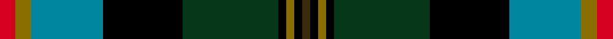

This page is one **sett** — a single exact thread-count. It belongs to the [tartan](/setts/r2y2t9k10dg12k1y1k1dy1/)
(the same proportion at any scale), whose colour order is pattern [GKGKGKBGR](/stripes/gkgkgkbgr/).

Sourced from register-of-tartans.  It is a [9 stripe tartan](/stripes/stripes9/).

Original link https://www.tartanregister.gov.uk/tartanDetails.aspx?ref=4144

2 attestations — the source records this cloth was collapsed from (oldest owns this page)

<ul>
<li>01/01/1997 — Trades House (register-of-tartans, <a href="https://www.tartanregister.gov.uk/tartanDetails.aspx?ref=4144">record</a>)  <em>Designed by Lochcarron of Scotland in September 1997 for Gordon M Wyllie of Biggart Baille, Solicitors, 310 St.Vincent Street, Glasgow. He intends to gift the rights to this tartan to the Trades House of Glasgow, incorporated in 1605 with the right to wear the tartan reserved for himself and others nonimated. Protected as a Registered Design.</em></li>
<li>1997 — Trades House (Corporate) (tartans-authority, <a href="https://www.tartanregister.gov.uk/tartanDetails.aspx?ref=4036">record</a>)  <em>Designed by Lochcarron of Scotland in September 1997 for Gordon M Wyllie of Biggart Baille, Solicitors, 310 St.Vincent Street, Glasgow. He intends to gift the rights to this tartan to the Trades House of Glasgow, incorporated in 1605 with the right to wear the tartan reserved for himself and others nonimated. Protected as a Registered Design.</em></li>
</ul>

Dataset <small>— provenance for this record, inherited from the source manifest</small>

<dl class="dataset-prov">
<dt>source</dt><dd><a href="/sources/register-of-tartans/">Scottish Register of Tartans</a></dd>
<dt>data captured from</dt><dd><a href="https://github.com/thetartan/tartan-database/blob/master/data/register-of-tartans/data.csv">https://github.com/thetartan/tartan-database/blob/master/data/register-of-tartans/data.csv</a></dd>
<dt>data date</dt><dd>1997 <small>(this record)</small></dd>
<dt>licence</dt><dd><a href="https://www.tartanregister.gov.uk/copyright">Crown copyright</a></dd>
</dl>

Capture chain <small>— the hands this data passed through, oldest first; each capture carries its own licence</small>

<ol class="capture-chain">
<li><a href="https://www.tartanregister.gov.uk/">Scottish Register of Tartans</a> · <a href="https://www.tartanregister.gov.uk/copyright">Crown copyright</a> <small>the living register — still published by National Records of Scotland</small></li>
<li><a href="https://github.com/thetartan/tartan-database">thetartan/tartan-database</a> <small>2016-2017</small> · <a href="https://creativecommons.org/licenses/by-nc-nd/4.0/">CC BY-NC-ND 4.0</a> <small>Levko Kravets's frozen compilation — the capture we vendored, and where its CC licence text came from</small></li>
<li>this dictionary <small>captured 2026-06-10 · commit 5bf86c7566</small> <small>each re-capture is a git commit to data/sources</small></li>
</ol>

## Register references

External register numbers recorded for this tartan.

- Scottish Register of Tartans: [4144](https://www.tartanregister.gov.uk/tartanDetails.aspx?ref=4144)
- Scottish Tartans Authority (ITI): 4036

## Thread count
R/8 Y8 T36 K40 DG48 K4 Y4 K4 DY/4

One full sett is **300 threads**.

## Palette
<table><thead><tr><th>Colour</th><th>Shade</th><th>OKLCh</th></tr></thead><tbody><tr><td>T</td><td><code style="background-color:#00879F;">#00879F</code> <small style="color:#888">#00879F</small></td><td><small style="color:#888">oklch(57.4% 0.102 216.1)</small></td></tr><tr><td>DG</td><td><code style="background-color:#053819;">#053819</code> <small style="color:#888">#053819</small></td><td><small style="color:#888">oklch(30.0% 0.075 151.3)</small></td></tr><tr><td>K</td><td><code style="background-color:#000000;">#000000</code> <small style="color:#888">#000000</small></td><td><small style="color:#888">oklch(0.0% 0.000 0.0)</small></td></tr><tr><td>Y</td><td><code style="background-color:#8B6E00;">#8B6E00</code> <small style="color:#888">#8B6E00</small></td><td><small style="color:#888">oklch(55.1% 0.113 90.4)</small></td></tr><tr><td>R</td><td><code style="background-color:#D60020;">#D60020</code> <small style="color:#888">#D60020</small></td><td><small style="color:#888">oklch(55.2% 0.224 25.5)</small></td></tr><tr><td>DY</td><td><code style="background-color:#3A2B0D;">#3A2B0D</code> <small style="color:#888">#3A2B0D</small></td><td><small style="color:#888">oklch(30.0% 0.049 82.0)</small></td></tr></tbody></table>

# Sample pattern

## Nearest tartan variants

The nearest existing variants by ΔTartan distance, with this cloth at the top so the swatches line up against it.

ΔTartan

Threads

Variant

Sett

—

300

<a href="/variants/s9/r2y2t9k10dg12k1y1k1dy1~x4/">Trades House</a>

<a href="/ttd/edit/#slug=r3db3k2db18ly2k25g20r2g3lb3~x2&amp;base=r2y2t9k10dg12k1y1k1dy1~x4" title="compare in the TTD">1.62</a>

312

<a href="/variants/s10/r3db3k2db18ly2k25g20r2g3lb3~x2/">Loch Freuchie (District)</a>

<a href="/ttd/edit/#slug=r3db3k2db13y2k25g20r2g3lb3~x2&amp;base=r2y2t9k10dg12k1y1k1dy1~x4" title="compare in the TTD">1.64</a>

292

<a href="/variants/s10/r3db3k2db13y2k25g20r2g3lb3~x2/">Loch Freuchie</a>

<a href="/ttd/edit/#slug=k3db10k2w1k2g10k2dg10r1dg2~x4&amp;base=r2y2t9k10dg12k1y1k1dy1~x4" title="compare in the TTD">1.66</a>

324

<a href="/variants/s10/k3db10k2w1k2g10k2dg10r1dg2~x4/">Rutledge (Name)</a>

<a href="/ttd/edit/#slug=k3db10k2w1k2g10k2dg10r1dg1~x4&amp;base=r2y2t9k10dg12k1y1k1dy1~x4" title="compare in the TTD">1.67</a>

320

<a href="/variants/s10/k3db10k2w1k2g10k2dg10r1dg1~x4/">Rutledge</a>

<a href="/ttd/edit/#slug=r3db3k2db13k27g20r2g3lb3~x2&amp;base=r2y2t9k10dg12k1y1k1dy1~x4" title="compare in the TTD">1.81</a>

292

<a href="/variants/s9/r3db3k2db13k27g20r2g3lb3~x2/">Loch Freuchie District Tartan</a>

<a href="/ttd/edit/#slug=r1g3t1g5k1g1k9db12w1~x4~t2402222-db1004274&amp;base=r2y2t9k10dg12k1y1k1dy1~x4" title="compare in the TTD">1.84</a>

264

<a href="/variants/s9/r1g3t1g5k1g1k9db12w1~x4~t2402222-db1004274/">St Andrews Golf Club</a>

<a href="/ttd/edit/#slug=y3k2r3db20k24g20r3k2lb3~x2&amp;base=r2y2t9k10dg12k1y1k1dy1~x4" title="compare in the TTD">1.86</a>

308

<a href="/variants/s9/y3k2r3db20k24g20r3k2lb3~x2/">Loch Awe</a>

<a href="/ttd/edit/#slug=ly3k2r3db20k24g20r3k2lb3~x2&amp;base=r2y2t9k10dg12k1y1k1dy1~x4" title="compare in the TTD">1.86</a>

308

<a href="/variants/s9/ly3k2r3db20k24g20r3k2lb3~x2/">Loch Awe</a>

<a href="/ttd/edit/#slug=y3db29k15r4g25r8k4r3w2~x2&amp;base=r2y2t9k10dg12k1y1k1dy1~x4" title="compare in the TTD">2.02</a>

362

<a href="/variants/s9/y3db29k15r4g25r8k4r3w2~x2/">George Brown</a>

<a href="/ttd/edit/#slug=g4lb3g18k14o2k2dp18ly1dp2ly3~x2~o2203076-ly2705081&amp;base=r2y2t9k10dg12k1y1k1dy1~x4" title="compare in the TTD">2.04</a>

254

<a href="/variants/s10/g4lb3g18k14y2k2dp18ly1dp2ly3~x2~y2203076-ly2705081/">Caisteal Leòdhais</a>

## Neighbour map

Every grey dot is one of 13620 variants placed by the first two principal components of the ΔTartan feature space (42% of its variance). Red is this tartan; blue dots are its nearest — click one to open its page.

<svg viewBox="0 0 640 380" role="img" style="max-width:100%;height:auto;border:1px solid #e0e0e0;border-radius:4px;display:block" xmlns="http://www.w3.org/2000/svg"><image href="/nn/cloud.v1.png" width="640" height="380"/><a href="/variants/s10/r3db3k2db18ly2k25g20r2g3lb3~x2/"><circle cx="106.6" cy="122.5" r="4" fill="#3465a4"><title>Loch Freuchie (District)</title></circle></a><a href="/variants/s10/r3db3k2db13y2k25g20r2g3lb3~x2/"><circle cx="115.3" cy="121.4" r="4" fill="#3465a4"><title>Loch Freuchie</title></circle></a><a href="/variants/s10/k3db10k2w1k2g10k2dg10r1dg2~x4/"><circle cx="81.7" cy="155.1" r="4" fill="#3465a4"><title>Rutledge (Name)</title></circle></a><a href="/variants/s10/k3db10k2w1k2g10k2dg10r1dg1~x4/"><circle cx="76.9" cy="152.0" r="4" fill="#3465a4"><title>Rutledge</title></circle></a><a href="/variants/s9/r3db3k2db13k27g20r2g3lb3~x2/"><circle cx="108.9" cy="117.1" r="4" fill="#3465a4"><title>Loch Freuchie District Tartan</title></circle></a><a href="/variants/s9/r1g3t1g5k1g1k9db12w1~x4~t2402222-db1004274/"><circle cx="124.6" cy="131.9" r="4" fill="#3465a4"><title>St Andrews Golf Club</title></circle></a><a href="/variants/s9/y3k2r3db20k24g20r3k2lb3~x2/"><circle cx="105.8" cy="130.0" r="4" fill="#3465a4"><title>Loch Awe</title></circle></a><a href="/variants/s9/ly3k2r3db20k24g20r3k2lb3~x2/"><circle cx="102.0" cy="128.8" r="4" fill="#3465a4"><title>Loch Awe</title></circle></a><a href="/variants/s9/y3db29k15r4g25r8k4r3w2~x2/"><circle cx="95.1" cy="128.8" r="4" fill="#3465a4"><title>George Brown</title></circle></a><a href="/variants/s10/g4lb3g18k14y2k2dp18ly1dp2ly3~x2~y2203076-ly2705081/"><circle cx="117.5" cy="114.6" r="4" fill="#3465a4"><title>Caisteal Leòdhais</title></circle></a><circle cx="111.1" cy="139.1" r="5" fill="#c00000"/><text x="320" y="376" text-anchor="middle" font-size="11" fill="#999">ground</text><text x="11" y="190" text-anchor="middle" font-size="11" fill="#999" transform="rotate(-90 11 190)">complexity</text></svg>

ID: /variants/s9/r2y2t9k10dg12k1y1k1dy1~x4/
