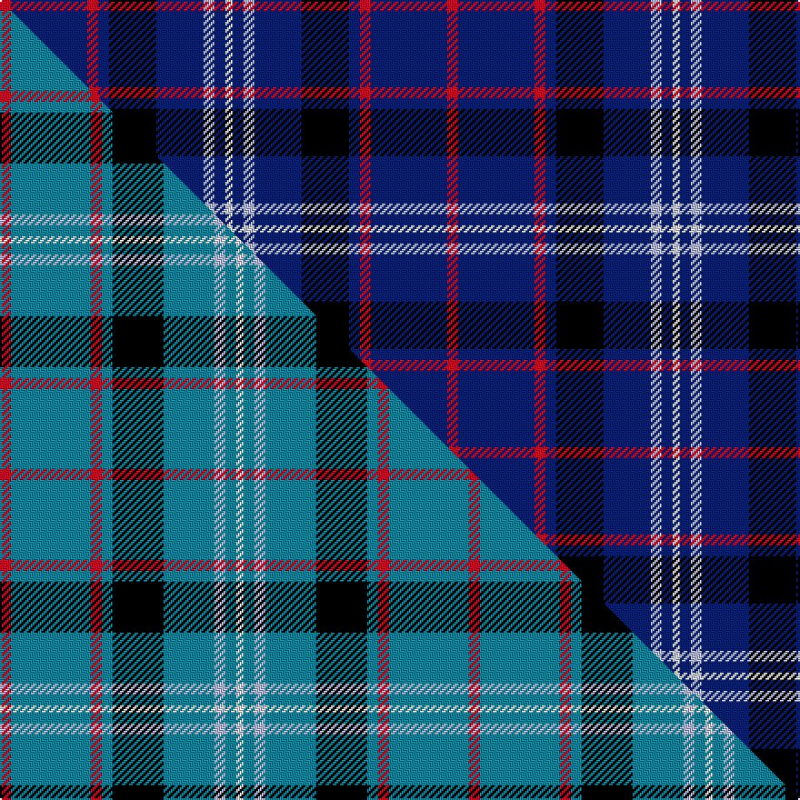

This page is one **sett** — a single exact thread-count. It belongs to the [tartan](/setts/r3db21r3db3k13db13lb3db3w2/)
(the same proportion at any scale), whose colour order is pattern [RBRBKBWBW](/stripes/rbrbkbwbw/).

Part of the [Fitzgerald](/tartans/fitzgerald/) tartan — the named design grouping this sett with its other cloths.

Sourced from weddslist.  It is a [9 stripe tartan](/stripes/stripes9/).

Original link http://www.weddslist.com/cgi-bin/tartans/pg.pl?source=sts

## Provenance

Earliest known date: pre 2003 One of four Fitzgerald tartans all apparently designed by Robert P. Fitzgerald of Philadelphia. Starting with this variation of Robertson, he then designed the blue and hunting as color variations and a further "fancy dress" version.

2 attestations — the source records this cloth was collapsed from (oldest owns this page)

<ul>
<li>undated — Fitzgerald, Blue (weddslist, <a href="http://www.weddslist.com/cgi-bin/tartans/pg.pl?source=sts">record</a>) </li>
<li>undated — Fitzgerald Blue Irish Family Tartan (house-of-tartan, <a href="http://www.house-of-tartan.scotland.net/house/TartanViewjs.asp?colr=Def&tnam=1419">record</a>) </li>
</ul>

## Thread count
R/6 DB42 R6 DB6 K26 DB26 LB6 DB6 W/4

One full sett is **246 threads**.

## Palette
<table><thead><tr><th>Colour</th><th>Shade</th><th>OKLCh</th></tr></thead><tbody><tr><td>DB</td><td><code style="background-color:#082077;">#082077</code> <small style="color:#888">#082077</small></td><td><small style="color:#888">oklch(30.0% 0.149 265.1)</small></td></tr><tr><td>LB</td><td><code style="background-color:#B5BBDE;">#B5BBDE</code> <small style="color:#888">#B5BBDE</small></td><td><small style="color:#888">oklch(79.9% 0.050 277.6)</small></td></tr><tr><td>K</td><td><code style="background-color:#000000;">#000000</code> <small style="color:#888">#000000</small></td><td><small style="color:#888">oklch(0.0% 0.000 0.0)</small></td></tr><tr><td>W</td><td><code style="background-color:#F7F7F7;">#F7F7F7</code> <small style="color:#888">#F7F7F7</small></td><td><small style="color:#888">oklch(97.6% 0.000 89.9)</small></td></tr><tr><td>R</td><td><code style="background-color:#D60020;">#D60020</code> <small style="color:#888">#D60020</small></td><td><small style="color:#888">oklch(55.2% 0.224 25.5)</small></td></tr></tbody></table>

# Sample pattern

## Compared to the master

This cloth is one sett of its design; the master sett (the exemplar the design is anchored on) is below for comparison.

Its **ΔTartan distance** from the master is **0.27** — the same measure the nearest-tartans table ranks by (0 is identical; a re-scale of the same cloth is near 0, a recolour or a different proportion further).

<figure class="master-compare" style="margin:0">

this sett
master sett ★

<figcaption style="color:#888;font-size:smaller">One weave of this sett against the <a href="/setts/r3t22r3t3k14t14lb3t3w2/">master sett ★</a>, split on the diagonal: a shared proportion runs seamlessly across it with only the shades shifting; a different proportion breaks on it.</figcaption>
</figure>

## Nearest tartan variants

The nearest existing variants by ΔTartan distance, with this cloth at the top so the swatches line up against it.

ΔTartan

Threads

Variant

Sett

—

246

<a href="/variants/s9/r3db21r3db3k13db13lb3db3w2~x2/">Fitzgerald, Blue</a>

<a href="/ttd/edit/#slug=db65k9db21y8db21w8db35r35&amp;base=r3db21r3db3k13db13lb3db3w2~x2" title="compare in the TTD">1.49</a>

304

<a href="/variants/s8/db65k9db21y8db21w8db35r35/">Maud, Mary</a>

<a href="/ttd/edit/#slug=db42k6db3k3db3w5db17w7dy10k3~x2&amp;base=r3db21r3db3k13db13lb3db3w2~x2" title="compare in the TTD">1.87</a>

306

<a href="/variants/s10/db42k6db3k3db3w5db17w7dy10k3~x2/">California Riverside, University of (Corporate)</a>

<a href="/ttd/edit/#slug=db42k6db3k3db3w5db17w7ly10k3~x2&amp;base=r3db21r3db3k13db13lb3db3w2~x2" title="compare in the TTD">1.87</a>

306

<a href="/variants/s10/db42k6db3k3db3w5db17w7ly10k3~x2/">California Riverside, Uni. (Corp)</a>

<a href="/ttd/edit/#slug=db8k3db26k11lb3db8r4db8lb3k2w3~x2&amp;base=r3db21r3db3k13db13lb3db3w2~x2" title="compare in the TTD">2.04</a>

294

<a href="/variants/s11/db8k3db26k11lb3db8r4db8lb3k2w3~x2/">Dublin Lie-ins (Corporate)</a>

<a href="/ttd/edit/#slug=db10k1g2k2lb3k2g2k1db10w1~x8&amp;base=r3db21r3db3k13db13lb3db3w2~x2" title="compare in the TTD">2.13</a>

456

<a href="/variants/s10/db10k1g2k2lb3k2g2k1db10w1~x8/">Isle of Harris</a>

<a href="/ttd/edit/#slug=r10db4r6db30k10db5w2~x2&amp;base=r3db21r3db3k13db13lb3db3w2~x2" title="compare in the TTD">2.14</a>

244

<a href="/variants/s7/r10db4r6db30k10db5w2~x2/">Heritage of Wales (Fashion)</a>

<a href="/ttd/edit/#slug=k22b16dr3b16k2b16g3b3lb5~x2&amp;base=r3db21r3db3k13db13lb3db3w2~x2" title="compare in the TTD">2.27</a>

290

<a href="/variants/s9/k22b16dr3b16k2b16g3b3lb5~x2/">Jethart (District)</a>

<a href="/ttd/edit/#slug=dr4y4db9w3y2k9db21y2db2y2db8y3~x2&amp;base=r3db21r3db3k13db13lb3db3w2~x2" title="compare in the TTD">2.27</a>

262

<a href="/variants/s12/dr4y4db9w3y2k9db21y2db2y2db8y3~x2/">Ruxton, dress</a>

<a href="/ttd/edit/#slug=r4dy4db9w3dy2k9db21dy2db2dy2db8dy3~x2&amp;base=r3db21r3db3k13db13lb3db3w2~x2" title="compare in the TTD">2.38</a>

262

<a href="/variants/s12/r4dy4db9w3dy2k9db21dy2db2dy2db8dy3~x2/">Ruxton Dress</a>

<a href="/ttd/edit/#slug=k22db16r3db16k3db16dg3db3b5~x2&amp;base=r3db21r3db3k13db13lb3db3w2~x2" title="compare in the TTD">2.38</a>

294

<a href="/variants/s9/k22db16r3db16k3db16dg3db3b5~x2/">Jethart</a>

## Neighbour map

Every grey dot is one of 13620 variants placed by the first two principal components of the ΔTartan feature space (42% of its variance). Red is this tartan; blue dots are its nearest — click one to open its page.

<svg viewBox="0 0 640 380" role="img" style="max-width:100%;height:auto;border:1px solid #e0e0e0;border-radius:4px;display:block" xmlns="http://www.w3.org/2000/svg"><image href="/nn/cloud.v1.png" width="640" height="380"/><a href="/variants/s8/db65k9db21y8db21w8db35r35/"><circle cx="328.7" cy="185.3" r="4" fill="#3465a4"><title>Maud, Mary</title></circle></a><a href="/variants/s10/db42k6db3k3db3w5db17w7dy10k3~x2/"><circle cx="327.1" cy="133.9" r="4" fill="#3465a4"><title>California Riverside, University of (Corporate)</title></circle></a><a href="/variants/s10/db42k6db3k3db3w5db17w7ly10k3~x2/"><circle cx="314.7" cy="130.8" r="4" fill="#3465a4"><title>California Riverside, Uni. (Corp)</title></circle></a><a href="/variants/s11/db8k3db26k11lb3db8r4db8lb3k2w3~x2/"><circle cx="283.2" cy="136.9" r="4" fill="#3465a4"><title>Dublin Lie-ins (Corporate)</title></circle></a><a href="/variants/s10/db10k1g2k2lb3k2g2k1db10w1~x8/"><circle cx="244.0" cy="146.2" r="4" fill="#3465a4"><title>Isle of Harris</title></circle></a><a href="/variants/s7/r10db4r6db30k10db5w2~x2/"><circle cx="296.8" cy="162.0" r="4" fill="#3465a4"><title>Heritage of Wales (Fashion)</title></circle></a><a href="/variants/s9/k22b16dr3b16k2b16g3b3lb5~x2/"><circle cx="248.1" cy="164.8" r="4" fill="#3465a4"><title>Jethart (District)</title></circle></a><a href="/variants/s12/dr4y4db9w3y2k9db21y2db2y2db8y3~x2/"><circle cx="250.3" cy="146.6" r="4" fill="#3465a4"><title>Ruxton, dress</title></circle></a><a href="/variants/s12/r4dy4db9w3dy2k9db21dy2db2dy2db8dy3~x2/"><circle cx="264.2" cy="150.2" r="4" fill="#3465a4"><title>Ruxton Dress</title></circle></a><a href="/variants/s9/k22db16r3db16k3db16dg3db3b5~x2/"><circle cx="280.0" cy="195.0" r="4" fill="#3465a4"><title>Jethart</title></circle></a><circle cx="280.6" cy="154.2" r="5" fill="#c00000"/><text x="320" y="376" text-anchor="middle" font-size="11" fill="#999">ground</text><text x="11" y="190" text-anchor="middle" font-size="11" fill="#999" transform="rotate(-90 11 190)">complexity</text></svg>

ID: /variants/s9/r3db21r3db3k13db13lb3db3w2~x2/
