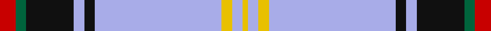

This page is one **sett** — a single exact thread-count. It belongs to the [tartan](/setts/r3g2k9lb2k2lb24ly2lb2ly1/)
(the same proportion at any scale), whose colour order is pattern [RGKWKWYWY](/stripes/rgkwkwywy/).

Part of the [Bell](/tartans/bell/) tartan — the named design grouping this sett with its other cloths.

Sourced from house-of-tartan.  It is a [9 stripe tartan](/stripes/stripes9/).

Original link http://www.house-of-tartan.scotland.net/house/TartanViewjs.asp?colr=Def&tnam=1489

## Provenance

Earliest known date: 1984 Designed for William H. Bell, Colonel, USAF Ret., President of the Bell Family Association of the United States (Clan Bell). The Bells are one of the eight great riding Clans of the Borders.

## Thread count
R/6 G4 K18 LP4 K4 LP48 Y4 LP4 Y/2

One full sett is **180 threads**.

## Palette

Palette: <strong>Tartan Register</strong>
<table><thead><tr><th>Colour</th><th>Threads</th><th>Shade</th><th>Base</th><th>OKLCh</th></tr></thead><tbody><tr><td>R/</td><td style="text-align:right;font-variant-numeric:tabular-nums">6</td><td><code style="background-color:#C80000;">#C80000</code> <small style="color:#888">#C80000</small></td><td>R <code style="background-color:#CC0000;">#CC0000</code></td><td><small style="color:#888">oklch(52.3% 0.215 29.2)</small></td></tr><tr><td>G</td><td style="text-align:right;font-variant-numeric:tabular-nums">4</td><td><code style="background-color:#00643C;">#00643C</code> <small style="color:#888">#00643C</small></td><td>G <code style="background-color:#006100;">#006100</code></td><td><small style="color:#888">oklch(44.3% 0.104 157.7)</small></td></tr><tr><td>K</td><td style="text-align:right;font-variant-numeric:tabular-nums">18</td><td><code style="background-color:#101010;">#101010</code> <small style="color:#888">#101010</small></td><td>K <code style="background-color:#000000;">#000000</code></td><td><small style="color:#888">oklch(17.3% 0.000 89.9)</small></td></tr><tr><td>LP</td><td style="text-align:right;font-variant-numeric:tabular-nums">4</td><td><code style="background-color:#A8ACE8;">#A8ACE8</code> <small style="color:#888">#A8ACE8</small></td><td>W <code style="background-color:#F7F7F7;">#F7F7F7</code></td><td><small style="color:#888">oklch(76.3% 0.086 281.2)</small></td></tr><tr><td>K</td><td style="text-align:right;font-variant-numeric:tabular-nums">4</td><td><code style="background-color:#101010;">#101010</code> <small style="color:#888">#101010</small></td><td>K <code style="background-color:#000000;">#000000</code></td><td><small style="color:#888">oklch(17.3% 0.000 89.9)</small></td></tr><tr><td>LP</td><td style="text-align:right;font-variant-numeric:tabular-nums">48</td><td><code style="background-color:#A8ACE8;">#A8ACE8</code> <small style="color:#888">#A8ACE8</small></td><td>W <code style="background-color:#F7F7F7;">#F7F7F7</code></td><td><small style="color:#888">oklch(76.3% 0.086 281.2)</small></td></tr><tr><td>Y</td><td style="text-align:right;font-variant-numeric:tabular-nums">4</td><td><code style="background-color:#E8C000;">#E8C000</code> <small style="color:#888">#E8C000</small></td><td>Y <code style="background-color:#F2BF00;">#F2BF00</code></td><td><small style="color:#888">oklch(81.9% 0.168 93.7)</small></td></tr><tr><td>LP</td><td style="text-align:right;font-variant-numeric:tabular-nums">4</td><td><code style="background-color:#A8ACE8;">#A8ACE8</code> <small style="color:#888">#A8ACE8</small></td><td>W <code style="background-color:#F7F7F7;">#F7F7F7</code></td><td><small style="color:#888">oklch(76.3% 0.086 281.2)</small></td></tr><tr><td>Y/</td><td style="text-align:right;font-variant-numeric:tabular-nums">2</td><td><code style="background-color:#E8C000;">#E8C000</code> <small style="color:#888">#E8C000</small></td><td>Y <code style="background-color:#F2BF00;">#F2BF00</code></td><td><small style="color:#888">oklch(81.9% 0.168 93.7)</small></td></tr></tbody></table>

## Compared to the master

This cloth is one sett of its design; the master sett (the exemplar the design is anchored on) is below for comparison.

<figure style="margin:0"><figcaption style="color:#888;font-size:smaller">this sett</figcaption></figure>
<figure style="margin:0"><figcaption style="color:#888;font-size:smaller"><a href="/setts/dt7k2dt7w1k2w1k8dg2w3r10w3dg2k8w1dt11k2lr3k2/">master sett →</a></figcaption></figure>

## Nearest tartans

The nearest existing variants by ΔTartan distance, with this tartan at the top so the swatches line up against it.

ΔTartan

Tartan

Sett

—

<a href="/ttd/edit/#slug=r3g2k9lb2k2lb24ly2lb2ly1~x2">Bell Family Tartan</a> <a class="nn-out" href="/variants/s9/r3g2k9lb2k2lb24ly2lb2ly1~x2/" title="open its dictionary page">↗</a>

1.05

<a href="/ttd/edit/#slug=r3g2k9b2k2b24ly2b2ly1~x2&amp;base=r3g2k9lb2k2lb24ly2lb2ly1~x2">Bell of the Borders.</a> <a class="nn-out" href="/variants/s9/r3g2k9b2k2b24ly2b2ly1~x2/" title="open its dictionary page">↗</a>

1.08

<a href="/ttd/edit/#slug=lb50db6lo2db3lb2db3y8dy8db2dy8lb2~x2&amp;base=r3g2k9lb2k2lb24ly2lb2ly1~x2">Renfrew #2</a> <a class="nn-out" href="/variants/s11/lb50db6lo2db3lb2db3y8dy8db2dy8lb2~x2/" title="open its dictionary page">↗</a>

1.12

<a href="/ttd/edit/#slug=r3g2k9lr2k2lr24ly2lr2ly1~x4&amp;base=r3g2k9lb2k2lb24ly2lb2ly1~x2">Bell of the Borders</a> <a class="nn-out" href="/variants/s9/r3g2k9lr2k2lr24ly2lr2ly1~x4/" title="open its dictionary page">↗</a>

1.13

<a href="/ttd/edit/#slug=w49dg11r2dg3w2dy10m9dg2m6w2~x2&amp;base=r3g2k9lb2k2lb24ly2lb2ly1~x2">Strathyre dress</a> <a class="nn-out" href="/variants/s10/w49dg11r2dg3w2dy10m9dg2m6w2~x2/" title="open its dictionary page">↗</a>

1.22

<a href="/ttd/edit/#slug=lb52k12r3k3lb3k3do10n8k3n3lb3~x2&amp;base=r3g2k9lb2k2lb24ly2lb2ly1~x2">Stewart Dress, Grey #1 (Fashion)</a> <a class="nn-out" href="/variants/s11/lb52k12r3k3lb3k3do10n8k3n3lb3~x2/" title="open its dictionary page">↗</a>

1.23

<a href="/ttd/edit/#slug=lo3db4w10dg2w2dg5db34ly3~x2&amp;base=r3g2k9lb2k2lb24ly2lb2ly1~x2">Royal Troon Golf Club, The</a> <a class="nn-out" href="/variants/s8/lo3db4w10dg2w2dg5db34ly3~x2/" title="open its dictionary page">↗</a>

1.26

<a href="/ttd/edit/#slug=w8lb2db52r2db3r2db3r3db2r3db2r8lb8ly8&amp;base=r3g2k9lb2k2lb24ly2lb2ly1~x2">Kiltwalk</a> <a class="nn-out" href="/variants/s14/w8lb2db52r2db3r2db3r3db2r3db2r8lb8ly8/" title="open its dictionary page">↗</a>

1.27

<a href="/ttd/edit/#slug=lb26k7y1k1lb1k1y5dp3k1dp2lb1~x4&amp;base=r3g2k9lb2k2lb24ly2lb2ly1~x2">Grotto Dove</a> <a class="nn-out" href="/variants/s11/lb26k7y1k1lb1k1y5dp3k1dp2lb1~x4/" title="open its dictionary page">↗</a>

1.28

<a href="/ttd/edit/#slug=w72db20ly2db3w2db3y16dy6db2dy5w2~x2&amp;base=r3g2k9lb2k2lb24ly2lb2ly1~x2">Stuart/Stewart Dress Blue</a> <a class="nn-out" href="/variants/s11/w72db20ly2db3w2db3y16dy6db2dy5w2~x2/" title="open its dictionary page">↗</a>

1.29

<a href="/ttd/edit/#slug=lo1n8lb2k15lb20r1lb1r1lb8n3lb1~x2&amp;base=r3g2k9lb2k2lb24ly2lb2ly1~x2">Harris (Personal)</a> <a class="nn-out" href="/variants/s11/lo1n8lb2k15lb20r1lb1r1lb8n3lb1~x2/" title="open its dictionary page">↗</a>

## Neighbour map

Every grey dot is one of 14360 variants placed by the first two principal components of the ΔTartan feature space (44% of its variance). Red is this tartan; blue dots are its nearest — click one to open its page.

<svg viewBox="0 0 640 380" role="img" style="max-width:100%;height:auto;border:1px solid #e0e0e0;border-radius:4px;display:block" xmlns="http://www.w3.org/2000/svg"><image href="/nn/cloud.v1.png" width="640" height="380"/><a href="/variants/s9/r3g2k9b2k2b24ly2b2ly1~x2/"><circle cx="316.7" cy="96.5" r="4" fill="#3465a4"><title>Bell of the Borders.</title></circle></a><a href="/variants/s11/lb50db6lo2db3lb2db3y8dy8db2dy8lb2~x2/"><circle cx="317.1" cy="74.3" r="4" fill="#3465a4"><title>Renfrew #2</title></circle></a><a href="/variants/s9/r3g2k9lr2k2lr24ly2lr2ly1~x4/"><circle cx="307.9" cy="92.2" r="4" fill="#3465a4"><title>Bell of the Borders</title></circle></a><a href="/variants/s10/w49dg11r2dg3w2dy10m9dg2m6w2~x2/"><circle cx="279.2" cy="73.0" r="4" fill="#3465a4"><title>Strathyre dress</title></circle></a><a href="/variants/s11/lb52k12r3k3lb3k3do10n8k3n3lb3~x2/"><circle cx="271.4" cy="83.3" r="4" fill="#3465a4"><title>Stewart Dress, Grey #1 (Fashion)</title></circle></a><a href="/variants/s8/lo3db4w10dg2w2dg5db34ly3~x2/"><circle cx="303.1" cy="118.0" r="4" fill="#3465a4"><title>Royal Troon Golf Club, The</title></circle></a><a href="/variants/s14/w8lb2db52r2db3r2db3r3db2r3db2r8lb8ly8/"><circle cx="321.1" cy="60.4" r="4" fill="#3465a4"><title>Kiltwalk</title></circle></a><a href="/variants/s11/lb26k7y1k1lb1k1y5dp3k1dp2lb1~x4/"><circle cx="327.2" cy="83.3" r="4" fill="#3465a4"><title>Grotto Dove</title></circle></a><a href="/variants/s11/w72db20ly2db3w2db3y16dy6db2dy5w2~x2/"><circle cx="312.0" cy="47.8" r="4" fill="#3465a4"><title>Stuart/Stewart Dress Blue</title></circle></a><a href="/variants/s11/lo1n8lb2k15lb20r1lb1r1lb8n3lb1~x2/"><circle cx="254.5" cy="101.9" r="4" fill="#3465a4"><title>Harris (Personal)</title></circle></a><circle cx="318.0" cy="91.9" r="5" fill="#c00000"/></svg>

ID: /variants/s9/r3g2k9lb2k2lb24ly2lb2ly1~x2/
