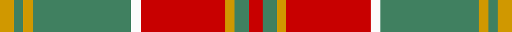

This is one **variant** — a specific cloth: this exact thread count and colourway, with its own
provenance below. It is one weaving of the [sett](/setts/r3g3lo2r18w2g21lo2g2lo3/) (the scale-free proportion — the
same cloth at any scale or shade), whose colour order is pattern [RGYRWGYGY](/stripes/rgyrwgygy/).

Part of the [MacDonald of Kingsburgh](/tartans/m/ma/macdonald-of-kingsburgh-2/) tartan — the named design grouping this sett with its other cloths.

Sourced from register-of-tartans.  It is a [9 stripe tartan](/stripes/stripes9/).

Original link [https://www.tartanregister.gov.uk/tartanDetails.aspx?ref=2364](https://www.tartanregister.gov.uk/tartanDetails.aspx?ref=2364)

Dataset <small>— provenance for this record, inherited from the source manifest</small>

<dl class="dataset-prov">
<dt>source</dt><dd><a href="/sources/register-of-tartans/">Scottish Register of Tartans</a></dd>
<dt>data captured from</dt><dd><a href="https://github.com/thetartan/tartan-database/blob/master/data/register-of-tartans/data.csv">https://github.com/thetartan/tartan-database/blob/master/data/register-of-tartans/data.csv</a></dd>
<dt>data date</dt><dd>1893 <small>(this record)</small></dd>
<dt>licence</dt><dd><a href="https://www.tartanregister.gov.uk/copyright">Crown copyright</a></dd>
</dl>

Capture chain <small>— the hands this data passed through, oldest first; each capture carries its own licence</small>

<ol class="capture-chain">
<li><a href="https://www.tartanregister.gov.uk/">Scottish Register of Tartans</a> · <a href="https://www.tartanregister.gov.uk/copyright">Crown copyright</a> <small>the living register — still published by National Records of Scotland</small></li>
<li><a href="https://github.com/thetartan/tartan-database">thetartan/tartan-database</a> <small>2016-2017</small> · <a href="https://creativecommons.org/licenses/by-nc-nd/4.0/">CC BY-NC-ND 4.0</a> <small>Levko Kravets's frozen compilation — the capture we vendored, and where its CC licence text came from</small></li>
<li>this dictionary <small>captured 2026-06-10 · commit 5bf86c7566</small> <small>each re-capture is a git commit to data/sources</small></li>
</ol>

## Register references

External register numbers recorded for this tartan.

- Scottish Register of Tartans: [2364](https://www.tartanregister.gov.uk/tartanDetails.aspx?ref=2364)
- Scottish Tartans Authority (ITI): 1562
- Scottish Tartans World Register: 1562

## Thread count
LO/6 G4 LO4 G42 W4 R36 LO4 G6 R/6

One full sett is **212 threads**.

## Palette
<table><thead><tr><th>Colour</th><th>Shade</th><th>OKLCh</th></tr></thead><tbody><tr><td>LO</td><td><code style="background-color:#FF9C34;">#FF9C34</code> <small style="color:#888">#FF9C34</small></td><td><small style="color:#888">oklch(77.9% 0.161 61.8)</small></td></tr><tr><td>G</td><td><code style="background-color:#008B2A;">#008B2A</code> <small style="color:#888">#008B2A</small></td><td><small style="color:#888">oklch(55.4% 0.170 145.9)</small></td></tr><tr><td>R</td><td><code style="background-color:#D60020;">#D60020</code> <small style="color:#888">#D60020</small></td><td><small style="color:#888">oklch(55.2% 0.224 25.5)</small></td></tr><tr><td>W</td><td><code style="background-color:#F7F7F7;">#F7F7F7</code> <small style="color:#888">#F7F7F7</small></td><td><small style="color:#888">oklch(97.6% 0.000 89.9)</small></td></tr></tbody></table>

# Sample pattern

## Nearest tartan variants

The nearest existing variants by ΔTartan distance, with this cloth at the top so the swatches line up against it.

ΔTartan

Threads

Variant

Sett

—

212

<a href="/variants/s9/r3g3lo2r18w2g21lo2g2lo3~x2/">MacDonald of Kingsburgh</a>

<a href="/ttd/edit/#slug=r3g3y1r18w1g21y1g1y3~x2&amp;base=r3g3lo2r18w2g21lo2g2lo3~x2" title="compare in the TTD">1.40</a>

196

<a href="/variants/s9/r3g3y1r18w1g21y1g1y3~x2/">MacDonald of Kingsburgh Clan Tartan</a>

<a href="/ttd/edit/#slug=r30g3db5g21r3g21db2~x2&amp;base=r3g3lo2r18w2g21lo2g2lo3~x2" title="compare in the TTD">1.83</a>

276

<a href="/variants/s7/r30g3db5g21r3g21db2~x2/">Scottish Piping Soc. of London (Corp</a>

<a href="/ttd/edit/#slug=g18w3y1r2y1r3y1r10~x4&amp;base=r3g3lo2r18w2g21lo2g2lo3~x2" title="compare in the TTD">1.98</a>

200

<a href="/variants/s8/g18w3y1r2y1r3y1r10~x4/">Brisbane (Artefact)</a>

<a href="/ttd/edit/#slug=lo28r3lo3db5lo3g3r3g12r3g3lo6db3~x2~lo2706066-r2109032&amp;base=r3g3lo2r18w2g21lo2g2lo3~x2" title="compare in the TTD">2.07</a>

238

<a href="/variants/s12/lo28r3lo3db5lo3g3r3g12r3g3lo6db3~x2~lo2706066-r2109032/">Bird of Paradise</a>

<a href="/ttd/edit/#slug=r2dr1r10dr2g10w1g2~x2&amp;base=r3g3lo2r18w2g21lo2g2lo3~x2" title="compare in the TTD">2.12</a>

104

<a href="/variants/s7/r2dr1r10dr2g10w1g2~x2/">Lennox District Tartan</a>

<a href="/ttd/edit/#slug=lo28r3lo3db5lo3g3r3g12r3g3lo6db3~x2&amp;base=r3g3lo2r18w2g21lo2g2lo3~x2" title="compare in the TTD">2.18</a>

238

<a href="/variants/s12/lo28r3lo3db5lo3g3r3g12r3g3lo6db3~x2/">Bird of Paradise (Fashion)</a>

<a href="/ttd/edit/#slug=r2dr1r10dr2g10lr1g2~x4&amp;base=r3g3lo2r18w2g21lo2g2lo3~x2" title="compare in the TTD">2.18</a>

208

<a href="/variants/s7/r2dr1r10dr2g10lr1g2~x4/">Lennox</a>

<a href="/ttd/edit/#slug=ri2r1ri10r2g10w1g2~x2~ri2008029-r1506028&amp;base=r3g3lo2r18w2g21lo2g2lo3~x2" title="compare in the TTD">2.22</a>

104

<a href="/variants/s7/ri2r1ri10r2g10w1g2~x2~ri2008029-r1506028/">Lennox</a>

<a href="/ttd/edit/#slug=g18lb3y1r2y1r3y1r10~x4&amp;base=r3g3lo2r18w2g21lo2g2lo3~x2" title="compare in the TTD">2.23</a>

200

<a href="/variants/s8/g18lb3y1r2y1r3y1r10~x4/">Brisbane (Artefact)</a>

<a href="/ttd/edit/#slug=g5r4g17lt5r32lt5g17r4g5w2~x2&amp;base=r3g3lo2r18w2g21lo2g2lo3~x2" title="compare in the TTD">2.35</a>

370

<a href="/variants/s10/g5r4g17lt5r32lt5g17r4g5w2~x2/">Wilson's No.005</a>

## Neighbour map

Every grey dot is one of 13621 variants placed by the first two principal components of the ΔTartan feature space (42% of its variance). Red is this tartan; blue dots are its nearest — click one to open its page. The map is a flat projection of a many-dimensional space — [how to read it](/posts/neighbourhood-maps/).

<svg viewBox="0 0 640 380" role="img" style="max-width:100%;height:auto;border:1px solid #e0e0e0;border-radius:4px;display:block" xmlns="http://www.w3.org/2000/svg"><image href="/nn/cloud.v1.png" width="640" height="380"/><a href="/variants/s9/r3g3y1r18w1g21y1g1y3~x2/"><circle cx="355.5" cy="152.6" r="4" fill="#3465a4"><title>MacDonald of Kingsburgh Clan Tartan</title></circle></a><a href="/variants/s7/r30g3db5g21r3g21db2~x2/"><circle cx="349.7" cy="207.8" r="4" fill="#3465a4"><title>Scottish Piping Soc. of London (Corp</title></circle></a><a href="/variants/s8/g18w3y1r2y1r3y1r10~x4/"><circle cx="308.2" cy="162.5" r="4" fill="#3465a4"><title>Brisbane (Artefact)</title></circle></a><a href="/variants/s12/lo28r3lo3db5lo3g3r3g12r3g3lo6db3~x2~lo2706066-r2109032/"><circle cx="314.4" cy="176.6" r="4" fill="#3465a4"><title>Bird of Paradise</title></circle></a><a href="/variants/s7/r2dr1r10dr2g10w1g2~x2/"><circle cx="275.2" cy="202.2" r="4" fill="#3465a4"><title>Lennox District Tartan</title></circle></a><a href="/variants/s12/lo28r3lo3db5lo3g3r3g12r3g3lo6db3~x2/"><circle cx="283.9" cy="166.3" r="4" fill="#3465a4"><title>Bird of Paradise (Fashion)</title></circle></a><a href="/variants/s7/r2dr1r10dr2g10lr1g2~x4/"><circle cx="285.3" cy="204.8" r="4" fill="#3465a4"><title>Lennox</title></circle></a><a href="/variants/s7/ri2r1ri10r2g10w1g2~x2~ri2008029-r1506028/"><circle cx="283.1" cy="203.5" r="4" fill="#3465a4"><title>Lennox</title></circle></a><a href="/variants/s8/g18lb3y1r2y1r3y1r10~x4/"><circle cx="327.9" cy="169.0" r="4" fill="#3465a4"><title>Brisbane (Artefact)</title></circle></a><a href="/variants/s10/g5r4g17lt5r32lt5g17r4g5w2~x2/"><circle cx="294.3" cy="175.0" r="4" fill="#3465a4"><title>Wilson's No.005</title></circle></a><circle cx="293.5" cy="179.9" r="5" fill="#c00000"/><text x="320" y="376" text-anchor="middle" font-size="11" fill="#999">ground</text><text x="11" y="190" text-anchor="middle" font-size="11" fill="#999" transform="rotate(-90 11 190)">complexity</text></svg>

ID: /variants/s9/r3g3lo2r18w2g21lo2g2lo3~x2/
