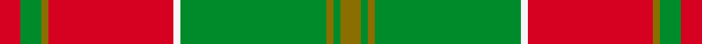

This page is one **sett** — a single exact thread-count. It belongs to the [tartan](/setts/r3g3y1r18w1g21y1g1y3/)
(the same proportion at any scale), whose colour order is pattern [GGGGWRGGR](/stripes/ggggwrggr/).

Sourced from weddslist.  It is a [9 stripe tartan](/stripes/stripes9/).

Original link http://www.weddslist.com/cgi-bin/tartans/pg.pl?source=sts

## Provenance

Earliest known date: 1746 D.W.Stewart recorded this pattern from a relic, worn by Prince Charles Edward, and hidden in a cleft of a rock, to be recovered later and eventually preserved in the Advocates' Library in Edinburgh.

2 attestations — the source records this cloth was collapsed from (oldest owns this page)

<ul>
<li>undated — MacDonald of Kingsburgh (weddslist, <a href="http://www.weddslist.com/cgi-bin/tartans/pg.pl?source=sts">record</a>) </li>
<li>undated — MacDonald of Kingsburgh Clan Tartan (house-of-tartan, <a href="http://www.house-of-tartan.scotland.net/house/TartanViewjs.asp?colr=Def&tnam=1562">record</a>) </li>
</ul>

Dataset <small>— provenance for this record, inherited from the source manifest</small>

<dl class="dataset-prov">
<dt>source</dt><dd><a href="/sources/weddslist/">Weddslist</a></dd>
<dt>data captured from</dt><dd><a href="https://github.com/thetartan/tartan-database/blob/master/data/weddslist/data.csv">https://github.com/thetartan/tartan-database/blob/master/data/weddslist/data.csv</a></dd>
<dt>data date</dt><dd>2016-11-17 <small>(dataset default)</small></dd>
<dt>licence</dt><dd><a href="https://creativecommons.org/licenses/by-nc-nd/4.0/">CC BY-NC-ND 4.0</a></dd>
</dl>

Capture chain <small>— the hands this data passed through, oldest first; each capture carries its own licence</small>

<ol class="capture-chain">
<li><a href="https://www.weddslist.com/tartans/">Weddslist</a> <small>the living privately compiled reference</small></li>
<li><a href="https://github.com/thetartan/tartan-database">thetartan/tartan-database</a> <small>2016-2017</small> · <a href="https://creativecommons.org/licenses/by-nc-nd/4.0/">CC BY-NC-ND 4.0</a> <small>Levko Kravets's frozen compilation — the capture we vendored, and where its CC licence text came from</small></li>
<li>this dictionary <small>captured 2026-06-10 · commit 5bf86c7566</small> <small>each re-capture is a git commit to data/sources</small></li>
</ol>

## Thread count
R/6 G6 Y2 R36 W2 G42 Y2 G2 Y/6

One full sett is **196 threads**.

## Palette
<table><thead><tr><th>Colour</th><th>Shade</th><th>OKLCh</th></tr></thead><tbody><tr><td>G</td><td><code style="background-color:#008B2A;">#008B2A</code> <small style="color:#888">#008B2A</small></td><td><small style="color:#888">oklch(55.4% 0.170 145.9)</small></td></tr><tr><td>W</td><td><code style="background-color:#F7F7F7;">#F7F7F7</code> <small style="color:#888">#F7F7F7</small></td><td><small style="color:#888">oklch(97.6% 0.000 89.9)</small></td></tr><tr><td>R</td><td><code style="background-color:#D60020;">#D60020</code> <small style="color:#888">#D60020</small></td><td><small style="color:#888">oklch(55.2% 0.224 25.5)</small></td></tr><tr><td>Y</td><td><code style="background-color:#8B6E00;">#8B6E00</code> <small style="color:#888">#8B6E00</small></td><td><small style="color:#888">oklch(55.1% 0.113 90.4)</small></td></tr></tbody></table>

# Sample pattern

## Nearest tartan variants

The nearest existing variants by ΔTartan distance, with this cloth at the top so the swatches line up against it.

ΔTartan

Threads

Variant

Sett

—

196

<a href="/variants/s9/r3g3y1r18w1g21y1g1y3~x2/">MacDonald of Kingsburgh</a>

<a href="/ttd/edit/#slug=w5g1w1g33y3r24g3r4~x2&amp;base=r3g3y1r18w1g21y1g1y3~x2" title="compare in the TTD">1.25</a>

278

<a href="/variants/s8/w5g1w1g33y3r24g3r4~x2/">Sutherland de Albergaria Dress (Personal)</a>

<a href="/ttd/edit/#slug=r3g3lo2r18w2g21lo2g2lo3~x2&amp;base=r3g3y1r18w1g21y1g1y3~x2" title="compare in the TTD">1.40</a>

212

<a href="/variants/s9/r3g3lo2r18w2g21lo2g2lo3~x2/">MacDonald of Kingsburgh</a>

<a href="/ttd/edit/#slug=g15y3g27r2g2r33t2w1t4~x2&amp;base=r3g3y1r18w1g21y1g1y3~x2" title="compare in the TTD">1.74</a>

318

<a href="/variants/s9/g15y3g27r2g2r33t2w1t4~x2/">Longmore (Name)</a>

<a href="/ttd/edit/#slug=r4g4lo4g12r22lo1g4~x4&amp;base=r3g3y1r18w1g21y1g1y3~x2" title="compare in the TTD">1.80</a>

376

<a href="/variants/s7/r4g4lo4g12r22lo1g4~x4/">Spice Apple</a>

<a href="/ttd/edit/#slug=r30g3db5g21r3g21db2~x2&amp;base=r3g3y1r18w1g21y1g1y3~x2" title="compare in the TTD">1.84</a>

276

<a href="/variants/s7/r30g3db5g21r3g21db2~x2/">Scottish Piping Soc. of London (Corp</a>

<a href="/ttd/edit/#slug=r2db1g2db1g19db2r27g2~x2&amp;base=r3g3y1r18w1g21y1g1y3~x2" title="compare in the TTD">2.00</a>

216

<a href="/variants/s8/r2db1g2db1g19db2r27g2~x2/">Thomas of Wales</a>

<a href="/ttd/edit/#slug=g18lb3y1r2y1r3y1r10~x4&amp;base=r3g3y1r18w1g21y1g1y3~x2" title="compare in the TTD">2.17</a>

200

<a href="/variants/s8/g18lb3y1r2y1r3y1r10~x4/">Brisbane (Artefact)</a>

<a href="/ttd/edit/#slug=ri4r10g7r70g7r4dp21r4g85r4g7r10ri4~ri2406019-r2109032&amp;base=r3g3y1r18w1g21y1g1y3~x2" title="compare in the TTD">2.27</a>

466

<a href="/variants/s13/ri4r10g7r70g7r4dp21r4g85r4g7r10ri4~ri2406019-r2109032/">Crieff District Tartan</a>

<a href="/ttd/edit/#slug=g21r2w1y3r2g5r21y1ly1y1r1g8~x2~y2405105-ly3307090&amp;base=r3g3y1r18w1g21y1g1y3~x2" title="compare in the TTD">2.28</a>

210

<a href="/variants/s12/g21r2w1y3r2g5r21y1ly1y1r1g8~x2~y2405105-ly3307090/">Glendronach</a>

<a href="/ttd/edit/#slug=r1g14r1g1r14g1w1~x2&amp;base=r3g3y1r18w1g21y1g1y3~x2" title="compare in the TTD">2.33</a>

128

<a href="/variants/s7/r1g14r1g1r14g1w1~x2/">MacKintosh Fragment</a>

## Neighbour map

Every grey dot is one of 13620 variants placed by the first two principal components of the ΔTartan feature space (42% of its variance). Red is this tartan; blue dots are its nearest — click one to open its page.

<svg viewBox="0 0 640 380" role="img" style="max-width:100%;height:auto;border:1px solid #e0e0e0;border-radius:4px;display:block" xmlns="http://www.w3.org/2000/svg"><image href="/nn/cloud.v1.png" width="640" height="380"/><a href="/variants/s8/w5g1w1g33y3r24g3r4~x2/"><circle cx="346.0" cy="134.1" r="4" fill="#3465a4"><title>Sutherland de Albergaria Dress (Personal)</title></circle></a><a href="/variants/s9/r3g3lo2r18w2g21lo2g2lo3~x2/"><circle cx="293.4" cy="179.6" r="4" fill="#3465a4"><title>MacDonald of Kingsburgh</title></circle></a><a href="/variants/s9/g15y3g27r2g2r33t2w1t4~x2/"><circle cx="348.0" cy="128.6" r="4" fill="#3465a4"><title>Longmore (Name)</title></circle></a><a href="/variants/s7/r4g4lo4g12r22lo1g4~x4/"><circle cx="372.7" cy="190.3" r="4" fill="#3465a4"><title>Spice Apple</title></circle></a><a href="/variants/s7/r30g3db5g21r3g21db2~x2/"><circle cx="349.6" cy="207.4" r="4" fill="#3465a4"><title>Scottish Piping Soc. of London (Corp</title></circle></a><a href="/variants/s8/r2db1g2db1g19db2r27g2~x2/"><circle cx="390.7" cy="145.6" r="4" fill="#3465a4"><title>Thomas of Wales</title></circle></a><a href="/variants/s8/g18lb3y1r2y1r3y1r10~x4/"><circle cx="327.9" cy="168.8" r="4" fill="#3465a4"><title>Brisbane (Artefact)</title></circle></a><a href="/variants/s13/ri4r10g7r70g7r4dp21r4g85r4g7r10ri4~ri2406019-r2109032/"><circle cx="327.7" cy="123.6" r="4" fill="#3465a4"><title>Crieff District Tartan</title></circle></a><a href="/variants/s12/g21r2w1y3r2g5r21y1ly1y1r1g8~x2~y2405105-ly3307090/"><circle cx="339.7" cy="126.6" r="4" fill="#3465a4"><title>Glendronach</title></circle></a><a href="/variants/s7/r1g14r1g1r14g1w1~x2/"><circle cx="370.1" cy="183.8" r="4" fill="#3465a4"><title>MacKintosh Fragment</title></circle></a><circle cx="355.5" cy="152.5" r="5" fill="#c00000"/><text x="320" y="376" text-anchor="middle" font-size="11" fill="#999">ground</text><text x="11" y="190" text-anchor="middle" font-size="11" fill="#999" transform="rotate(-90 11 190)">complexity</text></svg>

ID: /variants/s9/r3g3y1r18w1g21y1g1y3~x2/
