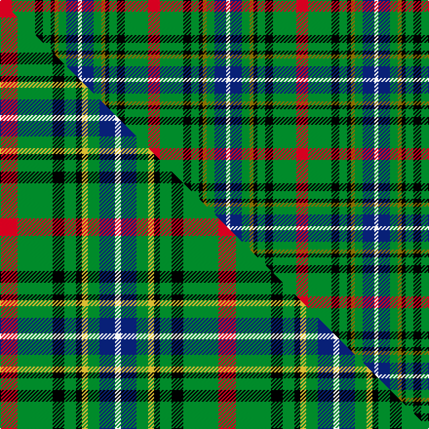

This is one **variant** — a specific cloth: this exact thread count and colourway, with its own
provenance below. It is one weaving of the [sett](/tartans/b/bi/bisset/) (the scale-free proportion — the
same cloth at any scale or shade), whose colour order is pattern [RGKGKGGBW](/stripes/rgkgkggbw/).

Part of the [Bisset](/tartans/b/bi/bisset/) tartan — the named design grouping this sett with its other cloths.

Sourced from house-of-tartan.  It is a [9 stripe tartan](/stripes/stripes9/).

Original link [http://www.house-of-tartan.scotland.net/house/TartanViewjs.asp?colr=Def&tnam=1478](http://www.house-of-tartan.scotland.net/house/TartanViewjs.asp?colr=Def&tnam=1478)

## Provenance

Earliest known date: 1976 One of the first tartans designed by the Scottish Tartans Society for a Mrs E. Bisset, who gave the following details for the colours of the sett: The blue and white of the Bisset shield, yellow and black representing the motto, red for the 'eternal flame' and the local tartan; all on a green background. The motto of the Bissets is 'Abscissa virescit' meaning 'Cut me down and I shall grow again'. The yellow represents the wood chips from the axe and the green for the fresh new growth. Bissets are represented in the histories of prominent Scottish families through the female line. Both Chisholms and Frasers married heiress's of the Bisset family. The result being that the Bisset surname has greatly reduced in number. There is no chief of the family at present (1993) but the senior branch are the Bissets of Lessendrum in Aberdeenshire.

2 attestations — the source records this cloth was collapsed from (oldest owns this page)

<ul>
<li>1976 — Bisset Clan Tartan (house-of-tartan, <a href="http://www.house-of-tartan.scotland.net/house/TartanViewjs.asp?colr=Def&tnam=1478">record</a>) </li>
<li>undated — Bisset (weddslist, <a href="http://www.weddslist.com/cgi-bin/tartans/pg.pl?source=sts">record</a>) </li>
</ul>

Dataset <small>— provenance for this record, inherited from the source manifest</small>

<dl class="dataset-prov">
<dt>source</dt><dd><a href="/sources/house-of-tartan/">House of Tartan</a></dd>
<dt>data captured from</dt><dd><a href="https://github.com/thetartan/tartan-database/blob/master/data/house-of-tartan/data.csv">https://github.com/thetartan/tartan-database/blob/master/data/house-of-tartan/data.csv</a></dd>
<dt>data date</dt><dd>1976 <small>(this record)</small></dd>
<dt>licence</dt><dd><a href="https://creativecommons.org/licenses/by-nc-nd/4.0/">CC BY-NC-ND 4.0</a></dd>
</dl>

Capture chain <small>— the hands this data passed through, oldest first; each capture carries its own licence</small>

<ol class="capture-chain">
<li><a href="http://www.house-of-tartan.scotland.net/">House of Tartan</a> <small>the weaver/retailer's database — the site is now offline; the URL is kept as the ultimate source's identity</small></li>
<li><a href="https://github.com/thetartan/tartan-database">thetartan/tartan-database</a> <small>2016-2017</small> · <a href="https://creativecommons.org/licenses/by-nc-nd/4.0/">CC BY-NC-ND 4.0</a> <small>Levko Kravets's frozen compilation — the capture we vendored, and where its CC licence text came from</small></li>
<li>this dictionary <small>captured 2026-06-10 · commit 5bf86c7566</small> <small>each re-capture is a git commit to data/sources</small></li>
</ol>

## Thread count
R/12 G24 K8 G8 K4 Y4 G8 DB12 W/4

One full sett is **152 threads**.

## Palette
<table><thead><tr><th>Colour</th><th>Shade</th><th>OKLCh</th></tr></thead><tbody><tr><td>DB</td><td><code style="background-color:#082077;">#082077</code> <small style="color:#888">#082077</small></td><td><small style="color:#888">oklch(30.0% 0.149 265.1)</small></td></tr><tr><td>G</td><td><code style="background-color:#008B2A;">#008B2A</code> <small style="color:#888">#008B2A</small></td><td><small style="color:#888">oklch(55.4% 0.170 145.9)</small></td></tr><tr><td>K</td><td><code style="background-color:#000000;">#000000</code> <small style="color:#888">#000000</small></td><td><small style="color:#888">oklch(0.0% 0.000 0.0)</small></td></tr><tr><td>W</td><td><code style="background-color:#F7F7F7;">#F7F7F7</code> <small style="color:#888">#F7F7F7</small></td><td><small style="color:#888">oklch(97.6% 0.000 89.9)</small></td></tr><tr><td>R</td><td><code style="background-color:#D60020;">#D60020</code> <small style="color:#888">#D60020</small></td><td><small style="color:#888">oklch(55.2% 0.224 25.5)</small></td></tr><tr><td>Y</td><td><code style="background-color:#8B6E00;">#8B6E00</code> <small style="color:#888">#8B6E00</small></td><td><small style="color:#888">oklch(55.1% 0.113 90.4)</small></td></tr></tbody></table>

# Sample pattern

## Compared to the master

This cloth is one sett of its design; the master sett (the exemplar the design is anchored on) is below for comparison.

Its **ΔTartan distance** from the master is **0.05** — the same measure the nearest-tartans table ranks by (0 is identical; a re-scale of the same cloth is near 0, a recolour or a different proportion further).

<figure class="master-compare" style="margin:0">

this sett
master sett ★

<figcaption style="color:#888;font-size:smaller">One weave of this sett against the <a href="/setts/r9g18k6g6k3ly3g6db8w3/">master sett ★</a>, split on the diagonal: a shared proportion runs seamlessly across it with only the shades shifting; a different proportion breaks on it.</figcaption>
</figure>

## Nearest tartan variants

The nearest existing variants by ΔTartan distance, with this cloth at the top so the swatches line up against it.

ΔTartan

Threads

Variant

Sett

—

152

<a href="/variants/s9/r3g6k2g2k1y1g2db3w1~x4/">Bisset Clan Tartan</a>

<a href="/ttd/edit/#slug=r9g18k6g6k3ly3g6db8w3~x2&amp;base=r3g6k2g2k1y1g2db3w1~x4" title="compare in the TTD">0.05</a>

224

<a href="/variants/s9/r9g18k6g6k3ly3g6db8w3~x2/">Bisset</a>

<a href="/ttd/edit/#slug=g5r4g19k10g8w4db18r4~x2&amp;base=r3g6k2g2k1y1g2db3w1~x4" title="compare in the TTD">1.88</a>

270

<a href="/variants/s8/g5r4g19k10g8w4db18r4~x2/">CSCA</a>

<a href="/ttd/edit/#slug=g4lb2g9k4g2r6db12w2~x2&amp;base=r3g6k2g2k1y1g2db3w1~x4" title="compare in the TTD">1.91</a>

152

<a href="/variants/s8/g4lb2g9k4g2r6db12w2~x2/">Cherokee</a>

<a href="/ttd/edit/#slug=k2g5w1k4y1db4g4k1r6k1g9db2~x4&amp;base=r3g6k2g2k1y1g2db3w1~x4" title="compare in the TTD">2.15</a>

304

<a href="/variants/s12/k2g5w1k4y1db4g4k1r6k1g9db2~x4/">Moskova</a>

<a href="/ttd/edit/#slug=g16db4g8k2y1k6w8r10~x2&amp;base=r3g6k2g2k1y1g2db3w1~x4" title="compare in the TTD">2.30</a>

168

<a href="/variants/s8/g16db4g8k2y1k6w8r10~x2/">Red Deer, City of</a>

<a href="/ttd/edit/#slug=dg9w2dg9k2o14ly4w2r2~x4~o2503076-ly2705081&amp;base=r3g6k2g2k1y1g2db3w1~x4" title="compare in the TTD">2.32</a>

308

<a href="/variants/s8/dg9w2dg9k2ly14lyi4w2r2~x4~ly2503076-lyi2705081/">MacShane (Clan)</a>

<a href="/ttd/edit/#slug=k22g21k5g12lb12n3w4~x2&amp;base=r3g6k2g2k1y1g2db3w1~x4" title="compare in the TTD">2.36</a>

264

<a href="/variants/s7/k22g21k5g12lb12n3w4~x2/">Disciples of Christ Motorcycle Ministry (Switzerland)</a>

<a href="/ttd/edit/#slug=g16b2dp13lb2k6y2g16lb2k12~x2&amp;base=r3g6k2g2k1y1g2db3w1~x4" title="compare in the TTD">2.45</a>

228

<a href="/variants/s9/g16b2dp13lb2k6y2g16lb2k12~x2/">Wilson's, No 225</a>

<a href="/ttd/edit/#slug=g24k4g6r4g6k19db22w5~x2&amp;base=r3g6k2g2k1y1g2db3w1~x4" title="compare in the TTD">2.49</a>

302

<a href="/variants/s8/g24k4g6r4g6k19db22w5~x2/">MacRae, Ancient hunting</a>

<a href="/ttd/edit/#slug=k13y4g15w4r13w4g15w4db13~x2&amp;base=r3g6k2g2k1y1g2db3w1~x4" title="compare in the TTD">2.50</a>

288

<a href="/variants/s9/k13y4g15w4r13w4g15w4db13~x2/">Spirit of 1994</a>

## Neighbour map

Every grey dot is one of 13656 variants placed by the first two principal components of the ΔTartan feature space (42% of its variance). Red is this tartan; blue dots are its nearest — click one to open its page. The map is a flat projection of a many-dimensional space — [how to read it](/posts/neighbourhood-maps/).

<svg viewBox="0 0 640 380" role="img" style="max-width:100%;height:auto;border:1px solid #e0e0e0;border-radius:4px;display:block" xmlns="http://www.w3.org/2000/svg"><image href="/nn/cloud.v1.png" width="640" height="380"/><a href="/variants/s9/r9g18k6g6k3ly3g6db8w3~x2/"><circle cx="113.8" cy="187.6" r="4" fill="#3465a4"><title>Bisset</title></circle></a><a href="/variants/s8/g5r4g19k10g8w4db18r4~x2/"><circle cx="96.8" cy="197.2" r="4" fill="#3465a4"><title>CSCA</title></circle></a><a href="/variants/s8/g4lb2g9k4g2r6db12w2~x2/"><circle cx="74.8" cy="192.4" r="4" fill="#3465a4"><title>Cherokee</title></circle></a><a href="/variants/s12/k2g5w1k4y1db4g4k1r6k1g9db2~x4/"><circle cx="110.6" cy="152.0" r="4" fill="#3465a4"><title>Moskova</title></circle></a><a href="/variants/s8/g16db4g8k2y1k6w8r10~x2/"><circle cx="118.9" cy="152.8" r="4" fill="#3465a4"><title>Red Deer, City of</title></circle></a><a href="/variants/s8/dg9w2dg9k2ly14lyi4w2r2~x4~ly2503076-lyi2705081/"><circle cx="127.5" cy="179.5" r="4" fill="#3465a4"><title>MacShane (Clan)</title></circle></a><a href="/variants/s7/k22g21k5g12lb12n3w4~x2/"><circle cx="115.5" cy="201.8" r="4" fill="#3465a4"><title>Disciples of Christ Motorcycle Ministry (Switzerland)</title></circle></a><a href="/variants/s9/g16b2dp13lb2k6y2g16lb2k12~x2/"><circle cx="126.8" cy="167.9" r="4" fill="#3465a4"><title>Wilson's, No 225</title></circle></a><a href="/variants/s8/g24k4g6r4g6k19db22w5~x2/"><circle cx="108.0" cy="198.1" r="4" fill="#3465a4"><title>MacRae, Ancient hunting</title></circle></a><a href="/variants/s9/k13y4g15w4r13w4g15w4db13~x2/"><circle cx="16.7" cy="218.9" r="4" fill="#3465a4"><title>Spirit of 1994</title></circle></a><circle cx="113.3" cy="189.4" r="5" fill="#c00000"/><text x="320" y="376" text-anchor="middle" font-size="11" fill="#999">ground</text><text x="11" y="190" text-anchor="middle" font-size="11" fill="#999" transform="rotate(-90 11 190)">complexity</text></svg>

ID: /variants/s9/r3g6k2g2k1y1g2db3w1~x4/
