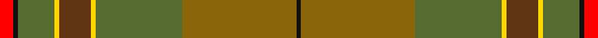

This page is one **sett** — a single exact thread-count. It belongs to the [tartan](/setts/r3k1yi8ly1dy7ly1yi19y25k1/)
(the same proportion at any scale), whose colour order is pattern [KGGYGYGKR](/stripes/kggygygkr/).

Sourced from register-of-tartans.  It is a [9 stripe tartan](/stripes/stripes9/).

Original link https://www.tartanregister.gov.uk/tartanDetails.aspx?ref=10357

## Register references

External register numbers recorded for this tartan.

- Scottish Register of Tartans: [10357](https://www.tartanregister.gov.uk/tartanDetails.aspx?ref=10357)

## Thread count
R/6 K2 G16 Y2 Ta14 Y2 G38 T50 K/2

One full sett is **256 threads**.

## Palette

Palette: <strong>Tartan Register</strong> <small style="color:#888">(3 of 6 colours)</small>
<table><thead><tr><th>Colour</th><th>Threads</th><th>Shade</th><th>Base</th><th>OKLCh</th></tr></thead><tbody><tr><td>R/</td><td style="text-align:right;font-variant-numeric:tabular-nums">6</td><td><code style="background-color:#FF0000;">#FF0000</code> <small style="color:#888">#FF0000</small></td><td>R <code style="background-color:#CC0000;">#CC0000</code></td><td><small style="color:#888">oklch(62.8% 0.258 29.2)</small></td></tr><tr><td>K</td><td style="text-align:right;font-variant-numeric:tabular-nums">2</td><td><code style="background-color:#101010;">#101010</code> <small style="color:#888">#101010</small></td><td>K <code style="background-color:#000000;">#000000</code></td><td><small style="color:#888">oklch(17.3% 0.000 89.9)</small></td></tr><tr><td>G</td><td style="text-align:right;font-variant-numeric:tabular-nums">16</td><td><code style="background-color:#556B2F;">#556B2F</code> <small style="color:#888">#556B2F</small></td><td>G <code style="background-color:#006100;">#006100</code></td><td><small style="color:#888">oklch(49.6% 0.090 126.2)</small></td></tr><tr><td>Y</td><td style="text-align:right;font-variant-numeric:tabular-nums">2</td><td><code style="background-color:#FFD700;">#FFD700</code> <small style="color:#888">#FFD700</small></td><td>Y <code style="background-color:#F2BF00;">#F2BF00</code></td><td><small style="color:#888">oklch(88.7% 0.182 95.3)</small></td></tr><tr><td>Ta</td><td style="text-align:right;font-variant-numeric:tabular-nums">14</td><td><code style="background-color:#603311;">#603311</code> <small style="color:#888">#603311</small></td><td>G <code style="background-color:#006100;">#006100</code></td><td><small style="color:#888">oklch(37.2% 0.079 53.9)</small></td></tr><tr><td>Y</td><td style="text-align:right;font-variant-numeric:tabular-nums">2</td><td><code style="background-color:#FFD700;">#FFD700</code> <small style="color:#888">#FFD700</small></td><td>Y <code style="background-color:#F2BF00;">#F2BF00</code></td><td><small style="color:#888">oklch(88.7% 0.182 95.3)</small></td></tr><tr><td>G</td><td style="text-align:right;font-variant-numeric:tabular-nums">38</td><td><code style="background-color:#556B2F;">#556B2F</code> <small style="color:#888">#556B2F</small></td><td>G <code style="background-color:#006100;">#006100</code></td><td><small style="color:#888">oklch(49.6% 0.090 126.2)</small></td></tr><tr><td>T</td><td style="text-align:right;font-variant-numeric:tabular-nums">50</td><td><code style="background-color:#8B6508;">#8B6508</code> <small style="color:#888">#8B6508</small></td><td>G <code style="background-color:#006100;">#006100</code></td><td><small style="color:#888">oklch(53.2% 0.107 82.0)</small></td></tr><tr><td>K/</td><td style="text-align:right;font-variant-numeric:tabular-nums">2</td><td><code style="background-color:#101010;">#101010</code> <small style="color:#888">#101010</small></td><td>K <code style="background-color:#000000;">#000000</code></td><td><small style="color:#888">oklch(17.3% 0.000 89.9)</small></td></tr></tbody></table>

## Nearest tartans

The nearest existing variants by ΔTartan distance, with this tartan at the top so the swatches line up against it.

ΔTartan

Tartan

Sett

—

<a href="/ttd/edit/#slug=r3k1yi8ly1dy7ly1yi19y25k1~x2">Broons, The (DC Thomson)</a> <a class="nn-out" href="/variants/s9/r3k1yi8ly1dy7ly1yi19y25k1~x2/" title="open its dictionary page">↗</a>

1.47

<a href="/ttd/edit/#slug=dp4g4y2w3g27y30ly1r3~x2&amp;base=r3k1yi8ly1dy7ly1yi19y25k1~x2">Hannigan of Dirleton (Personal)</a> <a class="nn-out" href="/variants/s8/dp4g4y2w3g27y30ly1r3~x2/" title="open its dictionary page">↗</a>

1.65

<a href="/ttd/edit/#slug=g1r7g7n2r1dg15lb1~x4&amp;base=r3k1yi8ly1dy7ly1yi19y25k1~x2">Ramsay (Green Fashion)</a> <a class="nn-out" href="/variants/s7/g1r7g7n2r1dg15lb1~x4/" title="open its dictionary page">↗</a>

1.73

<a href="/ttd/edit/#slug=y10lo5y54lo2lb32loi54b4loi10&amp;base=r3k1yi8ly1dy7ly1yi19y25k1~x2">Cladish</a> <a class="nn-out" href="/variants/s8/y10lo5y54lo2lb32loi54b4loi10/" title="open its dictionary page">↗</a>

1.74

<a href="/ttd/edit/#slug=do6lg3do18dy2do2dy10y28r2y4~x2&amp;base=r3k1yi8ly1dy7ly1yi19y25k1~x2">Scottish Crofting Foundation</a> <a class="nn-out" href="/variants/s9/do6lg3do18dy2do2dy10y28r2y4~x2/" title="open its dictionary page">↗</a>

1.76

<a href="/ttd/edit/#slug=g4n4g2lo36n14lo2t4g7r5lo3~x2&amp;base=r3k1yi8ly1dy7ly1yi19y25k1~x2">Rikaco Eve (Fashion)</a> <a class="nn-out" href="/variants/s10/g4n4g2lo36n14lo2t4g7r5lo3~x2/" title="open its dictionary page">↗</a>

1.79

<a href="/variants/s14/dp4g4y2w3g27y30ly1r3~x2/">Hannigan of Dirleton (Personal)</a>

1.82

<a href="/ttd/edit/#slug=r4g46r10db10dy33db5dy4lo3~x2&amp;base=r3k1yi8ly1dy7ly1yi19y25k1~x2">State Seal of Minnesota (Fashion)</a> <a class="nn-out" href="/variants/s8/r4g46r10db10dy33db5dy4lo3~x2/" title="open its dictionary page">↗</a>

1.83

<a href="/ttd/edit/#slug=w2lo1r3y20r1lo1r3lo2o14ly2r2ly2~x2&amp;base=r3k1yi8ly1dy7ly1yi19y25k1~x2">Flodden</a> <a class="nn-out" href="/variants/s12/w2lo1r3y20r1lo1r3lo2o14ly2r2ly2~x2/" title="open its dictionary page">↗</a>

1.86

<a href="/ttd/edit/#slug=do5lo1y27loi9r6do5lo1loi23do3loi5~x2&amp;base=r3k1yi8ly1dy7ly1yi19y25k1~x2">Satisfashion Argyll (Corporate)</a> <a class="nn-out" href="/variants/s10/do5lo1y27loi9r6do5lo1loi23do3loi5~x2/" title="open its dictionary page">↗</a>

1.87

<a href="/variants/s12/y23o4dy6g6y4lb1y4~x4/">Tricor</a>

## Neighbour map

Every grey dot is one of 14360 variants placed by the first two principal components of the ΔTartan feature space (44% of its variance). Red is this tartan; blue dots are its nearest — click one to open its page.

<svg viewBox="0 0 640 380" role="img" style="max-width:100%;height:auto;border:1px solid #e0e0e0;border-radius:4px;display:block" xmlns="http://www.w3.org/2000/svg"><image href="/nn/cloud.v1.png" width="640" height="380"/><a href="/variants/s8/dp4g4y2w3g27y30ly1r3~x2/"><circle cx="332.8" cy="146.3" r="4" fill="#3465a4"><title>Hannigan of Dirleton (Personal)</title></circle></a><a href="/variants/s7/g1r7g7n2r1dg15lb1~x4/"><circle cx="314.2" cy="212.4" r="4" fill="#3465a4"><title>Ramsay (Green Fashion)</title></circle></a><a href="/variants/s8/y10lo5y54lo2lb32loi54b4loi10/"><circle cx="321.2" cy="175.8" r="4" fill="#3465a4"><title>Cladish</title></circle></a><a href="/variants/s9/do6lg3do18dy2do2dy10y28r2y4~x2/"><circle cx="309.6" cy="194.6" r="4" fill="#3465a4"><title>Scottish Crofting Foundation</title></circle></a><a href="/variants/s10/g4n4g2lo36n14lo2t4g7r5lo3~x2/"><circle cx="355.7" cy="164.7" r="4" fill="#3465a4"><title>Rikaco Eve (Fashion)</title></circle></a><a href="/variants/s14/dp4g4y2w3g27y30ly1r3~x2/"><circle cx="354.1" cy="137.7" r="4" fill="#3465a4"><title>Hannigan of Dirleton (Personal)</title></circle></a><a href="/variants/s8/r4g46r10db10dy33db5dy4lo3~x2/"><circle cx="289.3" cy="195.3" r="4" fill="#3465a4"><title>State Seal of Minnesota (Fashion)</title></circle></a><a href="/variants/s12/w2lo1r3y20r1lo1r3lo2o14ly2r2ly2~x2/"><circle cx="253.9" cy="112.6" r="4" fill="#3465a4"><title>Flodden</title></circle></a><a href="/variants/s10/do5lo1y27loi9r6do5lo1loi23do3loi5~x2/"><circle cx="302.9" cy="147.6" r="4" fill="#3465a4"><title>Satisfashion Argyll (Corporate)</title></circle></a><a href="/variants/s12/y23o4dy6g6y4lb1y4~x4/"><circle cx="384.8" cy="190.3" r="4" fill="#3465a4"><title>Tricor</title></circle></a><circle cx="321.2" cy="153.6" r="5" fill="#c00000"/></svg>

ID: /variants/s9/r3k1yi8ly1dy7ly1yi19y25k1~x2/
