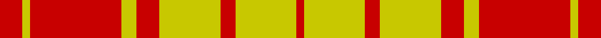

This page is one **sett** — a single exact thread-count. It belongs to the [tartan](/setts/r3ly1r12ly2r3ly8r2ly8r1/)
(the same proportion at any scale), whose colour order is pattern [RYRYRYRYR](/stripes/ryryryryr/).

Part of the [MacMillan](/tartans/macmillan/) tartan — the named design grouping this sett with its other cloths.

Sourced from weddslist.  It is a [9 stripe tartan](/stripes/stripes9/).

Original link http://www.weddslist.com/cgi-bin/tartans/pg.pl?source=rb

## Also known as

This cloth is also recorded under:

- MacMillan Ancient
- MacMillan Black
- MacMillan Dress
- MacMillan Old
- MacMillan Varient
- MacMillan, Ancient

4 attestations — the source records this cloth was collapsed from (oldest owns this page)

<ul>
<li>undated — MacMillan (weddslist, <a href="http://www.weddslist.com/cgi-bin/tartans/pg.pl?source=rb">record</a>)</li>
<li>undated — MacMillan (weddslist, <a href="http://www.weddslist.com/cgi-bin/tartans/pg.pl?source=sts">record</a>)</li>
<li>undated — MacMillan (weddslist, <a href="http://www.weddslist.com/cgi-bin/tartans/pg.pl?source=tinsel">record</a>)</li>
<li>undated — MacMillan (weddslist, <a href="http://www.weddslist.com/cgi-bin/tartans/pg.pl?source=x">record</a>)</li>
</ul>

## Thread count
R/6 Y2 R24 Y4 R6 Y16 R4 Y16 R/2

One full sett is **152 threads**.

## Palette

Palette: <strong>Tartan Register</strong> <small style="color:#888">(1 of 2 colours)</small>
<table><thead><tr><th>Colour</th><th>Threads</th><th>Shade</th><th>Base</th><th>OKLCh</th></tr></thead><tbody><tr><td>R/</td><td style="text-align:right;font-variant-numeric:tabular-nums">6</td><td><code style="background-color:#C80000;">#C80000</code> <small style="color:#888">#C80000</small></td><td>R <code style="background-color:#CC0000;">#CC0000</code></td><td><small style="color:#888">oklch(52.3% 0.215 29.2)</small></td></tr><tr><td>Y</td><td style="text-align:right;font-variant-numeric:tabular-nums">2</td><td><code style="background-color:#C8C800;">#C8C800</code> <small style="color:#888">#C8C800</small></td><td>Y <code style="background-color:#F2BF00;">#F2BF00</code></td><td><small style="color:#888">oklch(80.6% 0.176 109.8)</small></td></tr><tr><td>R</td><td style="text-align:right;font-variant-numeric:tabular-nums">24</td><td><code style="background-color:#C80000;">#C80000</code> <small style="color:#888">#C80000</small></td><td>R <code style="background-color:#CC0000;">#CC0000</code></td><td><small style="color:#888">oklch(52.3% 0.215 29.2)</small></td></tr><tr><td>Y</td><td style="text-align:right;font-variant-numeric:tabular-nums">4</td><td><code style="background-color:#C8C800;">#C8C800</code> <small style="color:#888">#C8C800</small></td><td>Y <code style="background-color:#F2BF00;">#F2BF00</code></td><td><small style="color:#888">oklch(80.6% 0.176 109.8)</small></td></tr><tr><td>R</td><td style="text-align:right;font-variant-numeric:tabular-nums">6</td><td><code style="background-color:#C80000;">#C80000</code> <small style="color:#888">#C80000</small></td><td>R <code style="background-color:#CC0000;">#CC0000</code></td><td><small style="color:#888">oklch(52.3% 0.215 29.2)</small></td></tr><tr><td>Y</td><td style="text-align:right;font-variant-numeric:tabular-nums">16</td><td><code style="background-color:#C8C800;">#C8C800</code> <small style="color:#888">#C8C800</small></td><td>Y <code style="background-color:#F2BF00;">#F2BF00</code></td><td><small style="color:#888">oklch(80.6% 0.176 109.8)</small></td></tr><tr><td>R</td><td style="text-align:right;font-variant-numeric:tabular-nums">4</td><td><code style="background-color:#C80000;">#C80000</code> <small style="color:#888">#C80000</small></td><td>R <code style="background-color:#CC0000;">#CC0000</code></td><td><small style="color:#888">oklch(52.3% 0.215 29.2)</small></td></tr><tr><td>Y</td><td style="text-align:right;font-variant-numeric:tabular-nums">16</td><td><code style="background-color:#C8C800;">#C8C800</code> <small style="color:#888">#C8C800</small></td><td>Y <code style="background-color:#F2BF00;">#F2BF00</code></td><td><small style="color:#888">oklch(80.6% 0.176 109.8)</small></td></tr><tr><td>R/</td><td style="text-align:right;font-variant-numeric:tabular-nums">2</td><td><code style="background-color:#C80000;">#C80000</code> <small style="color:#888">#C80000</small></td><td>R <code style="background-color:#CC0000;">#CC0000</code></td><td><small style="color:#888">oklch(52.3% 0.215 29.2)</small></td></tr></tbody></table>

## Compared to the master

This cloth is one sett of its design; the master sett (the exemplar the design is anchored on) is below for comparison.

<figure style="margin:0"><figcaption style="color:#888;font-size:smaller">this sett</figcaption></figure>
<figure style="margin:0"><figcaption style="color:#888;font-size:smaller"><a href="/setts/dg2k1dg18k1dg2k1r12dg4ly6k1ly6k1/">master sett →</a></figcaption></figure>

## Nearest tartans

The nearest existing variants by ΔTartan distance, with this tartan at the top so the swatches line up against it.

ΔTartan

Tartan

Sett

—

<a href="/ttd/edit/#slug=r3ly1r12ly2r3ly8r2ly8r1~x2">MacMillan</a> <a class="nn-out" href="/variants/s9/r3ly1r12ly2r3ly8r2ly8r1~x2/" title="open its dictionary page">↗</a>

0.82

<a href="/ttd/edit/#slug=r6ly2r18ly3r4ly12r3ly10r2~x2&amp;base=r3ly1r12ly2r3ly8r2ly8r1~x2">MacMillan Dress Clan Tartan</a> <a class="nn-out" href="/variants/s9/r6ly2r18ly3r4ly12r3ly10r2~x2/" title="open its dictionary page">↗</a>

1.38

<a href="/ttd/edit/#slug=db4ly1r12ly2r2ly12r1ly4~x4&amp;base=r3ly1r12ly2r3ly8r2ly8r1~x2">Glassary #3</a> <a class="nn-out" href="/variants/s8/db4ly1r12ly2r2ly12r1ly4~x4/" title="open its dictionary page">↗</a>

1.45

<a href="/ttd/edit/#slug=r3ly2r12ly2r3ly8r2ly8r2~x2&amp;base=r3ly1r12ly2r3ly8r2ly8r1~x2">MacMillan - 1842 (Dress)</a> <a class="nn-out" href="/variants/s9/r3ly2r12ly2r3ly8r2ly8r2~x2/" title="open its dictionary page">↗</a>

1.86

<a href="/ttd/edit/#slug=r29g2r2g2r6ly21~x4&amp;base=r3ly1r12ly2r3ly8r2ly8r1~x2">Maguire, Black</a> <a class="nn-out" href="/variants/s6/r29g2r2g2r6ly21~x4/" title="open its dictionary page">↗</a>

1.86

<a href="/ttd/edit/#slug=g14r4g2r2g2r4g19r30g2r9~x2&amp;base=r3ly1r12ly2r3ly8r2ly8r1~x2">Livingstone</a> <a class="nn-out" href="/variants/s10/g14r4g2r2g2r4g19r30g2r9~x2/" title="open its dictionary page">↗</a>

1.92

<a href="/ttd/edit/#slug=ly8k3ly4k2r30ly6~x2&amp;base=r3ly1r12ly2r3ly8r2ly8r1~x2">Masai Shuka 16 (Artefact)</a> <a class="nn-out" href="/variants/s6/ly8k3ly4k2r30ly6~x2/" title="open its dictionary page">↗</a>

1.94

<a href="/ttd/edit/#slug=w11r40g13r5g12r5~x2&amp;base=r3ly1r12ly2r3ly8r2ly8r1~x2">Makhtoum</a> <a class="nn-out" href="/variants/s6/w11r40g13r5g12r5~x2/" title="open its dictionary page">↗</a>

1.98

<a href="/ttd/edit/#slug=dg14r4dg2r2dg2r4dg19r30dg2r9~x2&amp;base=r3ly1r12ly2r3ly8r2ly8r1~x2">Livingstone</a> <a class="nn-out" href="/variants/s10/dg14r4dg2r2dg2r4dg19r30dg2r9~x2/" title="open its dictionary page">↗</a>

1.99

<a href="/ttd/edit/#slug=r1g14r1g1r14g1w1~x2&amp;base=r3ly1r12ly2r3ly8r2ly8r1~x2">MacKintosh Fragment</a> <a class="nn-out" href="/variants/s7/r1g14r1g1r14g1w1~x2/" title="open its dictionary page">↗</a>

2.01

<a href="/ttd/edit/#slug=r18ly3r18ly30k4~x2&amp;base=r3ly1r12ly2r3ly8r2ly8r1~x2">Shire of Hornwood (USA)</a> <a class="nn-out" href="/variants/s5/r18ly3r18ly30k4~x2/" title="open its dictionary page">↗</a>

## Neighbour map

Every grey dot is one of 14360 variants placed by the first two principal components of the ΔTartan feature space (44% of its variance). Red is this tartan; blue dots are its nearest — click one to open its page.

<svg viewBox="0 0 640 380" role="img" style="max-width:100%;height:auto;border:1px solid #e0e0e0;border-radius:4px;display:block" xmlns="http://www.w3.org/2000/svg"><image href="/nn/cloud.v1.png" width="640" height="380"/><a href="/variants/s9/r6ly2r18ly3r4ly12r3ly10r2~x2/"><circle cx="363.0" cy="210.7" r="4" fill="#3465a4"><title>MacMillan Dress Clan Tartan</title></circle></a><a href="/variants/s8/db4ly1r12ly2r2ly12r1ly4~x4/"><circle cx="296.7" cy="172.1" r="4" fill="#3465a4"><title>Glassary #3</title></circle></a><a href="/variants/s9/r3ly2r12ly2r3ly8r2ly8r2~x2/"><circle cx="311.2" cy="224.7" r="4" fill="#3465a4"><title>MacMillan - 1842 (Dress)</title></circle></a><a href="/variants/s6/r29g2r2g2r6ly21~x4/"><circle cx="381.0" cy="162.2" r="4" fill="#3465a4"><title>Maguire, Black</title></circle></a><a href="/variants/s10/g14r4g2r2g2r4g19r30g2r9~x2/"><circle cx="413.9" cy="195.1" r="4" fill="#3465a4"><title>Livingstone</title></circle></a><a href="/variants/s6/ly8k3ly4k2r30ly6~x2/"><circle cx="360.4" cy="163.2" r="4" fill="#3465a4"><title>Masai Shuka 16 (Artefact)</title></circle></a><a href="/variants/s6/w11r40g13r5g12r5~x2/"><circle cx="327.5" cy="217.2" r="4" fill="#3465a4"><title>Makhtoum</title></circle></a><a href="/variants/s10/dg14r4dg2r2dg2r4dg19r30dg2r9~x2/"><circle cx="407.9" cy="188.2" r="4" fill="#3465a4"><title>Livingstone</title></circle></a><a href="/variants/s7/r1g14r1g1r14g1w1~x2/"><circle cx="357.7" cy="170.0" r="4" fill="#3465a4"><title>MacKintosh Fragment</title></circle></a><a href="/variants/s5/r18ly3r18ly30k4~x2/"><circle cx="282.7" cy="204.7" r="4" fill="#3465a4"><title>Shire of Hornwood (USA)</title></circle></a><circle cx="357.7" cy="196.7" r="5" fill="#c00000"/></svg>

ID: /variants/s9/r3ly1r12ly2r3ly8r2ly8r1~x2/
