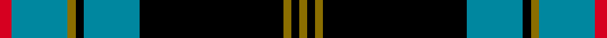

This page is one **sett** — a single exact thread-count. It belongs to the [tartan](/setts/r3t14y2k2t14k36y2k2y2/)
(the same proportion at any scale), whose colour order is pattern [GKGKBKGBR](/stripes/gkgkbkgbr/).

Sourced from register-of-tartans.  It is a [9 stripe tartan](/stripes/stripes9/).

Original link https://www.tartanregister.gov.uk/tartanDetails.aspx?ref=1141

2 attestations — the source records this cloth was collapsed from (oldest owns this page)

<ul>
<li>01/05/2002 — Ewbank (register-of-tartans, <a href="https://www.tartanregister.gov.uk/tartanDetails.aspx?ref=1141">record</a>)  <em>Co-ordinator of this tartan was Capt. Edward E Ewbank who was chairman of a group of Ewbanks/Eubanks from New Zealand, Netherlands and various US states. The Ewbanks are thought to have come to the UK with William the Conqueror. The tartan is based on the Vipont tartan (the Ewbanks are said to have had connections with the Viponts) and the Vipont (#1479, original Scottish Tartans Authority reference) was designed circa 1930 by a J. Wright of Edinburgh. The Ewbank can be worn by all of the name and spelling variants which include variants such as Hughbank. Colours are based on the Eubank coat of arms (black, gold and red).</em></li>
<li>pre 2002 — Ewbank (Name) (tartans-authority, <a href="http://www.tartansauthority.com/tartan-ferret/display/5798/">record</a>)  <em>Co-ordinator of this tartan was Capt. Edward E Ewbank who was chairman of a group of Ewbanks/Eubanks from New Zealand, Netherlands and various US states. The Ewbanks are thought to have come to the UK with William the Conqueror. The tartan is based on the Vipont tartan (the Ewbanks are said to have had connections with the Viponts) and the Vipont (#1479) was designed circa 1930 by a J. Wright of Edinburgh. The Ewbank can be worn by all of the name and spelling variants which include variants such as Hughbank. Colours are based on the Eubank coat of arms (black, gold and red).</em></li>
</ul>

## Register references

External register numbers recorded for this tartan.

- Scottish Register of Tartans: [1141](https://www.tartanregister.gov.uk/tartanDetails.aspx?ref=1141)
- Scottish Tartans Authority (ITI): 5798
- Scottish Tartans World Register: 2898

## Thread count
R/6 T28 Y4 K4 T28 K72 Y4 K4 Y/4

One full sett is **298 threads**.

## Palette
<table><thead><tr><th>Colour</th><th>Shade</th><th>OKLCh</th></tr></thead><tbody><tr><td>T</td><td><code style="background-color:#00879F;">#00879F</code> <small style="color:#888">#00879F</small></td><td><small style="color:#888">oklch(57.4% 0.102 216.1)</small></td></tr><tr><td>K</td><td><code style="background-color:#000000;">#000000</code> <small style="color:#888">#000000</small></td><td><small style="color:#888">oklch(0.0% 0.000 0.0)</small></td></tr><tr><td>R</td><td><code style="background-color:#D60020;">#D60020</code> <small style="color:#888">#D60020</small></td><td><small style="color:#888">oklch(55.2% 0.224 25.5)</small></td></tr><tr><td>Y</td><td><code style="background-color:#8B6E00;">#8B6E00</code> <small style="color:#888">#8B6E00</small></td><td><small style="color:#888">oklch(55.1% 0.113 90.4)</small></td></tr></tbody></table>

# Sample pattern

## Nearest variants

The nearest existing variants by ΔTartan distance, with this cloth at the top so the swatches line up against it.

ΔTartan

Threads

Variant

Sett

—

298

<a href="/variants/s9/r3t14y2k2t14k36y2k2y2~x2/">Ewbank</a>

<a href="/ttd/edit/#slug=r1t1k17t17k1w1~x4&amp;base=r3t14y2k2t14k36y2k2y2~x2" title="compare in the TTD">2.66</a>

296

<a href="/variants/s6/r1t1k17t17k1w1~x4/">Sorbie (Name)</a>

<a href="/ttd/edit/#slug=k2dr1t1g1t12k12g1k1dy1t2~x4&amp;base=r3t14y2k2t14k36y2k2y2~x2" title="compare in the TTD">2.98</a>

256

<a href="/variants/s10/k2dr1t1g1t12k12g1k1dy1t2~x4/">Kingsbarns Golf Links (Corporate)</a>

## Neighbour map

Every grey dot is one of 13620 variants placed by the first two principal components of the ΔTartan feature space (42% of its variance). Red is this tartan; blue dots are its nearest — click one to open its page.

<svg viewBox="0 0 640 380" role="img" style="max-width:100%;height:auto;border:1px solid #e0e0e0;border-radius:4px;display:block" xmlns="http://www.w3.org/2000/svg"><image href="/nn/cloud.v1.png" width="640" height="380"/><a href="/variants/s6/r1t1k17t17k1w1~x4/"><circle cx="269.6" cy="146.6" r="4" fill="#3465a4"><title>Sorbie (Name)</title></circle></a><a href="/variants/s10/k2dr1t1g1t12k12g1k1dy1t2~x4/"><circle cx="207.7" cy="122.8" r="4" fill="#3465a4"><title>Kingsbarns Golf Links (Corporate)</title></circle></a><circle cx="266.0" cy="120.4" r="5" fill="#c00000"/><text x="320" y="376" text-anchor="middle" font-size="11" fill="#999">ground</text><text x="11" y="190" text-anchor="middle" font-size="11" fill="#999" transform="rotate(-90 11 190)">complexity</text></svg>

ID: /variants/s9/r3t14y2k2t14k36y2k2y2~x2/
