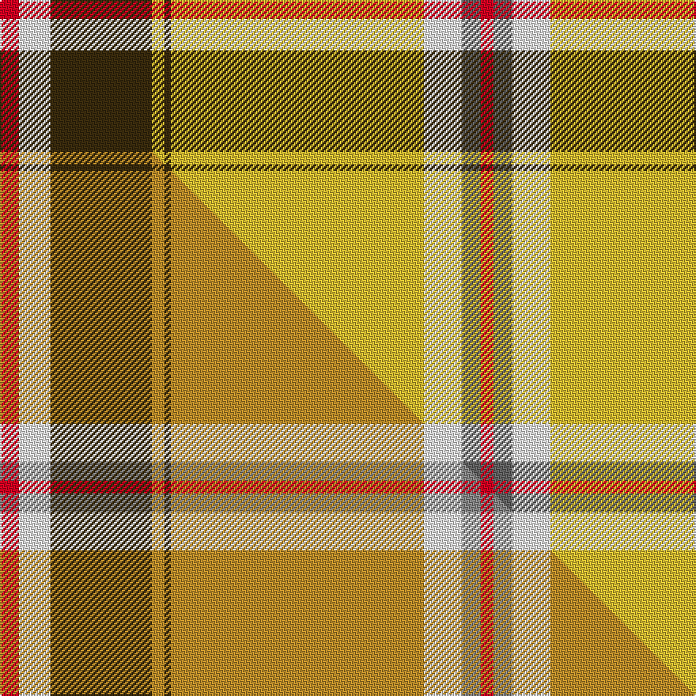

This page is one **sett** — a single exact thread-count. It belongs to the [tartan](/setts/r3w5dy16ly2dy1ly40w6n3r2/)
(the same proportion at any scale), whose colour order is pattern [RBWYGYGWR](/stripes/rbwygygwr/).

Part of the [Bell's Whisky](/tartans/bell-s-whisky/) tartan — the named design grouping this sett with its other cloths.

Sourced from tartans-authority.  It is a [9 stripe tartan](/stripes/stripes9/).

Original link http://www.tartansauthority.com/tartan-ferret/display/3674/

## Register references

External register numbers recorded for this tartan.

- Scottish Tartans Authority (ITI): 3674

## Thread count
R/12 W20 DY64 LY8 DY4 LY160 W24 N12 R/8

One full sett is **604 threads**.

## Palette
<table><thead><tr><th>Colour</th><th>Shade</th><th>OKLCh</th></tr></thead><tbody><tr><td>LY</td><td><code style="background-color:#DCBC32;">#DCBC32</code> <small style="color:#888">#DCBC32</small></td><td><small style="color:#888">oklch(80.0% 0.150 95.2)</small></td></tr><tr><td>N</td><td><code style="background-color:#636363;">#636363</code> <small style="color:#888">#636363</small></td><td><small style="color:#888">oklch(50.0% 0.000 89.9)</small></td></tr><tr><td>R</td><td><code style="background-color:#D60020;">#D60020</code> <small style="color:#888">#D60020</small></td><td><small style="color:#888">oklch(55.2% 0.224 25.5)</small></td></tr><tr><td>DY</td><td><code style="background-color:#3A2B0D;">#3A2B0D</code> <small style="color:#888">#3A2B0D</small></td><td><small style="color:#888">oklch(30.0% 0.049 82.0)</small></td></tr><tr><td>W</td><td><code style="background-color:#F7F7F7;">#F7F7F7</code> <small style="color:#888">#F7F7F7</small></td><td><small style="color:#888">oklch(97.6% 0.000 89.9)</small></td></tr></tbody></table>

# Sample pattern

## Compared to the master

This cloth is one sett of its design; the master sett (the exemplar the design is anchored on) is below for comparison.

Its **ΔTartan distance** from the master is **0.13** — the same measure the nearest-tartans table ranks by (0 is identical; a re-scale of the same cloth is near 0, a recolour or a different proportion further).

<figure class="master-compare" style="margin:0">

this sett
master sett ★

<figcaption style="color:#888;font-size:smaller">One weave of this sett against the <a href="/setts/r3w5dy16ly2dy1ly40w6o3r2/">master sett ★</a>, split on the diagonal: a shared proportion runs seamlessly across it with only the shades shifting; a different proportion breaks on it.</figcaption>
</figure>

## Nearest tartan variants

The nearest existing variants by ΔTartan distance, with this cloth at the top so the swatches line up against it.

ΔTartan

Threads

Variant

Sett

—

604

<a href="/variants/s9/r3w5dy16ly2dy1ly40w6n3r2~x4/">Bell's Whisky (Corporate)</a>

<a href="/ttd/edit/#slug=r3w5dy16ly2dy1ly40w6o3r2~x4~ly2705081-o2500000&amp;base=r3w5dy16ly2dy1ly40w6n3r2~x4" title="compare in the TTD">0.14</a>

604

<a href="/variants/s9/r3w5dy16ly2dy1ly40w6o3r2~x4~ly2705081-o2500000/">Bell's Whisky</a>

<a href="/ttd/edit/#slug=ly50k1dr12lb1g12dr14lb1dr2~x4&amp;base=r3w5dy16ly2dy1ly40w6n3r2~x4" title="compare in the TTD">2.34</a>

536

<a href="/variants/s8/ly50k1dr12lb1g12dr14lb1dr2~x4/">MacByrd (Personal)</a>

<a href="/ttd/edit/#slug=y42db2w2db2y5lo12w32r4~x2&amp;base=r3w5dy16ly2dy1ly40w6n3r2~x4" title="compare in the TTD">3.11</a>

312

<a href="/variants/s8/y42db2w2db2y5lo12w32r4~x2/">Comrie, Gold (Dance)</a>

<a href="/ttd/edit/#slug=w5g1w1g33y3r24g3r4~x2&amp;base=r3w5dy16ly2dy1ly40w6n3r2~x4" title="compare in the TTD">3.28</a>

278

<a href="/variants/s8/w5g1w1g33y3r24g3r4~x2/">Sutherland de Albergaria Dress (Personal)</a>

<a href="/ttd/edit/#slug=db8dg3ly1dg1ly39dg3r3ly2db11dg8ly2dg3w2~x2&amp;base=r3w5dy16ly2dy1ly40w6n3r2~x4" title="compare in the TTD">3.35</a>

324

<a href="/variants/s13/db8dg3ly1dg1ly39dg3r3ly2db11dg8ly2dg3w2~x2/">Afghanistan Memorial</a>

<a href="/ttd/edit/#slug=ly62dr12g1dgi4dg2dgi4g1dr12dg12~x2~g2408144-dgi1806142&amp;base=r3w5dy16ly2dy1ly40w6n3r2~x4" title="compare in the TTD">3.41</a>

292

<a href="/variants/s9/ly62dr12g1dgi4dg2dgi4g1dr12dg12~x2~g2408144-dgi1806142/">Roast Den, The</a>

<a href="/ttd/edit/#slug=ly36k3r6k3dy10r5dy3y4k1ly2~x2&amp;base=r3w5dy16ly2dy1ly40w6n3r2~x4" title="compare in the TTD">3.52</a>

216

<a href="/variants/s10/ly36k3r6k3dy10r5dy3y4k1ly2~x2/">Mead (Tennessee) Hunting (Personal)</a>

<a href="/ttd/edit/#slug=w32ri9ly1ri2w1ri2r7o4ri1o2w1~x4~ri1606028-r1406028-o2304058&amp;base=r3w5dy16ly2dy1ly40w6n3r2~x4" title="compare in the TTD">3.73</a>

364

<a href="/variants/s11/w32ri9ly1ri2w1ri2r7o4ri1o2w1~x4~ri1606028-r1406028-o2304058/">Canna</a>

<a href="/ttd/edit/#slug=r4ly27dy9w2t2dy2t4~x3&amp;base=r3w5dy16ly2dy1ly40w6n3r2~x4" title="compare in the TTD">3.73</a>

276

<a href="/variants/s7/r4ly27dy9w2t2dy2t4~x3/">Unidentified #25</a>

<a href="/ttd/edit/#slug=lo45g24k15w2lo2k1lo2w2lb11k3lo4w8~x2&amp;base=r3w5dy16ly2dy1ly40w6n3r2~x4" title="compare in the TTD">3.77</a>

370

<a href="/variants/s12/lo45g24k15w2lo2k1lo2w2lb11k3lo4w8~x2/">MacGill of Jura (Clan?)</a>

## Neighbour map

Every grey dot is one of 13620 variants placed by the first two principal components of the ΔTartan feature space (42% of its variance). Red is this tartan; blue dots are its nearest — click one to open its page.

<svg viewBox="0 0 640 380" role="img" style="max-width:100%;height:auto;border:1px solid #e0e0e0;border-radius:4px;display:block" xmlns="http://www.w3.org/2000/svg"><image href="/nn/cloud.v1.png" width="640" height="380"/><a href="/variants/s9/r3w5dy16ly2dy1ly40w6o3r2~x4~ly2705081-o2500000/"><circle cx="323.3" cy="93.8" r="4" fill="#3465a4"><title>Bell's Whisky</title></circle></a><a href="/variants/s8/ly50k1dr12lb1g12dr14lb1dr2~x4/"><circle cx="310.6" cy="80.1" r="4" fill="#3465a4"><title>MacByrd (Personal)</title></circle></a><a href="/variants/s8/y42db2w2db2y5lo12w32r4~x2/"><circle cx="268.1" cy="138.4" r="4" fill="#3465a4"><title>Comrie, Gold (Dance)</title></circle></a><a href="/variants/s8/w5g1w1g33y3r24g3r4~x2/"><circle cx="346.0" cy="134.1" r="4" fill="#3465a4"><title>Sutherland de Albergaria Dress (Personal)</title></circle></a><a href="/variants/s13/db8dg3ly1dg1ly39dg3r3ly2db11dg8ly2dg3w2~x2/"><circle cx="279.0" cy="72.0" r="4" fill="#3465a4"><title>Afghanistan Memorial</title></circle></a><a href="/variants/s9/ly62dr12g1dgi4dg2dgi4g1dr12dg12~x2~g2408144-dgi1806142/"><circle cx="353.1" cy="91.2" r="4" fill="#3465a4"><title>Roast Den, The</title></circle></a><a href="/variants/s10/ly36k3r6k3dy10r5dy3y4k1ly2~x2/"><circle cx="251.0" cy="70.1" r="4" fill="#3465a4"><title>Mead (Tennessee) Hunting (Personal)</title></circle></a><a href="/variants/s11/w32ri9ly1ri2w1ri2r7o4ri1o2w1~x4~ri1606028-r1406028-o2304058/"><circle cx="294.4" cy="73.2" r="4" fill="#3465a4"><title>Canna</title></circle></a><a href="/variants/s7/r4ly27dy9w2t2dy2t4~x3/"><circle cx="301.0" cy="137.5" r="4" fill="#3465a4"><title>Unidentified #25</title></circle></a><a href="/variants/s12/lo45g24k15w2lo2k1lo2w2lb11k3lo4w8~x2/"><circle cx="205.0" cy="65.5" r="4" fill="#3465a4"><title>MacGill of Jura (Clan?)</title></circle></a><circle cx="306.2" cy="90.9" r="5" fill="#c00000"/><text x="320" y="376" text-anchor="middle" font-size="11" fill="#999">ground</text><text x="11" y="190" text-anchor="middle" font-size="11" fill="#999" transform="rotate(-90 11 190)">complexity</text></svg>

ID: /variants/s9/r3w5dy16ly2dy1ly40w6n3r2~x4/
