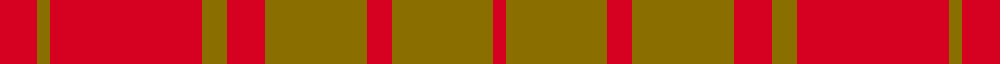

This page is one **sett** — a single exact thread-count. It belongs to the [tartan](/setts/r3y1r12y2r3y8r2y8r1/)
(the same proportion at any scale), whose colour order is pattern [RGRGRGRGR](/stripes/rgrgrgrgr/).

Sourced from weddslist.  It is a [9 stripe tartan](/stripes/stripes9/).

Original link http://www.weddslist.com/cgi-bin/tartans/pg.pl?source=rb

4 attestations — the source records this cloth was collapsed from (oldest owns this page)

<ul>
<li>undated — MacMillan (weddslist, <a href="http://www.weddslist.com/cgi-bin/tartans/pg.pl?source=rb">record</a>) </li>
<li>undated — MacMillan (weddslist, <a href="http://www.weddslist.com/cgi-bin/tartans/pg.pl?source=sts">record</a>) </li>
<li>undated — MacMillan (weddslist, <a href="http://www.weddslist.com/cgi-bin/tartans/pg.pl?source=tinsel">record</a>) </li>
<li>undated — MacMillan (weddslist, <a href="http://www.weddslist.com/cgi-bin/tartans/pg.pl?source=x">record</a>) </li>
</ul>

## Thread count
R/6 Y2 R24 Y4 R6 Y16 R4 Y16 R/2

One full sett is **152 threads**.

## Palette
<table><thead><tr><th>Colour</th><th>Shade</th><th>OKLCh</th></tr></thead><tbody><tr><td>R</td><td><code style="background-color:#D60020;">#D60020</code> <small style="color:#888">#D60020</small></td><td><small style="color:#888">oklch(55.2% 0.224 25.5)</small></td></tr><tr><td>Y</td><td><code style="background-color:#8B6E00;">#8B6E00</code> <small style="color:#888">#8B6E00</small></td><td><small style="color:#888">oklch(55.1% 0.113 90.4)</small></td></tr></tbody></table>

# Sample pattern

## Nearest variants

The nearest existing variants by ΔTartan distance, with this cloth at the top so the swatches line up against it.

ΔTartan

Threads

Variant

Sett

—

152

<a href="/variants/s9/r3y1r12y2r3y8r2y8r1~x2/">MacMillan</a>

<a href="/ttd/edit/#slug=r6y2r18y3r4y12r3y10r2~x2&amp;base=r3y1r12y2r3y8r2y8r1~x2" title="compare in the TTD">0.36</a>

224

<a href="/variants/s9/r6y2r18y3r4y12r3y10r2~x2/">MacMillan Dress Clan Tartan</a>

<a href="/ttd/edit/#slug=dr3y2dr12y2dr3y8dr2y8dr2~x2&amp;base=r3y1r12y2r3y8r2y8r1~x2" title="compare in the TTD">0.49</a>

158

<a href="/variants/s9/dr3y2dr12y2dr3y8dr2y8dr2~x2/">MacMillan Dress</a>

<a href="/ttd/edit/#slug=db4y1r12y2r2y12r1y4~x4&amp;base=r3y1r12y2r3y8r2y8r1~x2" title="compare in the TTD">2.50</a>

272

<a href="/variants/s8/db4y1r12y2r2y12r1y4~x4/">Glassary #3</a>

<a href="/ttd/edit/#slug=r9y2r45y20ly3~x2~r1706009&amp;base=r3y1r12y2r3y8r2y8r1~x2" title="compare in the TTD">2.90</a>

292

<a href="/variants/s5/r9y2r45y20ly3~x2~r1706009/">Hunt (Personal)</a>

## Neighbour map

Every grey dot is one of 13620 variants placed by the first two principal components of the ΔTartan feature space (42% of its variance). Red is this tartan; blue dots are its nearest — click one to open its page.

<svg viewBox="0 0 640 380" role="img" style="max-width:100%;height:auto;border:1px solid #e0e0e0;border-radius:4px;display:block" xmlns="http://www.w3.org/2000/svg"><image href="/nn/cloud.v1.png" width="640" height="380"/><a href="/variants/s9/r6y2r18y3r4y12r3y10r2~x2/"><circle cx="511.9" cy="273.5" r="4" fill="#3465a4"><title>MacMillan Dress Clan Tartan</title></circle></a><a href="/variants/s9/dr3y2dr12y2dr3y8dr2y8dr2~x2/"><circle cx="432.1" cy="287.4" r="4" fill="#3465a4"><title>MacMillan Dress</title></circle></a><a href="/variants/s8/db4y1r12y2r2y12r1y4~x4/"><circle cx="384.4" cy="219.7" r="4" fill="#3465a4"><title>Glassary #3</title></circle></a><a href="/variants/s5/r9y2r45y20ly3~x2~r1706009/"><circle cx="574.3" cy="212.0" r="4" fill="#3465a4"><title>Hunt (Personal)</title></circle></a><circle cx="514.2" cy="259.9" r="5" fill="#c00000"/><text x="320" y="376" text-anchor="middle" font-size="11" fill="#999">ground</text><text x="11" y="190" text-anchor="middle" font-size="11" fill="#999" transform="rotate(-90 11 190)">complexity</text></svg>

ID: /variants/s9/r3y1r12y2r3y8r2y8r1~x2/
