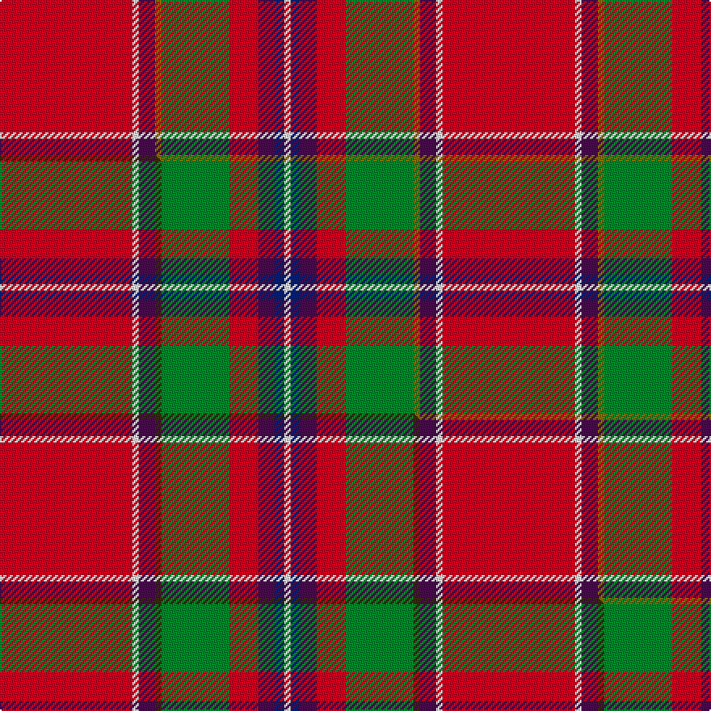

This page is one **sett** — a single exact thread-count. It belongs to the [tartan](/setts/r41w2dp5y2g21r9dp5db3w2/)
(the same proportion at any scale), whose colour order is pattern [RWBGGRBBW](/stripes/rwbggrbbw/).

Part of the [Perthshire or Drummond](/tartans/perthshire-or-drummond/) tartan — the named design grouping this sett with its other cloths.

Sourced from weddslist.  It is a [9 stripe tartan](/stripes/stripes9/).

Original link http://www.weddslist.com/cgi-bin/tartans/pg.pl?source=sts

## Thread count
R/82 W4 DP10 Y4 G42 R18 DP10 DB6 W/4

One full sett is **274 threads**.

## Palette
<table><thead><tr><th>Colour</th><th>Shade</th><th>OKLCh</th></tr></thead><tbody><tr><td>DB</td><td><code style="background-color:#082077;">#082077</code> <small style="color:#888">#082077</small></td><td><small style="color:#888">oklch(30.0% 0.149 265.1)</small></td></tr><tr><td>G</td><td><code style="background-color:#008B2A;">#008B2A</code> <small style="color:#888">#008B2A</small></td><td><small style="color:#888">oklch(55.4% 0.170 145.9)</small></td></tr><tr><td>W</td><td><code style="background-color:#F7F7F7;">#F7F7F7</code> <small style="color:#888">#F7F7F7</small></td><td><small style="color:#888">oklch(97.6% 0.000 89.9)</small></td></tr><tr><td>DP</td><td><code style="background-color:#4B0B4F;">#4B0B4F</code> <small style="color:#888">#4B0B4F</small></td><td><small style="color:#888">oklch(30.1% 0.125 325.4)</small></td></tr><tr><td>R</td><td><code style="background-color:#D60020;">#D60020</code> <small style="color:#888">#D60020</small></td><td><small style="color:#888">oklch(55.2% 0.224 25.5)</small></td></tr><tr><td>Y</td><td><code style="background-color:#8B6E00;">#8B6E00</code> <small style="color:#888">#8B6E00</small></td><td><small style="color:#888">oklch(55.1% 0.113 90.4)</small></td></tr></tbody></table>

# Sample pattern

## Compared to the master

This cloth is one sett of its design; the master sett (the exemplar the design is anchored on) is below for comparison.

Its **ΔTartan distance** from the master is **0.08** — the same measure the nearest-tartans table ranks by (0 is identical; a re-scale of the same cloth is near 0, a recolour or a different proportion further).

<figure class="master-compare" style="margin:0">

this sett
master sett ★

<figcaption style="color:#888;font-size:smaller">One weave of this sett against the <a href="/setts/r41w2dp5dy2g21r9dp5db3w2/">master sett ★</a>, split on the diagonal: a shared proportion runs seamlessly across it with only the shades shifting; a different proportion breaks on it.</figcaption>
</figure>

## Nearest variants

The nearest existing variants by ΔTartan distance, with this cloth at the top so the swatches line up against it.

ΔTartan

Threads

Variant

Sett

—

274

<a href="/variants/s9/r41w2dp5y2g21r9dp5db3w2~x2/">Perthshire, or Drummond</a>

<a href="/ttd/edit/#slug=r41w2dp5dy2g21r9dp5db3w2~x2&amp;base=r41w2dp5y2g21r9dp5db3w2~x2" title="compare in the TTD">0.00</a>

274

<a href="/variants/s9/r41w2dp5dy2g21r9dp5db3w2~x2/">Perthshire or Drummond District Tartan</a>

<a href="/ttd/edit/#slug=r30w1dp4y1dg14r6dp4lb2w1~x4&amp;base=r41w2dp5y2g21r9dp5db3w2~x2" title="compare in the TTD">0.38</a>

380

<a href="/variants/s9/r30w1dp4y1dg14r6dp4lb2w1~x4/">Perth - 1819 (District)</a>

<a href="/ttd/edit/#slug=r36w1db3y1g16r8db3w5&amp;base=r41w2dp5y2g21r9dp5db3w2~x2" title="compare in the TTD">1.11</a>

105

<a href="/variants/s8/r36w1db3y1g16r8db3w5/">Drummond of Perth</a>

<a href="/ttd/edit/#slug=r22db3y1g12r6db3lb3w1~x2&amp;base=r41w2dp5y2g21r9dp5db3w2~x2" title="compare in the TTD">1.35</a>

158

<a href="/variants/s8/r22db3y1g12r6db3lb3w1~x2/">Drummond, (Fingask)</a>

<a href="/ttd/edit/#slug=r36w1db3y1g16r8db3lb2w1&amp;base=r41w2dp5y2g21r9dp5db3w2~x2" title="compare in the TTD">1.39</a>

105

<a href="/variants/s9/r36w1db3y1g16r8db3lb2w1/">Drummond of Perth</a>

<a href="/ttd/edit/#slug=r36w1db3y1g16r8db3lb2w1~x2&amp;base=r41w2dp5y2g21r9dp5db3w2~x2" title="compare in the TTD">1.39</a>

210

<a href="/variants/s9/r36w1db3y1g16r8db3lb2w1~x2/">Drummond of Perth</a>

<a href="/ttd/edit/#slug=r36w1db3y1g16r8db3t2w1~x2&amp;base=r41w2dp5y2g21r9dp5db3w2~x2" title="compare in the TTD">1.39</a>

210

<a href="/variants/s9/r36w1db3y1g16r8db3t2w1~x2/">Drummond of Perth (Clan)</a>

<a href="/ttd/edit/#slug=r36w1db3y1dg16r8db3lb2w1~x2&amp;base=r41w2dp5y2g21r9dp5db3w2~x2" title="compare in the TTD">1.39</a>

210

<a href="/variants/s9/r36w1db3y1dg16r8db3lb2w1~x2/">Perthshire or Drummond of Perth</a>

<a href="/ttd/edit/#slug=r48db3ly2dg14r8db3lb4w3~x2&amp;base=r41w2dp5y2g21r9dp5db3w2~x2" title="compare in the TTD">1.72</a>

238

<a href="/variants/s8/r48db3ly2dg14r8db3lb4w3~x2/">Drummond of Fingask</a>

<a href="/ttd/edit/#slug=r38y1db3w1g13r6db3lb3w1~x2&amp;base=r41w2dp5y2g21r9dp5db3w2~x2" title="compare in the TTD">2.08</a>

198

<a href="/variants/s9/r38y1db3w1g13r6db3lb3w1~x2/">Drummond, Ancient</a>

## Neighbour map

Every grey dot is one of 13620 variants placed by the first two principal components of the ΔTartan feature space (42% of its variance). Red is this tartan; blue dots are its nearest — click one to open its page.

<svg viewBox="0 0 640 380" role="img" style="max-width:100%;height:auto;border:1px solid #e0e0e0;border-radius:4px;display:block" xmlns="http://www.w3.org/2000/svg"><image href="/nn/cloud.v1.png" width="640" height="380"/><a href="/variants/s9/r41w2dp5dy2g21r9dp5db3w2~x2/"><circle cx="306.8" cy="108.7" r="4" fill="#3465a4"><title>Perthshire or Drummond District Tartan</title></circle></a><a href="/variants/s9/r30w1dp4y1dg14r6dp4lb2w1~x4/"><circle cx="335.7" cy="90.0" r="4" fill="#3465a4"><title>Perth - 1819 (District)</title></circle></a><a href="/variants/s8/r36w1db3y1g16r8db3w5/"><circle cx="366.2" cy="104.0" r="4" fill="#3465a4"><title>Drummond of Perth</title></circle></a><a href="/variants/s8/r22db3y1g12r6db3lb3w1~x2/"><circle cx="298.5" cy="123.1" r="4" fill="#3465a4"><title>Drummond, (Fingask)</title></circle></a><a href="/variants/s9/r36w1db3y1g16r8db3lb2w1/"><circle cx="378.0" cy="80.0" r="4" fill="#3465a4"><title>Drummond of Perth</title></circle></a><a href="/variants/s9/r36w1db3y1g16r8db3lb2w1~x2/"><circle cx="378.0" cy="80.0" r="4" fill="#3465a4"><title>Drummond of Perth</title></circle></a><a href="/variants/s9/r36w1db3y1g16r8db3t2w1~x2/"><circle cx="380.2" cy="81.0" r="4" fill="#3465a4"><title>Drummond of Perth (Clan)</title></circle></a><a href="/variants/s9/r36w1db3y1dg16r8db3lb2w1~x2/"><circle cx="372.9" cy="75.8" r="4" fill="#3465a4"><title>Perthshire or Drummond of Perth</title></circle></a><a href="/variants/s8/r48db3ly2dg14r8db3lb4w3~x2/"><circle cx="383.8" cy="94.2" r="4" fill="#3465a4"><title>Drummond of Fingask</title></circle></a><a href="/variants/s9/r38y1db3w1g13r6db3lb3w1~x2/"><circle cx="392.9" cy="73.1" r="4" fill="#3465a4"><title>Drummond, Ancient</title></circle></a><circle cx="309.0" cy="109.6" r="5" fill="#c00000"/><text x="320" y="376" text-anchor="middle" font-size="11" fill="#999">ground</text><text x="11" y="190" text-anchor="middle" font-size="11" fill="#999" transform="rotate(-90 11 190)">complexity</text></svg>

ID: /variants/s9/r41w2dp5y2g21r9dp5db3w2~x2/
