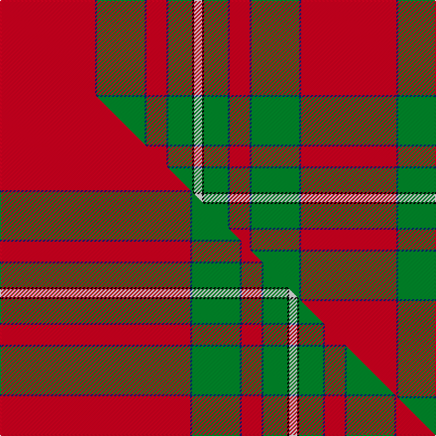

This is one **variant** — a specific cloth: this exact thread count and colourway, with its own
provenance below. It is one weaving of the [sett](/setts/r48db1g24db1r10db1g12k1w4/) (the scale-free proportion — the
same cloth at any scale or shade), whose colour order is pattern [RBGBRBGKW](/stripes/rbgbrbgkw/).

Part of the [MacAulay](/tartans/macaulay-2/) tartan — the named design grouping this sett with its other cloths.

Sourced from weddslist.  It is a [9 stripe tartan](/stripes/stripes9/).

Original link [http://www.weddslist.com/cgi-bin/tartans/pg.pl?source=sts](http://www.weddslist.com/cgi-bin/tartans/pg.pl?source=sts)

Dataset <small>— provenance for this record, inherited from the source manifest</small>

<dl class="dataset-prov">
<dt>source</dt><dd><a href="/sources/weddslist/">Weddslist</a></dd>
<dt>data captured from</dt><dd><a href="https://github.com/thetartan/tartan-database/blob/master/data/weddslist/data.csv">https://github.com/thetartan/tartan-database/blob/master/data/weddslist/data.csv</a></dd>
<dt>data date</dt><dd>2016-11-17 <small>(dataset default)</small></dd>
<dt>licence</dt><dd><a href="https://creativecommons.org/licenses/by-nc-nd/4.0/">CC BY-NC-ND 4.0</a></dd>
</dl>

Capture chain <small>— the hands this data passed through, oldest first; each capture carries its own licence</small>

<ol class="capture-chain">
<li><a href="https://www.weddslist.com/tartans/">Weddslist</a> <small>the living privately compiled reference</small></li>
<li><a href="https://github.com/thetartan/tartan-database">thetartan/tartan-database</a> <small>2016-2017</small> · <a href="https://creativecommons.org/licenses/by-nc-nd/4.0/">CC BY-NC-ND 4.0</a> <small>Levko Kravets's frozen compilation — the capture we vendored, and where its CC licence text came from</small></li>
<li>this dictionary <small>captured 2026-06-10 · commit 5bf86c7566</small> <small>each re-capture is a git commit to data/sources</small></li>
</ol>

## Thread count
R/96 DB2 G48 DB2 R20 DB2 G24 K2 W/8

One full sett is **304 threads**.

## Palette
<table><thead><tr><th>Colour</th><th>Shade</th><th>OKLCh</th></tr></thead><tbody><tr><td>DB</td><td><code style="background-color:#082077;">#082077</code> <small style="color:#888">#082077</small></td><td><small style="color:#888">oklch(30.0% 0.149 265.1)</small></td></tr><tr><td>G</td><td><code style="background-color:#008B2A;">#008B2A</code> <small style="color:#888">#008B2A</small></td><td><small style="color:#888">oklch(55.4% 0.170 145.9)</small></td></tr><tr><td>K</td><td><code style="background-color:#000000;">#000000</code> <small style="color:#888">#000000</small></td><td><small style="color:#888">oklch(0.0% 0.000 0.0)</small></td></tr><tr><td>W</td><td><code style="background-color:#F7F7F7;">#F7F7F7</code> <small style="color:#888">#F7F7F7</small></td><td><small style="color:#888">oklch(97.6% 0.000 89.9)</small></td></tr><tr><td>R</td><td><code style="background-color:#D60020;">#D60020</code> <small style="color:#888">#D60020</small></td><td><small style="color:#888">oklch(55.2% 0.224 25.5)</small></td></tr></tbody></table>

# Sample pattern

## Compared to the master

This cloth is one sett of its design; the master sett (the exemplar the design is anchored on) is below for comparison.

Its **ΔTartan distance** from the master is **0.67** — the same measure the nearest-tartans table ranks by (0 is identical; a re-scale of the same cloth is near 0, a recolour or a different proportion further).

<figure class="master-compare" style="margin:0">

this sett
master sett ★

<figcaption style="color:#888;font-size:smaller">One weave of this sett against the <a href="/setts/r96db1g24db1r10db1g12k1w4/">master sett ★</a>, split on the diagonal: a shared proportion runs seamlessly across it with only the shades shifting; a different proportion breaks on it.</figcaption>
</figure>

## Nearest tartan variants

The nearest existing variants by ΔTartan distance, with this cloth at the top so the swatches line up against it.

ΔTartan

Threads

Variant

Sett

—

304

<a href="/variants/s9/r48db1g24db1r10db1g12k1w4~x2/">MacAulay</a>

<a href="/ttd/edit/#slug=r50db3g6db1r3db1g8k1lb3~x2&amp;base=r48db1g24db1r10db1g12k1w4~x2" title="compare in the TTD">1.07</a>

198

<a href="/variants/s9/r50db3g6db1r3db1g8k1lb3~x2/">MacAulay of Ardincaple (Clan)</a>

<a href="/ttd/edit/#slug=r41g19r7g8k1w3~x2&amp;base=r48db1g24db1r10db1g12k1w4~x2" title="compare in the TTD">1.21</a>

228

<a href="/variants/s6/r41g19r7g8k1w3~x2/">MacGregor #4</a>

<a href="/ttd/edit/#slug=r36g18r4g6k1w2~x2&amp;base=r48db1g24db1r10db1g12k1w4~x2" title="compare in the TTD">1.29</a>

192

<a href="/variants/s6/r36g18r4g6k1w2~x2/">MacGregor Clan Tartan</a>

<a href="/ttd/edit/#slug=r36g18r4g6k1w2&amp;base=r48db1g24db1r10db1g12k1w4~x2" title="compare in the TTD">1.29</a>

96

<a href="/variants/s6/r36g18r4g6k1w2/">MacGregor</a>

<a href="/ttd/edit/#slug=r96g42r16g17k4n6&amp;base=r48db1g24db1r10db1g12k1w4~x2" title="compare in the TTD">1.50</a>

260

<a href="/variants/s6/r96g42r16g17k4n6/">MacGregor, Glengyle</a>

<a href="/ttd/edit/#slug=r96g42r16g17k4lb6&amp;base=r48db1g24db1r10db1g12k1w4~x2" title="compare in the TTD">1.80</a>

260

<a href="/variants/s6/r96g42r16g17k4lb6/">MacGregor Hunting Glengyle Clan Tartan</a>

<a href="/ttd/edit/#slug=g10r4g46r69k2w6&amp;base=r48db1g24db1r10db1g12k1w4~x2" title="compare in the TTD">1.97</a>

258

<a href="/variants/s6/g10r4g46r69k2w6/">Colchester &amp; District Pipes &amp; Drums</a>

<a href="/ttd/edit/#slug=r60k2w3dg20r10dg20~x2&amp;base=r48db1g24db1r10db1g12k1w4~x2" title="compare in the TTD">1.99</a>

300

<a href="/variants/s6/r60k2w3dg20r10dg20~x2/">Greig (Personal)</a>

<a href="/ttd/edit/#slug=g6w1g12r4db4r2k4r32g1r2~x2&amp;base=r48db1g24db1r10db1g12k1w4~x2" title="compare in the TTD">2.05</a>

256

<a href="/variants/s10/g6w1g12r4db4r2k4r32g1r2~x2/">Seton Family Tartan</a>

<a href="/ttd/edit/#slug=r60db2g24r8db2lb3db2&amp;base=r48db1g24db1r10db1g12k1w4~x2" title="compare in the TTD">2.62</a>

140

<a href="/variants/s7/r60db2g24r8db2lb3db2/">Unidentified Cant #12</a>

## Neighbour map

Every grey dot is one of 13621 variants placed by the first two principal components of the ΔTartan feature space (42% of its variance). Red is this tartan; blue dots are its nearest — click one to open its page.

<svg viewBox="0 0 640 380" role="img" style="max-width:100%;height:auto;border:1px solid #e0e0e0;border-radius:4px;display:block" xmlns="http://www.w3.org/2000/svg"><image href="/nn/cloud.v1.png" width="640" height="380"/><a href="/variants/s9/r50db3g6db1r3db1g8k1lb3~x2/"><circle cx="458.2" cy="49.9" r="4" fill="#3465a4"><title>MacAulay of Ardincaple (Clan)</title></circle></a><a href="/variants/s6/r41g19r7g8k1w3~x2/"><circle cx="398.5" cy="127.3" r="4" fill="#3465a4"><title>MacGregor #4</title></circle></a><a href="/variants/s6/r36g18r4g6k1w2~x2/"><circle cx="394.9" cy="127.8" r="4" fill="#3465a4"><title>MacGregor Clan Tartan</title></circle></a><a href="/variants/s6/r36g18r4g6k1w2/"><circle cx="394.9" cy="127.8" r="4" fill="#3465a4"><title>MacGregor</title></circle></a><a href="/variants/s6/r96g42r16g17k4n6/"><circle cx="399.1" cy="148.5" r="4" fill="#3465a4"><title>MacGregor, Glengyle</title></circle></a><a href="/variants/s6/r96g42r16g17k4lb6/"><circle cx="392.5" cy="146.3" r="4" fill="#3465a4"><title>MacGregor Hunting Glengyle Clan Tartan</title></circle></a><a href="/variants/s6/g10r4g46r69k2w6/"><circle cx="353.4" cy="129.1" r="4" fill="#3465a4"><title>Colchester &amp; District Pipes &amp; Drums</title></circle></a><a href="/variants/s6/r60k2w3dg20r10dg20~x2/"><circle cx="380.1" cy="131.6" r="4" fill="#3465a4"><title>Greig (Personal)</title></circle></a><a href="/variants/s10/g6w1g12r4db4r2k4r32g1r2~x2/"><circle cx="328.6" cy="77.6" r="4" fill="#3465a4"><title>Seton Family Tartan</title></circle></a><a href="/variants/s7/r60db2g24r8db2lb3db2/"><circle cx="369.4" cy="107.2" r="4" fill="#3465a4"><title>Unidentified Cant #12</title></circle></a><circle cx="361.5" cy="76.6" r="5" fill="#c00000"/><text x="320" y="376" text-anchor="middle" font-size="11" fill="#999">ground</text><text x="11" y="190" text-anchor="middle" font-size="11" fill="#999" transform="rotate(-90 11 190)">complexity</text></svg>

ID: /variants/s9/r48db1g24db1r10db1g12k1w4~x2/
