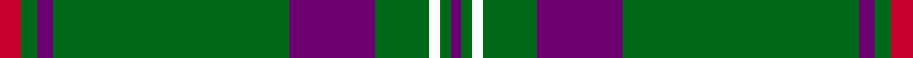

This is one **variant** — a specific cloth: this exact thread count and colourway, with its own
provenance below. It is one weaving of the [sett](/tartans/g/gl/glenfeshie/) (the scale-free proportion — the
same cloth at any scale or shade), whose colour order is pattern [BGWGBGBGR](/stripes/bgwgbgbgr/).

Part of the [Glenfeshie](/tartans/g/gl/glenfeshie/) tartan — the named design grouping this sett with its other cloths.

Sourced from register-of-tartans.  It is a [9 stripe tartan](/stripes/stripes9/).

Original link [https://www.tartanregister.gov.uk/tartanDetails.aspx?ref=1417](https://www.tartanregister.gov.uk/tartanDetails.aspx?ref=1417)

2 attestations — the source records this cloth was collapsed from (oldest owns this page)

<ul>
<li>01/01/2003 — Glenfeshie (Personal) (register-of-tartans, <a href="https://www.tartanregister.gov.uk/tartanDetails.aspx?ref=1417">record</a>)  <em>No other details. Lochcarron swatch labelled 'Penmark' - assume that was the customer.</em></li>
<li>2003 — Glenfeshie (Personal) (tartans-authority, <a href="https://web.archive.org/web/*/http://www.tartansauthority.com/tartan-ferret/display/6023/*">record</a>)  <em>No other details. Lochcarron swatch labelled 'Penmark' - assume that was the customer.</em></li>
</ul>

Dataset <small>— provenance for this record, inherited from the source manifest</small>

<dl class="dataset-prov">
<dt>source</dt><dd><a href="/sources/register-of-tartans/">Scottish Register of Tartans</a></dd>
<dt>data captured from</dt><dd><a href="https://github.com/thetartan/tartan-database/blob/master/data/register-of-tartans/data.csv">https://github.com/thetartan/tartan-database/blob/master/data/register-of-tartans/data.csv</a></dd>
<dt>data date</dt><dd>2003 <small>(this record)</small></dd>
<dt>licence</dt><dd><a href="https://www.tartanregister.gov.uk/copyright">Crown copyright</a></dd>
</dl>

Capture chain <small>— the hands this data passed through, oldest first; each capture carries its own licence</small>

<ol class="capture-chain">
<li><a href="https://www.tartanregister.gov.uk/">Scottish Register of Tartans</a> · <a href="https://www.tartanregister.gov.uk/copyright">Crown copyright</a> <small>the living register — still published by National Records of Scotland</small></li>
<li><a href="https://github.com/thetartan/tartan-database">thetartan/tartan-database</a> <small>2016-2017</small> · <a href="https://creativecommons.org/licenses/by-nc-nd/4.0/">CC BY-NC-ND 4.0</a> <small>Levko Kravets's frozen compilation — the capture we vendored, and where its CC licence text came from</small></li>
<li>this dictionary <small>captured 2026-06-10 · commit 5bf86c7566</small> <small>each re-capture is a git commit to data/sources</small></li>
</ol>

## Register references

External register numbers recorded for this tartan.

- Scottish Register of Tartans: [1417](https://www.tartanregister.gov.uk/tartanDetails.aspx?ref=1417)
- Scottish Tartans Authority (ITI): 6023

## Thread count
R/8 G6 DP6 G88 DP32 G20 W4 G4 DP/4

One full sett is **332 threads**.

## Palette
<table><thead><tr><th>Colour</th><th>Shade</th><th>OKLCh</th></tr></thead><tbody><tr><td>G</td><td><code style="background-color:#008B2A;">#008B2A</code> <small style="color:#888">#008B2A</small></td><td><small style="color:#888">oklch(55.4% 0.170 145.9)</small></td></tr><tr><td>DP</td><td><code style="background-color:#4B0B4F;">#4B0B4F</code> <small style="color:#888">#4B0B4F</small></td><td><small style="color:#888">oklch(30.1% 0.125 325.4)</small></td></tr><tr><td>R</td><td><code style="background-color:#D60020;">#D60020</code> <small style="color:#888">#D60020</small></td><td><small style="color:#888">oklch(55.2% 0.224 25.5)</small></td></tr><tr><td>W</td><td><code style="background-color:#F7F7F7;">#F7F7F7</code> <small style="color:#888">#F7F7F7</small></td><td><small style="color:#888">oklch(97.6% 0.000 89.9)</small></td></tr></tbody></table>

# Sample pattern

[Sample sheet (PDF)](swatch.pdf) — the woven sample, thread count and palette on one printable A4, rendered on demand (the same sheet the TTD print page downloads).

## Nearest tartan variants

The nearest existing variants by ΔTartan distance, with this cloth at the top so the swatches line up against it.

ΔTartan

Threads

Variant

Sett

—

332

<a href="/variants/s9/r4g3dp3g44dp16g10w2g2dp2~x2/">Glenfeshie (Personal)</a>

<a href="/ttd/edit/#slug=g33db2g33r2db12r12g4r2g4w3~x2&amp;base=r4g3dp3g44dp16g10w2g2dp2~x2" title="compare in the TTD">1.83</a>

356

<a href="/variants/s10/g33db2g33r2db12r12g4r2g4w3~x2/">Island Weavers (Corporate)</a>

<a href="/ttd/edit/#slug=dg5r3dg3ly2dg1lyi8dg24ly2~x2~ly6614084-lyi7811105&amp;base=r4g3dp3g44dp16g10w2g2dp2~x2" title="compare in the TTD">2.12</a>

178

<a href="/variants/s8/dg5r3dg3ly2dg1lyi8dg24ly2~x2~ly6614084-lyi7811105/">St. Christopher (Corporate)</a>

<a href="/ttd/edit/#slug=g78db13ly6r3ly5g6db9ly6~x2&amp;base=r4g3dp3g44dp16g10w2g2dp2~x2" title="compare in the TTD">2.19</a>

336

<a href="/variants/s8/g78db13ly6r3ly5g6db9ly6~x2/">Walterstrm (2014))</a>

<a href="/ttd/edit/#slug=g5w1g32db1g8db9g2w2r3db3w1~x2&amp;base=r4g3dp3g44dp16g10w2g2dp2~x2" title="compare in the TTD">2.20</a>

256

<a href="/variants/s11/g5w1g32db1g8db9g2w2r3db3w1~x2/">Portosalvo</a>

<a href="/ttd/edit/#slug=db17r3g55db3g4db3g4y3w5~x2&amp;base=r4g3dp3g44dp16g10w2g2dp2~x2" title="compare in the TTD">2.74</a>

344

<a href="/variants/s9/db17r3g55db3g4db3g4y3w5~x2/">Bundanoon</a>

<a href="/ttd/edit/#slug=g4lb1db2r1g1r1db2lb1g14lo1~x4&amp;base=r4g3dp3g44dp16g10w2g2dp2~x2" title="compare in the TTD">2.74</a>

204

<a href="/variants/s10/g4lb1db2r1g1r1db2lb1g14lo1~x4/">Seattle (District)</a>

<a href="/ttd/edit/#slug=g14w1db2r1g1r1db2w1g4y1~x4&amp;base=r4g3dp3g44dp16g10w2g2dp2~x2" title="compare in the TTD">2.76</a>

164

<a href="/variants/s10/g14w1db2r1g1r1db2w1g4y1~x4/">Seattle District Tartan</a>

<a href="/ttd/edit/#slug=db17r3g55db3g4db3g4dy3w5~x2&amp;base=r4g3dp3g44dp16g10w2g2dp2~x2" title="compare in the TTD">2.77</a>

344

<a href="/variants/s9/db17r3g55db3g4db3g4dy3w5~x2/">Bundanoon</a>

<a href="/ttd/edit/#slug=g40db2w2db2y2db23g32r2~x2&amp;base=r4g3dp3g44dp16g10w2g2dp2~x2" title="compare in the TTD">2.82</a>

336

<a href="/variants/s8/g40db2w2db2y2db23g32r2~x2/">Marshall Fields Corporate Tartan</a>

<a href="/ttd/edit/#slug=g3db1g2dbi1g3r3g2r2g18db2~x2~dbi2508255-r5221030&amp;base=r4g3dp3g44dp16g10w2g2dp2~x2" title="compare in the TTD">2.94</a>

138

<a href="/variants/s10/g3db1g2dbi1g3r3g2r2g18db2~x2~dbi2508255-r5221030/">Owen (Welsh Name)</a>

## Neighbour map

Every grey dot is one of 13662 variants placed by the first two principal components of the ΔTartan feature space (42% of its variance). Red is this tartan; blue dots are its nearest — click one to open its page. The map is a flat projection of a many-dimensional space — [how to read it](/posts/neighbourhood-maps/).

<svg viewBox="0 0 640 380" role="img" style="max-width:100%;height:auto;border:1px solid #e0e0e0;border-radius:4px;display:block" xmlns="http://www.w3.org/2000/svg"><image href="/nn/cloud.v1.png" width="640" height="380"/><a href="/variants/s10/g33db2g33r2db12r12g4r2g4w3~x2/"><circle cx="407.7" cy="161.8" r="4" fill="#3465a4"><title>Island Weavers (Corporate)</title></circle></a><a href="/variants/s8/dg5r3dg3ly2dg1lyi8dg24ly2~x2~ly6614084-lyi7811105/"><circle cx="414.0" cy="143.0" r="4" fill="#3465a4"><title>St. Christopher (Corporate)</title></circle></a><a href="/variants/s8/g78db13ly6r3ly5g6db9ly6~x2/"><circle cx="436.9" cy="140.3" r="4" fill="#3465a4"><title>Walterstrm (2014))</title></circle></a><a href="/variants/s11/g5w1g32db1g8db9g2w2r3db3w1~x2/"><circle cx="443.5" cy="118.6" r="4" fill="#3465a4"><title>Portosalvo</title></circle></a><a href="/variants/s9/db17r3g55db3g4db3g4y3w5~x2/"><circle cx="381.0" cy="127.3" r="4" fill="#3465a4"><title>Bundanoon</title></circle></a><a href="/variants/s10/g4lb1db2r1g1r1db2lb1g14lo1~x4/"><circle cx="389.4" cy="141.4" r="4" fill="#3465a4"><title>Seattle (District)</title></circle></a><a href="/variants/s10/g14w1db2r1g1r1db2w1g4y1~x4/"><circle cx="378.5" cy="138.4" r="4" fill="#3465a4"><title>Seattle District Tartan</title></circle></a><a href="/variants/s9/db17r3g55db3g4db3g4dy3w5~x2/"><circle cx="378.4" cy="126.3" r="4" fill="#3465a4"><title>Bundanoon</title></circle></a><a href="/variants/s8/g40db2w2db2y2db23g32r2~x2/"><circle cx="412.3" cy="151.7" r="4" fill="#3465a4"><title>Marshall Fields Corporate Tartan</title></circle></a><a href="/variants/s10/g3db1g2dbi1g3r3g2r2g18db2~x2~dbi2508255-r5221030/"><circle cx="491.5" cy="153.8" r="4" fill="#3465a4"><title>Owen (Welsh Name)</title></circle></a><circle cx="432.6" cy="138.7" r="5" fill="#c00000"/><text x="320" y="376" text-anchor="middle" font-size="11" fill="#999">ground</text><text x="11" y="190" text-anchor="middle" font-size="11" fill="#999" transform="rotate(-90 11 190)">complexity</text></svg>

ID: /variants/s9/r4g3dp3g44dp16g10w2g2dp2~x2/
