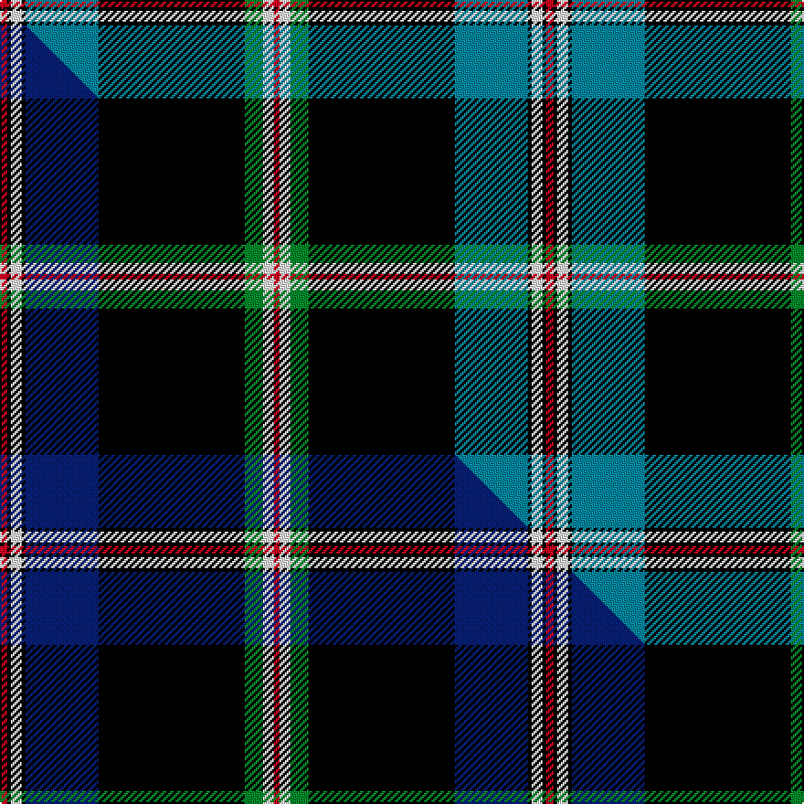

This page is one **sett** — a single exact thread-count. It belongs to the [tartan](/setts/r4k2w6k2t40k80g10w6r3/)
(the same proportion at any scale), whose colour order is pattern [RKWKBKGWR](/stripes/rkwkbkgwr/).

Part of the [Italian American](/tartans/italian-american/) tartan — the named design grouping this sett with its other cloths.

Sourced from tartans-authority.  It is a [9 stripe tartan](/stripes/stripes9/).

Original link http://www.tartansauthority.com/tartan-ferret/display/10135/

## Provenance

Earliest known date: 5th Jan. 2010 This tartan was designed by Rocky Roeger of USA Kilts and was commissioned by Tony Licalzi, to celebrate the creativity and passion of Italian Americans. The green, white and red represent the colours of the Italian flag and the red, white and blue, the American flag. This is a Universal tartan that is available for anyone to wear.

2 attestations — the source records this cloth was collapsed from (oldest owns this page)

<ul>
<li>5th Jan. 2010 — Italian American (Corporate) (tartans-authority, <a href="http://www.tartansauthority.com/tartan-ferret/display/10135/">record</a>)  <em>This tartan was designed by Rocky Roeger of USA Kilts and was commissioned by Tony Licalzi, to celebrate the creativity and passion of Italian Americans. The green, white and red represent the colours of the Italian flag and the red, white and blue, the American flag. This is a Universal tartan that is available for anyone to wear.</em></li>
<li>undated — Italian American Corporate Tartan (house-of-tartan, <a href="http://www.house-of-tartan.scotland.net/house/TartanViewjs.asp?colr=Def&tnam=10135">record</a>) </li>
</ul>

## Register references

External register numbers recorded for this tartan.

- Scottish Register of Tartans: [10135](https://www.tartanregister.gov.uk/tartanDetails?ref=10135)
- Scottish Tartans Authority (ITI): 10135

## Thread count
R/4 K2 W6 K2 T40 K80 G10 W6 R/3

One full sett is **299 threads**.

## Palette
<table><thead><tr><th>Colour</th><th>Shade</th><th>OKLCh</th></tr></thead><tbody><tr><td>T</td><td><code style="background-color:#00879F;">#00879F</code> <small style="color:#888">#00879F</small></td><td><small style="color:#888">oklch(57.4% 0.102 216.1)</small></td></tr><tr><td>G</td><td><code style="background-color:#008B2A;">#008B2A</code> <small style="color:#888">#008B2A</small></td><td><small style="color:#888">oklch(55.4% 0.170 145.9)</small></td></tr><tr><td>K</td><td><code style="background-color:#000000;">#000000</code> <small style="color:#888">#000000</small></td><td><small style="color:#888">oklch(0.0% 0.000 0.0)</small></td></tr><tr><td>W</td><td><code style="background-color:#F7F7F7;">#F7F7F7</code> <small style="color:#888">#F7F7F7</small></td><td><small style="color:#888">oklch(97.6% 0.000 89.9)</small></td></tr><tr><td>R</td><td><code style="background-color:#D60020;">#D60020</code> <small style="color:#888">#D60020</small></td><td><small style="color:#888">oklch(55.2% 0.224 25.5)</small></td></tr></tbody></table>

# Sample pattern

## Compared to the master

This cloth is one sett of its design; the master sett (the exemplar the design is anchored on) is below for comparison.

Its **ΔTartan distance** from the master is **0.83** — the same measure the nearest-tartans table ranks by (0 is identical; a re-scale of the same cloth is near 0, a recolour or a different proportion further).

<figure class="master-compare" style="margin:0">

this sett
master sett ★

<figcaption style="color:#888;font-size:smaller">One weave of this sett against the <a href="/setts/r4k2w6k2db40k80g10w6r3/">master sett ★</a>, split on the diagonal: a shared proportion runs seamlessly across it with only the shades shifting; a different proportion breaks on it.</figcaption>
</figure>

## Nearest variants

The nearest existing variants by ΔTartan distance, with this cloth at the top so the swatches line up against it.

ΔTartan

Threads

Variant

Sett

—

299

<a href="/variants/s9/r4k2w6k2t40k80g10w6r3/">Italian American (Corporate)</a>

<a href="/ttd/edit/#slug=r4k2w6k2db40k80g10w6r3&amp;base=r4k2w6k2t40k80g10w6r3" title="compare in the TTD">0.00</a>

299

<a href="/variants/s9/r4k2w6k2db40k80g10w6r3/">Italian American</a>

<a href="/ttd/edit/#slug=r3t14y2k2t14k36y2k2y2~x2&amp;base=r4k2w6k2t40k80g10w6r3" title="compare in the TTD">2.69</a>

298

<a href="/variants/s9/r3t14y2k2t14k36y2k2y2~x2/">Ewbank</a>

<a href="/ttd/edit/#slug=dr35w8k85n6k4n14k2dp4&amp;base=r4k2w6k2t40k80g10w6r3" title="compare in the TTD">2.90</a>

277

<a href="/variants/s8/dr35w8k85n6k4n14k2dp4/">MacEvil (Corporate)</a>

## Neighbour map

Every grey dot is one of 13620 variants placed by the first two principal components of the ΔTartan feature space (42% of its variance). Red is this tartan; blue dots are its nearest — click one to open its page.

<svg viewBox="0 0 640 380" role="img" style="max-width:100%;height:auto;border:1px solid #e0e0e0;border-radius:4px;display:block" xmlns="http://www.w3.org/2000/svg"><image href="/nn/cloud.v1.png" width="640" height="380"/><a href="/variants/s9/r4k2w6k2db40k80g10w6r3/"><circle cx="278.7" cy="62.2" r="4" fill="#3465a4"><title>Italian American</title></circle></a><a href="/variants/s9/r3t14y2k2t14k36y2k2y2~x2/"><circle cx="266.0" cy="120.4" r="4" fill="#3465a4"><title>Ewbank</title></circle></a><a href="/variants/s8/dr35w8k85n6k4n14k2dp4/"><circle cx="315.1" cy="75.7" r="4" fill="#3465a4"><title>MacEvil (Corporate)</title></circle></a><circle cx="269.1" cy="61.9" r="5" fill="#c00000"/><text x="320" y="376" text-anchor="middle" font-size="11" fill="#999">ground</text><text x="11" y="190" text-anchor="middle" font-size="11" fill="#999" transform="rotate(-90 11 190)">complexity</text></svg>

ID: /variants/s9/r4k2w6k2t40k80g10w6r3/
