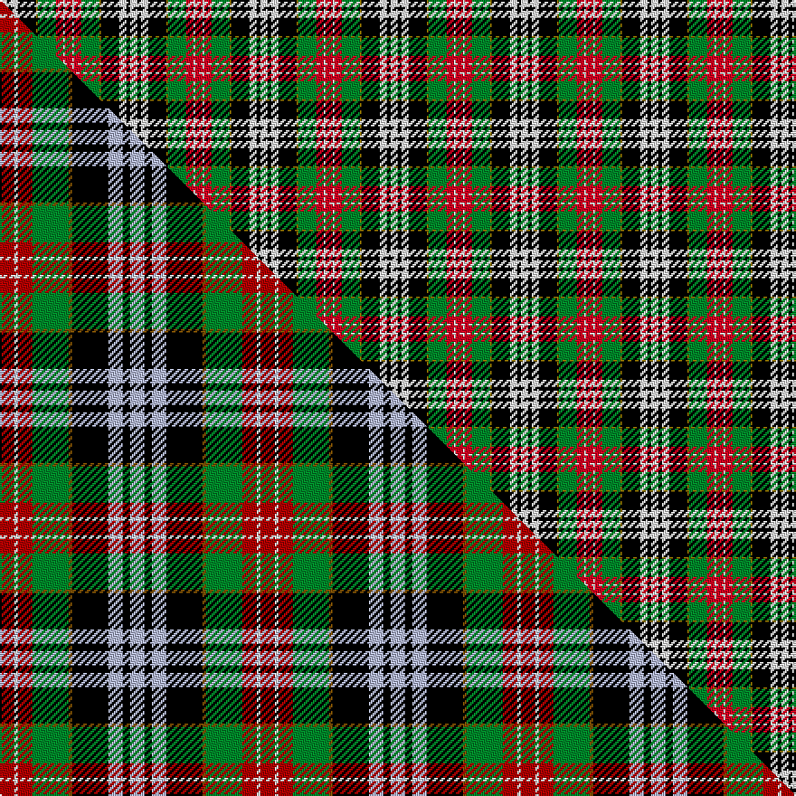

This page is one **sett** — a single exact thread-count. It belongs to the [tartan](/setts/r4w1r4g10y1k10w4k2w4/)
(the same proportion at any scale), whose colour order is pattern [RWRGGKWKW](/stripes/rwrggkwkw/).

Part of the [Cumming LO](/tartans/cumming-lo/) tartan — the named design grouping this sett with its other cloths.

Sourced from weddslist.  It is a [9 stripe tartan](/stripes/stripes9/).

Original link http://www.weddslist.com/cgi-bin/tartans/pg.pl?source=rb

## Thread count
W/4 K2 W4 K10 Y1 G10 R4 W1 R/4

One full sett is **72 threads**.

## Palette
<table><thead><tr><th>Colour</th><th>Shade</th><th>OKLCh</th></tr></thead><tbody><tr><td>G</td><td><code style="background-color:#008B2A;">#008B2A</code> <small style="color:#888">#008B2A</small></td><td><small style="color:#888">oklch(55.4% 0.170 145.9)</small></td></tr><tr><td>K</td><td><code style="background-color:#000000;">#000000</code> <small style="color:#888">#000000</small></td><td><small style="color:#888">oklch(0.0% 0.000 0.0)</small></td></tr><tr><td>W</td><td><code style="background-color:#F7F7F7;">#F7F7F7</code> <small style="color:#888">#F7F7F7</small></td><td><small style="color:#888">oklch(97.6% 0.000 89.9)</small></td></tr><tr><td>R</td><td><code style="background-color:#D60020;">#D60020</code> <small style="color:#888">#D60020</small></td><td><small style="color:#888">oklch(55.2% 0.224 25.5)</small></td></tr><tr><td>Y</td><td><code style="background-color:#8B6E00;">#8B6E00</code> <small style="color:#888">#8B6E00</small></td><td><small style="color:#888">oklch(55.1% 0.113 90.4)</small></td></tr></tbody></table>

# Sample pattern

## Compared to the master

This cloth is one sett of its design; the master sett (the exemplar the design is anchored on) is below for comparison.

Its **ΔTartan distance** from the master is **2.00** — the same measure the nearest-tartans table ranks by (0 is identical; a re-scale of the same cloth is near 0, a recolour or a different proportion further).

<figure class="master-compare" style="margin:0">

this sett
master sett ★

<figcaption style="color:#888;font-size:smaller">One weave of this sett against the <a href="/setts/r4w1r4g10y1k10lb4k2lb4/">master sett ★</a>, split on the diagonal: a shared proportion runs seamlessly across it with only the shades shifting; a different proportion breaks on it.</figcaption>
</figure>

## Nearest tartan variants

The nearest existing variants by ΔTartan distance, with this cloth at the top so the swatches line up against it.

ΔTartan

Threads

Variant

Sett

—

72

<a href="/variants/s9/r4w1r4g10y1k10w4k2w4/">Cumming LO</a>

<a href="/ttd/edit/#slug=r4g7y3g12k16lb5r20lb5k4lb2~x2&amp;base=r4w1r4g10y1k10w4k2w4" title="compare in the TTD">1.45</a>

300

<a href="/variants/s10/r4g7y3g12k16lb5r20lb5k4lb2~x2/">Unidentified #9</a>

<a href="/ttd/edit/#slug=r4w1r4g10y1k10lb4k2lb4~x4&amp;base=r4w1r4g10y1k10w4k2w4" title="compare in the TTD">2.00</a>

288

<a href="/variants/s9/r4w1r4g10y1k10lb4k2lb4~x4/">Comyn/Cumming</a>

<a href="/ttd/edit/#slug=k6g5k6do6w1do10k6w3dr1w12dr1w3~x4&amp;base=r4w1r4g10y1k10w4k2w4" title="compare in the TTD">2.02</a>

444

<a href="/variants/s12/k6g5k6do6w1do10k6w3dr1w12dr1w3~x4/">Forbes - 1970 (WCWM #1)</a>

<a href="/ttd/edit/#slug=lr3ly2k4lo6k4ly15k4dg18k2ly3~x2&amp;base=r4w1r4g10y1k10w4k2w4" title="compare in the TTD">2.11</a>

232

<a href="/variants/s10/lr3ly2k4lo6k4ly15k4dg18k2ly3~x2/">Fitzsimmons</a>

<a href="/ttd/edit/#slug=y1k1r8y4k6dg8w8k1y1~x4&amp;base=r4w1r4g10y1k10w4k2w4" title="compare in the TTD">2.18</a>

296

<a href="/variants/s9/y1k1r8y4k6dg8w8k1y1~x4/">Graham, Red Dress</a>

<a href="/ttd/edit/#slug=dr4k1dr4g8k6lb3db2lb11db1dr2~x4&amp;base=r4w1r4g10y1k10w4k2w4" title="compare in the TTD">2.25</a>

312

<a href="/variants/s10/dr4k1dr4g8k6lb3db2lb11db1dr2~x4/">MacDuff Dress #2</a>

<a href="/ttd/edit/#slug=dy3g2ly18k4dr15k4dy6k4ly2g3~x2&amp;base=r4w1r4g10y1k10w4k2w4" title="compare in the TTD">2.26</a>

232

<a href="/variants/s10/dy3g2ly18k4dr15k4dy6k4ly2g3~x2/">Fitzsimmons Red (Name)</a>

<a href="/ttd/edit/#slug=r4w1r4g10y1k10lb4k2lb4~x2~r1908029-y1904072&amp;base=r4w1r4g10y1k10w4k2w4" title="compare in the TTD">2.29</a>

144

<a href="/variants/s9/r4w1r4g10y1k10lb4k2lb4~x2~r1908029-y1904072/">Cumming LO</a>

<a href="/ttd/edit/#slug=w18dr3w3dr10w26dr3k26g28dr10g3dr3g8lo6&amp;base=r4w1r4g10y1k10w4k2w4" title="compare in the TTD">2.35</a>

270

<a href="/variants/s13/w18dr3w3dr10w26dr3k26g28dr10g3dr3g8lo6/">Carnegie Dress #2 (Fashion)</a>

<a href="/ttd/edit/#slug=r4g6y3g12k14db5r20db5k4db2~x2&amp;base=r4w1r4g10y1k10w4k2w4" title="compare in the TTD">2.39</a>

288

<a href="/variants/s10/r4g6y3g12k14db5r20db5k4db2~x2/">Etienne-Carter, Sir George</a>

## Neighbour map

Every grey dot is one of 13620 variants placed by the first two principal components of the ΔTartan feature space (42% of its variance). Red is this tartan; blue dots are its nearest — click one to open its page.

<svg viewBox="0 0 640 380" role="img" style="max-width:100%;height:auto;border:1px solid #e0e0e0;border-radius:4px;display:block" xmlns="http://www.w3.org/2000/svg"><image href="/nn/cloud.v1.png" width="640" height="380"/><a href="/variants/s10/r4g7y3g12k16lb5r20lb5k4lb2~x2/"><circle cx="81.1" cy="164.6" r="4" fill="#3465a4"><title>Unidentified #9</title></circle></a><a href="/variants/s9/r4w1r4g10y1k10lb4k2lb4~x4/"><circle cx="51.9" cy="157.9" r="4" fill="#3465a4"><title>Comyn/Cumming</title></circle></a><a href="/variants/s12/k6g5k6do6w1do10k6w3dr1w12dr1w3~x4/"><circle cx="70.8" cy="156.2" r="4" fill="#3465a4"><title>Forbes - 1970 (WCWM #1)</title></circle></a><a href="/variants/s10/lr3ly2k4lo6k4ly15k4dg18k2ly3~x2/"><circle cx="87.9" cy="157.2" r="4" fill="#3465a4"><title>Fitzsimmons</title></circle></a><a href="/variants/s9/y1k1r8y4k6dg8w8k1y1~x4/"><circle cx="22.9" cy="175.5" r="4" fill="#3465a4"><title>Graham, Red Dress</title></circle></a><a href="/variants/s10/dr4k1dr4g8k6lb3db2lb11db1dr2~x4/"><circle cx="87.4" cy="165.4" r="4" fill="#3465a4"><title>MacDuff Dress #2</title></circle></a><a href="/variants/s10/dy3g2ly18k4dr15k4dy6k4ly2g3~x2/"><circle cx="87.9" cy="157.3" r="4" fill="#3465a4"><title>Fitzsimmons Red (Name)</title></circle></a><a href="/variants/s9/r4w1r4g10y1k10lb4k2lb4~x2~r1908029-y1904072/"><circle cx="53.0" cy="158.9" r="4" fill="#3465a4"><title>Cumming LO</title></circle></a><a href="/variants/s13/w18dr3w3dr10w26dr3k26g28dr10g3dr3g8lo6/"><circle cx="68.4" cy="151.2" r="4" fill="#3465a4"><title>Carnegie Dress #2 (Fashion)</title></circle></a><a href="/variants/s10/r4g6y3g12k14db5r20db5k4db2~x2/"><circle cx="93.4" cy="166.7" r="4" fill="#3465a4"><title>Etienne-Carter, Sir George</title></circle></a><circle cx="65.5" cy="169.8" r="5" fill="#c00000"/><text x="320" y="376" text-anchor="middle" font-size="11" fill="#999">ground</text><text x="11" y="190" text-anchor="middle" font-size="11" fill="#999" transform="rotate(-90 11 190)">complexity</text></svg>

ID: /variants/s9/r4w1r4g10y1k10w4k2w4/
