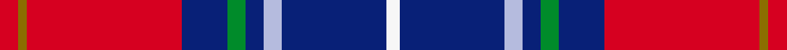
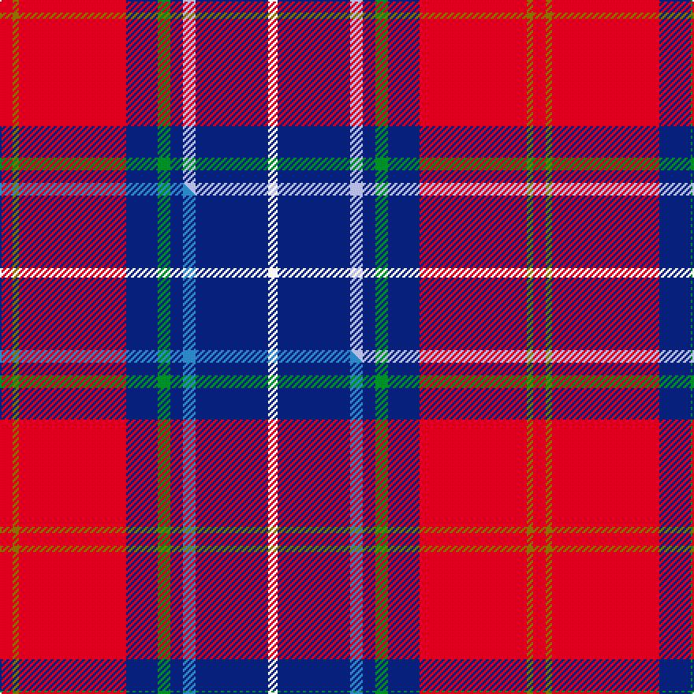

This is one **variant** — a specific cloth: this exact thread count and colourway, with its own
provenance below. It is one weaving of the [sett](/tartans/h/he/heirloom-red-alba/) (the scale-free proportion — the
same cloth at any scale or shade), whose colour order is pattern [RGRBGBWBW](/stripes/rgrbgbwbw/).

Part of the [Heirloom Red Alba](/tartans/h/he/heirloom-red-alba/) tartan — the named design grouping this sett with its other cloths.

Sourced from tartans-authority.  It is a [9 stripe tartan](/stripes/stripes9/).

Original link <code>http://www.tartansauthority.com/tartan-ferret/display/6407/</code> — retired · [Internet Archive copy](https://web.archive.org/web/*/http://www.tartansauthority.com/tartan-ferret/display/6407/*)

Dataset <small>— provenance for this record, inherited from the source manifest</small>

<dl class="dataset-prov">
<dt>source</dt><dd><a href="/sources/tartans-authority/">Scottish Tartans Authority</a></dd>
<dt>data captured from</dt><dd><a href="https://github.com/thetartan/tartan-database/blob/master/data/tartans-authority/data.csv">https://github.com/thetartan/tartan-database/blob/master/data/tartans-authority/data.csv</a></dd>
<dt>data date</dt><dd>Jan 2004 <small>(this record)</small></dd>
<dt>licence</dt><dd><a href="https://creativecommons.org/licenses/by-nc-nd/4.0/">CC BY-NC-ND 4.0</a></dd>
</dl>

Capture chain <small>— the hands this data passed through, oldest first; each capture carries its own licence</small>

<ol class="capture-chain">
<li><a href="https://www.tartansauthority.com/">Scottish Tartans Authority</a> <small>the heritage body’s archive — its tartan-ferret record browser is retired; dead record links are shown unlinked, with an Internet Archive copy (ITI numbers are not SRT references)</small></li>
<li><a href="https://github.com/thetartan/tartan-database">thetartan/tartan-database</a> <small>2016-2017</small> · <a href="https://creativecommons.org/licenses/by-nc-nd/4.0/">CC BY-NC-ND 4.0</a> <small>Levko Kravets's frozen compilation — the capture we vendored, and where its CC licence text came from</small></li>
<li>this dictionary <small>captured 2026-06-10 · commit 5bf86c7566</small> <small>each re-capture is a git commit to data/sources</small></li>
</ol>

## Register references

External register numbers recorded for this tartan.

- Scottish Tartans Authority (ITI): 6407

## Thread count
R/8 Y4 R68 DB20 G8 DB8 LB8 DB46 W/6

One full sett is **338 threads**.

## Palette
<table><thead><tr><th>Colour</th><th>Shade</th><th>OKLCh</th></tr></thead><tbody><tr><td>LB</td><td><code style="background-color:#B5BBDE;">#B5BBDE</code> <small style="color:#888">#B5BBDE</small></td><td><small style="color:#888">oklch(79.9% 0.050 277.6)</small></td></tr><tr><td>DB</td><td><code style="background-color:#082077;">#082077</code> <small style="color:#888">#082077</small></td><td><small style="color:#888">oklch(30.0% 0.149 265.1)</small></td></tr><tr><td>R</td><td><code style="background-color:#D60020;">#D60020</code> <small style="color:#888">#D60020</small></td><td><small style="color:#888">oklch(55.2% 0.224 25.5)</small></td></tr><tr><td>G</td><td><code style="background-color:#008B2A;">#008B2A</code> <small style="color:#888">#008B2A</small></td><td><small style="color:#888">oklch(55.4% 0.170 145.9)</small></td></tr><tr><td>W</td><td><code style="background-color:#F7F7F7;">#F7F7F7</code> <small style="color:#888">#F7F7F7</small></td><td><small style="color:#888">oklch(97.6% 0.000 89.9)</small></td></tr><tr><td>Y</td><td><code style="background-color:#8B6E00;">#8B6E00</code> <small style="color:#888">#8B6E00</small></td><td><small style="color:#888">oklch(55.1% 0.113 90.4)</small></td></tr></tbody></table>

# Sample pattern

## Compared to the master

This cloth is one sett of its design; the master sett (the exemplar the design is anchored on) is below for comparison.

Its **ΔTartan distance** from the master is **0.02** — the same measure the nearest-tartans table ranks by (0 is identical; a re-scale of the same cloth is near 0, a recolour or a different proportion further).

<figure class="master-compare" style="margin:0">

this sett
master sett ★

<figcaption style="color:#888;font-size:smaller">One weave of this sett against the <a href="/setts/r4y2r34db10g4db4t4db23w3/">master sett ★</a>, split on the diagonal: a shared proportion runs seamlessly across it with only the shades shifting; a different proportion breaks on it.</figcaption>
</figure>

## Nearest tartan variants

The nearest existing variants by ΔTartan distance, with this cloth at the top so the swatches line up against it.

ΔTartan

Threads

Variant

Sett

—

338

<a href="/variants/s9/r4y2r34db10g4db4lb4db23w3~x2/">Heirloom Red Alba (Fashion)</a>

<a href="/ttd/edit/#slug=r4y2r34db10g4db4t4db23w3~x2~t2405244&amp;base=r4y2r34db10g4db4lb4db23w3~x2" title="compare in the TTD">0.02</a>

338

<a href="/variants/s9/r4y2r34db10g4db4t4db23w3~x2~t2405244/">Heirloom Red Alba</a>

<a href="/ttd/edit/#slug=db8w3db25k3db4k8r31y2r5~x2&amp;base=r4y2r34db10g4db4lb4db23w3~x2" title="compare in the TTD">1.22</a>

330

<a href="/variants/s9/db8w3db25k3db4k8r31y2r5~x2/">Caledon (Corporate)</a>

<a href="/ttd/edit/#slug=db5lb2db11g2db2g6r17y9db1r1~x2&amp;base=r4y2r34db10g4db4lb4db23w3~x2" title="compare in the TTD">2.15</a>

212

<a href="/variants/s10/db5lb2db11g2db2g6r17y9db1r1~x2/">Clarks No.1</a>

<a href="/ttd/edit/#slug=db5lb2db11g2db2g6r17ly9db1r1~x2&amp;base=r4y2r34db10g4db4lb4db23w3~x2" title="compare in the TTD">2.15</a>

212

<a href="/variants/s10/db5lb2db11g2db2g6r17ly9db1r1~x2/">Clarks No. 1 (Fashion)</a>

<a href="/ttd/edit/#slug=ly3db8w3db34r34g4r4w2~x2&amp;base=r4y2r34db10g4db4lb4db23w3~x2" title="compare in the TTD">2.32</a>

358

<a href="/variants/s8/ly3db8w3db34r34g4r4w2~x2/">Manitoba Masonic (Corporate)</a>

<a href="/ttd/edit/#slug=y3db8w3db34r34dg4r4w2~x2&amp;base=r4y2r34db10g4db4lb4db23w3~x2" title="compare in the TTD">2.32</a>

358

<a href="/variants/s8/y3db8w3db34r34dg4r4w2~x2/">Manitoba Masonic</a>

<a href="/ttd/edit/#slug=r4db36ri35dg2ri2dg8w4~x2~r2309032-ri2510029&amp;base=r4y2r34db10g4db4lb4db23w3~x2" title="compare in the TTD">2.49</a>

348

<a href="/variants/s7/r4db36ri35dg2ri2dg8w4~x2~r2309032-ri2510029/">Cherry, John S (Personal)</a>

<a href="/ttd/edit/#slug=g18b2db5r45n3db18n3r5w2~db0805267-n1604274&amp;base=r4y2r34db10g4db4lb4db23w3~x2" title="compare in the TTD">2.51</a>

182

<a href="/variants/s9/g18b2db5r45dbi3db18dbi3r5w2~db0805267-dbi1604274/">MacNiven</a>

<a href="/ttd/edit/#slug=db3ly2db32r28w2r2w2r2w3~x2&amp;base=r4y2r34db10g4db4lb4db23w3~x2" title="compare in the TTD">2.57</a>

292

<a href="/variants/s9/db3ly2db32r28w2r2w2r2w3~x2/">Sea Dog Bamse, Pride of Norway</a>

<a href="/ttd/edit/#slug=db4y3db17b6w2do6w2r24do3r4~x2&amp;base=r4y2r34db10g4db4lb4db23w3~x2" title="compare in the TTD">2.61</a>

268

<a href="/variants/s10/db4y3db17b6w2do6w2r24do3r4~x2/">Asman Family</a>

## Neighbour map

Every grey dot is one of 13656 variants placed by the first two principal components of the ΔTartan feature space (42% of its variance). Red is this tartan; blue dots are its nearest — click one to open its page. The map is a flat projection of a many-dimensional space — [how to read it](/posts/neighbourhood-maps/).

<svg viewBox="0 0 640 380" role="img" style="max-width:100%;height:auto;border:1px solid #e0e0e0;border-radius:4px;display:block" xmlns="http://www.w3.org/2000/svg"><image href="/nn/cloud.v1.png" width="640" height="380"/><a href="/variants/s9/r4y2r34db10g4db4t4db23w3~x2~t2405244/"><circle cx="231.1" cy="107.0" r="4" fill="#3465a4"><title>Heirloom Red Alba</title></circle></a><a href="/variants/s9/db8w3db25k3db4k8r31y2r5~x2/"><circle cx="199.6" cy="125.4" r="4" fill="#3465a4"><title>Caledon (Corporate)</title></circle></a><a href="/variants/s10/db5lb2db11g2db2g6r17y9db1r1~x2/"><circle cx="188.8" cy="157.9" r="4" fill="#3465a4"><title>Clarks No.1</title></circle></a><a href="/variants/s10/db5lb2db11g2db2g6r17ly9db1r1~x2/"><circle cx="167.3" cy="151.2" r="4" fill="#3465a4"><title>Clarks No. 1 (Fashion)</title></circle></a><a href="/variants/s8/ly3db8w3db34r34g4r4w2~x2/"><circle cx="263.2" cy="135.2" r="4" fill="#3465a4"><title>Manitoba Masonic (Corporate)</title></circle></a><a href="/variants/s8/y3db8w3db34r34dg4r4w2~x2/"><circle cx="268.9" cy="136.6" r="4" fill="#3465a4"><title>Manitoba Masonic</title></circle></a><a href="/variants/s7/r4db36ri35dg2ri2dg8w4~x2~r2309032-ri2510029/"><circle cx="232.8" cy="138.9" r="4" fill="#3465a4"><title>Cherry, John S (Personal)</title></circle></a><a href="/variants/s9/g18b2db5r45dbi3db18dbi3r5w2~db0805267-dbi1604274/"><circle cx="258.0" cy="106.9" r="4" fill="#3465a4"><title>MacNiven</title></circle></a><a href="/variants/s9/db3ly2db32r28w2r2w2r2w3~x2/"><circle cx="291.7" cy="134.0" r="4" fill="#3465a4"><title>Sea Dog Bamse, Pride of Norway</title></circle></a><a href="/variants/s10/db4y3db17b6w2do6w2r24do3r4~x2/"><circle cx="181.4" cy="143.9" r="4" fill="#3465a4"><title>Asman Family</title></circle></a><circle cx="234.1" cy="123.3" r="5" fill="#c00000"/><text x="320" y="376" text-anchor="middle" font-size="11" fill="#999">ground</text><text x="11" y="190" text-anchor="middle" font-size="11" fill="#999" transform="rotate(-90 11 190)">complexity</text></svg>

ID: /variants/s9/r4y2r34db10g4db4lb4db23w3~x2/
