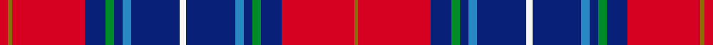

This page is one **sett** — a single exact thread-count. It belongs to the [tartan](/setts/r4y2r34db10g4db4t4db23w3/)
(the same proportion at any scale), whose colour order is pattern [GRBGBBBWBBBGBRGR](/stripes/grbgbbbwbbbgbrgr/).

Part of the [Heirloom Red Alba](/tartans/heirloom-red-alba/) tartan — the named design grouping this sett with its other cloths.

Sourced from register-of-tartans.  It is a [16 stripe tartan](/stripes/stripes16/).

Original link https://www.tartanregister.gov.uk/tartanDetails.aspx?ref=1680

## Register references

External register numbers recorded for this tartan.

- Scottish Register of Tartans: [1680](https://www.tartanregister.gov.uk/tartanDetails.aspx?ref=1680)
- Scottish Tartans Authority (ITI): 6407

## Thread count
R/8 Y4 R68 DB20 G8 DB8 T8 DB46 W6 DB46 T8 DB8 G8 DB20 R68 Y/4

One full sett is **664 threads**.

## Palette
<table><thead><tr><th>Colour</th><th>Shade</th><th>OKLCh</th></tr></thead><tbody><tr><td>T</td><td><code style="background-color:#2888C4;">#2888C4</code> <small style="color:#888">#2888C4</small></td><td><small style="color:#888">oklch(60.1% 0.125 241.5)</small></td></tr><tr><td>DB</td><td><code style="background-color:#082077;">#082077</code> <small style="color:#888">#082077</small></td><td><small style="color:#888">oklch(30.0% 0.149 265.1)</small></td></tr><tr><td>R</td><td><code style="background-color:#D60020;">#D60020</code> <small style="color:#888">#D60020</small></td><td><small style="color:#888">oklch(55.2% 0.224 25.5)</small></td></tr><tr><td>G</td><td><code style="background-color:#008B2A;">#008B2A</code> <small style="color:#888">#008B2A</small></td><td><small style="color:#888">oklch(55.4% 0.170 145.9)</small></td></tr><tr><td>LB</td><td><code style="background-color:#98C8E8;">#98C8E8</code> <small style="color:#888">#98C8E8</small></td><td><small style="color:#888">oklch(81.0% 0.068 237.9)</small></td></tr><tr><td>W</td><td><code style="background-color:#F7F7F7;">#F7F7F7</code> <small style="color:#888">#F7F7F7</small></td><td><small style="color:#888">oklch(97.6% 0.000 89.9)</small></td></tr><tr><td>Y</td><td><code style="background-color:#8B6E00;">#8B6E00</code> <small style="color:#888">#8B6E00</small></td><td><small style="color:#888">oklch(55.1% 0.113 90.4)</small></td></tr></tbody></table>

# Sample pattern

ID: /variants/s9/r4y2r34db10g4db4t4db23w3~x2~t2405244/
