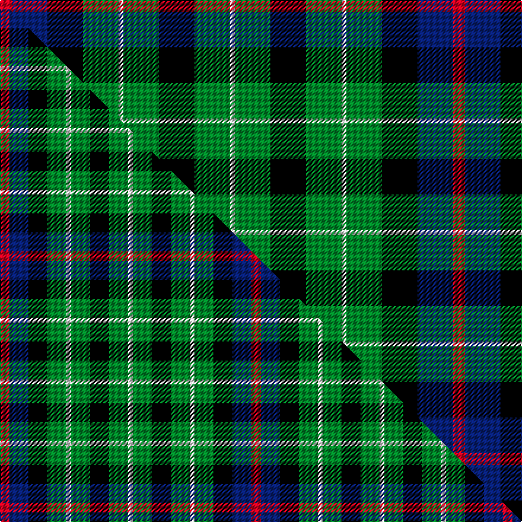

This page is one **sett** — a single exact thread-count. It belongs to the [tartan](/setts/r5db15k15g15w2g15k15g15w2/)
(the same proportion at any scale), whose colour order is pattern [RBKGWGKGW](/stripes/rbkgwgkgw/).

Part of the [Arrol](/tartans/arrol/) tartan — the named design grouping this sett with its other cloths.

Sourced from weddslist.  It is a [9 stripe tartan](/stripes/stripes9/).

Original link http://www.weddslist.com/cgi-bin/tartans/pg.pl?source=sts

## Provenance

Earliest known date: c.1910 From James Johnston & Co. (Glasgow) pattern book covering 1863 to 1963. Designed early 20th century for Sir William Arrol, head of the engineering firm which built Forth Bridge, and of the Arrol-Johnston motor car company, but it is not clear whether it was intended as a corporate tartan or for his personal use.

2 attestations — the source records this cloth was collapsed from (oldest owns this page)

<ul>
<li>undated — Arrol (weddslist, <a href="http://www.weddslist.com/cgi-bin/tartans/pg.pl?source=sts">record</a>) </li>
<li>undated — Arrol Corporate Tartan (house-of-tartan, <a href="http://www.house-of-tartan.scotland.net/house/TartanViewjs.asp?colr=Def&tnam=1365">record</a>) </li>
</ul>

## Thread count
R/10 DB30 K30 G30 W4 G30 K30 G30 W/4

One full sett is **382 threads**.

## Palette
<table><thead><tr><th>Colour</th><th>Shade</th><th>OKLCh</th></tr></thead><tbody><tr><td>DB</td><td><code style="background-color:#082077;">#082077</code> <small style="color:#888">#082077</small></td><td><small style="color:#888">oklch(30.0% 0.149 265.1)</small></td></tr><tr><td>G</td><td><code style="background-color:#008B2A;">#008B2A</code> <small style="color:#888">#008B2A</small></td><td><small style="color:#888">oklch(55.4% 0.170 145.9)</small></td></tr><tr><td>K</td><td><code style="background-color:#000000;">#000000</code> <small style="color:#888">#000000</small></td><td><small style="color:#888">oklch(0.0% 0.000 0.0)</small></td></tr><tr><td>W</td><td><code style="background-color:#F7F7F7;">#F7F7F7</code> <small style="color:#888">#F7F7F7</small></td><td><small style="color:#888">oklch(97.6% 0.000 89.9)</small></td></tr><tr><td>R</td><td><code style="background-color:#D60020;">#D60020</code> <small style="color:#888">#D60020</small></td><td><small style="color:#888">oklch(55.2% 0.224 25.5)</small></td></tr></tbody></table>

# Sample pattern

## Compared to the master

This cloth is one sett of its design; the master sett (the exemplar the design is anchored on) is below for comparison.

Its **ΔTartan distance** from the master is **1.18** — the same measure the nearest-tartans table ranks by (0 is identical; a re-scale of the same cloth is near 0, a recolour or a different proportion further).

<figure class="master-compare" style="margin:0">

this sett
master sett ★

<figcaption style="color:#888;font-size:smaller">One weave of this sett against the <a href="/setts/r2db4k4g4w1g4k4g4w1/">master sett ★</a>, split on the diagonal: a shared proportion runs seamlessly across it with only the shades shifting; a different proportion breaks on it.</figcaption>
</figure>

## Nearest tartan variants

The nearest existing variants by ΔTartan distance, with this cloth at the top so the swatches line up against it.

ΔTartan

Threads

Variant

Sett

—

382

<a href="/variants/s9/r5db15k15g15w2g15k15g15w2~x2/">Arrol</a>

<a href="/ttd/edit/#slug=r2db4k4g4w1g4k4g4w1~x4&amp;base=r5db15k15g15w2g15k15g15w2~x2" title="compare in the TTD">0.46</a>

212

<a href="/variants/s9/r2db4k4g4w1g4k4g4w1~x4/">Arrol</a>

<a href="/ttd/edit/#slug=g24k4g6r4g6k19db22w5~x2&amp;base=r5db15k15g15w2g15k15g15w2~x2" title="compare in the TTD">1.17</a>

302

<a href="/variants/s8/g24k4g6r4g6k19db22w5~x2/">MacRae, Ancient hunting</a>

<a href="/ttd/edit/#slug=k7g6w1g6k7db7k1~x4&amp;base=r5db15k15g15w2g15k15g15w2~x2" title="compare in the TTD">2.08</a>

248

<a href="/variants/s7/k7g6w1g6k7db7k1~x4/">MacLaggan</a>

<a href="/ttd/edit/#slug=g9w1g6k7db7k1~x2&amp;base=r5db15k15g15w2g15k15g15w2~x2" title="compare in the TTD">2.14</a>

104

<a href="/variants/s6/g9w1g6k7db7k1~x2/">Menteith</a>

<a href="/ttd/edit/#slug=k6g6w1g6k6dp6b1~x4&amp;base=r5db15k15g15w2g15k15g15w2~x2" title="compare in the TTD">2.26</a>

228

<a href="/variants/s7/k6g6w1g6k6dp6b1~x4/">Wilson's, No 233</a>

<a href="/ttd/edit/#slug=db12k4g12ly1g12k4db8r3~x2&amp;base=r5db15k15g15w2g15k15g15w2~x2" title="compare in the TTD">2.38</a>

194

<a href="/variants/s8/db12k4g12ly1g12k4db8r3~x2/">Art Pewter Silver</a>

<a href="/ttd/edit/#slug=k8g8k1g8k8b8w2~x2&amp;base=r5db15k15g15w2g15k15g15w2~x2" title="compare in the TTD">2.64</a>

152

<a href="/variants/s7/k8g8k1g8k8b8w2~x2/">Unnamed, No 31</a>

<a href="/ttd/edit/#slug=k8g8k1g8k8lb8w2~x2&amp;base=r5db15k15g15w2g15k15g15w2~x2" title="compare in the TTD">2.64</a>

152

<a href="/variants/s7/k8g8k1g8k8lb8w2~x2/">Unidentified No 31</a>

<a href="/ttd/edit/#slug=r3k8g17y2g17k8db8k2~x2&amp;base=r5db15k15g15w2g15k15g15w2~x2" title="compare in the TTD">2.71</a>

250

<a href="/variants/s8/r3k8g17y2g17k8db8k2~x2/">Aztec, New Mexico</a>

<a href="/ttd/edit/#slug=k11g12w2g12k12dp12r3~x2&amp;base=r5db15k15g15w2g15k15g15w2~x2" title="compare in the TTD">2.77</a>

228

<a href="/variants/s7/k11g12w2g12k12dp12r3~x2/">Cunningham / Wilson's No 120</a>

## Neighbour map

Every grey dot is one of 13620 variants placed by the first two principal components of the ΔTartan feature space (42% of its variance). Red is this tartan; blue dots are its nearest — click one to open its page.

<svg viewBox="0 0 640 380" role="img" style="max-width:100%;height:auto;border:1px solid #e0e0e0;border-radius:4px;display:block" xmlns="http://www.w3.org/2000/svg"><image href="/nn/cloud.v1.png" width="640" height="380"/><a href="/variants/s9/r2db4k4g4w1g4k4g4w1~x4/"><circle cx="71.7" cy="245.2" r="4" fill="#3465a4"><title>Arrol</title></circle></a><a href="/variants/s8/g24k4g6r4g6k19db22w5~x2/"><circle cx="108.3" cy="198.4" r="4" fill="#3465a4"><title>MacRae, Ancient hunting</title></circle></a><a href="/variants/s7/k7g6w1g6k7db7k1~x4/"><circle cx="135.6" cy="230.2" r="4" fill="#3465a4"><title>MacLaggan</title></circle></a><a href="/variants/s6/g9w1g6k7db7k1~x2/"><circle cx="184.1" cy="224.7" r="4" fill="#3465a4"><title>Menteith</title></circle></a><a href="/variants/s7/k6g6w1g6k6dp6b1~x4/"><circle cx="97.4" cy="230.0" r="4" fill="#3465a4"><title>Wilson's, No 233</title></circle></a><a href="/variants/s8/db12k4g12ly1g12k4db8r3~x2/"><circle cx="162.6" cy="192.1" r="4" fill="#3465a4"><title>Art Pewter Silver</title></circle></a><a href="/variants/s7/k8g8k1g8k8b8w2~x2/"><circle cx="121.1" cy="233.0" r="4" fill="#3465a4"><title>Unnamed, No 31</title></circle></a><a href="/variants/s7/k8g8k1g8k8lb8w2~x2/"><circle cx="115.1" cy="231.1" r="4" fill="#3465a4"><title>Unidentified No 31</title></circle></a><a href="/variants/s8/r3k8g17y2g17k8db8k2~x2/"><circle cx="181.9" cy="186.2" r="4" fill="#3465a4"><title>Aztec, New Mexico</title></circle></a><a href="/variants/s7/k11g12w2g12k12dp12r3~x2/"><circle cx="86.1" cy="230.1" r="4" fill="#3465a4"><title>Cunningham / Wilson's No 120</title></circle></a><circle cx="123.2" cy="208.8" r="5" fill="#c00000"/><text x="320" y="376" text-anchor="middle" font-size="11" fill="#999">ground</text><text x="11" y="190" text-anchor="middle" font-size="11" fill="#999" transform="rotate(-90 11 190)">complexity</text></svg>

ID: /variants/s9/r5db15k15g15w2g15k15g15w2~x2/
