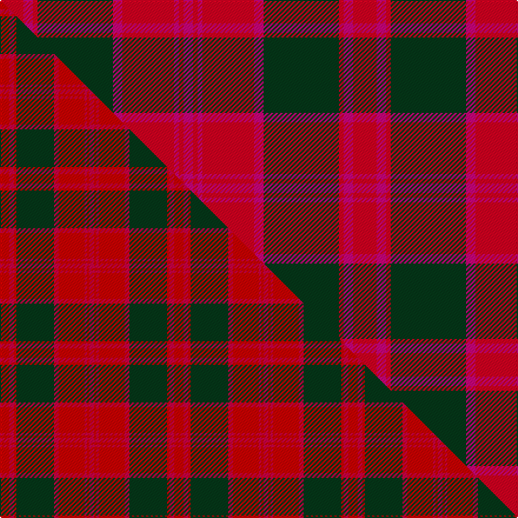

This is one **variant** — a specific cloth: this exact thread count and colourway, with its own
provenance below. It is one weaving of the [sett](/setts/r5m2r1dg16m2r11m1r1m2/) (the scale-free proportion — the
same cloth at any scale or shade), whose colour order is pattern [RRRGRRRRR](/stripes/rrrgrrrrr/).

Part of the [Valdres, Kvam & Vang](/tartans/valdres-kvam-vang-2/) tartan — the named design grouping this sett with its other cloths.

Sourced from tartans-authority.  It is a [9 stripe tartan](/stripes/stripes9/).

Original link [https://www.tartanregister.gov.uk/tartanDetails.aspx?ref=2124](https://www.tartanregister.gov.uk/tartanDetails.aspx?ref=2124)

Dataset <small>— provenance for this record, inherited from the source manifest</small>

<dl class="dataset-prov">
<dt>source</dt><dd><a href="/sources/tartans-authority/">Scottish Tartans Authority</a></dd>
<dt>data captured from</dt><dd><a href="https://github.com/thetartan/tartan-database/blob/master/data/tartans-authority/data.csv">https://github.com/thetartan/tartan-database/blob/master/data/tartans-authority/data.csv</a></dd>
<dt>data date</dt><dd>pre 2002 <small>(this record)</small></dd>
<dt>licence</dt><dd><a href="https://creativecommons.org/licenses/by-nc-nd/4.0/">CC BY-NC-ND 4.0</a></dd>
</dl>

Capture chain <small>— the hands this data passed through, oldest first; each capture carries its own licence</small>

<ol class="capture-chain">
<li><a href="https://www.tartansauthority.com/">Scottish Tartans Authority</a> <small>the heritage body's archive — its tartan-ferret record browser is retired (links repaired to the SRT, above)</small></li>
<li><a href="https://github.com/thetartan/tartan-database">thetartan/tartan-database</a> <small>2016-2017</small> · <a href="https://creativecommons.org/licenses/by-nc-nd/4.0/">CC BY-NC-ND 4.0</a> <small>Levko Kravets's frozen compilation — the capture we vendored, and where its CC licence text came from</small></li>
<li>this dictionary <small>captured 2026-06-10 · commit 5bf86c7566</small> <small>each re-capture is a git commit to data/sources</small></li>
</ol>

## Register references

External register numbers recorded for this tartan.

- Scottish Tartans Authority (ITI): 2124

## Thread count
R/20 M8 R4 DG64 M8 R44 M4 R4 M/8

One full sett is **300 threads**.

## Palette
<table><thead><tr><th>Colour</th><th>Shade</th><th>OKLCh</th></tr></thead><tbody><tr><td>DG</td><td><code style="background-color:#053819;">#053819</code> <small style="color:#888">#053819</small></td><td><small style="color:#888">oklch(30.0% 0.075 151.3)</small></td></tr><tr><td>R</td><td><code style="background-color:#D60020;">#D60020</code> <small style="color:#888">#D60020</small></td><td><small style="color:#888">oklch(55.2% 0.224 25.5)</small></td></tr><tr><td>M</td><td><code style="background-color:#CA047B;">#CA047B</code> <small style="color:#888">#CA047B</small></td><td><small style="color:#888">oklch(55.0% 0.225 353.8)</small></td></tr></tbody></table>

# Sample pattern

## Compared to the master

This cloth is one sett of its design; the master sett (the exemplar the design is anchored on) is below for comparison.

Its **ΔTartan distance** from the master is **0.94** — the same measure the nearest-tartans table ranks by (0 is identical; a re-scale of the same cloth is near 0, a recolour or a different proportion further).

<figure class="master-compare" style="margin:0">

this sett
master sett ★

<figcaption style="color:#888;font-size:smaller">One weave of this sett against the <a href="/setts/ri4r2ri1dg16r2ri11r1ri1r2/">master sett ★</a>, split on the diagonal: a shared proportion runs seamlessly across it with only the shades shifting; a different proportion breaks on it.</figcaption>
</figure>

## Nearest tartan variants

The nearest existing variants by ΔTartan distance, with this cloth at the top so the swatches line up against it.

ΔTartan

Threads

Variant

Sett

—

300

<a href="/variants/s9/r5m2r1dg16m2r11m1r1m2~x4/">Valdres, Kvam &amp; Vang (Artefact)</a>

<a href="/ttd/edit/#slug=ri4r2ri1dg16r2ri11r1ri1r2~x2~ri2109032-r2109013&amp;base=r5m2r1dg16m2r11m1r1m2~x4" title="compare in the TTD">0.94</a>

148

<a href="/variants/s9/ri4r2ri1dg16r2ri11r1ri1r2~x2~ri2109032-r2109013/">Valdres, Kvam &amp; Vang</a>

<a href="/ttd/edit/#slug=db4r1y12r2y2r12y1db4~x4&amp;base=r5m2r1dg16m2r11m1r1m2~x4" title="compare in the TTD">2.34</a>

272

<a href="/variants/s8/db4r1y12r2y2r12y1db4~x4/">Glassary #2</a>

<a href="/ttd/edit/#slug=db6n3db3n15r7db7r5db17r46n4&amp;base=r5m2r1dg16m2r11m1r1m2~x4" title="compare in the TTD">2.58</a>

216

<a href="/variants/s10/db6n3db3n15r7db7r5db17r46n4/">Harry (Welsh Name)</a>

<a href="/ttd/edit/#slug=dg20db2dg2db2dg2db8r24db2r3~x2&amp;base=r5m2r1dg16m2r11m1r1m2~x4" title="compare in the TTD">2.84</a>

214

<a href="/variants/s9/dg20db2dg2db2dg2db8r24db2r3~x2/">Lindsay Clan Tartan</a>

<a href="/ttd/edit/#slug=dg20db2dg2db2dg2db8r24db2r3&amp;base=r5m2r1dg16m2r11m1r1m2~x4" title="compare in the TTD">2.84</a>

107

<a href="/variants/s9/dg20db2dg2db2dg2db8r24db2r3/">Lindsay MINI Design Tartan</a>

<a href="/ttd/edit/#slug=dr4g8db6dr8r6g2r2g2r24g1r3~x2&amp;base=r5m2r1dg16m2r11m1r1m2~x4" title="compare in the TTD">3.02</a>

250

<a href="/variants/s11/dr4g8db6dr8r6g2r2g2r24g1r3~x2/">MacDougall VS</a>

<a href="/ttd/edit/#slug=dr4g8db6dr8r6g2r2g2r24g1r3&amp;base=r5m2r1dg16m2r11m1r1m2~x4" title="compare in the TTD">3.02</a>

125

<a href="/variants/s11/dr4g8db6dr8r6g2r2g2r24g1r3/">MacDougall VS</a>

<a href="/ttd/edit/#slug=dp28r26w2dp5w2r26g28r5w2r5~x2&amp;base=r5m2r1dg16m2r11m1r1m2~x4" title="compare in the TTD">3.04</a>

450

<a href="/variants/s10/dp28r26w2dp5w2r26g28r5w2r5~x2/">Glenfinnan</a>

<a href="/ttd/edit/#slug=dp4g8db6dp8r6g2r2g2r24g1r3~x2&amp;base=r5m2r1dg16m2r11m1r1m2~x4" title="compare in the TTD">3.05</a>

250

<a href="/variants/s11/dp4g8db6dp8r6g2r2g2r24g1r3~x2/">MacDougall</a>

<a href="/ttd/edit/#slug=r28g2r5g2r28db3r3g24r3db24r3db3~x2&amp;base=r5m2r1dg16m2r11m1r1m2~x4" title="compare in the TTD">3.09</a>

450

<a href="/variants/s12/r28g2r5g2r28db3r3g24r3db24r3db3~x2/">Robertson #5</a>

## Neighbour map

Every grey dot is one of 13621 variants placed by the first two principal components of the ΔTartan feature space (42% of its variance). Red is this tartan; blue dots are its nearest — click one to open its page.

<svg viewBox="0 0 640 380" role="img" style="max-width:100%;height:auto;border:1px solid #e0e0e0;border-radius:4px;display:block" xmlns="http://www.w3.org/2000/svg"><image href="/nn/cloud.v1.png" width="640" height="380"/><a href="/variants/s9/ri4r2ri1dg16r2ri11r1ri1r2~x2~ri2109032-r2109013/"><circle cx="336.5" cy="177.5" r="4" fill="#3465a4"><title>Valdres, Kvam &amp; Vang</title></circle></a><a href="/variants/s8/db4r1y12r2y2r12y1db4~x4/"><circle cx="297.9" cy="210.9" r="4" fill="#3465a4"><title>Glassary #2</title></circle></a><a href="/variants/s10/db6n3db3n15r7db7r5db17r46n4/"><circle cx="352.0" cy="172.8" r="4" fill="#3465a4"><title>Harry (Welsh Name)</title></circle></a><a href="/variants/s9/dg20db2dg2db2dg2db8r24db2r3~x2/"><circle cx="291.2" cy="184.3" r="4" fill="#3465a4"><title>Lindsay Clan Tartan</title></circle></a><a href="/variants/s9/dg20db2dg2db2dg2db8r24db2r3/"><circle cx="291.2" cy="184.3" r="4" fill="#3465a4"><title>Lindsay MINI Design Tartan</title></circle></a><a href="/variants/s11/dr4g8db6dr8r6g2r2g2r24g1r3~x2/"><circle cx="330.6" cy="140.1" r="4" fill="#3465a4"><title>MacDougall VS</title></circle></a><a href="/variants/s11/dr4g8db6dr8r6g2r2g2r24g1r3/"><circle cx="330.6" cy="140.1" r="4" fill="#3465a4"><title>MacDougall VS</title></circle></a><a href="/variants/s10/dp28r26w2dp5w2r26g28r5w2r5~x2/"><circle cx="269.3" cy="168.8" r="4" fill="#3465a4"><title>Glenfinnan</title></circle></a><a href="/variants/s11/dp4g8db6dp8r6g2r2g2r24g1r3~x2/"><circle cx="324.7" cy="137.9" r="4" fill="#3465a4"><title>MacDougall</title></circle></a><a href="/variants/s12/r28g2r5g2r28db3r3g24r3db24r3db3~x2/"><circle cx="328.6" cy="165.8" r="4" fill="#3465a4"><title>Robertson #5</title></circle></a><circle cx="323.1" cy="171.6" r="5" fill="#c00000"/><text x="320" y="376" text-anchor="middle" font-size="11" fill="#999">ground</text><text x="11" y="190" text-anchor="middle" font-size="11" fill="#999" transform="rotate(-90 11 190)">complexity</text></svg>

ID: /variants/s9/r5m2r1dg16m2r11m1r1m2~x4/
