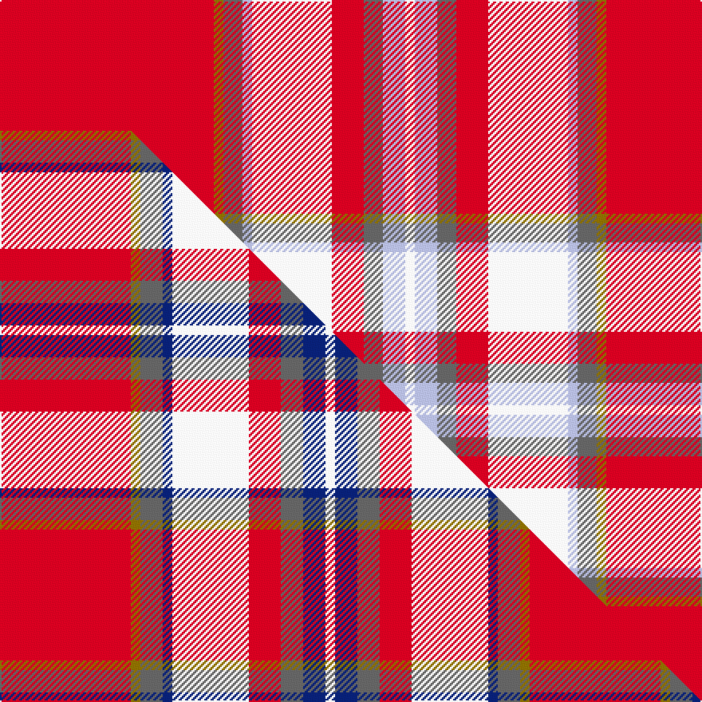

This is one **variant** — a specific cloth: this exact thread count and colourway, with its own
provenance below. It is one weaving of the [sett](/setts/r67y3n6lb3w25r10n6lb7w3/) (the scale-free proportion — the
same cloth at any scale or shade), whose colour order is pattern [RGBWWRBWW](/stripes/rgbwwrbww/).

Part of the [Drummond of Perth Dress](/tartans/d/dr/drummond-of-perth-dress/) tartan — the named design grouping this sett with its other cloths.

Sourced from register-of-tartans.  It is a [9 stripe tartan](/stripes/stripes9/).

Original link [https://www.tartanregister.gov.uk/tartanDetails.aspx?ref=991](https://www.tartanregister.gov.uk/tartanDetails.aspx?ref=991)

Dataset <small>— provenance for this record, inherited from the source manifest</small>

<dl class="dataset-prov">
<dt>source</dt><dd><a href="/sources/register-of-tartans/">Scottish Register of Tartans</a></dd>
<dt>data captured from</dt><dd><a href="https://github.com/thetartan/tartan-database/blob/master/data/register-of-tartans/data.csv">https://github.com/thetartan/tartan-database/blob/master/data/register-of-tartans/data.csv</a></dd>
<dt>data date</dt><dd>2017-01-06 <small>(dataset default)</small></dd>
<dt>licence</dt><dd><a href="https://www.tartanregister.gov.uk/copyright">Crown copyright</a></dd>
</dl>

Capture chain <small>— the hands this data passed through, oldest first; each capture carries its own licence</small>

<ol class="capture-chain">
<li><a href="https://www.tartanregister.gov.uk/">Scottish Register of Tartans</a> · <a href="https://www.tartanregister.gov.uk/copyright">Crown copyright</a> <small>the living register — still published by National Records of Scotland</small></li>
<li><a href="https://github.com/thetartan/tartan-database">thetartan/tartan-database</a> <small>2016-2017</small> · <a href="https://creativecommons.org/licenses/by-nc-nd/4.0/">CC BY-NC-ND 4.0</a> <small>Levko Kravets's frozen compilation — the capture we vendored, and where its CC licence text came from</small></li>
<li>this dictionary <small>captured 2026-06-10 · commit 5bf86c7566</small> <small>each re-capture is a git commit to data/sources</small></li>
</ol>

## Register references

External register numbers recorded for this tartan.

- Scottish Register of Tartans: [991](https://www.tartanregister.gov.uk/tartanDetails.aspx?ref=991)
- Scottish Tartans World Register: 1720

## Thread count
R/134 Y6 N12 LB6 W50 R20 N12 LB14 W/6

One full sett is **380 threads**.

## Palette
<table><thead><tr><th>Colour</th><th>Shade</th><th>OKLCh</th></tr></thead><tbody><tr><td>W</td><td><code style="background-color:#F7F7F7;">#F7F7F7</code> <small style="color:#888">#F7F7F7</small></td><td><small style="color:#888">oklch(97.6% 0.000 89.9)</small></td></tr><tr><td>N</td><td><code style="background-color:#636363;">#636363</code> <small style="color:#888">#636363</small></td><td><small style="color:#888">oklch(50.0% 0.000 89.9)</small></td></tr><tr><td>LB</td><td><code style="background-color:#B5BBDE;">#B5BBDE</code> <small style="color:#888">#B5BBDE</small></td><td><small style="color:#888">oklch(79.9% 0.050 277.6)</small></td></tr><tr><td>R</td><td><code style="background-color:#D60020;">#D60020</code> <small style="color:#888">#D60020</small></td><td><small style="color:#888">oklch(55.2% 0.224 25.5)</small></td></tr><tr><td>Y</td><td><code style="background-color:#8B6E00;">#8B6E00</code> <small style="color:#888">#8B6E00</small></td><td><small style="color:#888">oklch(55.1% 0.113 90.4)</small></td></tr></tbody></table>

# Sample pattern

## Compared to the master

This cloth is one sett of its design; the master sett (the exemplar the design is anchored on) is below for comparison.

Its **ΔTartan distance** from the master is **0.51** — the same measure the nearest-tartans table ranks by (0 is identical; a re-scale of the same cloth is near 0, a recolour or a different proportion further).

<figure class="master-compare" style="margin:0">

this sett
master sett ★

<figcaption style="color:#888;font-size:smaller">One weave of this sett against the <a href="/setts/r41y3n7db3w24r10n7db7w3/">master sett ★</a>, split on the diagonal: a shared proportion runs seamlessly across it with only the shades shifting; a different proportion breaks on it.</figcaption>
</figure>

## Nearest tartan variants

The nearest existing variants by ΔTartan distance, with this cloth at the top so the swatches line up against it.

ΔTartan

Threads

Variant

Sett

—

380

<a href="/variants/s9/r67y3n6lb3w25r10n6lb7w3~x2/">Drummond of Perth Dress #3</a>

<a href="/ttd/edit/#slug=r41y3n7db3w24r10n7db7w3~x2&amp;base=r67y3n6lb3w25r10n6lb7w3~x2" title="compare in the TTD">0.51</a>

332

<a href="/variants/s9/r41y3n7db3w24r10n7db7w3~x2/">Drummond of Perth Dress #2</a>

<a href="/ttd/edit/#slug=r24y2n3o2w10r4n3o3w2~x2&amp;base=r67y3n6lb3w25r10n6lb7w3~x2" title="compare in the TTD">1.11</a>

160

<a href="/variants/s9/r24y2n3o2w10r4n3o3w2~x2/">Manx Laxey, Red</a>

<a href="/ttd/edit/#slug=r24ly2n3dy2w10r4n3dy3w2~x2~ly3307090-dy1603076&amp;base=r67y3n6lb3w25r10n6lb7w3~x2" title="compare in the TTD">1.11</a>

160

<a href="/variants/s9/r24ly2n3dy2w10r4n3dy3w2~x2~ly3307090-dy1603076/">Manx Laxey (Red)</a>

<a href="/ttd/edit/#slug=r67y3b6dg3w25r10b6dg7w3~x2&amp;base=r67y3n6lb3w25r10n6lb7w3~x2" title="compare in the TTD">1.23</a>

380

<a href="/variants/s9/r67y3b6dg3w25r10b6dg7w3~x2/">Drummond of Perth, dress</a>

<a href="/ttd/edit/#slug=r24y2n3dy2w10r4n3dy3w2~x2&amp;base=r67y3n6lb3w25r10n6lb7w3~x2" title="compare in the TTD">1.42</a>

160

<a href="/variants/s9/r24y2n3dy2w10r4n3dy3w2~x2/">Manx Laxey Red District Tartan</a>

<a href="/ttd/edit/#slug=r6w3n6lb10r38w2n4&amp;base=r67y3n6lb3w25r10n6lb7w3~x2" title="compare in the TTD">1.45</a>

128

<a href="/variants/s7/r6w3n6lb10r38w2n4/">Washington State University Cougar</a>

<a href="/ttd/edit/#slug=r36w1db3y1g16r8db3w5&amp;base=r67y3n6lb3w25r10n6lb7w3~x2" title="compare in the TTD">2.70</a>

105

<a href="/variants/s8/r36w1db3y1g16r8db3w5/">Drummond of Perth</a>

<a href="/ttd/edit/#slug=k3ly6lb13r2lb2r32lb1r2lb1~x2&amp;base=r67y3n6lb3w25r10n6lb7w3~x2" title="compare in the TTD">2.75</a>

240

<a href="/variants/s9/k3ly6lb13r2lb2r32lb1r2lb1~x2/">Fueglistal</a>

<a href="/ttd/edit/#slug=ly5w15r40y4g2lb2~x2&amp;base=r67y3n6lb3w25r10n6lb7w3~x2" title="compare in the TTD">2.81</a>

258

<a href="/variants/s6/ly5w15r40y4g2lb2~x2/">Tomomi</a>

<a href="/ttd/edit/#slug=r40w1db7w1g12r8db6lb2w1~x2&amp;base=r67y3n6lb3w25r10n6lb7w3~x2" title="compare in the TTD">2.91</a>

230

<a href="/variants/s9/r40w1db7w1g12r8db6lb2w1~x2/">Spens (Lochcarron)</a>

## Neighbour map

Every grey dot is one of 13656 variants placed by the first two principal components of the ΔTartan feature space (42% of its variance). Red is this tartan; blue dots are its nearest — click one to open its page. The map is a flat projection of a many-dimensional space — [how to read it](/posts/neighbourhood-maps/).

<svg viewBox="0 0 640 380" role="img" style="max-width:100%;height:auto;border:1px solid #e0e0e0;border-radius:4px;display:block" xmlns="http://www.w3.org/2000/svg"><image href="/nn/cloud.v1.png" width="640" height="380"/><a href="/variants/s9/r41y3n7db3w24r10n7db7w3~x2/"><circle cx="240.5" cy="144.6" r="4" fill="#3465a4"><title>Drummond of Perth Dress #2</title></circle></a><a href="/variants/s9/r24y2n3o2w10r4n3o3w2~x2/"><circle cx="290.2" cy="146.9" r="4" fill="#3465a4"><title>Manx Laxey, Red</title></circle></a><a href="/variants/s9/r24ly2n3dy2w10r4n3dy3w2~x2~ly3307090-dy1603076/"><circle cx="280.9" cy="145.0" r="4" fill="#3465a4"><title>Manx Laxey (Red)</title></circle></a><a href="/variants/s9/r67y3b6dg3w25r10b6dg7w3~x2/"><circle cx="337.5" cy="103.6" r="4" fill="#3465a4"><title>Drummond of Perth, dress</title></circle></a><a href="/variants/s9/r24y2n3dy2w10r4n3dy3w2~x2/"><circle cx="273.0" cy="141.3" r="4" fill="#3465a4"><title>Manx Laxey Red District Tartan</title></circle></a><a href="/variants/s7/r6w3n6lb10r38w2n4/"><circle cx="424.7" cy="156.9" r="4" fill="#3465a4"><title>Washington State University Cougar</title></circle></a><a href="/variants/s8/r36w1db3y1g16r8db3w5/"><circle cx="366.6" cy="103.5" r="4" fill="#3465a4"><title>Drummond of Perth</title></circle></a><a href="/variants/s9/k3ly6lb13r2lb2r32lb1r2lb1~x2/"><circle cx="365.4" cy="97.6" r="4" fill="#3465a4"><title>Fueglistal</title></circle></a><a href="/variants/s6/ly5w15r40y4g2lb2~x2/"><circle cx="329.4" cy="123.8" r="4" fill="#3465a4"><title>Tomomi</title></circle></a><a href="/variants/s9/r40w1db7w1g12r8db6lb2w1~x2/"><circle cx="381.5" cy="87.9" r="4" fill="#3465a4"><title>Spens (Lochcarron)</title></circle></a><circle cx="353.2" cy="108.5" r="5" fill="#c00000"/><text x="320" y="376" text-anchor="middle" font-size="11" fill="#999">ground</text><text x="11" y="190" text-anchor="middle" font-size="11" fill="#999" transform="rotate(-90 11 190)">complexity</text></svg>

ID: /variants/s9/r67y3n6lb3w25r10n6lb7w3~x2/
