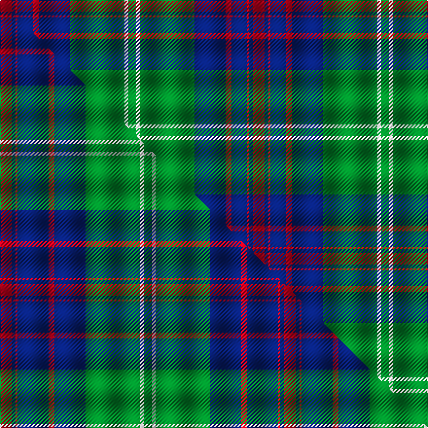

This is one **variant** — a specific cloth: this exact thread count and colourway, with its own
provenance below. It is one weaving of the [sett](/setts/r6db2r1db8r3db16g28w2g4/) (the scale-free proportion — the
same cloth at any scale or shade), whose colour order is pattern [GWGBRBRBR](/stripes/gwgbrbrbr/).

Part of the [George](/tartans/g/ge/george-2/) tartan — the named design grouping this sett with its other cloths.

Sourced from tartans-authority.  It is a [9 stripe tartan](/stripes/stripes9/).

Original link [https://www.tartanregister.gov.uk/tartanDetails.aspx?ref=7365](https://www.tartanregister.gov.uk/tartanDetails.aspx?ref=7365)

Dataset <small>— provenance for this record, inherited from the source manifest</small>

<dl class="dataset-prov">
<dt>source</dt><dd><a href="/sources/tartans-authority/">Scottish Tartans Authority</a></dd>
<dt>data captured from</dt><dd><a href="https://github.com/thetartan/tartan-database/blob/master/data/tartans-authority/data.csv">https://github.com/thetartan/tartan-database/blob/master/data/tartans-authority/data.csv</a></dd>
<dt>data date</dt><dd>pre 2007 <small>(this record)</small></dd>
<dt>licence</dt><dd><a href="https://creativecommons.org/licenses/by-nc-nd/4.0/">CC BY-NC-ND 4.0</a></dd>
</dl>

Capture chain <small>— the hands this data passed through, oldest first; each capture carries its own licence</small>

<ol class="capture-chain">
<li><a href="https://www.tartansauthority.com/">Scottish Tartans Authority</a> <small>the heritage body's archive — its tartan-ferret record browser is retired (links repaired to the SRT, above)</small></li>
<li><a href="https://github.com/thetartan/tartan-database">thetartan/tartan-database</a> <small>2016-2017</small> · <a href="https://creativecommons.org/licenses/by-nc-nd/4.0/">CC BY-NC-ND 4.0</a> <small>Levko Kravets's frozen compilation — the capture we vendored, and where its CC licence text came from</small></li>
<li>this dictionary <small>captured 2026-06-10 · commit 5bf86c7566</small> <small>each re-capture is a git commit to data/sources</small></li>
</ol>

## Register references

External register numbers recorded for this tartan.

- Scottish Tartans Authority (ITI): 7365

## Thread count
R/12 DB4 R2 DB16 R6 DB32 G56 W4 G/8

One full sett is **260 threads**.

## Palette
<table><thead><tr><th>Colour</th><th>Shade</th><th>OKLCh</th></tr></thead><tbody><tr><td>DB</td><td><code style="background-color:#082077;">#082077</code> <small style="color:#888">#082077</small></td><td><small style="color:#888">oklch(30.0% 0.149 265.1)</small></td></tr><tr><td>G</td><td><code style="background-color:#008B2A;">#008B2A</code> <small style="color:#888">#008B2A</small></td><td><small style="color:#888">oklch(55.4% 0.170 145.9)</small></td></tr><tr><td>W</td><td><code style="background-color:#F7F7F7;">#F7F7F7</code> <small style="color:#888">#F7F7F7</small></td><td><small style="color:#888">oklch(97.6% 0.000 89.9)</small></td></tr><tr><td>R</td><td><code style="background-color:#D60020;">#D60020</code> <small style="color:#888">#D60020</small></td><td><small style="color:#888">oklch(55.2% 0.224 25.5)</small></td></tr></tbody></table>

# Sample pattern

## Compared to the master

This cloth is one sett of its design; the master sett (the exemplar the design is anchored on) is below for comparison.

Its **ΔTartan distance** from the master is **0.28** — the same measure the nearest-tartans table ranks by (0 is identical; a re-scale of the same cloth is near 0, a recolour or a different proportion further).

<figure class="master-compare" style="margin:0">

this sett
master sett ★

<figcaption style="color:#888;font-size:smaller">One weave of this sett against the <a href="/setts/r6db2r1db16r3db16g28w2g4/">master sett ★</a>, split on the diagonal: a shared proportion runs seamlessly across it with only the shades shifting; a different proportion breaks on it.</figcaption>
</figure>

## Nearest tartan variants

The nearest existing variants by ΔTartan distance, with this cloth at the top so the swatches line up against it.

ΔTartan

Threads

Variant

Sett

—

260

<a href="/variants/s9/r6db2r1db8r3db16g28w2g4~x2/">George (Personal)</a>

<a href="/ttd/edit/#slug=r6db2r1db16r3db16g28w2g4~x2&amp;base=r6db2r1db8r3db16g28w2g4~x2" title="compare in the TTD">0.28</a>

292

<a href="/variants/s9/r6db2r1db16r3db16g28w2g4~x2/">George (Personal)</a>

<a href="/ttd/edit/#slug=db2g2k1g30db20r2db2r2~x2&amp;base=r6db2r1db8r3db16g28w2g4~x2" title="compare in the TTD">0.94</a>

236

<a href="/variants/s8/db2g2k1g30db20r2db2r2~x2/">Gretna Green Fashion Tartan</a>

<a href="/ttd/edit/#slug=db2g2ly1g30db20r2db2r2~x2&amp;base=r6db2r1db8r3db16g28w2g4~x2" title="compare in the TTD">1.24</a>

236

<a href="/variants/s8/db2g2ly1g30db20r2db2r2~x2/">Gretna Green</a>

<a href="/ttd/edit/#slug=g38w2g6db24o6db2o3db2~x2&amp;base=r6db2r1db8r3db16g28w2g4~x2" title="compare in the TTD">1.58</a>

252

<a href="/variants/s8/g38w2g6db24o6db2o3db2~x2/">MacAuliffe/McAucliffe</a>

<a href="/ttd/edit/#slug=r1g16db2g10db22y4r2y1~x2&amp;base=r6db2r1db8r3db16g28w2g4~x2" title="compare in the TTD">1.88</a>

228

<a href="/variants/s8/r1g16db2g10db22y4r2y1~x2/">New Mexico</a>

<a href="/ttd/edit/#slug=db3r3db36g17y2g21w2r3~x2&amp;base=r6db2r1db8r3db16g28w2g4~x2" title="compare in the TTD">2.24</a>

336

<a href="/variants/s8/db3r3db36g17y2g21w2r3~x2/">Singh Name Tartan</a>

<a href="/ttd/edit/#slug=g3r12g15r2w1db30w1g2r2~x2&amp;base=r6db2r1db8r3db16g28w2g4~x2" title="compare in the TTD">2.25</a>

262

<a href="/variants/s9/g3r12g15r2w1db30w1g2r2~x2/">Christmas Morning</a>

<a href="/ttd/edit/#slug=db8r3db1r3g14r3db1~x4&amp;base=r6db2r1db8r3db16g28w2g4~x2" title="compare in the TTD">2.26</a>

228

<a href="/variants/s7/db8r3db1r3g14r3db1~x4/">Logan</a>

<a href="/ttd/edit/#slug=g11r4g4r7g41db11lb4db41r4db8&amp;base=r6db2r1db8r3db16g28w2g4~x2" title="compare in the TTD">2.37</a>

251

<a href="/variants/s10/g11r4g4r7g41db11lb4db41r4db8/">Stuart/Stewart of Appin #2</a>

<a href="/ttd/edit/#slug=g8lr4db21g6r7g1r1g8~x2&amp;base=r6db2r1db8r3db16g28w2g4~x2" title="compare in the TTD">2.40</a>

192

<a href="/variants/s8/g8lr4db21g6r7g1r1g8~x2/">Cathcart</a>

## Neighbour map

Every grey dot is one of 13621 variants placed by the first two principal components of the ΔTartan feature space (42% of its variance). Red is this tartan; blue dots are its nearest — click one to open its page.

<svg viewBox="0 0 640 380" role="img" style="max-width:100%;height:auto;border:1px solid #e0e0e0;border-radius:4px;display:block" xmlns="http://www.w3.org/2000/svg"><image href="/nn/cloud.v1.png" width="640" height="380"/><a href="/variants/s9/r6db2r1db16r3db16g28w2g4~x2/"><circle cx="281.8" cy="151.1" r="4" fill="#3465a4"><title>George (Personal)</title></circle></a><a href="/variants/s8/db2g2k1g30db20r2db2r2~x2/"><circle cx="336.3" cy="121.1" r="4" fill="#3465a4"><title>Gretna Green Fashion Tartan</title></circle></a><a href="/variants/s8/db2g2ly1g30db20r2db2r2~x2/"><circle cx="360.8" cy="136.9" r="4" fill="#3465a4"><title>Gretna Green</title></circle></a><a href="/variants/s8/g38w2g6db24o6db2o3db2~x2/"><circle cx="335.5" cy="164.1" r="4" fill="#3465a4"><title>MacAuliffe/McAucliffe</title></circle></a><a href="/variants/s8/r1g16db2g10db22y4r2y1~x2/"><circle cx="300.2" cy="169.9" r="4" fill="#3465a4"><title>New Mexico</title></circle></a><a href="/variants/s8/db3r3db36g17y2g21w2r3~x2/"><circle cx="275.2" cy="156.9" r="4" fill="#3465a4"><title>Singh Name Tartan</title></circle></a><a href="/variants/s9/g3r12g15r2w1db30w1g2r2~x2/"><circle cx="279.6" cy="127.5" r="4" fill="#3465a4"><title>Christmas Morning</title></circle></a><a href="/variants/s7/db8r3db1r3g14r3db1~x4/"><circle cx="269.9" cy="204.1" r="4" fill="#3465a4"><title>Logan</title></circle></a><a href="/variants/s10/g11r4g4r7g41db11lb4db41r4db8/"><circle cx="258.5" cy="182.6" r="4" fill="#3465a4"><title>Stuart/Stewart of Appin #2</title></circle></a><a href="/variants/s8/g8lr4db21g6r7g1r1g8~x2/"><circle cx="242.5" cy="177.4" r="4" fill="#3465a4"><title>Cathcart</title></circle></a><circle cx="288.6" cy="146.3" r="5" fill="#c00000"/><text x="320" y="376" text-anchor="middle" font-size="11" fill="#999">ground</text><text x="11" y="190" text-anchor="middle" font-size="11" fill="#999" transform="rotate(-90 11 190)">complexity</text></svg>

ID: /variants/s9/r6db2r1db8r3db16g28w2g4~x2/
