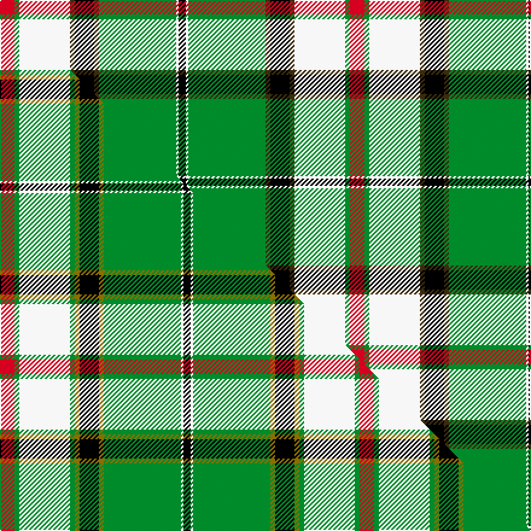

This page is one **sett** — a single exact thread-count. It belongs to the [tartan](/setts/r6g2w21dy2k8dy2g32w1k3/)
(the same proportion at any scale), whose colour order is pattern [KWGGKGWGR](/stripes/kwggkgwgr/).

Part of the [Fiander, Julian](/tartans/fiander-julian/) tartan — the named design grouping this sett with its other cloths.

Sourced from tartans-authority.  It is a [9 stripe tartan](/stripes/stripes9/).

Original link http://www.tartansauthority.com/tartan-ferret/display/10935/

## Register references

External register numbers recorded for this tartan.

- Scottish Register of Tartans: [10935](https://www.tartanregister.gov.uk/tartanDetails?ref=10935)
- Scottish Tartans Authority (ITI): 10935

## Thread count
R/12 G4 W42 DY4 K16 DY4 G64 W2 K/6

One full sett is **290 threads**.

## Palette
<table><thead><tr><th>Colour</th><th>Shade</th><th>OKLCh</th></tr></thead><tbody><tr><td>G</td><td><code style="background-color:#008B2A;">#008B2A</code> <small style="color:#888">#008B2A</small></td><td><small style="color:#888">oklch(55.4% 0.170 145.9)</small></td></tr><tr><td>K</td><td><code style="background-color:#000000;">#000000</code> <small style="color:#888">#000000</small></td><td><small style="color:#888">oklch(0.0% 0.000 0.0)</small></td></tr><tr><td>R</td><td><code style="background-color:#D60020;">#D60020</code> <small style="color:#888">#D60020</small></td><td><small style="color:#888">oklch(55.2% 0.224 25.5)</small></td></tr><tr><td>W</td><td><code style="background-color:#F7F7F7;">#F7F7F7</code> <small style="color:#888">#F7F7F7</small></td><td><small style="color:#888">oklch(97.6% 0.000 89.9)</small></td></tr><tr><td>DY</td><td><code style="background-color:#3A2B0D;">#3A2B0D</code> <small style="color:#888">#3A2B0D</small></td><td><small style="color:#888">oklch(30.0% 0.049 82.0)</small></td></tr></tbody></table>

# Sample pattern

## Compared to the master

This cloth is one sett of its design; the master sett (the exemplar the design is anchored on) is below for comparison.

Its **ΔTartan distance** from the master is **1.03** — the same measure the nearest-tartans table ranks by (0 is identical; a re-scale of the same cloth is near 0, a recolour or a different proportion further).

<figure class="master-compare" style="margin:0">

this sett
master sett ★

<figcaption style="color:#888;font-size:smaller">One weave of this sett against the <a href="/setts/r6g2w21g2y2k8y2g32w1k3/">master sett ★</a>, split on the diagonal: a shared proportion runs seamlessly across it with only the shades shifting; a different proportion breaks on it.</figcaption>
</figure>

## Nearest tartan variants

The nearest existing variants by ΔTartan distance, with this cloth at the top so the swatches line up against it.

ΔTartan

Threads

Variant

Sett

—

290

<a href="/variants/s9/r6g2w21dy2k8dy2g32w1k3~x2/">Fiander, Julian (Personal)</a>

<a href="/ttd/edit/#slug=r6g2w21g2y2k8y2g32w1k3~x2&amp;base=r6g2w21dy2k8dy2g32w1k3~x2" title="compare in the TTD">1.03</a>

298

<a href="/variants/s10/r6g2w21g2y2k8y2g32w1k3~x2/">Fiander, Julian (Personal)</a>

<a href="/ttd/edit/#slug=g3dg32g36o12k2w68dg3k2~x2~g2003152-dg1806142&amp;base=r6g2w21dy2k8dy2g32w1k3~x2" title="compare in the TTD">2.18</a>

622

<a href="/variants/s8/g3dg32g36o12k2w68dg3k2~x2~g2003152-dg1806142/">Kintail Dress</a>

<a href="/ttd/edit/#slug=g3dp2g25k6r2k6lb20k1w2~x2&amp;base=r6g2w21dy2k8dy2g32w1k3~x2" title="compare in the TTD">2.52</a>

258

<a href="/variants/s9/g3dp2g25k6r2k6lb20k1w2~x2/">Birch (Name)</a>

<a href="/ttd/edit/#slug=k9n2ly2k2w18ly2k2w1k19ly33dr2~x2&amp;base=r6g2w21dy2k8dy2g32w1k3~x2" title="compare in the TTD">2.57</a>

346

<a href="/variants/s11/k9n2ly2k2w18ly2k2w1k19ly33dr2~x2/">Pride of Scotland Gold</a>

<a href="/ttd/edit/#slug=w3lb2w3r4w16k2w2k2w3k10g35k2g2k1g2~x2&amp;base=r6g2w21dy2k8dy2g32w1k3~x2" title="compare in the TTD">2.63</a>

346

<a href="/variants/s15/w3lb2w3r4w16k2w2k2w3k10g35k2g2k1g2~x2/">Prestoungrange/Dolphinstoun/Wills dress</a>

<a href="/ttd/edit/#slug=dr4w6k10db5k3ly16k3g33k1w4~x2&amp;base=r6g2w21dy2k8dy2g32w1k3~x2" title="compare in the TTD">2.73</a>

324

<a href="/variants/s10/dr4w6k10db5k3ly16k3g33k1w4~x2/">Fermanagh County Crest (Fashion)</a>

<a href="/ttd/edit/#slug=g22r3k1g2r3lb16k3y2~x4&amp;base=r6g2w21dy2k8dy2g32w1k3~x2" title="compare in the TTD">2.98</a>

320

<a href="/variants/s8/g22r3k1g2r3lb16k3y2~x4/">Stirling, University of Corporate Univ Tartan</a>

<a href="/ttd/edit/#slug=w4k1db16k1g32dr6k6lo6g4lo2g1~x2&amp;base=r6g2w21dy2k8dy2g32w1k3~x2" title="compare in the TTD">3.05</a>

306

<a href="/variants/s11/w4k1db16k1g32dr6k6lo6g4lo2g1~x2/">Zambia</a>

<a href="/ttd/edit/#slug=g4k2g28r4g4k18g4lp4g4lp7k1w3~x2&amp;base=r6g2w21dy2k8dy2g32w1k3~x2" title="compare in the TTD">3.05</a>

318

<a href="/variants/s12/g4k2g28r4g4k18g4lp4g4lp7k1w3~x2/">Moss</a>

<a href="/ttd/edit/#slug=k7lb38g7k2g7k2g7ly21k3g4k3~x2&amp;base=r6g2w21dy2k8dy2g32w1k3~x2" title="compare in the TTD">3.10</a>

384

<a href="/variants/s11/k7lb38g7k2g7k2g7ly21k3g4k3~x2/">Chakraa (Fashion)</a>

## Neighbour map

Every grey dot is one of 13620 variants placed by the first two principal components of the ΔTartan feature space (42% of its variance). Red is this tartan; blue dots are its nearest — click one to open its page.

<svg viewBox="0 0 640 380" role="img" style="max-width:100%;height:auto;border:1px solid #e0e0e0;border-radius:4px;display:block" xmlns="http://www.w3.org/2000/svg"><image href="/nn/cloud.v1.png" width="640" height="380"/><a href="/variants/s10/r6g2w21g2y2k8y2g32w1k3~x2/"><circle cx="200.3" cy="86.8" r="4" fill="#3465a4"><title>Fiander, Julian (Personal)</title></circle></a><a href="/variants/s8/g3dg32g36o12k2w68dg3k2~x2~g2003152-dg1806142/"><circle cx="206.0" cy="105.4" r="4" fill="#3465a4"><title>Kintail Dress</title></circle></a><a href="/variants/s9/g3dp2g25k6r2k6lb20k1w2~x2/"><circle cx="160.3" cy="94.8" r="4" fill="#3465a4"><title>Birch (Name)</title></circle></a><a href="/variants/s11/k9n2ly2k2w18ly2k2w1k19ly33dr2~x2/"><circle cx="185.2" cy="82.3" r="4" fill="#3465a4"><title>Pride of Scotland Gold</title></circle></a><a href="/variants/s15/w3lb2w3r4w16k2w2k2w3k10g35k2g2k1g2~x2/"><circle cx="196.9" cy="56.8" r="4" fill="#3465a4"><title>Prestoungrange/Dolphinstoun/Wills dress</title></circle></a><a href="/variants/s10/dr4w6k10db5k3ly16k3g33k1w4~x2/"><circle cx="133.4" cy="84.9" r="4" fill="#3465a4"><title>Fermanagh County Crest (Fashion)</title></circle></a><a href="/variants/s8/g22r3k1g2r3lb16k3y2~x4/"><circle cx="207.8" cy="110.3" r="4" fill="#3465a4"><title>Stirling, University of Corporate Univ Tartan</title></circle></a><a href="/variants/s11/w4k1db16k1g32dr6k6lo6g4lo2g1~x2/"><circle cx="194.0" cy="76.4" r="4" fill="#3465a4"><title>Zambia</title></circle></a><a href="/variants/s12/g4k2g28r4g4k18g4lp4g4lp7k1w3~x2/"><circle cx="229.0" cy="93.0" r="4" fill="#3465a4"><title>Moss</title></circle></a><a href="/variants/s11/k7lb38g7k2g7k2g7ly21k3g4k3~x2/"><circle cx="158.6" cy="122.3" r="4" fill="#3465a4"><title>Chakraa (Fashion)</title></circle></a><circle cx="191.6" cy="93.6" r="5" fill="#c00000"/><text x="320" y="376" text-anchor="middle" font-size="11" fill="#999">ground</text><text x="11" y="190" text-anchor="middle" font-size="11" fill="#999" transform="rotate(-90 11 190)">complexity</text></svg>

ID: /variants/s9/r6g2w21dy2k8dy2g32w1k3~x2/
