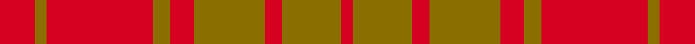
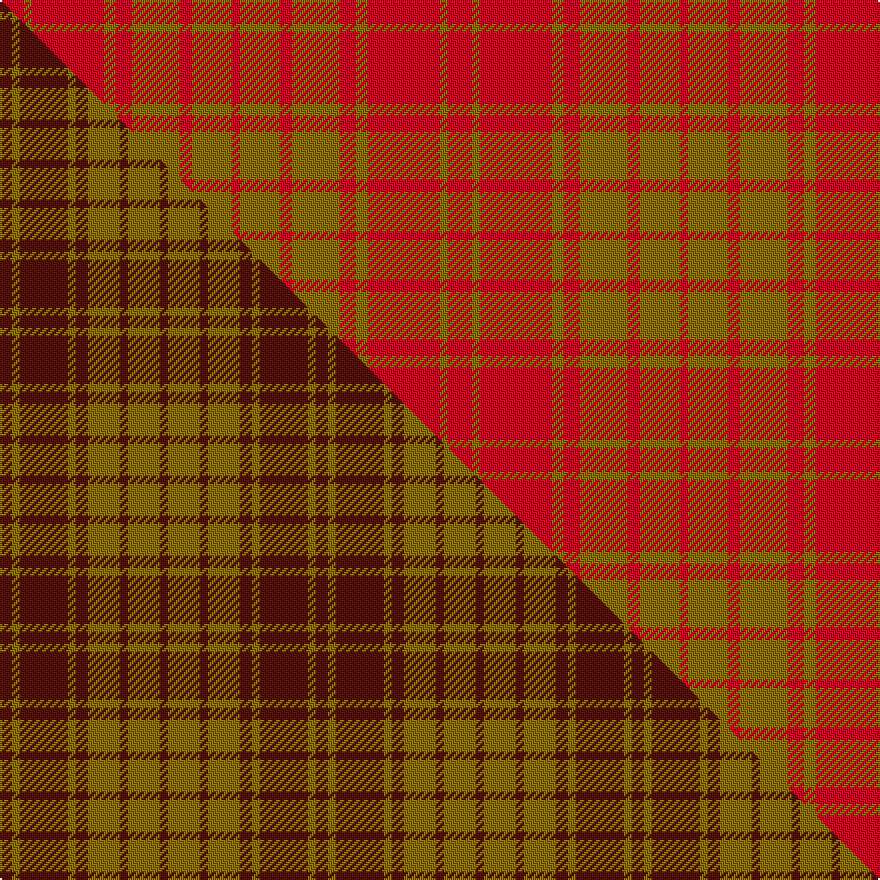

This is one **variant** — a specific cloth: this exact thread count and colourway, with its own
provenance below. It is one weaving of the [sett](/setts/r6y2r18y3r4y12r3y10r2/) (the scale-free proportion — the
same cloth at any scale or shade), whose colour order is pattern [RGRGRGRGR](/stripes/rgrgrgrgr/).

Part of the [MacMillan Dress](/tartans/m/ma/macmillan-dress/) tartan — the named design grouping this sett with its other cloths.

Sourced from house-of-tartan.  It is a [9 stripe tartan](/stripes/stripes9/).

Original link [http://www.house-of-tartan.scotland.net/house/TartanViewjs.asp?colr=Def&tnam=1723](http://www.house-of-tartan.scotland.net/house/TartanViewjs.asp?colr=Def&tnam=1723)

## Provenance

Earliest known date: 1906 The modern Dress MacMillan incorporates red and yellow stripes from the ancient design but omits the greens and blues of the Vestiarium version.

Dataset <small>— provenance for this record, inherited from the source manifest</small>

<dl class="dataset-prov">
<dt>source</dt><dd><a href="/sources/house-of-tartan/">House of Tartan</a></dd>
<dt>data captured from</dt><dd><a href="https://github.com/thetartan/tartan-database/blob/master/data/house-of-tartan/data.csv">https://github.com/thetartan/tartan-database/blob/master/data/house-of-tartan/data.csv</a></dd>
<dt>data date</dt><dd>1906 <small>(this record)</small></dd>
<dt>licence</dt><dd><a href="https://creativecommons.org/licenses/by-nc-nd/4.0/">CC BY-NC-ND 4.0</a></dd>
</dl>

Capture chain <small>— the hands this data passed through, oldest first; each capture carries its own licence</small>

<ol class="capture-chain">
<li><a href="http://www.house-of-tartan.scotland.net/">House of Tartan</a> <small>the weaver/retailer's database — the site is now offline; the URL is kept as the ultimate source's identity</small></li>
<li><a href="https://github.com/thetartan/tartan-database">thetartan/tartan-database</a> <small>2016-2017</small> · <a href="https://creativecommons.org/licenses/by-nc-nd/4.0/">CC BY-NC-ND 4.0</a> <small>Levko Kravets's frozen compilation — the capture we vendored, and where its CC licence text came from</small></li>
<li>this dictionary <small>captured 2026-06-10 · commit 5bf86c7566</small> <small>each re-capture is a git commit to data/sources</small></li>
</ol>

## Thread count
R/12 Y4 R36 Y6 R8 Y24 R6 Y20 R/4

One full sett is **224 threads**.

## Palette
<table><thead><tr><th>Colour</th><th>Shade</th><th>OKLCh</th></tr></thead><tbody><tr><td>R</td><td><code style="background-color:#D60020;">#D60020</code> <small style="color:#888">#D60020</small></td><td><small style="color:#888">oklch(55.2% 0.224 25.5)</small></td></tr><tr><td>Y</td><td><code style="background-color:#8B6E00;">#8B6E00</code> <small style="color:#888">#8B6E00</small></td><td><small style="color:#888">oklch(55.1% 0.113 90.4)</small></td></tr></tbody></table>

# Sample pattern

## Compared to the master

This cloth is one sett of its design; the master sett (the exemplar the design is anchored on) is below for comparison.

Its **ΔTartan distance** from the master is **0.52** — the same measure the nearest-tartans table ranks by (0 is identical; a re-scale of the same cloth is near 0, a recolour or a different proportion further).

<figure class="master-compare" style="margin:0">

this sett
master sett ★

<figcaption style="color:#888;font-size:smaller">One weave of this sett against the <a href="/setts/dr3y2dr12y2dr3y8dr2y8dr2/">master sett ★</a>, split on the diagonal: a shared proportion runs seamlessly across it with only the shades shifting; a different proportion breaks on it.</figcaption>
</figure>

## Nearest tartan variants

The nearest existing variants by ΔTartan distance, with this cloth at the top so the swatches line up against it.

ΔTartan

Threads

Variant

Sett

—

224

<a href="/variants/s9/r6y2r18y3r4y12r3y10r2~x2/">MacMillan Dress Clan Tartan</a>

<a href="/ttd/edit/#slug=r3y1r12y2r3y8r2y8r1~x2&amp;base=r6y2r18y3r4y12r3y10r2~x2" title="compare in the TTD">0.36</a>

152

<a href="/variants/s9/r3y1r12y2r3y8r2y8r1~x2/">MacMillan</a>

<a href="/ttd/edit/#slug=dr3y2dr12y2dr3y8dr2y8dr2~x2&amp;base=r6y2r18y3r4y12r3y10r2~x2" title="compare in the TTD">0.52</a>

158

<a href="/variants/s9/dr3y2dr12y2dr3y8dr2y8dr2~x2/">MacMillan Dress</a>

<a href="/ttd/edit/#slug=db4y1r12y2r2y12r1y4~x4&amp;base=r6y2r18y3r4y12r3y10r2~x2" title="compare in the TTD">3.35</a>

272

<a href="/variants/s8/db4y1r12y2r2y12r1y4~x4/">Glassary #3</a>

<a href="/ttd/edit/#slug=r29g2r2g2r6y21~x4&amp;base=r6y2r18y3r4y12r3y10r2~x2" title="compare in the TTD">3.97</a>

296

<a href="/variants/s6/r29g2r2g2r6y21~x4/">Maguire, Black</a>

## Neighbour map

Every grey dot is one of 13621 variants placed by the first two principal components of the ΔTartan feature space (42% of its variance). Red is this tartan; blue dots are its nearest — click one to open its page. The map is a flat projection of a many-dimensional space — [how to read it](/posts/neighbourhood-maps/).

<svg viewBox="0 0 640 380" role="img" style="max-width:100%;height:auto;border:1px solid #e0e0e0;border-radius:4px;display:block" xmlns="http://www.w3.org/2000/svg"><image href="/nn/cloud.v1.png" width="640" height="380"/><a href="/variants/s9/r3y1r12y2r3y8r2y8r1~x2/"><circle cx="514.4" cy="260.2" r="4" fill="#3465a4"><title>MacMillan</title></circle></a><a href="/variants/s9/dr3y2dr12y2dr3y8dr2y8dr2~x2/"><circle cx="432.3" cy="287.9" r="4" fill="#3465a4"><title>MacMillan Dress</title></circle></a><a href="/variants/s8/db4y1r12y2r2y12r1y4~x4/"><circle cx="384.5" cy="220.1" r="4" fill="#3465a4"><title>Glassary #3</title></circle></a><a href="/variants/s6/r29g2r2g2r6y21~x4/"><circle cx="512.9" cy="229.0" r="4" fill="#3465a4"><title>Maguire, Black</title></circle></a><circle cx="512.2" cy="273.8" r="5" fill="#c00000"/><text x="320" y="376" text-anchor="middle" font-size="11" fill="#999">ground</text><text x="11" y="190" text-anchor="middle" font-size="11" fill="#999" transform="rotate(-90 11 190)">complexity</text></svg>

ID: /variants/s9/r6y2r18y3r4y12r3y10r2~x2/
