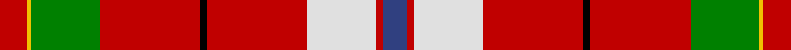

This page is one **sett** — a single exact thread-count. It belongs to the [tartan](/setts/r8ly1g20r29k2r29w20r2db7/)
(the same proportion at any scale), whose colour order is pattern [BRWRKRGYR](/stripes/brwrkrgyr/).

Part of the [Unidentified Travelling costume](/tartans/unidentified-travelling-costume/) tartan — the named design grouping this sett with its other cloths.

Sourced from weddslist.  It is a [9 stripe tartan](/stripes/stripes9/).

Original link http://www.weddslist.com/cgi-bin/tartans/pg.pl?source=sts

## Also known as

This cloth is also recorded under:

- Unidentified, Travelling costume

## Thread count
R/16 Y2 G40 R58 K4 R58 LN40 R4 B/14

One full sett is **442 threads**.

## Palette

Palette: <strong>Tartan Register</strong> <small style="color:#888">(2 of 6 colours)</small>
<table><thead><tr><th>Colour</th><th>Threads</th><th>Shade</th><th>Base</th><th>OKLCh</th></tr></thead><tbody><tr><td>R/</td><td style="text-align:right;font-variant-numeric:tabular-nums">16</td><td><code style="background-color:#C00000;">#C00000</code> <small style="color:#888">#C00000</small></td><td>R <code style="background-color:#CC0000;">#CC0000</code></td><td><small style="color:#888">oklch(50.7% 0.208 29.2)</small></td></tr><tr><td>Y</td><td style="text-align:right;font-variant-numeric:tabular-nums">2</td><td><code style="background-color:#F0C000;">#F0C000</code> <small style="color:#888">#F0C000</small></td><td>Y <code style="background-color:#F2BF00;">#F2BF00</code></td><td><small style="color:#888">oklch(82.7% 0.169 90.5)</small></td></tr><tr><td>G</td><td style="text-align:right;font-variant-numeric:tabular-nums">40</td><td><code style="background-color:#008000;">#008000</code> <small style="color:#888">#008000</small></td><td>G <code style="background-color:#006100;">#006100</code></td><td><small style="color:#888">oklch(52.0% 0.177 142.5)</small></td></tr><tr><td>R</td><td style="text-align:right;font-variant-numeric:tabular-nums">58</td><td><code style="background-color:#C00000;">#C00000</code> <small style="color:#888">#C00000</small></td><td>R <code style="background-color:#CC0000;">#CC0000</code></td><td><small style="color:#888">oklch(50.7% 0.208 29.2)</small></td></tr><tr><td>K</td><td style="text-align:right;font-variant-numeric:tabular-nums">4</td><td><code style="background-color:#000000;">#000000</code> <small style="color:#888">#000000</small></td><td>K <code style="background-color:#000000;">#000000</code></td><td><small style="color:#888">oklch(0.0% 0.000 0.0)</small></td></tr><tr><td>R</td><td style="text-align:right;font-variant-numeric:tabular-nums">58</td><td><code style="background-color:#C00000;">#C00000</code> <small style="color:#888">#C00000</small></td><td>R <code style="background-color:#CC0000;">#CC0000</code></td><td><small style="color:#888">oklch(50.7% 0.208 29.2)</small></td></tr><tr><td>LN</td><td style="text-align:right;font-variant-numeric:tabular-nums">40</td><td><code style="background-color:#E0E0E0;">#E0E0E0</code> <small style="color:#888">#E0E0E0</small></td><td>W <code style="background-color:#F7F7F7;">#F7F7F7</code></td><td><small style="color:#888">oklch(90.7% 0.000 89.9)</small></td></tr><tr><td>R</td><td style="text-align:right;font-variant-numeric:tabular-nums">4</td><td><code style="background-color:#C00000;">#C00000</code> <small style="color:#888">#C00000</small></td><td>R <code style="background-color:#CC0000;">#CC0000</code></td><td><small style="color:#888">oklch(50.7% 0.208 29.2)</small></td></tr><tr><td>B/</td><td style="text-align:right;font-variant-numeric:tabular-nums">14</td><td><code style="background-color:#304080;">#304080</code> <small style="color:#888">#304080</small></td><td>B <code style="background-color:#2A418A;">#2A418A</code></td><td><small style="color:#888">oklch(39.4% 0.109 270.2)</small></td></tr></tbody></table>

## Compared to the master

This cloth is one sett of its design; the master sett (the exemplar the design is anchored on) is below for comparison.

<figure style="margin:0"><figcaption style="color:#888;font-size:smaller">this sett</figcaption></figure>
<figure style="margin:0"><figcaption style="color:#888;font-size:smaller"><a href="/setts/r8ly1dg20r29k2r29w20r2db7/">master sett →</a></figcaption></figure>

## Nearest tartans

The nearest existing variants by ΔTartan distance, with this tartan at the top so the swatches line up against it.

ΔTartan

Tartan

Sett

—

<a href="/ttd/edit/#slug=r8ly1g20r29k2r29w20r2db7~x2">Unidentified, Travelling costume</a> <a class="nn-out" href="/variants/s9/r8ly1g20r29k2r29w20r2db7~x2/" title="open its dictionary page">↗</a>

0.43

<a href="/ttd/edit/#slug=r8ly1dg20r29k2r29w20r2db7~x2&amp;base=r8ly1g20r29k2r29w20r2db7~x2">Unidentified Travelling costume</a> <a class="nn-out" href="/variants/s9/r8ly1dg20r29k2r29w20r2db7~x2/" title="open its dictionary page">↗</a>

1.01

<a href="/ttd/edit/#slug=ly3r4k1r27lyi14r4db15w2~x2&amp;base=r8ly1g20r29k2r29w20r2db7~x2">Dalmagarry (Corporate)</a> <a class="nn-out" href="/variants/s8/ly3r4k1r27lyi14r4db15w2~x2/" title="open its dictionary page">↗</a>

1.28

<a href="/ttd/edit/#slug=w8r100k42dg42r5k3r5t42r100w8&amp;base=r8ly1g20r29k2r29w20r2db7~x2">Unidentified Plaid #7</a> <a class="nn-out" href="/variants/s10/w8r100k42dg42r5k3r5t42r100w8/" title="open its dictionary page">↗</a>

1.37

<a href="/ttd/edit/#slug=w8r100k42g42r5k3r5t42r100w8&amp;base=r8ly1g20r29k2r29w20r2db7~x2">Unidentified Plaid 10</a> <a class="nn-out" href="/variants/s10/w8r100k42g42r5k3r5t42r100w8/" title="open its dictionary page">↗</a>

1.38

<a href="/ttd/edit/#slug=r22db3ly1g12r6db3t3w1~x2&amp;base=r8ly1g20r29k2r29w20r2db7~x2">Drummond, (Fingask)</a> <a class="nn-out" href="/variants/s8/r22db3ly1g12r6db3t3w1~x2/" title="open its dictionary page">↗</a>

1.43

<a href="/ttd/edit/#slug=w4k1r22dg5r4dg12r6dg12r4dg5r22k1ly4~x2&amp;base=r8ly1g20r29k2r29w20r2db7~x2">Bruce</a> <a class="nn-out" href="/variants/s13/w4k1r22dg5r4dg12r6dg12r4dg5r22k1ly4~x2/" title="open its dictionary page">↗</a>

1.45

<a href="/ttd/edit/#slug=r41w2p5ly2g21r9p5db3w2~x2&amp;base=r8ly1g20r29k2r29w20r2db7~x2">Perthshire, or Drummond</a> <a class="nn-out" href="/variants/s9/r41w2p5ly2g21r9p5db3w2~x2/" title="open its dictionary page">↗</a>

1.52

<a href="/ttd/edit/#slug=w6r25y2g3y30k3y2r30ly6~x2&amp;base=r8ly1g20r29k2r29w20r2db7~x2">Virginia Military Institute, New Market</a> <a class="nn-out" href="/variants/s9/w6r25y2g3y30k3y2r30ly6~x2/" title="open its dictionary page">↗</a>

1.56

<a href="/ttd/edit/#slug=r7k6r62k15r20n15lo10k16db10k3w6&amp;base=r8ly1g20r29k2r29w20r2db7~x2">Cork County Crest (Fashion)</a> <a class="nn-out" href="/variants/s11/r7k6r62k15r20n15lo10k16db10k3w6/" title="open its dictionary page">↗</a>

1.56

<a href="/ttd/edit/#slug=r30w1dp4ly1dg14r6dp4lt2w1~x4&amp;base=r8ly1g20r29k2r29w20r2db7~x2">Perth - 1819 (District)</a> <a class="nn-out" href="/variants/s9/r30w1dp4ly1dg14r6dp4lt2w1~x4/" title="open its dictionary page">↗</a>

## Neighbour map

Every grey dot is one of 14360 variants placed by the first two principal components of the ΔTartan feature space (44% of its variance). Red is this tartan; blue dots are its nearest — click one to open its page.

<svg viewBox="0 0 640 380" role="img" style="max-width:100%;height:auto;border:1px solid #e0e0e0;border-radius:4px;display:block" xmlns="http://www.w3.org/2000/svg"><image href="/nn/cloud.v1.png" width="640" height="380"/><a href="/variants/s9/r8ly1dg20r29k2r29w20r2db7~x2/"><circle cx="289.1" cy="98.5" r="4" fill="#3465a4"><title>Unidentified Travelling costume</title></circle></a><a href="/variants/s8/ly3r4k1r27lyi14r4db15w2~x2/"><circle cx="253.7" cy="92.7" r="4" fill="#3465a4"><title>Dalmagarry (Corporate)</title></circle></a><a href="/variants/s10/w8r100k42dg42r5k3r5t42r100w8/"><circle cx="336.2" cy="96.8" r="4" fill="#3465a4"><title>Unidentified Plaid #7</title></circle></a><a href="/variants/s10/w8r100k42g42r5k3r5t42r100w8/"><circle cx="324.3" cy="95.4" r="4" fill="#3465a4"><title>Unidentified Plaid 10</title></circle></a><a href="/variants/s8/r22db3ly1g12r6db3t3w1~x2/"><circle cx="306.9" cy="116.0" r="4" fill="#3465a4"><title>Drummond, (Fingask)</title></circle></a><a href="/variants/s13/w4k1r22dg5r4dg12r6dg12r4dg5r22k1ly4~x2/"><circle cx="318.2" cy="116.2" r="4" fill="#3465a4"><title>Bruce</title></circle></a><a href="/variants/s9/r41w2p5ly2g21r9p5db3w2~x2/"><circle cx="307.9" cy="95.1" r="4" fill="#3465a4"><title>Perthshire, or Drummond</title></circle></a><a href="/variants/s9/w6r25y2g3y30k3y2r30ly6~x2/"><circle cx="273.1" cy="123.1" r="4" fill="#3465a4"><title>Virginia Military Institute, New Market</title></circle></a><a href="/variants/s11/r7k6r62k15r20n15lo10k16db10k3w6/"><circle cx="262.8" cy="98.9" r="4" fill="#3465a4"><title>Cork County Crest (Fashion)</title></circle></a><a href="/variants/s9/r30w1dp4ly1dg14r6dp4lt2w1~x4/"><circle cx="324.9" cy="74.7" r="4" fill="#3465a4"><title>Perth - 1819 (District)</title></circle></a><circle cx="287.2" cy="101.5" r="5" fill="#c00000"/></svg>

ID: /variants/s9/r8ly1g20r29k2r29w20r2db7~x2/
