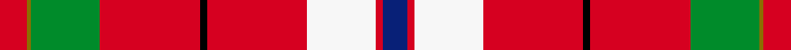

This is one **variant** — a specific cloth: this exact thread count and colourway, with its own
provenance below. It is one weaving of the [sett](/setts/r8y1g20r29k2r29w20r2db7/) (the scale-free proportion — the
same cloth at any scale or shade), whose colour order is pattern [BRWRKRGGR](/stripes/brwrkrggr/).

Sourced from register-of-tartans.  It is a [9 stripe tartan](/stripes/stripes9/).

Original link [https://www.tartanregister.gov.uk/tartanDetails.aspx?ref=4389](https://www.tartanregister.gov.uk/tartanDetails.aspx?ref=4389)

2 attestations — the source records this cloth was collapsed from (oldest owns this page)

<ul>
<li>undated — Unidentified Travelling costume (register-of-tartans, <a href="https://www.tartanregister.gov.uk/tartanDetails.aspx?ref=4389">record</a>)  <em>Scottish Tartans Society archive.</em></li>
<li>undated — Unidentified, Travelling costume (weddslist, <a href="http://www.weddslist.com/cgi-bin/tartans/pg.pl?source=sts">record</a>) </li>
</ul>

Dataset <small>— provenance for this record, inherited from the source manifest</small>

<dl class="dataset-prov">
<dt>source</dt><dd><a href="/sources/register-of-tartans/">Scottish Register of Tartans</a></dd>
<dt>data captured from</dt><dd><a href="https://github.com/thetartan/tartan-database/blob/master/data/register-of-tartans/data.csv">https://github.com/thetartan/tartan-database/blob/master/data/register-of-tartans/data.csv</a></dd>
<dt>data date</dt><dd>2017-01-06 <small>(dataset default)</small></dd>
<dt>licence</dt><dd><a href="https://www.tartanregister.gov.uk/copyright">Crown copyright</a></dd>
</dl>

Capture chain <small>— the hands this data passed through, oldest first; each capture carries its own licence</small>

<ol class="capture-chain">
<li><a href="https://www.tartanregister.gov.uk/">Scottish Register of Tartans</a> · <a href="https://www.tartanregister.gov.uk/copyright">Crown copyright</a> <small>the living register — still published by National Records of Scotland</small></li>
<li><a href="https://github.com/thetartan/tartan-database">thetartan/tartan-database</a> <small>2016-2017</small> · <a href="https://creativecommons.org/licenses/by-nc-nd/4.0/">CC BY-NC-ND 4.0</a> <small>Levko Kravets's frozen compilation — the capture we vendored, and where its CC licence text came from</small></li>
<li>this dictionary <small>captured 2026-06-10 · commit 5bf86c7566</small> <small>each re-capture is a git commit to data/sources</small></li>
</ol>

## Register references

External register numbers recorded for this tartan.

- Scottish Register of Tartans: [4389](https://www.tartanregister.gov.uk/tartanDetails.aspx?ref=4389)
- Scottish Tartans World Register: 582

## Thread count
R/16 Y2 G40 R58 K4 R58 W40 R4 DB/14

One full sett is **442 threads**.

## Palette
<table><thead><tr><th>Colour</th><th>Shade</th><th>OKLCh</th></tr></thead><tbody><tr><td>DB</td><td><code style="background-color:#082077;">#082077</code> <small style="color:#888">#082077</small></td><td><small style="color:#888">oklch(30.0% 0.149 265.1)</small></td></tr><tr><td>G</td><td><code style="background-color:#008B2A;">#008B2A</code> <small style="color:#888">#008B2A</small></td><td><small style="color:#888">oklch(55.4% 0.170 145.9)</small></td></tr><tr><td>K</td><td><code style="background-color:#000000;">#000000</code> <small style="color:#888">#000000</small></td><td><small style="color:#888">oklch(0.0% 0.000 0.0)</small></td></tr><tr><td>W</td><td><code style="background-color:#F7F7F7;">#F7F7F7</code> <small style="color:#888">#F7F7F7</small></td><td><small style="color:#888">oklch(97.6% 0.000 89.9)</small></td></tr><tr><td>R</td><td><code style="background-color:#D60020;">#D60020</code> <small style="color:#888">#D60020</small></td><td><small style="color:#888">oklch(55.2% 0.224 25.5)</small></td></tr><tr><td>Y</td><td><code style="background-color:#8B6E00;">#8B6E00</code> <small style="color:#888">#8B6E00</small></td><td><small style="color:#888">oklch(55.1% 0.113 90.4)</small></td></tr></tbody></table>

# Sample pattern

## Nearest tartan variants

The nearest existing variants by ΔTartan distance, with this cloth at the top so the swatches line up against it.

ΔTartan

Threads

Variant

Sett

—

442

<a href="/variants/s9/r8y1g20r29k2r29w20r2db7~x2/">Unidentified Travelling costume</a>

<a href="/ttd/edit/#slug=k3w1r20db4r4g10r4db4r20k1w3~x2&amp;base=r8y1g20r29k2r29w20r2db7~x2" title="compare in the TTD">2.19</a>

284

<a href="/variants/s11/k3w1r20db4r4g10r4db4r20k1w3~x2/">Hoben (Personal)</a>

<a href="/ttd/edit/#slug=r6g14r6db12r31lb2r4ly3~x2&amp;base=r8y1g20r29k2r29w20r2db7~x2" title="compare in the TTD">2.26</a>

294

<a href="/variants/s8/r6g14r6db12r31lb2r4ly3~x2/">Loch Lochy (District)</a>

<a href="/ttd/edit/#slug=y3r4k1r27g14r4db15w2~x2&amp;base=r8y1g20r29k2r29w20r2db7~x2" title="compare in the TTD">2.43</a>

270

<a href="/variants/s8/y3r4k1r27g14r4db15w2~x2/">Dalmagarry (Corporate)</a>

<a href="/ttd/edit/#slug=r48lb8k10y2k3w2g25r10k3r3w2~x2&amp;base=r8y1g20r29k2r29w20r2db7~x2" title="compare in the TTD">2.46</a>

364

<a href="/variants/s11/r48lb8k10y2k3w2g25r10k3r3w2~x2/">Follower's Plaid Artifact Tartan</a>

<a href="/ttd/edit/#slug=w8r100k42g42r5k3r5lb42r100w8&amp;base=r8y1g20r29k2r29w20r2db7~x2" title="compare in the TTD">2.60</a>

694

<a href="/variants/s10/w8r100k42g42r5k3r5lb42r100w8/">Unidentified Plaid #7</a>

<a href="/ttd/edit/#slug=o48ly14o9dg14k6o11g6o10dg3~x2~o2208036-dg1806142&amp;base=r8y1g20r29k2r29w20r2db7~x2" title="compare in the TTD">2.83</a>

382

<a href="/variants/s9/o48ly14o9dg14k6o11g6o10dg3~x2~o2208036-dg1806142/">Justerini &amp; Brooks</a>

<a href="/ttd/edit/#slug=gi3r4k1r26g14r4dp16w2~x2~gi2408144-g1903114&amp;base=r8y1g20r29k2r29w20r2db7~x2" title="compare in the TTD">2.97</a>

270

<a href="/variants/s8/gi3r4k1r26g14r4dp16w2~x2~gi2408144-g1903114/">MacQueen of Dalmagarry (Clan?)</a>

<a href="/ttd/edit/#slug=k2r1g8r3g3r14y1r1w2~x2&amp;base=r8y1g20r29k2r29w20r2db7~x2" title="compare in the TTD">3.18</a>

132

<a href="/variants/s9/k2r1g8r3g3r14y1r1w2~x2/">Melieres, Michel (Personal)</a>

<a href="/ttd/edit/#slug=w5k1r30db15r8g30r8db2&amp;base=r8y1g20r29k2r29w20r2db7~x2" title="compare in the TTD">3.19</a>

191

<a href="/variants/s8/w5k1r30db15r8g30r8db2/">Shaw</a>

<a href="/ttd/edit/#slug=k4w1r2g16r8g8r15lo1r14y2r2k1w4~x2&amp;base=r8y1g20r29k2r29w20r2db7~x2" title="compare in the TTD">3.21</a>

296

<a href="/variants/s13/k4w1r2g16r8g8r15lo1r14y2r2k1w4~x2/">Melieres-Frost</a>

## Neighbour map

Every grey dot is one of 13621 variants placed by the first two principal components of the ΔTartan feature space (42% of its variance). Red is this tartan; blue dots are its nearest — click one to open its page.

<svg viewBox="0 0 640 380" role="img" style="max-width:100%;height:auto;border:1px solid #e0e0e0;border-radius:4px;display:block" xmlns="http://www.w3.org/2000/svg"><image href="/nn/cloud.v1.png" width="640" height="380"/><a href="/variants/s11/k3w1r20db4r4g10r4db4r20k1w3~x2/"><circle cx="318.9" cy="105.7" r="4" fill="#3465a4"><title>Hoben (Personal)</title></circle></a><a href="/variants/s8/r6g14r6db12r31lb2r4ly3~x2/"><circle cx="330.4" cy="157.2" r="4" fill="#3465a4"><title>Loch Lochy (District)</title></circle></a><a href="/variants/s8/y3r4k1r27g14r4db15w2~x2/"><circle cx="238.3" cy="104.4" r="4" fill="#3465a4"><title>Dalmagarry (Corporate)</title></circle></a><a href="/variants/s11/r48lb8k10y2k3w2g25r10k3r3w2~x2/"><circle cx="232.7" cy="68.5" r="4" fill="#3465a4"><title>Follower's Plaid Artifact Tartan</title></circle></a><a href="/variants/s10/w8r100k42g42r5k3r5lb42r100w8/"><circle cx="285.6" cy="86.6" r="4" fill="#3465a4"><title>Unidentified Plaid #7</title></circle></a><a href="/variants/s9/o48ly14o9dg14k6o11g6o10dg3~x2~o2208036-dg1806142/"><circle cx="335.4" cy="135.8" r="4" fill="#3465a4"><title>Justerini &amp; Brooks</title></circle></a><a href="/variants/s8/gi3r4k1r26g14r4dp16w2~x2~gi2408144-g1903114/"><circle cx="257.3" cy="112.4" r="4" fill="#3465a4"><title>MacQueen of Dalmagarry (Clan?)</title></circle></a><a href="/variants/s9/k2r1g8r3g3r14y1r1w2~x2/"><circle cx="265.9" cy="129.6" r="4" fill="#3465a4"><title>Melieres, Michel (Personal)</title></circle></a><a href="/variants/s8/w5k1r30db15r8g30r8db2/"><circle cx="236.1" cy="123.0" r="4" fill="#3465a4"><title>Shaw</title></circle></a><a href="/variants/s13/k4w1r2g16r8g8r15lo1r14y2r2k1w4~x2/"><circle cx="219.6" cy="107.8" r="4" fill="#3465a4"><title>Melieres-Frost</title></circle></a><circle cx="258.8" cy="102.1" r="5" fill="#c00000"/><text x="320" y="376" text-anchor="middle" font-size="11" fill="#999">ground</text><text x="11" y="190" text-anchor="middle" font-size="11" fill="#999" transform="rotate(-90 11 190)">complexity</text></svg>

ID: /variants/s9/r8y1g20r29k2r29w20r2db7~x2/
