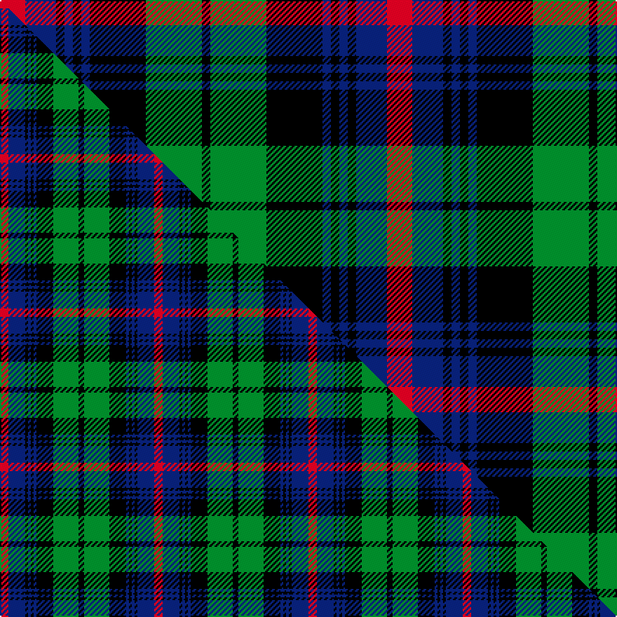

This page is one **sett** — a single exact thread-count. It belongs to the [tartan](/setts/r9db11k3db3k3db3k20g20k3/)
(the same proportion at any scale), whose colour order is pattern [KGKBKBKBR](/stripes/kgkbkbkbr/).

Part of the [Urquhart](/tartans/urquhart-2/) tartan — the named design grouping this sett with its other cloths.

Sourced from tartans-authority.  It is a [9 stripe tartan](/stripes/stripes9/).

Original link https://www.tartanregister.gov.uk/tartanDetails.aspx?ref=1086

## Provenance

Earliest known date: 1810-15 Registered with Lord Lyon on 14th October, 1991. Lord Lyon also registered the 'Urquhart White Line' in the same entry. The proportions of the count given here are taken from the sample in the Cockburn Collection in the Mitchell Library in Glasgow. The sett also appears in the work of W and A Smith (1850) who claim that their sample was collected in the Highlands around 1822, possibly by George Hunter, the Army clothier.

3 attestations — the source records this cloth was collapsed from (oldest owns this page)

<ul>
<li>1822 — Urquhart - 1810 ((Clan) (tartans-authority, <a href="https://www.tartanregister.gov.uk/tartanDetails.aspx?ref=1086">record</a>)  <em>First recorded in the 1810 Cockburn Collection. This is the Urquhart of Urquhart tartan. Lord Lyon Book LCB 76 dated 14th October 1991. Lyon count: K4 G18 K12 B2 K2 B2 K2 B12 R6. The Chief said (13 May 1981) that this was the tartan that he wore. Lord Lyon also registered the 'Urquhart White Line' in the same entry. The proportions of the count given here are taken from the sample in the Cockburn Collection in the Mitchell Library in Glasgow. The sett also appears in the work of W and A Smith (1850) who claim that their sample was collected in the Highlands by George Hunter, the Army clothier prior to 1822. The green here is lightened to show the sett.</em></li>
<li>undated — Urquhart (weddslist, <a href="http://www.weddslist.com/cgi-bin/tartans/pg.pl?source=sts">record</a>) </li>
<li>undated — Urquhart Broad Red Clan Tartan (house-of-tartan, <a href="http://www.house-of-tartan.scotland.net/house/TartanViewjs.asp?colr=Def&tnam=1086">record</a>) </li>
</ul>

Dataset <small>— provenance for this record, inherited from the source manifest</small>

<dl class="dataset-prov">
<dt>source</dt><dd><a href="/sources/tartans-authority/">Scottish Tartans Authority</a></dd>
<dt>data captured from</dt><dd><a href="https://github.com/thetartan/tartan-database/blob/master/data/tartans-authority/data.csv">https://github.com/thetartan/tartan-database/blob/master/data/tartans-authority/data.csv</a></dd>
<dt>data date</dt><dd>1822 <small>(this record)</small></dd>
<dt>licence</dt><dd><a href="https://creativecommons.org/licenses/by-nc-nd/4.0/">CC BY-NC-ND 4.0</a></dd>
</dl>

Capture chain <small>— the hands this data passed through, oldest first; each capture carries its own licence</small>

<ol class="capture-chain">
<li><a href="https://www.tartansauthority.com/">Scottish Tartans Authority</a> <small>the heritage body's archive — its tartan-ferret record browser is retired (links repaired to the SRT, above)</small></li>
<li><a href="https://github.com/thetartan/tartan-database">thetartan/tartan-database</a> <small>2016-2017</small> · <a href="https://creativecommons.org/licenses/by-nc-nd/4.0/">CC BY-NC-ND 4.0</a> <small>Levko Kravets's frozen compilation — the capture we vendored, and where its CC licence text came from</small></li>
<li>this dictionary <small>captured 2026-06-10 · commit 5bf86c7566</small> <small>each re-capture is a git commit to data/sources</small></li>
</ol>

## Register references

External register numbers recorded for this tartan.

- Scottish Tartans Authority (ITI): 1086

## Thread count
R/18 DB22 K6 DB6 K6 DB6 K40 G40 K/6

One full sett is **276 threads**.

## Palette
<table><thead><tr><th>Colour</th><th>Shade</th><th>OKLCh</th></tr></thead><tbody><tr><td>DB</td><td><code style="background-color:#082077;">#082077</code> <small style="color:#888">#082077</small></td><td><small style="color:#888">oklch(30.0% 0.149 265.1)</small></td></tr><tr><td>G</td><td><code style="background-color:#008B2A;">#008B2A</code> <small style="color:#888">#008B2A</small></td><td><small style="color:#888">oklch(55.4% 0.170 145.9)</small></td></tr><tr><td>K</td><td><code style="background-color:#000000;">#000000</code> <small style="color:#888">#000000</small></td><td><small style="color:#888">oklch(0.0% 0.000 0.0)</small></td></tr><tr><td>R</td><td><code style="background-color:#D60020;">#D60020</code> <small style="color:#888">#D60020</small></td><td><small style="color:#888">oklch(55.2% 0.224 25.5)</small></td></tr></tbody></table>

# Sample pattern

## Compared to the master

This cloth is one sett of its design; the master sett (the exemplar the design is anchored on) is below for comparison.

Its **ΔTartan distance** from the master is **0.40** — the same measure the nearest-tartans table ranks by (0 is identical; a re-scale of the same cloth is near 0, a recolour or a different proportion further).

<figure class="master-compare" style="margin:0">

this sett
master sett ★

<figcaption style="color:#888;font-size:smaller">One weave of this sett against the <a href="/setts/r3db6k1db1k1db1k6g9k2/">master sett ★</a>, split on the diagonal: a shared proportion runs seamlessly across it with only the shades shifting; a different proportion breaks on it.</figcaption>
</figure>

## Nearest tartan variants

The nearest existing variants by ΔTartan distance, with this cloth at the top so the swatches line up against it.

ΔTartan

Threads

Variant

Sett

—

276

<a href="/variants/s9/r9db11k3db3k3db3k20g20k3~x2/">Urquhart - 1810 ((Clan)</a>

<a href="/ttd/edit/#slug=r3db6k1db1k1db1k6g9k2~x2&amp;base=r9db11k3db3k3db3k20g20k3~x2" title="compare in the TTD">0.40</a>

110

<a href="/variants/s9/r3db6k1db1k1db1k6g9k2~x2/">Urquhart</a>

<a href="/ttd/edit/#slug=db8k2db2k2db2k8g7k1w1~x2&amp;base=r9db11k3db3k3db3k20g20k3~x2" title="compare in the TTD">0.84</a>

114

<a href="/variants/s9/db8k2db2k2db2k8g7k1w1~x2/">Forbes #3</a>

<a href="/ttd/edit/#slug=db9k9db9r2k18g12r2g4r2g4~x2&amp;base=r9db11k3db3k3db3k20g20k3~x2" title="compare in the TTD">1.54</a>

258

<a href="/variants/s10/db9k9db9r2k18g12r2g4r2g4~x2/">Newlands</a>

<a href="/ttd/edit/#slug=db12r2db4r4k15db4g4db2g12~x2&amp;base=r9db11k3db3k3db3k20g20k3~x2" title="compare in the TTD">1.58</a>

188

<a href="/variants/s9/db12r2db4r4k15db4g4db2g12~x2/">Alexander Hunting (Name)</a>

<a href="/ttd/edit/#slug=dg10k3w3k3w3k3dg10b6k15b3~x2&amp;base=r9db11k3db3k3db3k20g20k3~x2" title="compare in the TTD">1.85</a>

210

<a href="/variants/s10/dg10k3w3k3w3k3dg10b6k15b3~x2/">City of Edinburgh</a>

<a href="/ttd/edit/#slug=g8lb1g1k6dp6k1dp3~x4&amp;base=r9db11k3db3k3db3k20g20k3~x2" title="compare in the TTD">1.92</a>

164

<a href="/variants/s7/g8lb1g1k6dp6k1dp3~x4/">Unnamed 19th Century Plaid</a>

<a href="/ttd/edit/#slug=y6g3y3g22k23dp23k4~x2&amp;base=r9db11k3db3k3db3k20g20k3~x2" title="compare in the TTD">1.95</a>

316

<a href="/variants/s7/y6g3y3g22k23dp23k4~x2/">Gordon of Esslemont</a>

<a href="/ttd/edit/#slug=dp3k1dp8k6g8k1w2~x2&amp;base=r9db11k3db3k3db3k20g20k3~x2" title="compare in the TTD">1.97</a>

106

<a href="/variants/s7/dp3k1dp8k6g8k1w2~x2/">Baillie (Highland Society)</a>

<a href="/ttd/edit/#slug=db10k1db1k1db2k8g10w1~x4&amp;base=r9db11k3db3k3db3k20g20k3~x2" title="compare in the TTD">2.00</a>

228

<a href="/variants/s8/db10k1db1k1db2k8g10w1~x4/">Lamont</a>

<a href="/ttd/edit/#slug=db10k1db1k1db2k8g10w1~x2&amp;base=r9db11k3db3k3db3k20g20k3~x2" title="compare in the TTD">2.00</a>

114

<a href="/variants/s8/db10k1db1k1db2k8g10w1~x2/">Lamont</a>

## Neighbour map

Every grey dot is one of 13620 variants placed by the first two principal components of the ΔTartan feature space (42% of its variance). Red is this tartan; blue dots are its nearest — click one to open its page.

<svg viewBox="0 0 640 380" role="img" style="max-width:100%;height:auto;border:1px solid #e0e0e0;border-radius:4px;display:block" xmlns="http://www.w3.org/2000/svg"><image href="/nn/cloud.v1.png" width="640" height="380"/><a href="/variants/s9/r3db6k1db1k1db1k6g9k2~x2/"><circle cx="127.3" cy="182.1" r="4" fill="#3465a4"><title>Urquhart</title></circle></a><a href="/variants/s9/db8k2db2k2db2k8g7k1w1~x2/"><circle cx="158.2" cy="192.1" r="4" fill="#3465a4"><title>Forbes #3</title></circle></a><a href="/variants/s10/db9k9db9r2k18g12r2g4r2g4~x2/"><circle cx="133.5" cy="188.7" r="4" fill="#3465a4"><title>Newlands</title></circle></a><a href="/variants/s9/db12r2db4r4k15db4g4db2g12~x2/"><circle cx="132.5" cy="200.8" r="4" fill="#3465a4"><title>Alexander Hunting (Name)</title></circle></a><a href="/variants/s10/dg10k3w3k3w3k3dg10b6k15b3~x2/"><circle cx="122.1" cy="210.1" r="4" fill="#3465a4"><title>City of Edinburgh</title></circle></a><a href="/variants/s7/g8lb1g1k6dp6k1dp3~x4/"><circle cx="144.9" cy="208.6" r="4" fill="#3465a4"><title>Unnamed 19th Century Plaid</title></circle></a><a href="/variants/s7/y6g3y3g22k23dp23k4~x2/"><circle cx="128.3" cy="206.2" r="4" fill="#3465a4"><title>Gordon of Esslemont</title></circle></a><a href="/variants/s7/dp3k1dp8k6g8k1w2~x2/"><circle cx="137.3" cy="204.9" r="4" fill="#3465a4"><title>Baillie (Highland Society)</title></circle></a><a href="/variants/s8/db10k1db1k1db2k8g10w1~x4/"><circle cx="171.8" cy="179.0" r="4" fill="#3465a4"><title>Lamont</title></circle></a><a href="/variants/s8/db10k1db1k1db2k8g10w1~x2/"><circle cx="171.8" cy="179.0" r="4" fill="#3465a4"><title>Lamont</title></circle></a><circle cx="133.0" cy="191.2" r="5" fill="#c00000"/><text x="320" y="376" text-anchor="middle" font-size="11" fill="#999">ground</text><text x="11" y="190" text-anchor="middle" font-size="11" fill="#999" transform="rotate(-90 11 190)">complexity</text></svg>

ID: /variants/s9/r9db11k3db3k3db3k20g20k3~x2/
