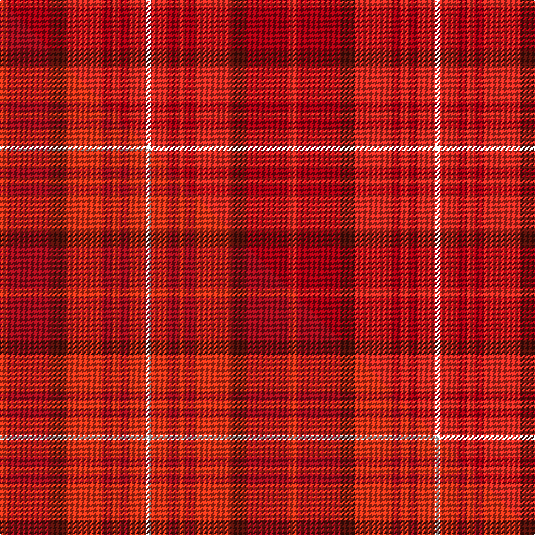

This page is one **sett** — a single exact thread-count. It belongs to the [tartan](/setts/ri3r18dr6ri15r4ri3r4ri7k2/)
(the same proportion at any scale), whose colour order is pattern [KRRRRRBRR](/stripes/krrrrrbrr/).

Part of the [Tune Hotels](/tartans/tune-hotels/) tartan — the named design grouping this sett with its other cloths.

Sourced from house-of-tartan.  It is a [9 stripe tartan](/stripes/stripes9/).

Original link http://www.house-of-tartan.scotland.net/house/TartanViewjs.asp?colr=Def&tnam=10742

## Provenance

Earliest known date: 04/09/2012 The Tune Hotels tartan was commissioned in 2012 to celebrate the launch of the first Tune Hotel in Scotland. Founded by prominent Malaysian entrepreneur, Tony Fernandes, Tune Hotels is a value hotel brand providing high quality, affordably priced accommodation. With hotels located across Southeast Asia and the United Kingdom and new hotels opening in areas such as Australia, China and India, this initial Scottish addition marks an important new stage in the company’s growth. As the first Scottish Tune Hotel will be based in Edinburgh, the City of Edinburgh Tartan presented itself as a great starting point and base sett for the new design. A simple but bold colour palette of tonal reds and white not only creates a striking appearance but also reflects the clean and contemporary feel of the brand’s identity.

## Thread count
Ri/6 R36 DR12 Ri30 R8 Ri6 R8 Ri14 K/4

One full sett is **238 threads**.

## Palette
<table><thead><tr><th>Colour</th><th>Shade</th><th>OKLCh</th></tr></thead><tbody><tr><td>R</td><td><code style="background-color:#A50313;">#A50313</code> <small style="color:#888">#A50313</small></td><td><small style="color:#888">oklch(45.5% 0.184 26.4)</small></td></tr><tr><td>DR</td><td><code style="background-color:#55120C;">#55120C</code> <small style="color:#888">#55120C</small></td><td><small style="color:#888">oklch(30.0% 0.099 29.3)</small></td></tr><tr><td>R</td><td><code style="background-color:#EE2E24;">#EE2E24</code> <small style="color:#888">#EE2E24</small></td><td><small style="color:#888">oklch(61.4% 0.227 28.9)</small></td></tr></tbody></table>

# Sample pattern

## Compared to the master

This cloth is one sett of its design; the master sett (the exemplar the design is anchored on) is below for comparison.

Its **ΔTartan distance** from the master is **1.22** — the same measure the nearest-tartans table ranks by (0 is identical; a re-scale of the same cloth is near 0, a recolour or a different proportion further).

<figure class="master-compare" style="margin:0">

this sett
master sett ★

<figcaption style="color:#888;font-size:smaller">One weave of this sett against the <a href="/setts/ri3r18dr6ri15r4ri3r4ri7w2/">master sett ★</a>, split on the diagonal: a shared proportion runs seamlessly across it with only the shades shifting; a different proportion breaks on it.</figcaption>
</figure>

## Nearest variants

The nearest existing variants by ΔTartan distance, with this cloth at the top so the swatches line up against it.

ΔTartan

Threads

Variant

Sett

—

238

<a href="/variants/s9/ri3r18dr6ri15r4ri3r4ri7k2~x2~ri2509032-r1807025/">Tune Hotels Corporate Tartan</a>

<a href="/ttd/edit/#slug=ri3r18dr6ri15r4ri3r4ri7w2~x2~ri2509032-r1807025&amp;base=ri3r18dr6ri15r4ri3r4ri7k2~x2~ri2509032-r1807025" title="compare in the TTD">0.00</a>

238

<a href="/variants/s9/ri3r18dr6ri15r4ri3r4ri7w2~x2~ri2509032-r1807025/">Tune Hotels</a>

<a href="/ttd/edit/#slug=ri3r18dr6ri15r4ri3r4ri7w2~x2~ri2406019-r2109032&amp;base=ri3r18dr6ri15r4ri3r4ri7k2~x2~ri2509032-r1807025" title="compare in the TTD">0.00</a>

238

<a href="/variants/s9/ri3r18dr6ri15r4ri3r4ri7w2~x2~ri2406019-r2109032/">Tune Hotels (Corporate)</a>

## Neighbour map

Every grey dot is one of 13620 variants placed by the first two principal components of the ΔTartan feature space (42% of its variance). Red is this tartan; blue dots are its nearest — click one to open its page.

<svg viewBox="0 0 640 380" role="img" style="max-width:100%;height:auto;border:1px solid #e0e0e0;border-radius:4px;display:block" xmlns="http://www.w3.org/2000/svg"><image href="/nn/cloud.v1.png" width="640" height="380"/><a href="/variants/s9/ri3r18dr6ri15r4ri3r4ri7w2~x2~ri2509032-r1807025/"><circle cx="352.4" cy="223.5" r="4" fill="#3465a4"><title>Tune Hotels</title></circle></a><a href="/variants/s9/ri3r18dr6ri15r4ri3r4ri7w2~x2~ri2406019-r2109032/"><circle cx="392.2" cy="240.8" r="4" fill="#3465a4"><title>Tune Hotels (Corporate)</title></circle></a><circle cx="324.6" cy="207.2" r="5" fill="#c00000"/><text x="320" y="376" text-anchor="middle" font-size="11" fill="#999">ground</text><text x="11" y="190" text-anchor="middle" font-size="11" fill="#999" transform="rotate(-90 11 190)">complexity</text></svg>

ID: /variants/s9/ri3r18dr6ri15r4ri3r4ri7k2~x2~ri2509032-r1807025/
