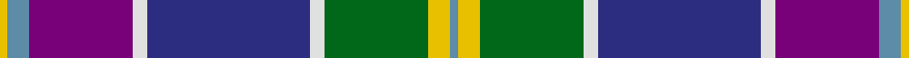

This page is one **sett** — a single exact thread-count. It belongs to the [tartan](/setts/t1ly3g14w2db22w2dp14t3ly1/)
(the same proportion at any scale), whose colour order is pattern [BYGWBWBBY](/stripes/bygwbwbby/).

Sourced from tartans-authority.  It is a [9 stripe tartan](/stripes/stripes9/).

Original link http://www.tartansauthority.com/tartan-ferret/display/3896/

## Provenance

Earliest known date: pre 2002 For the Yule families of Aberdeenshire, Lanarkshire and East Lothian not connected with Clan Buchanan.

3 attestations — the source records this cloth was collapsed from (oldest owns this page)

<ul>
<li>pre 2002 — Yule (Name) (tartans-authority, <a href="http://www.tartansauthority.com/tartan-ferret/display/3896/">record</a>)</li>
<li>undated — Yule (register-of-tartans, <a href="https://www.tartanregister.gov.uk/tartanDetails.aspx?ref=5338">record</a>)</li>
<li>undated — Yule Name Tartan (house-of-tartan, <a href="http://www.house-of-tartan.scotland.net/house/TartanViewjs.asp?colr=Def&tnam=3896">record</a>)</li>
</ul>

## Register references

External register numbers recorded for this tartan.

- Scottish Register of Tartans: [5338](https://www.tartanregister.gov.uk/tartanDetails.aspx?ref=5338)
- Scottish Tartans Authority (ITI): 3896

## Thread count
Y/2 B6 P28 LN4 DB44 LN4 G28 Y6 B/2

One full sett is **244 threads**.

## Palette

Palette: <strong>Tartan Register</strong>
<table><thead><tr><th>Colour</th><th>Threads</th><th>Shade</th><th>Base</th><th>OKLCh</th></tr></thead><tbody><tr><td>Y/</td><td style="text-align:right;font-variant-numeric:tabular-nums">2</td><td><code style="background-color:#E8C000;">#E8C000</code> <small style="color:#888">#E8C000</small></td><td>Y <code style="background-color:#F2BF00;">#F2BF00</code></td><td><small style="color:#888">oklch(81.9% 0.168 93.7)</small></td></tr><tr><td>B</td><td style="text-align:right;font-variant-numeric:tabular-nums">6</td><td><code style="background-color:#5C8CA8;">#5C8CA8</code> <small style="color:#888">#5C8CA8</small></td><td>B <code style="background-color:#2A418A;">#2A418A</code></td><td><small style="color:#888">oklch(61.7% 0.067 235.0)</small></td></tr><tr><td>P</td><td style="text-align:right;font-variant-numeric:tabular-nums">28</td><td><code style="background-color:#780078;">#780078</code> <small style="color:#888">#780078</small></td><td>B <code style="background-color:#2A418A;">#2A418A</code></td><td><small style="color:#888">oklch(40.2% 0.185 328.4)</small></td></tr><tr><td>LN</td><td style="text-align:right;font-variant-numeric:tabular-nums">4</td><td><code style="background-color:#E0E0E0;">#E0E0E0</code> <small style="color:#888">#E0E0E0</small></td><td>W <code style="background-color:#F7F7F7;">#F7F7F7</code></td><td><small style="color:#888">oklch(90.7% 0.000 89.9)</small></td></tr><tr><td>DB</td><td style="text-align:right;font-variant-numeric:tabular-nums">44</td><td><code style="background-color:#2C2C80;">#2C2C80</code> <small style="color:#888">#2C2C80</small></td><td>B <code style="background-color:#2A418A;">#2A418A</code></td><td><small style="color:#888">oklch(35.0% 0.138 276.6)</small></td></tr><tr><td>LN</td><td style="text-align:right;font-variant-numeric:tabular-nums">4</td><td><code style="background-color:#E0E0E0;">#E0E0E0</code> <small style="color:#888">#E0E0E0</small></td><td>W <code style="background-color:#F7F7F7;">#F7F7F7</code></td><td><small style="color:#888">oklch(90.7% 0.000 89.9)</small></td></tr><tr><td>G</td><td style="text-align:right;font-variant-numeric:tabular-nums">28</td><td><code style="background-color:#006818;">#006818</code> <small style="color:#888">#006818</small></td><td>G <code style="background-color:#006100;">#006100</code></td><td><small style="color:#888">oklch(45.0% 0.142 145.0)</small></td></tr><tr><td>Y</td><td style="text-align:right;font-variant-numeric:tabular-nums">6</td><td><code style="background-color:#E8C000;">#E8C000</code> <small style="color:#888">#E8C000</small></td><td>Y <code style="background-color:#F2BF00;">#F2BF00</code></td><td><small style="color:#888">oklch(81.9% 0.168 93.7)</small></td></tr><tr><td>B/</td><td style="text-align:right;font-variant-numeric:tabular-nums">2</td><td><code style="background-color:#5C8CA8;">#5C8CA8</code> <small style="color:#888">#5C8CA8</small></td><td>B <code style="background-color:#2A418A;">#2A418A</code></td><td><small style="color:#888">oklch(61.7% 0.067 235.0)</small></td></tr></tbody></table>

## Nearest tartans

The nearest existing variants by ΔTartan distance, with this tartan at the top so the swatches line up against it.

ΔTartan

Tartan

Sett

—

<a href="/ttd/edit/#slug=t1ly3g14w2db22w2dp14t3ly1~x2">Yule (Name)</a> <a class="nn-out" href="/variants/s9/t1ly3g14w2db22w2dp14t3ly1~x2/" title="open its dictionary page">↗</a>

0.78

<a href="/ttd/edit/#slug=w3k1db24dbi10o24k1ly3~x2&amp;base=t1ly3g14w2db22w2dp14t3ly1~x2">George Heriot's School</a> <a class="nn-out" href="/variants/s7/w3k1db24dbi10o24k1ly3~x2/" title="open its dictionary page">↗</a>

0.88

<a href="/ttd/edit/#slug=k16w6k4b64m19k8g42ly6&amp;base=t1ly3g14w2db22w2dp14t3ly1~x2">Unidentified (Woven sample)</a> <a class="nn-out" href="/variants/s8/k16w6k4b64m19k8g42ly6/" title="open its dictionary page">↗</a>

0.92

<a href="/ttd/edit/#slug=db1t12m6w1lo3db14dt18w1~x2&amp;base=t1ly3g14w2db22w2dp14t3ly1~x2">Ancient Gathering</a> <a class="nn-out" href="/variants/s8/db1t12m6w1lo3db14dt18w1~x2/" title="open its dictionary page">↗</a>

0.97

<a href="/ttd/edit/#slug=g5m2g2m9k9lr9db30w5~x2&amp;base=t1ly3g14w2db22w2dp14t3ly1~x2">Alexander of Menstry</a> <a class="nn-out" href="/variants/s8/g5m2g2m9k9lr9db30w5~x2/" title="open its dictionary page">↗</a>

0.98

<a href="/ttd/edit/#slug=db46ly4db4ly4db6k16o66w11r6&amp;base=t1ly3g14w2db22w2dp14t3ly1~x2">Scottish Association for N.S. (Corp)</a> <a class="nn-out" href="/variants/s9/db46ly4db4ly4db6k16o66w11r6/" title="open its dictionary page">↗</a>

1.00

<a href="/ttd/edit/#slug=dp3o1db4g2r2g21o3dp21db25w3~x2&amp;base=t1ly3g14w2db22w2dp14t3ly1~x2">Accenture</a> <a class="nn-out" href="/variants/s10/dp3o1db4g2r2g21o3dp21db25w3~x2/" title="open its dictionary page">↗</a>

1.05

<a href="/ttd/edit/#slug=db16w6r8db3ly1g1t3db1g9~x2&amp;base=t1ly3g14w2db22w2dp14t3ly1~x2">Ohio District Tartan</a> <a class="nn-out" href="/variants/s9/db16w6r8db3ly1g1t3db1g9~x2/" title="open its dictionary page">↗</a>

1.06

<a href="/ttd/edit/#slug=lb3m14w1k2g2k16t20lb1~x2&amp;base=t1ly3g14w2db22w2dp14t3ly1~x2">Vinther, Niels Christian (Personal)</a> <a class="nn-out" href="/variants/s8/lb3m14w1k2g2k16t20lb1~x2/" title="open its dictionary page">↗</a>

1.07

<a href="/ttd/edit/#slug=g10ly2dp2g2dp13g2dp2g1k13db24w2~x2&amp;base=t1ly3g14w2db22w2dp14t3ly1~x2">Lang of Sherbrooke (Personal)</a> <a class="nn-out" href="/variants/s11/g10ly2dp2g2dp13g2dp2g1k13db24w2~x2/" title="open its dictionary page">↗</a>

1.08

<a href="/ttd/edit/#slug=g10ly2k2g2k13g2k2g1dp13db24w2~x2&amp;base=t1ly3g14w2db22w2dp14t3ly1~x2">Lang of Sherbrooke (Personal)</a> <a class="nn-out" href="/variants/s11/g10ly2k2g2k13g2k2g1dp13db24w2~x2/" title="open its dictionary page">↗</a>

## Neighbour map

Every grey dot is one of 14360 variants placed by the first two principal components of the ΔTartan feature space (44% of its variance). Red is this tartan; blue dots are its nearest — click one to open its page.

<svg viewBox="0 0 640 380" role="img" style="max-width:100%;height:auto;border:1px solid #e0e0e0;border-radius:4px;display:block" xmlns="http://www.w3.org/2000/svg"><image href="/nn/cloud.v1.png" width="640" height="380"/><a href="/variants/s7/w3k1db24dbi10o24k1ly3~x2/"><circle cx="196.2" cy="126.1" r="4" fill="#3465a4"><title>George Heriot's School</title></circle></a><a href="/variants/s8/k16w6k4b64m19k8g42ly6/"><circle cx="161.5" cy="136.3" r="4" fill="#3465a4"><title>Unidentified (Woven sample)</title></circle></a><a href="/variants/s8/db1t12m6w1lo3db14dt18w1~x2/"><circle cx="148.0" cy="145.4" r="4" fill="#3465a4"><title>Ancient Gathering</title></circle></a><a href="/variants/s8/g5m2g2m9k9lr9db30w5~x2/"><circle cx="163.7" cy="135.9" r="4" fill="#3465a4"><title>Alexander of Menstry</title></circle></a><a href="/variants/s9/db46ly4db4ly4db6k16o66w11r6/"><circle cx="194.0" cy="111.7" r="4" fill="#3465a4"><title>Scottish Association for N.S. (Corp)</title></circle></a><a href="/variants/s10/dp3o1db4g2r2g21o3dp21db25w3~x2/"><circle cx="204.2" cy="117.2" r="4" fill="#3465a4"><title>Accenture</title></circle></a><a href="/variants/s9/db16w6r8db3ly1g1t3db1g9~x2/"><circle cx="160.4" cy="129.2" r="4" fill="#3465a4"><title>Ohio District Tartan</title></circle></a><a href="/variants/s8/lb3m14w1k2g2k16t20lb1~x2/"><circle cx="157.6" cy="115.5" r="4" fill="#3465a4"><title>Vinther, Niels Christian (Personal)</title></circle></a><a href="/variants/s11/g10ly2dp2g2dp13g2dp2g1k13db24w2~x2/"><circle cx="176.0" cy="113.1" r="4" fill="#3465a4"><title>Lang of Sherbrooke (Personal)</title></circle></a><a href="/variants/s11/g10ly2k2g2k13g2k2g1dp13db24w2~x2/"><circle cx="173.5" cy="113.6" r="4" fill="#3465a4"><title>Lang of Sherbrooke (Personal)</title></circle></a><circle cx="166.0" cy="112.7" r="5" fill="#c00000"/></svg>

ID: /variants/s9/t1ly3g14w2db22w2dp14t3ly1~x2/
