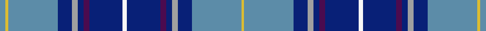

This page is one **sett** — a single exact thread-count. It belongs to the [tartan](/setts/t4ly2t34db10lr4db4dp4db23w3/)
(the same proportion at any scale), whose colour order is pattern [BYBBYBBBWBBBYBBY](/stripes/bybbybbbwbbbybby/).

Sourced from register-of-tartans.  It is a [16 stripe tartan](/stripes/stripes16/).

Original link https://www.tartanregister.gov.uk/tartanDetails.aspx?ref=1678

2 attestations — the source records this cloth was collapsed from (oldest owns this page)

<ul>
<li>01/01/2004 — Heirloom Blue Alba (register-of-tartans, <a href="https://www.tartanregister.gov.uk/tartanDetails.aspx?ref=1678">record</a>)  <em>A Lochcarron fashion design - swatch in Scottish Tartans Authority's archive.</em></li>
<li>Jan 2004 — Heirloom Blue Alba (Fashion) (tartans-authority, <a href="http://www.tartansauthority.com/tartan-ferret/display/6406/">record</a>)  <em>A Lochcarron fashion design - swatch in archive.</em></li>
</ul>

## Register references

External register numbers recorded for this tartan.

- Scottish Register of Tartans: [1678](https://www.tartanregister.gov.uk/tartanDetails.aspx?ref=1678)
- Scottish Tartans Authority (ITI): 6406

## Thread count
T/8 LY4 T68 DB20 LR8 DB8 DP8 DB46 W6 DB46 DP8 DB8 LR8 DB20 T68 LY/4

One full sett is **664 threads**.

## Palette
<table><thead><tr><th>Colour</th><th>Shade</th><th>OKLCh</th></tr></thead><tbody><tr><td>T</td><td><code style="background-color:#5C8CA8;">#5C8CA8</code> <small style="color:#888">#5C8CA8</small></td><td><small style="color:#888">oklch(61.7% 0.067 235.0)</small></td></tr><tr><td>DB</td><td><code style="background-color:#082077;">#082077</code> <small style="color:#888">#082077</small></td><td><small style="color:#888">oklch(30.0% 0.149 265.1)</small></td></tr><tr><td>DR</td><td><code style="background-color:#55120C;">#55120C</code> <small style="color:#888">#55120C</small></td><td><small style="color:#888">oklch(30.0% 0.099 29.3)</small></td></tr><tr><td>LY</td><td><code style="background-color:#DCBC32;">#DCBC32</code> <small style="color:#888">#DCBC32</small></td><td><small style="color:#888">oklch(80.0% 0.150 95.2)</small></td></tr><tr><td>W</td><td><code style="background-color:#F7F7F7;">#F7F7F7</code> <small style="color:#888">#F7F7F7</small></td><td><small style="color:#888">oklch(97.6% 0.000 89.9)</small></td></tr><tr><td>LR</td><td><code style="background-color:#A0A0A0;">#A0A0A0</code> <small style="color:#888">#A0A0A0</small></td><td><small style="color:#888">oklch(70.6% 0.000 89.9)</small></td></tr><tr><td>DP</td><td><code style="background-color:#4B0B4F;">#4B0B4F</code> <small style="color:#888">#4B0B4F</small></td><td><small style="color:#888">oklch(30.1% 0.125 325.4)</small></td></tr></tbody></table>

# Sample pattern

ID: /variants/s9/t4ly2t34db10lr4db4dp4db23w3~x2~t2503227-lr2800000/
