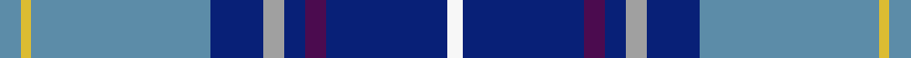

This is one **variant** — a specific cloth: this exact thread count and colourway, with its own
provenance below. It is one weaving of the [sett](/tartans/h/he/heirloom-blue-alba/) (the scale-free proportion — the
same cloth at any scale or shade), whose colour order is pattern [BYBBYBBBW](/stripes/bybbybbbw/).

Part of the [Heirloom Blue Alba](/tartans/h/he/heirloom-blue-alba/) tartan — the named design grouping this sett with its other cloths.

Sourced from register-of-tartans.  It is a [9 stripe tartan](/stripes/stripes9/).

Original link [https://www.tartanregister.gov.uk/tartanDetails.aspx?ref=1678](https://www.tartanregister.gov.uk/tartanDetails.aspx?ref=1678)

2 attestations — the source records this cloth was collapsed from (oldest owns this page)

<ul>
<li>01/01/2004 — Heirloom Blue Alba (register-of-tartans, <a href="https://www.tartanregister.gov.uk/tartanDetails.aspx?ref=1678">record</a>)  <em>A Lochcarron fashion design - swatch in Scottish Tartans Authority's archive.</em></li>
<li>Jan 2004 — Heirloom Blue Alba (Fashion) (tartans-authority, <a href="https://web.archive.org/web/*/http://www.tartansauthority.com/tartan-ferret/display/6406/*">record</a>)  <em>A Lochcarron fashion design - swatch in archive.</em></li>
</ul>

Dataset <small>— provenance for this record, inherited from the source manifest</small>

<dl class="dataset-prov">
<dt>source</dt><dd><a href="/sources/register-of-tartans/">Scottish Register of Tartans</a></dd>
<dt>data captured from</dt><dd><a href="https://github.com/thetartan/tartan-database/blob/master/data/register-of-tartans/data.csv">https://github.com/thetartan/tartan-database/blob/master/data/register-of-tartans/data.csv</a></dd>
<dt>data date</dt><dd>2004 <small>(this record)</small></dd>
<dt>licence</dt><dd><a href="https://www.tartanregister.gov.uk/copyright">Crown copyright</a></dd>
</dl>

Capture chain <small>— the hands this data passed through, oldest first; each capture carries its own licence</small>

<ol class="capture-chain">
<li><a href="https://www.tartanregister.gov.uk/">Scottish Register of Tartans</a> · <a href="https://www.tartanregister.gov.uk/copyright">Crown copyright</a> <small>the living register — still published by National Records of Scotland</small></li>
<li><a href="https://github.com/thetartan/tartan-database">thetartan/tartan-database</a> <small>2016-2017</small> · <a href="https://creativecommons.org/licenses/by-nc-nd/4.0/">CC BY-NC-ND 4.0</a> <small>Levko Kravets's frozen compilation — the capture we vendored, and where its CC licence text came from</small></li>
<li>this dictionary <small>captured 2026-06-10 · commit 5bf86c7566</small> <small>each re-capture is a git commit to data/sources</small></li>
</ol>

## Register references

External register numbers recorded for this tartan.

- Scottish Register of Tartans: [1678](https://www.tartanregister.gov.uk/tartanDetails.aspx?ref=1678)
- Scottish Tartans Authority (ITI): 6406

## Thread count
T/8 LY4 T68 DB20 LR8 DB8 DP8 DB46 W/6

One full sett is **338 threads**.

The source recorded this cloth as T/8 LY4 T68 DB20 LR8 DB8 DP8 DB46 W6 DB46 DP8 DB8 LR8 DB20 T68 LY/4 — 664 threads; it folds to the canonical 338-thread sett above.

## Palette
<table><thead><tr><th>Colour</th><th>Shade</th><th>OKLCh</th></tr></thead><tbody><tr><td>T</td><td><code style="background-color:#5C8CA8;">#5C8CA8</code> <small style="color:#888">#5C8CA8</small></td><td><small style="color:#888">oklch(61.7% 0.067 235.0)</small></td></tr><tr><td>DB</td><td><code style="background-color:#082077;">#082077</code> <small style="color:#888">#082077</small></td><td><small style="color:#888">oklch(30.0% 0.149 265.1)</small></td></tr><tr><td>DR</td><td><code style="background-color:#55120C;">#55120C</code> <small style="color:#888">#55120C</small></td><td><small style="color:#888">oklch(30.0% 0.099 29.3)</small></td></tr><tr><td>LY</td><td><code style="background-color:#DCBC32;">#DCBC32</code> <small style="color:#888">#DCBC32</small></td><td><small style="color:#888">oklch(80.0% 0.150 95.2)</small></td></tr><tr><td>W</td><td><code style="background-color:#F7F7F7;">#F7F7F7</code> <small style="color:#888">#F7F7F7</small></td><td><small style="color:#888">oklch(97.6% 0.000 89.9)</small></td></tr><tr><td>LR</td><td><code style="background-color:#A0A0A0;">#A0A0A0</code> <small style="color:#888">#A0A0A0</small></td><td><small style="color:#888">oklch(70.6% 0.000 89.9)</small></td></tr><tr><td>DP</td><td><code style="background-color:#4B0B4F;">#4B0B4F</code> <small style="color:#888">#4B0B4F</small></td><td><small style="color:#888">oklch(30.1% 0.125 325.4)</small></td></tr></tbody></table>

# Sample pattern

[Sample sheet (PDF)](swatch.pdf) — the woven sample, thread count and palette on one printable A4, rendered on demand (the same sheet the TTD print page downloads).

## Nearest tartan variants

The nearest existing variants by ΔTartan distance, with this cloth at the top so the swatches line up against it.

ΔTartan

Threads

Variant

Sett

—

664

<a href="/variants/s9/t4ly2t34db10lr4db4dp4db23w3~x2~t6107234-lr70/">Heirloom Blue Alba</a>

<a href="/ttd/edit/#slug=n5lbi3lb7n5lb27b8db43w3lb3~lbi82-lb7609282-b4618276-db3409246&amp;base=t4ly2t34db10lr4db4dp4db23w3~x2~t6107234-lr70" title="compare in the TTD">3.28</a>

200

<a href="/variants/s9/n5lbi3lb7n5lb27b8db43w3lb3~lbi82-lb7609282-b4618276-db3409246/">Queensferry High (School)</a>

<a href="/ttd/edit/#slug=db6lb2db2lb3db16t26dr2~x2&amp;base=t4ly2t34db10lr4db4dp4db23w3~x2~t6107234-lr70" title="compare in the TTD">3.35</a>

212

<a href="/variants/s7/db6lb2db2lb3db16t26dr2~x2/">Federal Bureau of Investigation</a>

<a href="/ttd/edit/#slug=t14lb1t3lo2t3lb1t4db24dr3~x4~t6107234-lb80&amp;base=t4ly2t34db10lr4db4dp4db23w3~x2~t6107234-lr70" title="compare in the TTD">3.42</a>

372

<a href="/variants/s9/t14lb1t3lo2t3lb1t4db24dr3~x4~t6107234-lb80/">Musselburgh</a>

<a href="/ttd/edit/#slug=db40lb3db3lb3db3lb4dg8g8n8w2~x2~dg3007159&amp;base=t4ly2t34db10lr4db4dp4db23w3~x2~t6107234-lr70" title="compare in the TTD">3.59</a>

244

<a href="/variants/s10/db40lb3db3lb3db3lb4dg8g8n8w2~x2~dg3007159/">Greenshields (Personal)</a>

<a href="/ttd/edit/#slug=db40lb3db3lb3db3lb4dg8g8n8w2~x2&amp;base=t4ly2t34db10lr4db4dp4db23w3~x2~t6107234-lr70" title="compare in the TTD">3.70</a>

244

<a href="/variants/s10/db40lb3db3lb3db3lb4dg8g8n8w2~x2/">Greenshields, Simon (Personal)</a>

<a href="/ttd/edit/#slug=db8w8db4dp4db36dp4db4n26db2n26g2db5&amp;base=t4ly2t34db10lr4db4dp4db23w3~x2~t6107234-lr70" title="compare in the TTD">3.75</a>

245

<a href="/variants/s12/db8w8db4dp4db36dp4db4n26db2n26g2db5/">Historic Scotland (1998)</a>

<a href="/ttd/edit/#slug=b26w2b3db15n26dr2n3db4~x2&amp;base=t4ly2t34db10lr4db4dp4db23w3~x2~t6107234-lr70" title="compare in the TTD">3.80</a>

264

<a href="/variants/s8/b26w2b3db15n26dr2n3db4~x2/">Scottish Highlander Dress</a>

<a href="/ttd/edit/#slug=db40lb3db3lb3db3lb4dg8g8n8w2~x2~db3409246&amp;base=t4ly2t34db10lr4db4dp4db23w3~x2~t6107234-lr70" title="compare in the TTD">3.87</a>

244

<a href="/variants/s10/db40lb3db3lb3db3lb4dg8g8n8w2~x2~db3409246/">Greenshields Family Tartan</a>

<a href="/ttd/edit/#slug=dr3t2lb7t3lb20db4dbi8t20dr3t7w2~x2~db2616276-dbi3409246&amp;base=t4ly2t34db10lr4db4dp4db23w3~x2~t6107234-lr70" title="compare in the TTD">3.92</a>

306

<a href="/variants/s11/dr3t2lb7t3lb20db4dbi8t20dr3t7w2~x2~db2616276-dbi3409246/">Royal Air Force</a>

<a href="/ttd/edit/#slug=t27db9lb3dg6db33lb3dr3y2~x2~t6107234-lb7609282&amp;base=t4ly2t34db10lr4db4dp4db23w3~x2~t6107234-lr70" title="compare in the TTD">3.98</a>

286

<a href="/variants/s8/t27db9lb3dg6db33lb3dr3y2~x2~t6107234-lb7609282/">Blue Ridge Highlands Heritage (Dist)</a>

## Neighbour map

Every grey dot is one of 13662 variants placed by the first two principal components of the ΔTartan feature space (42% of its variance). Red is this tartan; blue dots are its nearest — click one to open its page. The map is a flat projection of a many-dimensional space — [how to read it](/posts/neighbourhood-maps/).

<svg viewBox="0 0 640 380" role="img" style="max-width:100%;height:auto;border:1px solid #e0e0e0;border-radius:4px;display:block" xmlns="http://www.w3.org/2000/svg"><image href="/nn/cloud.v1.png" width="640" height="380"/><a href="/variants/s9/n5lbi3lb7n5lb27b8db43w3lb3~lbi82-lb7609282-b4618276-db3409246/"><circle cx="266.8" cy="173.1" r="4" fill="#3465a4"><title>Queensferry High (School)</title></circle></a><a href="/variants/s7/db6lb2db2lb3db16t26dr2~x2/"><circle cx="357.7" cy="226.1" r="4" fill="#3465a4"><title>Federal Bureau of Investigation</title></circle></a><a href="/variants/s9/t14lb1t3lo2t3lb1t4db24dr3~x4~t6107234-lb80/"><circle cx="341.2" cy="165.4" r="4" fill="#3465a4"><title>Musselburgh</title></circle></a><a href="/variants/s10/db40lb3db3lb3db3lb4dg8g8n8w2~x2~dg3007159/"><circle cx="217.2" cy="110.8" r="4" fill="#3465a4"><title>Greenshields (Personal)</title></circle></a><a href="/variants/s10/db40lb3db3lb3db3lb4dg8g8n8w2~x2/"><circle cx="310.4" cy="124.8" r="4" fill="#3465a4"><title>Greenshields, Simon (Personal)</title></circle></a><a href="/variants/s12/db8w8db4dp4db36dp4db4n26db2n26g2db5/"><circle cx="284.0" cy="140.1" r="4" fill="#3465a4"><title>Historic Scotland (1998)</title></circle></a><a href="/variants/s8/b26w2b3db15n26dr2n3db4~x2/"><circle cx="334.9" cy="200.8" r="4" fill="#3465a4"><title>Scottish Highlander Dress</title></circle></a><a href="/variants/s10/db40lb3db3lb3db3lb4dg8g8n8w2~x2~db3409246/"><circle cx="236.6" cy="119.1" r="4" fill="#3465a4"><title>Greenshields Family Tartan</title></circle></a><a href="/variants/s11/dr3t2lb7t3lb20db4dbi8t20dr3t7w2~x2~db2616276-dbi3409246/"><circle cx="233.0" cy="201.0" r="4" fill="#3465a4"><title>Royal Air Force</title></circle></a><a href="/variants/s8/t27db9lb3dg6db33lb3dr3y2~x2~t6107234-lb7609282/"><circle cx="300.0" cy="167.9" r="4" fill="#3465a4"><title>Blue Ridge Highlands Heritage (Dist)</title></circle></a><circle cx="291.1" cy="154.2" r="5" fill="#c00000"/><text x="320" y="376" text-anchor="middle" font-size="11" fill="#999">ground</text><text x="11" y="190" text-anchor="middle" font-size="11" fill="#999" transform="rotate(-90 11 190)">complexity</text></svg>

ID: /variants/s9/t4ly2t34db10lr4db4dp4db23w3~x2~t6107234-lr70/
