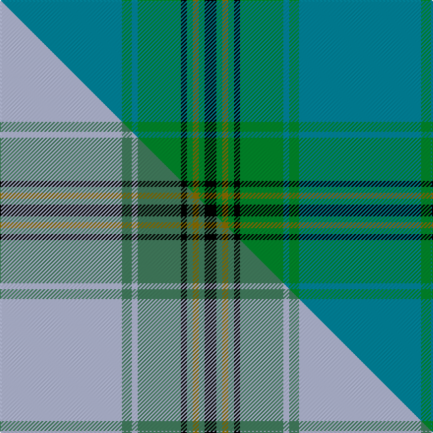

This is one **variant** — a specific cloth: this exact thread count and colourway, with its own
provenance below. It is one weaving of the [sett](/tartans/o/ol/oliver-hunting/) (the scale-free proportion — the
same cloth at any scale or shade), whose colour order is pattern [BGBGKGGGK](/stripes/bgbgkgggk/).

Part of the [Oliver Hunting](/tartans/o/ol/oliver-hunting/) tartan — the named design grouping this sett with its other cloths.

Sourced from tartans-authority.  It is a [9 stripe tartan](/stripes/stripes9/).

Original link <code>http://www.tartansauthority.com/tartan-ferret/display/126/</code> — retired · [Internet Archive copy](https://web.archive.org/web/*/http://www.tartansauthority.com/tartan-ferret/display/126/*)

Dataset <small>— provenance for this record, inherited from the source manifest</small>

<dl class="dataset-prov">
<dt>source</dt><dd><a href="/sources/tartans-authority/">Scottish Tartans Authority</a></dd>
<dt>data captured from</dt><dd><a href="https://github.com/thetartan/tartan-database/blob/master/data/tartans-authority/data.csv">https://github.com/thetartan/tartan-database/blob/master/data/tartans-authority/data.csv</a></dd>
<dt>data date</dt><dd>1973 <small>(this record)</small></dd>
<dt>licence</dt><dd><a href="https://creativecommons.org/licenses/by-nc-nd/4.0/">CC BY-NC-ND 4.0</a></dd>
</dl>

Capture chain <small>— the hands this data passed through, oldest first; each capture carries its own licence</small>

<ol class="capture-chain">
<li><a href="https://www.tartansauthority.com/">Scottish Tartans Authority</a> <small>the heritage body’s archive — its tartan-ferret record browser is retired; dead record links are shown unlinked, with an Internet Archive copy (ITI numbers are not SRT references)</small></li>
<li><a href="https://github.com/thetartan/tartan-database">thetartan/tartan-database</a> <small>2016-2017</small> · <a href="https://creativecommons.org/licenses/by-nc-nd/4.0/">CC BY-NC-ND 4.0</a> <small>Levko Kravets's frozen compilation — the capture we vendored, and where its CC licence text came from</small></li>
<li>this dictionary <small>captured 2026-06-10 · commit 5bf86c7566</small> <small>each re-capture is a git commit to data/sources</small></li>
</ol>

## Register references

External register numbers recorded for this tartan.

- Scottish Tartans Authority (ITI): 126

## Thread count
T/124 G10 T6 G44 K6 G6 Y6 G6 K/12

One full sett is **304 threads**.

## Palette
<table><thead><tr><th>Colour</th><th>Shade</th><th>OKLCh</th></tr></thead><tbody><tr><td>T</td><td><code style="background-color:#00879F;">#00879F</code> <small style="color:#888">#00879F</small></td><td><small style="color:#888">oklch(57.4% 0.102 216.1)</small></td></tr><tr><td>G</td><td><code style="background-color:#008B2A;">#008B2A</code> <small style="color:#888">#008B2A</small></td><td><small style="color:#888">oklch(55.4% 0.170 145.9)</small></td></tr><tr><td>K</td><td><code style="background-color:#000000;">#000000</code> <small style="color:#888">#000000</small></td><td><small style="color:#888">oklch(0.0% 0.000 0.0)</small></td></tr><tr><td>Y</td><td><code style="background-color:#8B6E00;">#8B6E00</code> <small style="color:#888">#8B6E00</small></td><td><small style="color:#888">oklch(55.1% 0.113 90.4)</small></td></tr></tbody></table>

# Sample pattern

## Compared to the master

This cloth is one sett of its design; the master sett (the exemplar the design is anchored on) is below for comparison.

Its **ΔTartan distance** from the master is **0.20** — the same measure the nearest-tartans table ranks by (0 is identical; a re-scale of the same cloth is near 0, a recolour or a different proportion further).

<figure class="master-compare" style="margin:0">

this sett
master sett ★

<figcaption style="color:#888;font-size:smaller">One weave of this sett against the <a href="/setts/lb62g5lb3g22k3g3y3g3k6/">master sett ★</a>, split on the diagonal: a shared proportion runs seamlessly across it with only the shades shifting; a different proportion breaks on it.</figcaption>
</figure>

## Nearest tartan variants

The nearest existing variants by ΔTartan distance, with this cloth at the top so the swatches line up against it.

ΔTartan

Threads

Variant

Sett

—

304

<a href="/variants/s9/t62g5t3g22k3g3y3g3k6~x2/">Oliver Hunting - 1973 (Clan)</a>

<a href="/ttd/edit/#slug=db40g3db2g12k2g2y2g2k3~x2&amp;base=t62g5t3g22k3g3y3g3k6~x2" title="compare in the TTD">0.34</a>

186

<a href="/variants/s9/db40g3db2g12k2g2y2g2k3~x2/">Oliver Hunting Family Tartan</a>

<a href="/ttd/edit/#slug=r2g6dy2g3t4g14t36k2t3w2~x2&amp;base=t62g5t3g22k3g3y3g3k6~x2" title="compare in the TTD">2.56</a>

288

<a href="/variants/s10/r2g6dy2g3t4g14t36k2t3w2~x2/">Sarasota - Dunfermline (Commemorat)</a>

<a href="/ttd/edit/#slug=db26g4db3g3y2g24r2~x2&amp;base=t62g5t3g22k3g3y3g3k6~x2" title="compare in the TTD">2.81</a>

200

<a href="/variants/s7/db26g4db3g3y2g24r2~x2/">St Andrews Links</a>

<a href="/ttd/edit/#slug=g13k2g34k6t16r2t16k2g13~x2&amp;base=t62g5t3g22k3g3y3g3k6~x2" title="compare in the TTD">2.88</a>

364

<a href="/variants/s9/g13k2g34k6t16r2t16k2g13~x2/">Lockhart</a>

<a href="/ttd/edit/#slug=db16g4db3g3y2g24r2~x2&amp;base=t62g5t3g22k3g3y3g3k6~x2" title="compare in the TTD">2.94</a>

180

<a href="/variants/s7/db16g4db3g3y2g24r2~x2/">St Andrews Links</a>

<a href="/ttd/edit/#slug=y3g2k1g30t24k2t2k2~x2&amp;base=t62g5t3g22k3g3y3g3k6~x2" title="compare in the TTD">2.98</a>

254

<a href="/variants/s8/y3g2k1g30t24k2t2k2~x2/">Johnston (Clan)</a>

<a href="/ttd/edit/#slug=y3g2k1g30t24k2t2k2~x2~t5211240&amp;base=t62g5t3g22k3g3y3g3k6~x2" title="compare in the TTD">3.00</a>

254

<a href="/variants/s8/y3g2k1g30t24k2t2k2~x2~t5211240/">Johnston/Johnstone</a>

<a href="/ttd/edit/#slug=k1t1k1t12g12k1g1ly1~x4~t5211240&amp;base=t62g5t3g22k3g3y3g3k6~x2" title="compare in the TTD">3.41</a>

232

<a href="/variants/s8/k1t1k1t12g12k1g1ly1~x4~t5211240/">Banff Centennial</a>

<a href="/ttd/edit/#slug=dy4g3r2g36t30k3t3k3~x2&amp;base=t62g5t3g22k3g3y3g3k6~x2" title="compare in the TTD">3.51</a>

322

<a href="/variants/s8/dy4g3r2g36t30k3t3k3~x2/">Chartered Accountants of Scotland</a>

<a href="/ttd/edit/#slug=db2g2k1g30db20r2db2r2~x2&amp;base=t62g5t3g22k3g3y3g3k6~x2" title="compare in the TTD">3.55</a>

236

<a href="/variants/s8/db2g2k1g30db20r2db2r2~x2/">Gretna Green Fashion Tartan</a>

## Neighbour map

Every grey dot is one of 13662 variants placed by the first two principal components of the ΔTartan feature space (42% of its variance). Red is this tartan; blue dots are its nearest — click one to open its page. The map is a flat projection of a many-dimensional space — [how to read it](/posts/neighbourhood-maps/).

<svg viewBox="0 0 640 380" role="img" style="max-width:100%;height:auto;border:1px solid #e0e0e0;border-radius:4px;display:block" xmlns="http://www.w3.org/2000/svg"><image href="/nn/cloud.v1.png" width="640" height="380"/><a href="/variants/s9/db40g3db2g12k2g2y2g2k3~x2/"><circle cx="372.1" cy="117.2" r="4" fill="#3465a4"><title>Oliver Hunting Family Tartan</title></circle></a><a href="/variants/s10/r2g6dy2g3t4g14t36k2t3w2~x2/"><circle cx="361.8" cy="129.2" r="4" fill="#3465a4"><title>Sarasota - Dunfermline (Commemorat)</title></circle></a><a href="/variants/s7/db26g4db3g3y2g24r2~x2/"><circle cx="320.8" cy="189.0" r="4" fill="#3465a4"><title>St Andrews Links</title></circle></a><a href="/variants/s9/g13k2g34k6t16r2t16k2g13~x2/"><circle cx="319.7" cy="180.8" r="4" fill="#3465a4"><title>Lockhart</title></circle></a><a href="/variants/s7/db16g4db3g3y2g24r2~x2/"><circle cx="349.7" cy="195.4" r="4" fill="#3465a4"><title>St Andrews Links</title></circle></a><a href="/variants/s8/y3g2k1g30t24k2t2k2~x2/"><circle cx="350.2" cy="143.8" r="4" fill="#3465a4"><title>Johnston (Clan)</title></circle></a><a href="/variants/s8/y3g2k1g30t24k2t2k2~x2~t5211240/"><circle cx="346.9" cy="122.5" r="4" fill="#3465a4"><title>Johnston/Johnstone</title></circle></a><a href="/variants/s8/k1t1k1t12g12k1g1ly1~x4~t5211240/"><circle cx="266.7" cy="167.1" r="4" fill="#3465a4"><title>Banff Centennial</title></circle></a><a href="/variants/s8/dy4g3r2g36t30k3t3k3~x2/"><circle cx="290.3" cy="148.7" r="4" fill="#3465a4"><title>Chartered Accountants of Scotland</title></circle></a><a href="/variants/s8/db2g2k1g30db20r2db2r2~x2/"><circle cx="336.2" cy="120.9" r="4" fill="#3465a4"><title>Gretna Green Fashion Tartan</title></circle></a><circle cx="384.9" cy="137.1" r="5" fill="#c00000"/><text x="320" y="376" text-anchor="middle" font-size="11" fill="#999">ground</text><text x="11" y="190" text-anchor="middle" font-size="11" fill="#999" transform="rotate(-90 11 190)">complexity</text></svg>

ID: /variants/s9/t62g5t3g22k3g3y3g3k6~x2/
