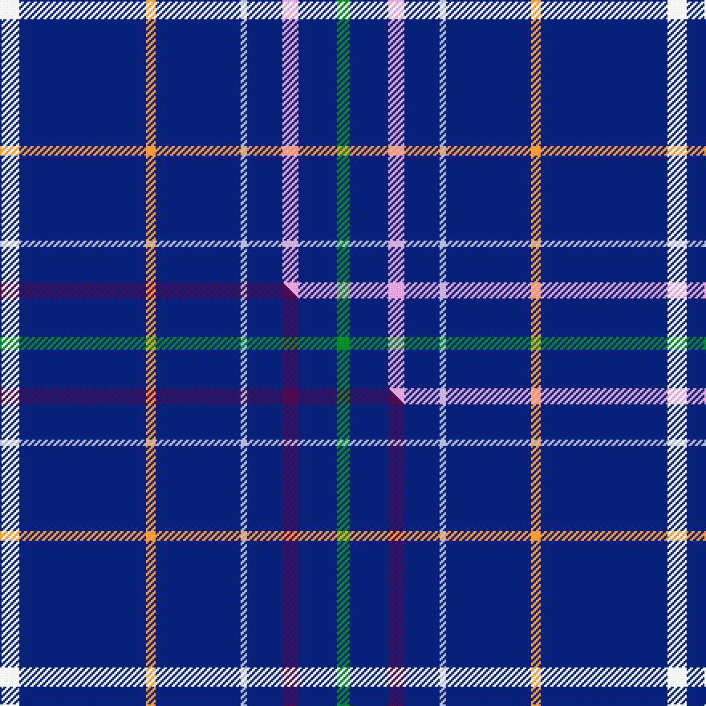

This is one **variant** — a specific cloth: this exact thread count and colourway, with its own
provenance below. It is one weaving of the [sett](/setts/w12db79lo6db53lb4db22lp10db24g8/) (the scale-free proportion — the
same cloth at any scale or shade), whose colour order is pattern [GBWBWBYBW](/stripes/gbwbwbybw/).

Part of the [Centrica Energy](/tartans/c/ce/centrica-energy/) tartan — the named design grouping this sett with its other cloths.

Sourced from tartans-authority.  It is a [9 stripe tartan](/stripes/stripes9/).

Original link [https://www.tartanregister.gov.uk/tartanDetails.aspx?ref=10196](https://www.tartanregister.gov.uk/tartanDetails.aspx?ref=10196)

Dataset <small>— provenance for this record, inherited from the source manifest</small>

<dl class="dataset-prov">
<dt>source</dt><dd><a href="/sources/tartans-authority/">Scottish Tartans Authority</a></dd>
<dt>data captured from</dt><dd><a href="https://github.com/thetartan/tartan-database/blob/master/data/tartans-authority/data.csv">https://github.com/thetartan/tartan-database/blob/master/data/tartans-authority/data.csv</a></dd>
<dt>data date</dt><dd>19th Apr. 2010 <small>(this record)</small></dd>
<dt>licence</dt><dd><a href="https://creativecommons.org/licenses/by-nc-nd/4.0/">CC BY-NC-ND 4.0</a></dd>
</dl>

Capture chain <small>— the hands this data passed through, oldest first; each capture carries its own licence</small>

<ol class="capture-chain">
<li><a href="https://www.tartansauthority.com/">Scottish Tartans Authority</a> <small>the heritage body's archive — its tartan-ferret record browser is retired (links repaired to the SRT, above)</small></li>
<li><a href="https://github.com/thetartan/tartan-database">thetartan/tartan-database</a> <small>2016-2017</small> · <a href="https://creativecommons.org/licenses/by-nc-nd/4.0/">CC BY-NC-ND 4.0</a> <small>Levko Kravets's frozen compilation — the capture we vendored, and where its CC licence text came from</small></li>
<li>this dictionary <small>captured 2026-06-10 · commit 5bf86c7566</small> <small>each re-capture is a git commit to data/sources</small></li>
</ol>

## Register references

External register numbers recorded for this tartan.

- Scottish Register of Tartans: [10196](https://www.tartanregister.gov.uk/tartanDetails?ref=10196)
- Scottish Tartans Authority (ITI): 10196

## Thread count
W/12 DB79 LO6 DB53 LB4 DB22 LP10 DB24 G/8

One full sett is **416 threads**.

## Palette
<table><thead><tr><th>Colour</th><th>Shade</th><th>OKLCh</th></tr></thead><tbody><tr><td>DB</td><td><code style="background-color:#082077;">#082077</code> <small style="color:#888">#082077</small></td><td><small style="color:#888">oklch(30.0% 0.149 265.1)</small></td></tr><tr><td>G</td><td><code style="background-color:#008B2A;">#008B2A</code> <small style="color:#888">#008B2A</small></td><td><small style="color:#888">oklch(55.4% 0.170 145.9)</small></td></tr><tr><td>LB</td><td><code style="background-color:#B5BBDE;">#B5BBDE</code> <small style="color:#888">#B5BBDE</small></td><td><small style="color:#888">oklch(79.9% 0.050 277.6)</small></td></tr><tr><td>W</td><td><code style="background-color:#F7F7F7;">#F7F7F7</code> <small style="color:#888">#F7F7F7</small></td><td><small style="color:#888">oklch(97.6% 0.000 89.9)</small></td></tr><tr><td>LP</td><td><code style="background-color:#E4A6DB;">#E4A6DB</code> <small style="color:#888">#E4A6DB</small></td><td><small style="color:#888">oklch(80.0% 0.100 331.6)</small></td></tr><tr><td>LO</td><td><code style="background-color:#FF9C34;">#FF9C34</code> <small style="color:#888">#FF9C34</small></td><td><small style="color:#888">oklch(77.9% 0.161 61.8)</small></td></tr></tbody></table>

# Sample pattern

## Compared to the master

This cloth is one sett of its design; the master sett (the exemplar the design is anchored on) is below for comparison.

Its **ΔTartan distance** from the master is **0.05** — the same measure the nearest-tartans table ranks by (0 is identical; a re-scale of the same cloth is near 0, a recolour or a different proportion further).

<figure class="master-compare" style="margin:0">

this sett
master sett ★

<figcaption style="color:#888;font-size:smaller">One weave of this sett against the <a href="/setts/w12db79lo6db53lb4db22dp10db24g8/">master sett ★</a>, split on the diagonal: a shared proportion runs seamlessly across it with only the shades shifting; a different proportion breaks on it.</figcaption>
</figure>

## Nearest tartan variants

The nearest existing variants by ΔTartan distance, with this cloth at the top so the swatches line up against it.

ΔTartan

Threads

Variant

Sett

—

416

<a href="/variants/s9/w12db79lo6db53lb4db22lp10db24g8/">Centrica Energy (Corporate)</a>

<a href="/ttd/edit/#slug=w12db79lo6db53lb4db22dp10db24g8&amp;base=w12db79lo6db53lb4db22lp10db24g8" title="compare in the TTD">0.05</a>

416

<a href="/variants/s9/w12db79lo6db53lb4db22dp10db24g8/">Centrica Energy</a>

<a href="/ttd/edit/#slug=k32lo4db12k2db4k2db2n16k67lo6~k0705267-db1404245&amp;base=w12db79lo6db53lb4db22lp10db24g8" title="compare in the TTD">1.40</a>

256

<a href="/variants/s10/db32lo4dbi12db2dbi4db2dbi2n16db67lo6~db0705267-dbi1404245/">Calum's Cabin</a>

<a href="/ttd/edit/#slug=r5db20r3db20w6db3lb2db1~x2&amp;base=w12db79lo6db53lb4db22lp10db24g8" title="compare in the TTD">1.75</a>

228

<a href="/variants/s8/r5db20r3db20w6db3lb2db1~x2/">Masai Shuka 29 (Artefact)</a>

<a href="/ttd/edit/#slug=db73g16db10r8db10k4db10w2~x2&amp;base=w12db79lo6db53lb4db22lp10db24g8" title="compare in the TTD">1.75</a>

382

<a href="/variants/s8/db73g16db10r8db10k4db10w2~x2/">Scotch Whisky Heritage Centre</a>

<a href="/ttd/edit/#slug=db73g16db10r8db10k4db10w2&amp;base=w12db79lo6db53lb4db22lp10db24g8" title="compare in the TTD">1.75</a>

191

<a href="/variants/s8/db73g16db10r8db10k4db10w2/">Scotch Whisky Heritage Corporate Tartan</a>

<a href="/ttd/edit/#slug=g8db13w1db40r5db40w1db13g8k4~x2&amp;base=w12db79lo6db53lb4db22lp10db24g8" title="compare in the TTD">1.75</a>

508

<a href="/variants/s10/g8db13w1db40r5db40w1db13g8k4~x2/">London Scottish Rugby Club Corporate Sport Tartan</a>

<a href="/ttd/edit/#slug=db48w2db7w2db7w2db20lb11r2~x2&amp;base=w12db79lo6db53lb4db22lp10db24g8" title="compare in the TTD">1.77</a>

304

<a href="/variants/s9/db48w2db7w2db7w2db20lb11r2~x2/">RAAF #4</a>

<a href="/ttd/edit/#slug=db42w5db1w1y9db1dg2w1db1r1~x4&amp;base=w12db79lo6db53lb4db22lp10db24g8" title="compare in the TTD">1.78</a>

340

<a href="/variants/s10/db42w5db1w1y9db1dg2w1db1r1~x4/">Stratford (Ontario), City of</a>

<a href="/ttd/edit/#slug=db30r3db3y3db3g30db36w5~x2&amp;base=w12db79lo6db53lb4db22lp10db24g8" title="compare in the TTD">1.92</a>

382

<a href="/variants/s8/db30r3db3y3db3g30db36w5~x2/">De Nardi Hunting (Personal)</a>

<a href="/ttd/edit/#slug=r2db8dy1db16w1g12db27w1db1w1~x2&amp;base=w12db79lo6db53lb4db22lp10db24g8" title="compare in the TTD">1.93</a>

274

<a href="/variants/s10/r2db8dy1db16w1g12db27w1db1w1~x2/">World Youth Congress (Corporate)</a>

## Neighbour map

Every grey dot is one of 13621 variants placed by the first two principal components of the ΔTartan feature space (42% of its variance). Red is this tartan; blue dots are its nearest — click one to open its page. The map is a flat projection of a many-dimensional space — [how to read it](/posts/neighbourhood-maps/).

<svg viewBox="0 0 640 380" role="img" style="max-width:100%;height:auto;border:1px solid #e0e0e0;border-radius:4px;display:block" xmlns="http://www.w3.org/2000/svg"><image href="/nn/cloud.v1.png" width="640" height="380"/><a href="/variants/s9/w12db79lo6db53lb4db22dp10db24g8/"><circle cx="487.1" cy="143.5" r="4" fill="#3465a4"><title>Centrica Energy</title></circle></a><a href="/variants/s10/db32lo4dbi12db2dbi4db2dbi2n16db67lo6~db0705267-dbi1404245/"><circle cx="501.3" cy="147.0" r="4" fill="#3465a4"><title>Calum's Cabin</title></circle></a><a href="/variants/s8/r5db20r3db20w6db3lb2db1~x2/"><circle cx="417.0" cy="153.4" r="4" fill="#3465a4"><title>Masai Shuka 29 (Artefact)</title></circle></a><a href="/variants/s8/db73g16db10r8db10k4db10w2~x2/"><circle cx="481.1" cy="97.1" r="4" fill="#3465a4"><title>Scotch Whisky Heritage Centre</title></circle></a><a href="/variants/s8/db73g16db10r8db10k4db10w2/"><circle cx="481.1" cy="97.1" r="4" fill="#3465a4"><title>Scotch Whisky Heritage Corporate Tartan</title></circle></a><a href="/variants/s10/g8db13w1db40r5db40w1db13g8k4~x2/"><circle cx="487.7" cy="101.2" r="4" fill="#3465a4"><title>London Scottish Rugby Club Corporate Sport Tartan</title></circle></a><a href="/variants/s9/db48w2db7w2db7w2db20lb11r2~x2/"><circle cx="505.7" cy="128.9" r="4" fill="#3465a4"><title>RAAF #4</title></circle></a><a href="/variants/s10/db42w5db1w1y9db1dg2w1db1r1~x4/"><circle cx="436.2" cy="63.5" r="4" fill="#3465a4"><title>Stratford (Ontario), City of</title></circle></a><a href="/variants/s8/db30r3db3y3db3g30db36w5~x2/"><circle cx="340.5" cy="171.8" r="4" fill="#3465a4"><title>De Nardi Hunting (Personal)</title></circle></a><a href="/variants/s10/r2db8dy1db16w1g12db27w1db1w1~x2/"><circle cx="447.5" cy="117.4" r="4" fill="#3465a4"><title>World Youth Congress (Corporate)</title></circle></a><circle cx="475.9" cy="140.6" r="5" fill="#c00000"/><text x="320" y="376" text-anchor="middle" font-size="11" fill="#999">ground</text><text x="11" y="190" text-anchor="middle" font-size="11" fill="#999" transform="rotate(-90 11 190)">complexity</text></svg>

ID: /variants/s9/w12db79lo6db53lb4db22lp10db24g8/
