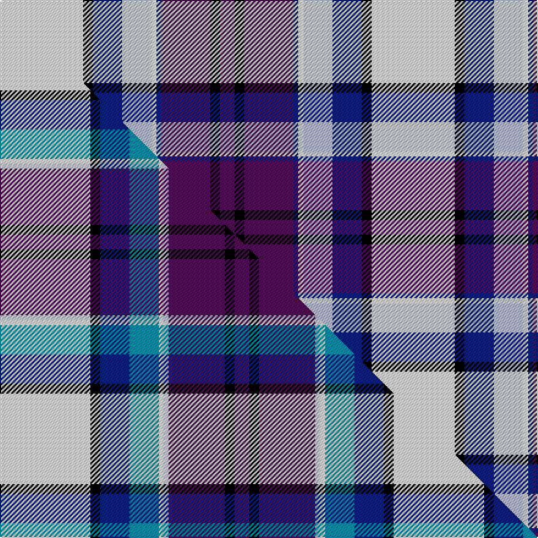

This is one **variant** — a specific cloth: this exact thread count and colourway, with its own
provenance below. It is one weaving of the [sett](/setts/w17k2db6lb6w1db1dp10k2dp3/) (the scale-free proportion — the
same cloth at any scale or shade), whose colour order is pattern [BKBBWWBKW](/stripes/bkbbwwbkw/).

Part of the [Hebridean Arisaid](/tartans/h/he/hebridean-arisaid/) tartan — the named design grouping this sett with its other cloths.

Sourced from house-of-tartan.  It is a [9 stripe tartan](/stripes/stripes9/).

Original link [http://www.house-of-tartan.scotland.net/house/TartanViewjs.asp?colr=Def&tnam=6558](http://www.house-of-tartan.scotland.net/house/TartanViewjs.asp?colr=Def&tnam=6558)

## Provenance

Earliest known date: 01/01/2005 Threadcount and colours aren't 100% original. Generated manually.

Dataset <small>— provenance for this record, inherited from the source manifest</small>

<dl class="dataset-prov">
<dt>source</dt><dd><a href="/sources/house-of-tartan/">House of Tartan</a></dd>
<dt>data captured from</dt><dd><a href="https://github.com/thetartan/tartan-database/blob/master/data/house-of-tartan/data.csv">https://github.com/thetartan/tartan-database/blob/master/data/house-of-tartan/data.csv</a></dd>
<dt>data date</dt><dd>01/01/2005 <small>(this record)</small></dd>
<dt>licence</dt><dd><a href="https://creativecommons.org/licenses/by-nc-nd/4.0/">CC BY-NC-ND 4.0</a></dd>
</dl>

Capture chain <small>— the hands this data passed through, oldest first; each capture carries its own licence</small>

<ol class="capture-chain">
<li><a href="http://www.house-of-tartan.scotland.net/">House of Tartan</a> <small>the weaver/retailer's database — the site is now offline; the URL is kept as the ultimate source's identity</small></li>
<li><a href="https://github.com/thetartan/tartan-database">thetartan/tartan-database</a> <small>2016-2017</small> · <a href="https://creativecommons.org/licenses/by-nc-nd/4.0/">CC BY-NC-ND 4.0</a> <small>Levko Kravets's frozen compilation — the capture we vendored, and where its CC licence text came from</small></li>
<li>this dictionary <small>captured 2026-06-10 · commit 5bf86c7566</small> <small>each re-capture is a git commit to data/sources</small></li>
</ol>

## Thread count
W/68 K8 DB24 LB24 W4 DB4 DP40 K8 DP/12

One full sett is **304 threads**.

## Palette
<table><thead><tr><th>Colour</th><th>Shade</th><th>OKLCh</th></tr></thead><tbody><tr><td>LB</td><td><code style="background-color:#B5BBDE;">#B5BBDE</code> <small style="color:#888">#B5BBDE</small></td><td><small style="color:#888">oklch(79.9% 0.050 277.6)</small></td></tr><tr><td>DB</td><td><code style="background-color:#082077;">#082077</code> <small style="color:#888">#082077</small></td><td><small style="color:#888">oklch(30.0% 0.149 265.1)</small></td></tr><tr><td>K</td><td><code style="background-color:#000000;">#000000</code> <small style="color:#888">#000000</small></td><td><small style="color:#888">oklch(0.0% 0.000 0.0)</small></td></tr><tr><td>W</td><td><code style="background-color:#F7F7F7;">#F7F7F7</code> <small style="color:#888">#F7F7F7</small></td><td><small style="color:#888">oklch(97.6% 0.000 89.9)</small></td></tr><tr><td>DP</td><td><code style="background-color:#4B0B4F;">#4B0B4F</code> <small style="color:#888">#4B0B4F</small></td><td><small style="color:#888">oklch(30.1% 0.125 325.4)</small></td></tr></tbody></table>

# Sample pattern

## Compared to the master

This cloth is one sett of its design; the master sett (the exemplar the design is anchored on) is below for comparison.

Its **ΔTartan distance** from the master is **0.44** — the same measure the nearest-tartans table ranks by (0 is identical; a re-scale of the same cloth is near 0, a recolour or a different proportion further).

<figure class="master-compare" style="margin:0">

this sett
master sett ★

<figcaption style="color:#888;font-size:smaller">One weave of this sett against the <a href="/setts/w37k4db12t12w2lb2dp23k4dp6/">master sett ★</a>, split on the diagonal: a shared proportion runs seamlessly across it with only the shades shifting; a different proportion breaks on it.</figcaption>
</figure>

## Nearest tartan variants

The nearest existing variants by ΔTartan distance, with this cloth at the top so the swatches line up against it.

ΔTartan

Threads

Variant

Sett

—

304

<a href="/variants/s9/w17k2db6lb6w1db1dp10k2dp3~x4/">Hebridean Arisaid Blue (Dance) Fashion Tartan</a>

<a href="/ttd/edit/#slug=db48r10w2r10g17k3w17k3w34~x2&amp;base=w17k2db6lb6w1db1dp10k2dp3~x4" title="compare in the TTD">1.90</a>

412

<a href="/variants/s9/db48r10w2r10g17k3w17k3w34~x2/">Unidentified #43</a>

<a href="/ttd/edit/#slug=db8r3db34b3k9w31r5w3r3w8~x2&amp;base=w17k2db6lb6w1db1dp10k2dp3~x4" title="compare in the TTD">2.16</a>

396

<a href="/variants/s10/db8r3db34b3k9w31r5w3r3w8~x2/">Stewart of Appin, dress</a>

<a href="/ttd/edit/#slug=r2db14k6g1w12g1w2~x4&amp;base=w17k2db6lb6w1db1dp10k2dp3~x4" title="compare in the TTD">2.23</a>

288

<a href="/variants/s7/r2db14k6g1w12g1w2~x4/">Davidson (Wedding) (Personal)</a>

<a href="/ttd/edit/#slug=db8r3db34lb3k9w31r5w3r3w8&amp;base=w17k2db6lb6w1db1dp10k2dp3~x4" title="compare in the TTD">2.24</a>

198

<a href="/variants/s10/db8r3db34lb3k9w31r5w3r3w8/">Stuart/Stewart of Appin Dress</a>

<a href="/ttd/edit/#slug=db8r3db34lb3k9w31r5w3r3w8~x2&amp;base=w17k2db6lb6w1db1dp10k2dp3~x4" title="compare in the TTD">2.24</a>

396

<a href="/variants/s10/db8r3db34lb3k9w31r5w3r3w8~x2/">Stewart of Appin Dress Clan Tartan</a>

<a href="/ttd/edit/#slug=w6dg2w27k10db4k4db4k4db15r2db2r4~x2&amp;base=w17k2db6lb6w1db1dp10k2dp3~x4" title="compare in the TTD">2.27</a>

316

<a href="/variants/s12/w6dg2w27k10db4k4db4k4db15r2db2r4~x2/">Sutherland Dress, Old (Dance)</a>

<a href="/ttd/edit/#slug=lb12k1lb1k1lb1db8w9n2~x4&amp;base=w17k2db6lb6w1db1dp10k2dp3~x4" title="compare in the TTD">2.40</a>

224

<a href="/variants/s8/lb12k1lb1k1lb1db8w9n2~x4/">Arran - 1989 (Fashion)</a>

<a href="/ttd/edit/#slug=w5g2w23k7db4k3db3k3db11r2db2r3~x2&amp;base=w17k2db6lb6w1db1dp10k2dp3~x4" title="compare in the TTD">2.48</a>

256

<a href="/variants/s12/w5g2w23k7db4k3db3k3db11r2db2r3~x2/">Sutherland, Dress</a>

<a href="/ttd/edit/#slug=w4k2w30g3dp3g3dp7db14g3r3~x2&amp;base=w17k2db6lb6w1db1dp10k2dp3~x4" title="compare in the TTD">2.64</a>

274

<a href="/variants/s10/w4k2w30g3dp3g3dp7db14g3r3~x2/">Edinburgh Dress (Dance)</a>

<a href="/ttd/edit/#slug=db15ly30w30k20w20k15w10ly4db94w4r10&amp;base=w17k2db6lb6w1db1dp10k2dp3~x4" title="compare in the TTD">2.67</a>

479

<a href="/variants/s11/db15ly30w30k20w20k15w10ly4db94w4r10/">Ar Lenn Vor</a>

## Neighbour map

Every grey dot is one of 13621 variants placed by the first two principal components of the ΔTartan feature space (42% of its variance). Red is this tartan; blue dots are its nearest — click one to open its page.

<svg viewBox="0 0 640 380" role="img" style="max-width:100%;height:auto;border:1px solid #e0e0e0;border-radius:4px;display:block" xmlns="http://www.w3.org/2000/svg"><image href="/nn/cloud.v1.png" width="640" height="380"/><a href="/variants/s9/db48r10w2r10g17k3w17k3w34~x2/"><circle cx="144.8" cy="121.8" r="4" fill="#3465a4"><title>Unidentified #43</title></circle></a><a href="/variants/s10/db8r3db34b3k9w31r5w3r3w8~x2/"><circle cx="150.8" cy="136.6" r="4" fill="#3465a4"><title>Stewart of Appin, dress</title></circle></a><a href="/variants/s7/r2db14k6g1w12g1w2~x4/"><circle cx="137.8" cy="150.1" r="4" fill="#3465a4"><title>Davidson (Wedding) (Personal)</title></circle></a><a href="/variants/s10/db8r3db34lb3k9w31r5w3r3w8/"><circle cx="156.6" cy="140.5" r="4" fill="#3465a4"><title>Stuart/Stewart of Appin Dress</title></circle></a><a href="/variants/s10/db8r3db34lb3k9w31r5w3r3w8~x2/"><circle cx="156.6" cy="140.5" r="4" fill="#3465a4"><title>Stewart of Appin Dress Clan Tartan</title></circle></a><a href="/variants/s12/w6dg2w27k10db4k4db4k4db15r2db2r4~x2/"><circle cx="132.2" cy="123.1" r="4" fill="#3465a4"><title>Sutherland Dress, Old (Dance)</title></circle></a><a href="/variants/s8/lb12k1lb1k1lb1db8w9n2~x4/"><circle cx="157.7" cy="158.3" r="4" fill="#3465a4"><title>Arran - 1989 (Fashion)</title></circle></a><a href="/variants/s12/w5g2w23k7db4k3db3k3db11r2db2r3~x2/"><circle cx="135.4" cy="127.9" r="4" fill="#3465a4"><title>Sutherland, Dress</title></circle></a><a href="/variants/s10/w4k2w30g3dp3g3dp7db14g3r3~x2/"><circle cx="169.9" cy="109.8" r="4" fill="#3465a4"><title>Edinburgh Dress (Dance)</title></circle></a><a href="/variants/s11/db15ly30w30k20w20k15w10ly4db94w4r10/"><circle cx="174.2" cy="108.6" r="4" fill="#3465a4"><title>Ar Lenn Vor</title></circle></a><circle cx="132.6" cy="133.6" r="5" fill="#c00000"/><text x="320" y="376" text-anchor="middle" font-size="11" fill="#999">ground</text><text x="11" y="190" text-anchor="middle" font-size="11" fill="#999" transform="rotate(-90 11 190)">complexity</text></svg>

ID: /variants/s9/w17k2db6lb6w1db1dp10k2dp3~x4/
