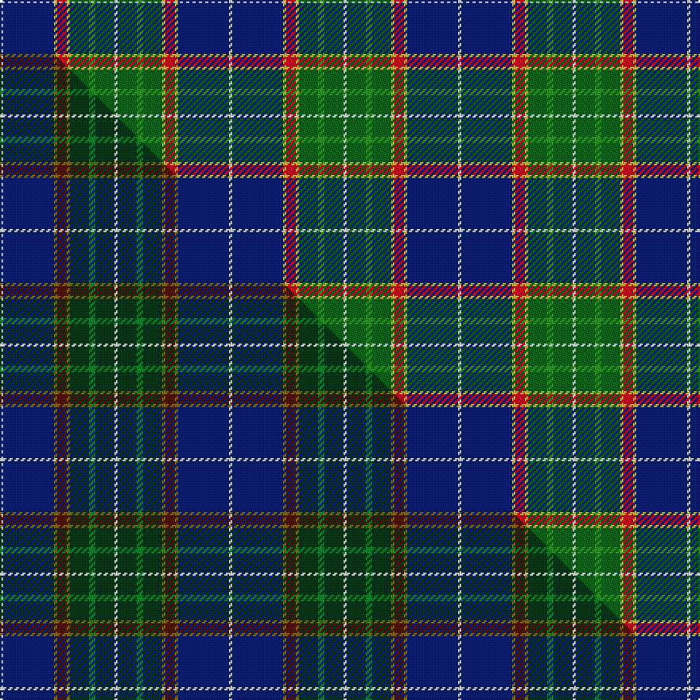

This page is one **sett** — a single exact thread-count. It belongs to the [tartan](/setts/w1db16ly1r3ly1dg6g2dg6w1/)
(the same proportion at any scale), whose colour order is pattern [WBYRYGGGW](/stripes/wbyrygggw/).

Part of the [Kleto, Susan](/tartans/kleto-susan/) tartan — the named design grouping this sett with its other cloths.

Sourced from tartans-authority.  It is a [9 stripe tartan](/stripes/stripes9/).

Original link http://www.tartansauthority.com/tartan-ferret/display/11172/

## Register references

External register numbers recorded for this tartan.

- Scottish Register of Tartans: [11172](https://www.tartanregister.gov.uk/tartanDetails?ref=11172)
- Scottish Tartans Authority (ITI): 11172

## Thread count
W/2 DB32 LY2 R6 LY2 DG12 G4 DG12 W/2

One full sett is **144 threads**.

## Palette
<table><thead><tr><th>Colour</th><th>Shade</th><th>OKLCh</th></tr></thead><tbody><tr><td>DB</td><td><code style="background-color:#082077;">#082077</code> <small style="color:#888">#082077</small></td><td><small style="color:#888">oklch(30.0% 0.149 265.1)</small></td></tr><tr><td>R</td><td><code style="background-color:#D60020;">#D60020</code> <small style="color:#888">#D60020</small></td><td><small style="color:#888">oklch(55.2% 0.224 25.5)</small></td></tr><tr><td>DG</td><td><code style="background-color:#006818;">#006818</code> <small style="color:#888">#006818</small></td><td><small style="color:#888">oklch(45.0% 0.142 145.0)</small></td></tr><tr><td>G</td><td><code style="background-color:#289C18;">#289C18</code> <small style="color:#888">#289C18</small></td><td><small style="color:#888">oklch(60.6% 0.191 141.6)</small></td></tr><tr><td>W</td><td><code style="background-color:#F7F7F7;">#F7F7F7</code> <small style="color:#888">#F7F7F7</small></td><td><small style="color:#888">oklch(97.6% 0.000 89.9)</small></td></tr><tr><td>LY</td><td><code style="background-color:#DCBC32;">#DCBC32</code> <small style="color:#888">#DCBC32</small></td><td><small style="color:#888">oklch(80.0% 0.150 95.2)</small></td></tr></tbody></table>

# Sample pattern

## Compared to the master

This cloth is one sett of its design; the master sett (the exemplar the design is anchored on) is below for comparison.

Its **ΔTartan distance** from the master is **1.48** — the same measure the nearest-tartans table ranks by (0 is identical; a re-scale of the same cloth is near 0, a recolour or a different proportion further).

<figure class="master-compare" style="margin:0">

this sett
master sett ★

<figcaption style="color:#888;font-size:smaller">One weave of this sett against the <a href="/setts/w1db16y1dr3y1dg6g2dg6w1/">master sett ★</a>, split on the diagonal: a shared proportion runs seamlessly across it with only the shades shifting; a different proportion breaks on it.</figcaption>
</figure>

## Nearest tartan variants

The nearest existing variants by ΔTartan distance, with this cloth at the top so the swatches line up against it.

ΔTartan

Threads

Variant

Sett

—

144

<a href="/variants/s9/w1db16ly1r3ly1dg6g2dg6w1~x2~dg1806142-g2408144/">Kleto, Susan (Personal)</a>

<a href="/ttd/edit/#slug=w2db20dg2g2dg2g4dg8y2r1~x2~dg1806142-g2408144&amp;base=w1db16ly1r3ly1dg6g2dg6w1~x2~dg1806142-g2408144" title="compare in the TTD">2.14</a>

166

<a href="/variants/s9/w2db20dg2g2dg2g4dg8y2r1~x2~dg1806142-g2408144/">Nova Scotia (Province)</a>

<a href="/ttd/edit/#slug=w2db20dg2g2dg2g4dg8y2r1~x2&amp;base=w1db16ly1r3ly1dg6g2dg6w1~x2~dg1806142-g2408144" title="compare in the TTD">2.14</a>

166

<a href="/variants/s9/w2db20dg2g2dg2g4dg8y2r1~x2/">Nova Scotia Canadian District Tartan</a>

<a href="/ttd/edit/#slug=r6db27lb2g2lb2g30w4~x2&amp;base=w1db16ly1r3ly1dg6g2dg6w1~x2~dg1806142-g2408144" title="compare in the TTD">2.22</a>

272

<a href="/variants/s7/r6db27lb2g2lb2g30w4~x2/">MX-5 Owners' Club</a>

<a href="/ttd/edit/#slug=db2r1db10w1dy4g8y1g2~x4&amp;base=w1db16ly1r3ly1dg6g2dg6w1~x2~dg1806142-g2408144" title="compare in the TTD">2.42</a>

216

<a href="/variants/s8/db2r1db10w1dy4g8y1g2~x4/">Ayrshire District Tartan</a>

<a href="/ttd/edit/#slug=db2r1db10w1o4g8y1g2~x4&amp;base=w1db16ly1r3ly1dg6g2dg6w1~x2~dg1806142-g2408144" title="compare in the TTD">2.42</a>

216

<a href="/variants/s8/db2r1db10w1o4g8y1g2~x4/">Ayrshire</a>

<a href="/ttd/edit/#slug=db2dr1db10w1dy4g8ly1g2~x4&amp;base=w1db16ly1r3ly1dg6g2dg6w1~x2~dg1806142-g2408144" title="compare in the TTD">2.42</a>

216

<a href="/variants/s8/db2dr1db10w1dy4g8ly1g2~x4/">Ayrshire (District)</a>

<a href="/ttd/edit/#slug=db30r2db4w1o11g4y2g22~x2&amp;base=w1db16ly1r3ly1dg6g2dg6w1~x2~dg1806142-g2408144" title="compare in the TTD">2.47</a>

200

<a href="/variants/s8/db30r2db4w1o11g4y2g22~x2/">Yorkland</a>

<a href="/ttd/edit/#slug=ly5db30w3g15y8r4~x2&amp;base=w1db16ly1r3ly1dg6g2dg6w1~x2~dg1806142-g2408144" title="compare in the TTD">2.51</a>

242

<a href="/variants/s6/ly5db30w3g15y8r4~x2/">Carleton College Rugby</a>

<a href="/ttd/edit/#slug=db3r3db36g17y2g21w2r3~x2&amp;base=w1db16ly1r3ly1dg6g2dg6w1~x2~dg1806142-g2408144" title="compare in the TTD">2.61</a>

336

<a href="/variants/s8/db3r3db36g17y2g21w2r3~x2/">Singh</a>

<a href="/ttd/edit/#slug=r5w1db10g10w1y1g2lb2w1~x2&amp;base=w1db16ly1r3ly1dg6g2dg6w1~x2~dg1806142-g2408144" title="compare in the TTD">2.80</a>

120

<a href="/variants/s9/r5w1db10g10w1y1g2lb2w1~x2/">Mary, Queen of Scots</a>

## Neighbour map

Every grey dot is one of 13620 variants placed by the first two principal components of the ΔTartan feature space (42% of its variance). Red is this tartan; blue dots are its nearest — click one to open its page.

<svg viewBox="0 0 640 380" role="img" style="max-width:100%;height:auto;border:1px solid #e0e0e0;border-radius:4px;display:block" xmlns="http://www.w3.org/2000/svg"><image href="/nn/cloud.v1.png" width="640" height="380"/><a href="/variants/s9/w2db20dg2g2dg2g4dg8y2r1~x2~dg1806142-g2408144/"><circle cx="242.4" cy="126.7" r="4" fill="#3465a4"><title>Nova Scotia (Province)</title></circle></a><a href="/variants/s9/w2db20dg2g2dg2g4dg8y2r1~x2/"><circle cx="253.8" cy="128.6" r="4" fill="#3465a4"><title>Nova Scotia Canadian District Tartan</title></circle></a><a href="/variants/s7/r6db27lb2g2lb2g30w4~x2/"><circle cx="240.6" cy="164.6" r="4" fill="#3465a4"><title>MX-5 Owners' Club</title></circle></a><a href="/variants/s8/db2r1db10w1dy4g8y1g2~x4/"><circle cx="196.1" cy="180.1" r="4" fill="#3465a4"><title>Ayrshire District Tartan</title></circle></a><a href="/variants/s8/db2r1db10w1o4g8y1g2~x4/"><circle cx="190.9" cy="176.6" r="4" fill="#3465a4"><title>Ayrshire</title></circle></a><a href="/variants/s8/db2dr1db10w1dy4g8ly1g2~x4/"><circle cx="209.5" cy="191.1" r="4" fill="#3465a4"><title>Ayrshire (District)</title></circle></a><a href="/variants/s8/db30r2db4w1o11g4y2g22~x2/"><circle cx="261.2" cy="126.0" r="4" fill="#3465a4"><title>Yorkland</title></circle></a><a href="/variants/s6/ly5db30w3g15y8r4~x2/"><circle cx="188.3" cy="183.1" r="4" fill="#3465a4"><title>Carleton College Rugby</title></circle></a><a href="/variants/s8/db3r3db36g17y2g21w2r3~x2/"><circle cx="275.2" cy="156.8" r="4" fill="#3465a4"><title>Singh</title></circle></a><a href="/variants/s9/r5w1db10g10w1y1g2lb2w1~x2/"><circle cx="150.6" cy="166.9" r="4" fill="#3465a4"><title>Mary, Queen of Scots</title></circle></a><circle cx="213.8" cy="138.6" r="5" fill="#c00000"/><text x="320" y="376" text-anchor="middle" font-size="11" fill="#999">ground</text><text x="11" y="190" text-anchor="middle" font-size="11" fill="#999" transform="rotate(-90 11 190)">complexity</text></svg>

ID: /variants/s9/w1db16ly1r3ly1dg6g2dg6w1~x2~dg1806142-g2408144/
