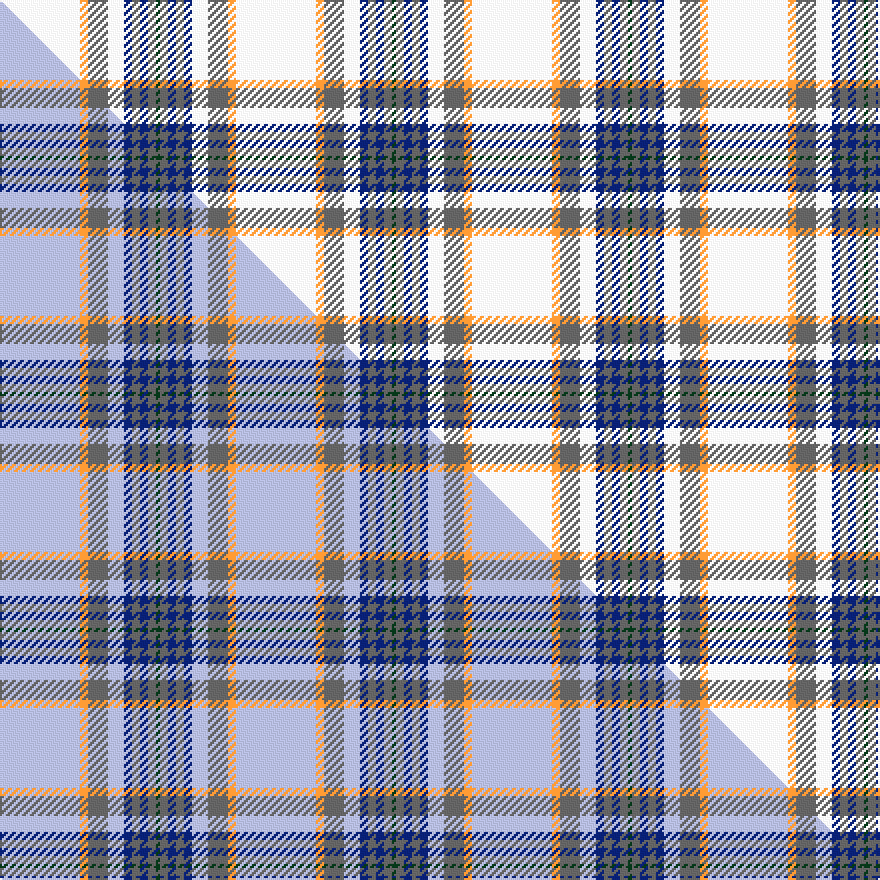

This is one **variant** — a specific cloth: this exact thread count and colourway, with its own
provenance below. It is one weaving of the [sett](/tartans/b/bo/boucherville-dress/) (the scale-free proportion — the
same cloth at any scale or shade), whose colour order is pattern [GBBBBWBYW](/stripes/gbbbbwbyw/).

Part of the [Boucherville Dress](/tartans/b/bo/boucherville-dress/) tartan — the named design grouping this sett with its other cloths.

Sourced from tartans-authority.  It is a [9 stripe tartan](/stripes/stripes9/).

Original link <code>http://www.tartansauthority.com/tartan-ferret/display/2118/</code> — retired · [Internet Archive copy](https://web.archive.org/web/*/http://www.tartansauthority.com/tartan-ferret/display/2118/*)

Dataset <small>— provenance for this record, inherited from the source manifest</small>

<dl class="dataset-prov">
<dt>source</dt><dd><a href="/sources/tartans-authority/">Scottish Tartans Authority</a></dd>
<dt>data captured from</dt><dd><a href="https://github.com/thetartan/tartan-database/blob/master/data/tartans-authority/data.csv">https://github.com/thetartan/tartan-database/blob/master/data/tartans-authority/data.csv</a></dd>
<dt>data date</dt><dd>pre 2002 <small>(this record)</small></dd>
<dt>licence</dt><dd><a href="https://creativecommons.org/licenses/by-nc-nd/4.0/">CC BY-NC-ND 4.0</a></dd>
</dl>

Capture chain <small>— the hands this data passed through, oldest first; each capture carries its own licence</small>

<ol class="capture-chain">
<li><a href="https://www.tartansauthority.com/">Scottish Tartans Authority</a> <small>the heritage body’s archive — its tartan-ferret record browser is retired; dead record links are shown unlinked, with an Internet Archive copy (ITI numbers are not SRT references)</small></li>
<li><a href="https://github.com/thetartan/tartan-database">thetartan/tartan-database</a> <small>2016-2017</small> · <a href="https://creativecommons.org/licenses/by-nc-nd/4.0/">CC BY-NC-ND 4.0</a> <small>Levko Kravets's frozen compilation — the capture we vendored, and where its CC licence text came from</small></li>
<li>this dictionary <small>captured 2026-06-10 · commit 5bf86c7566</small> <small>each re-capture is a git commit to data/sources</small></li>
</ol>

## Register references

External register numbers recorded for this tartan.

- Scottish Tartans Authority (ITI): 2118

## Thread count
W/40 LO4 N10 W8 DB4 N4 DB4 N4 DG/2

One full sett is **118 threads**.

## Palette
<table><thead><tr><th>Colour</th><th>Shade</th><th>OKLCh</th></tr></thead><tbody><tr><td>DB</td><td><code style="background-color:#082077;">#082077</code> <small style="color:#888">#082077</small></td><td><small style="color:#888">oklch(30.0% 0.149 265.1)</small></td></tr><tr><td>DG</td><td><code style="background-color:#053819;">#053819</code> <small style="color:#888">#053819</small></td><td><small style="color:#888">oklch(30.0% 0.075 151.3)</small></td></tr><tr><td>LO</td><td><code style="background-color:#FF9C34;">#FF9C34</code> <small style="color:#888">#FF9C34</small></td><td><small style="color:#888">oklch(77.9% 0.161 61.8)</small></td></tr><tr><td>W</td><td><code style="background-color:#F7F7F7;">#F7F7F7</code> <small style="color:#888">#F7F7F7</small></td><td><small style="color:#888">oklch(97.6% 0.000 89.9)</small></td></tr><tr><td>N</td><td><code style="background-color:#636363;">#636363</code> <small style="color:#888">#636363</small></td><td><small style="color:#888">oklch(50.0% 0.000 89.9)</small></td></tr></tbody></table>

# Sample pattern

## Compared to the master

This cloth is one sett of its design; the master sett (the exemplar the design is anchored on) is below for comparison.

Its **ΔTartan distance** from the master is **2.50** — the same measure the nearest-tartans table ranks by (0 is identical; a re-scale of the same cloth is near 0, a recolour or a different proportion further).

<figure class="master-compare" style="margin:0">

this sett
master sett ★

<figcaption style="color:#888;font-size:smaller">One weave of this sett against the <a href="/setts/lb20lo2n5lb4db2n2db2n2dg1/">master sett ★</a>, split on the diagonal: a shared proportion runs seamlessly across it with only the shades shifting; a different proportion breaks on it.</figcaption>
</figure>

## Nearest tartan variants

The nearest existing variants by ΔTartan distance, with this cloth at the top so the swatches line up against it.

ΔTartan

Threads

Variant

Sett

—

118

<a href="/variants/s9/w20lo2n5w4db2n2db2n2dg1~x2/">Boucherville Dress (District)</a>

<a href="/ttd/edit/#slug=w40y4n10w8db4n4db4n4g1~x2&amp;base=w20lo2n5w4db2n2db2n2dg1~x2" title="compare in the TTD">0.79</a>

234

<a href="/variants/s9/w40y4n10w8db4n4db4n4g1~x2/">Boucherville Formal District Tartan</a>

<a href="/ttd/edit/#slug=w40y4n10w8b4n4b4n4g1~x2&amp;base=w20lo2n5w4db2n2db2n2dg1~x2" title="compare in the TTD">0.80</a>

234

<a href="/variants/s9/w40y4n10w8b4n4b4n4g1~x2/">Boucherville (Tartan de..), dress</a>

<a href="/ttd/edit/#slug=w36g6dr2g3w2g3dy6b4g2b2w2~x2&amp;base=w20lo2n5w4db2n2db2n2dg1~x2" title="compare in the TTD">2.18</a>

196

<a href="/variants/s11/w36g6dr2g3w2g3dy6b4g2b2w2~x2/">Strathyre Dress (Dance)</a>

<a href="/ttd/edit/#slug=w55dp12ly2dp3w2g10dpi9dp2dpi6w2~x2~dp1105325-dpi1607327&amp;base=w20lo2n5w4db2n2db2n2dg1~x2" title="compare in the TTD">2.28</a>

298

<a href="/variants/s10/w55dp12ly2dp3w2g10dpi9dp2dpi6w2~x2~dp1105325-dpi1607327/">Stewart Dress, Purple (Dance)</a>

<a href="/ttd/edit/#slug=lb20lo2n5lb4db2n2db2n2dg1~x2&amp;base=w20lo2n5w4db2n2db2n2dg1~x2" title="compare in the TTD">2.50</a>

118

<a href="/variants/s9/lb20lo2n5lb4db2n2db2n2dg1~x2/">Boucherville Dress</a>

<a href="/ttd/edit/#slug=w48dy15lr2dy3w2dy3ly12w8dy2w6~x2&amp;base=w20lo2n5w4db2n2db2n2dg1~x2" title="compare in the TTD">2.79</a>

296

<a href="/variants/s10/w48dy15lr2dy3w2dy3ly12w8dy2w6~x2/">Loch Skene (Fashion)</a>

<a href="/ttd/edit/#slug=w72db20y2db3w2db3n16dy6db2dy5w2~x2&amp;base=w20lo2n5w4db2n2db2n2dg1~x2" title="compare in the TTD">3.06</a>

384

<a href="/variants/s11/w72db20y2db3w2db3n16dy6db2dy5w2~x2/">Stuart/Stewart Dress Blue</a>

<a href="/ttd/edit/#slug=w24g2w8db5y4db5y4~x2&amp;base=w20lo2n5w4db2n2db2n2dg1~x2" title="compare in the TTD">3.30</a>

152

<a href="/variants/s7/w24g2w8db5y4db5y4~x2/">Clackson Arisaid (Name?)</a>

<a href="/ttd/edit/#slug=lb50db6lo2db3lb2db3y8dy8db2dy8lb2~x2&amp;base=w20lo2n5w4db2n2db2n2dg1~x2" title="compare in the TTD">3.35</a>

272

<a href="/variants/s11/lb50db6lo2db3lb2db3y8dy8db2dy8lb2~x2/">Renfrew #2</a>

<a href="/ttd/edit/#slug=w72yi20y2dt3w2yi3n16dy6yi2dy5w2~x2~yi2402194-dt1204274&amp;base=w20lo2n5w4db2n2db2n2dg1~x2" title="compare in the TTD">3.37</a>

384

<a href="/variants/s11/w72yi20y2db3w2yi3n16dy6yi2dy5w2~x2~yi2402194-db1204274/">Stewart Blue Dress Clan Tartan</a>

## Neighbour map

Every grey dot is one of 13656 variants placed by the first two principal components of the ΔTartan feature space (42% of its variance). Red is this tartan; blue dots are its nearest — click one to open its page. The map is a flat projection of a many-dimensional space — [how to read it](/posts/neighbourhood-maps/).

<svg viewBox="0 0 640 380" role="img" style="max-width:100%;height:auto;border:1px solid #e0e0e0;border-radius:4px;display:block" xmlns="http://www.w3.org/2000/svg"><image href="/nn/cloud.v1.png" width="640" height="380"/><a href="/variants/s9/w40y4n10w8db4n4db4n4g1~x2/"><circle cx="364.3" cy="110.4" r="4" fill="#3465a4"><title>Boucherville Formal District Tartan</title></circle></a><a href="/variants/s9/w40y4n10w8b4n4b4n4g1~x2/"><circle cx="380.5" cy="115.9" r="4" fill="#3465a4"><title>Boucherville (Tartan de..), dress</title></circle></a><a href="/variants/s11/w36g6dr2g3w2g3dy6b4g2b2w2~x2/"><circle cx="322.7" cy="119.0" r="4" fill="#3465a4"><title>Strathyre Dress (Dance)</title></circle></a><a href="/variants/s10/w55dp12ly2dp3w2g10dpi9dp2dpi6w2~x2~dp1105325-dpi1607327/"><circle cx="321.7" cy="103.5" r="4" fill="#3465a4"><title>Stewart Dress, Purple (Dance)</title></circle></a><a href="/variants/s9/lb20lo2n5lb4db2n2db2n2dg1~x2/"><circle cx="378.6" cy="149.5" r="4" fill="#3465a4"><title>Boucherville Dress</title></circle></a><a href="/variants/s10/w48dy15lr2dy3w2dy3ly12w8dy2w6~x2/"><circle cx="382.0" cy="135.9" r="4" fill="#3465a4"><title>Loch Skene (Fashion)</title></circle></a><a href="/variants/s11/w72db20y2db3w2db3n16dy6db2dy5w2~x2/"><circle cx="331.0" cy="85.4" r="4" fill="#3465a4"><title>Stuart/Stewart Dress Blue</title></circle></a><a href="/variants/s7/w24g2w8db5y4db5y4~x2/"><circle cx="327.3" cy="197.6" r="4" fill="#3465a4"><title>Clackson Arisaid (Name?)</title></circle></a><a href="/variants/s11/lb50db6lo2db3lb2db3y8dy8db2dy8lb2~x2/"><circle cx="339.7" cy="106.6" r="4" fill="#3465a4"><title>Renfrew #2</title></circle></a><a href="/variants/s11/w72yi20y2db3w2yi3n16dy6yi2dy5w2~x2~yi2402194-db1204274/"><circle cx="327.7" cy="77.1" r="4" fill="#3465a4"><title>Stewart Blue Dress Clan Tartan</title></circle></a><circle cx="335.4" cy="136.6" r="5" fill="#c00000"/><text x="320" y="376" text-anchor="middle" font-size="11" fill="#999">ground</text><text x="11" y="190" text-anchor="middle" font-size="11" fill="#999" transform="rotate(-90 11 190)">complexity</text></svg>

ID: /variants/s9/w20lo2n5w4db2n2db2n2dg1~x2/
