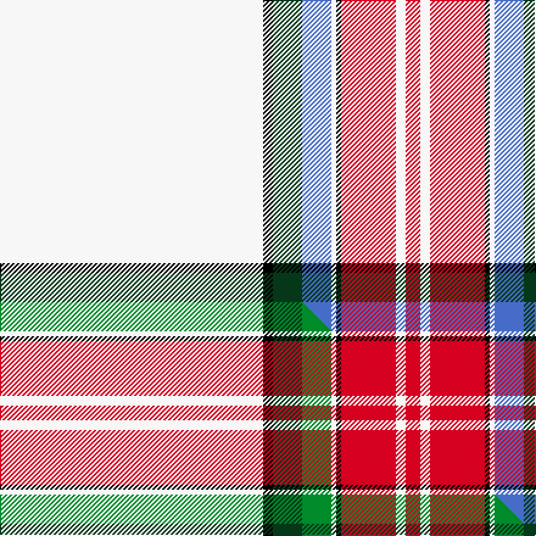

This page is one **sett** — a single exact thread-count. It belongs to the [tartan](/setts/w216k8dg24b24w4k4r45w8r12/)
(the same proportion at any scale), whose colour order is pattern [RWRKWBGKW](/stripes/rwrkwbgkw/).

Part of the [Unidentified Arisaid](/tartans/unidentified-arisaid/) tartan — the named design grouping this sett with its other cloths.

Sourced from weddslist.  It is a [9 stripe tartan](/stripes/stripes9/).

Original link http://www.weddslist.com/cgi-bin/tartans/pg.pl?source=sts

## Thread count
W/216 K8 DG24 B24 W4 K4 R45 W8 R/12

One full sett is **462 threads**.

## Palette
<table><thead><tr><th>Colour</th><th>Shade</th><th>OKLCh</th></tr></thead><tbody><tr><td>DG</td><td><code style="background-color:#053819;">#053819</code> <small style="color:#888">#053819</small></td><td><small style="color:#888">oklch(30.0% 0.075 151.3)</small></td></tr><tr><td>R</td><td><code style="background-color:#D60020;">#D60020</code> <small style="color:#888">#D60020</small></td><td><small style="color:#888">oklch(55.2% 0.224 25.5)</small></td></tr><tr><td>B</td><td><code style="background-color:#466CC8;">#466CC8</code> <small style="color:#888">#466CC8</small></td><td><small style="color:#888">oklch(55.1% 0.149 265.0)</small></td></tr><tr><td>K</td><td><code style="background-color:#000000;">#000000</code> <small style="color:#888">#000000</small></td><td><small style="color:#888">oklch(0.0% 0.000 0.0)</small></td></tr><tr><td>W</td><td><code style="background-color:#F7F7F7;">#F7F7F7</code> <small style="color:#888">#F7F7F7</small></td><td><small style="color:#888">oklch(97.6% 0.000 89.9)</small></td></tr></tbody></table>

# Sample pattern

## Compared to the master

This cloth is one sett of its design; the master sett (the exemplar the design is anchored on) is below for comparison.

Its **ΔTartan distance** from the master is **0.30** — the same measure the nearest-tartans table ranks by (0 is identical; a re-scale of the same cloth is near 0, a recolour or a different proportion further).

<figure class="master-compare" style="margin:0">

this sett
master sett ★

<figcaption style="color:#888;font-size:smaller">One weave of this sett against the <a href="/setts/w216k8dg24g24w4k4r45w8r12/">master sett ★</a>, split on the diagonal: a shared proportion runs seamlessly across it with only the shades shifting; a different proportion breaks on it.</figcaption>
</figure>

## Nearest tartan variants

The nearest existing variants by ΔTartan distance, with this cloth at the top so the swatches line up against it.

ΔTartan

Threads

Variant

Sett

—

462

<a href="/variants/s9/w216k8dg24b24w4k4r45w8r12/">Unidentified, Arisaid</a>

<a href="/ttd/edit/#slug=w216k8dg24g24w4k4r45w8r12&amp;base=w216k8dg24b24w4k4r45w8r12" title="compare in the TTD">0.30</a>

462

<a href="/variants/s9/w216k8dg24g24w4k4r45w8r12/">Unidentified Arisaid</a>

<a href="/ttd/edit/#slug=w50k3dg10g11w1k1r20w3r5~x2~dg1806142-g2203152&amp;base=w216k8dg24b24w4k4r45w8r12" title="compare in the TTD">0.88</a>

306

<a href="/variants/s9/w50k3dg10g11w1k1r20w3r5~x2~dg1806142-g2203152/">Drummond of Perth Dress (Dance)</a>

<a href="/ttd/edit/#slug=w57k1r12w1g12r14w1r2~x2&amp;base=w216k8dg24b24w4k4r45w8r12" title="compare in the TTD">2.08</a>

282

<a href="/variants/s8/w57k1r12w1g12r14w1r2~x2/">McBrayer Dress</a>

<a href="/ttd/edit/#slug=w50k1r12w1g12r13w1r2~x2&amp;base=w216k8dg24b24w4k4r45w8r12" title="compare in the TTD">2.14</a>

264

<a href="/variants/s8/w50k1r12w1g12r13w1r2~x2/">Unidentified Blanket</a>

<a href="/ttd/edit/#slug=w50k1r14w1dg14r14w1r2~x4~w4000000&amp;base=w216k8dg24b24w4k4r45w8r12" title="compare in the TTD">2.21</a>

568

<a href="/variants/s8/w50k1r14w1dg14r14w1r2~x4~w4000000/">Wilson's Blanket Pattern</a>

<a href="/ttd/edit/#slug=w80k2r19w2dg19r22w2r4~x2&amp;base=w216k8dg24b24w4k4r45w8r12" title="compare in the TTD">2.34</a>

432

<a href="/variants/s8/w80k2r19w2dg19r22w2r4~x2/">Wilsons' Blanket Pattern (Artefact)</a>

<a href="/ttd/edit/#slug=w54k7r7lo6ly4r1~x2~ly3307090&amp;base=w216k8dg24b24w4k4r45w8r12" title="compare in the TTD">2.42</a>

206

<a href="/variants/s6/w54k7r7lo6ly4r1~x2~ly3307090/">Young, Christina</a>

<a href="/ttd/edit/#slug=lb7w2dr7w4lb50w2k2r2~x2&amp;base=w216k8dg24b24w4k4r45w8r12" title="compare in the TTD">2.55</a>

286

<a href="/variants/s8/lb7w2dr7w4lb50w2k2r2~x2/">MacDonald from Rawtenstall (Personal)</a>

<a href="/ttd/edit/#slug=w102k3y3k3w3k12db14g12w3r3~x2&amp;base=w216k8dg24b24w4k4r45w8r12" title="compare in the TTD">2.63</a>

422

<a href="/variants/s10/w102k3y3k3w3k12db14g12w3r3~x2/">Miss Emma Halford-MacLeod</a>

<a href="/ttd/edit/#slug=w102k3ly3k3w3k12db14g12w3r3~x2&amp;base=w216k8dg24b24w4k4r45w8r12" title="compare in the TTD">2.64</a>

422

<a href="/variants/s10/w102k3ly3k3w3k12db14g12w3r3~x2/">Halford-Macleod, Miss Emma (Personal</a>

## Neighbour map

Every grey dot is one of 13620 variants placed by the first two principal components of the ΔTartan feature space (42% of its variance). Red is this tartan; blue dots are its nearest — click one to open its page.

<svg viewBox="0 0 640 380" role="img" style="max-width:100%;height:auto;border:1px solid #e0e0e0;border-radius:4px;display:block" xmlns="http://www.w3.org/2000/svg"><image href="/nn/cloud.v1.png" width="640" height="380"/><a href="/variants/s9/w216k8dg24g24w4k4r45w8r12/"><circle cx="362.8" cy="47.8" r="4" fill="#3465a4"><title>Unidentified Arisaid</title></circle></a><a href="/variants/s9/w50k3dg10g11w1k1r20w3r5~x2~dg1806142-g2203152/"><circle cx="265.0" cy="68.8" r="4" fill="#3465a4"><title>Drummond of Perth Dress (Dance)</title></circle></a><a href="/variants/s8/w57k1r12w1g12r14w1r2~x2/"><circle cx="354.4" cy="81.1" r="4" fill="#3465a4"><title>McBrayer Dress</title></circle></a><a href="/variants/s8/w50k1r12w1g12r13w1r2~x2/"><circle cx="336.9" cy="84.7" r="4" fill="#3465a4"><title>Unidentified Blanket</title></circle></a><a href="/variants/s8/w50k1r14w1dg14r14w1r2~x4~w4000000/"><circle cx="306.3" cy="83.1" r="4" fill="#3465a4"><title>Wilson's Blanket Pattern</title></circle></a><a href="/variants/s8/w80k2r19w2dg19r22w2r4~x2/"><circle cx="315.5" cy="89.7" r="4" fill="#3465a4"><title>Wilsons' Blanket Pattern (Artefact)</title></circle></a><a href="/variants/s6/w54k7r7lo6ly4r1~x2~ly3307090/"><circle cx="374.2" cy="74.5" r="4" fill="#3465a4"><title>Young, Christina</title></circle></a><a href="/variants/s8/lb7w2dr7w4lb50w2k2r2~x2/"><circle cx="441.6" cy="88.6" r="4" fill="#3465a4"><title>MacDonald from Rawtenstall (Personal)</title></circle></a><a href="/variants/s10/w102k3y3k3w3k12db14g12w3r3~x2/"><circle cx="337.1" cy="36.7" r="4" fill="#3465a4"><title>Miss Emma Halford-MacLeod</title></circle></a><a href="/variants/s10/w102k3ly3k3w3k12db14g12w3r3~x2/"><circle cx="341.8" cy="39.8" r="4" fill="#3465a4"><title>Halford-Macleod, Miss Emma (Personal</title></circle></a><circle cx="363.8" cy="47.2" r="5" fill="#c00000"/><text x="320" y="376" text-anchor="middle" font-size="11" fill="#999">ground</text><text x="11" y="190" text-anchor="middle" font-size="11" fill="#999" transform="rotate(-90 11 190)">complexity</text></svg>

ID: /variants/s9/w216k8dg24b24w4k4r45w8r12/
