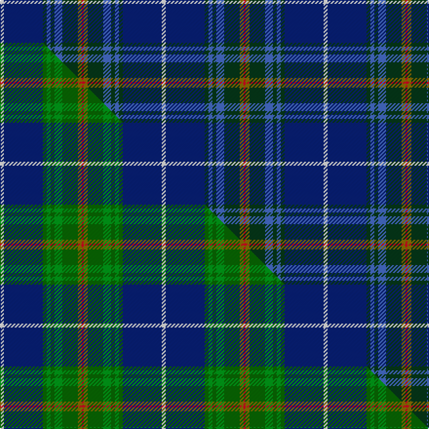

This page is one **sett** — a single exact thread-count. It belongs to the [tartan](/setts/w2db20dg2b2dg2b4dg8y2r1/)
(the same proportion at any scale), whose colour order is pattern [RGGBGBGBW](/stripes/rggbgbgbw/).

Part of the [Nova Scotia](/tartans/nova-scotia-2/) tartan — the named design grouping this sett with its other cloths.

Sourced from weddslist.  It is a [9 stripe tartan](/stripes/stripes9/).

Original link http://www.weddslist.com/cgi-bin/tartans/pg.pl?source=sts

## Thread count
W/4 DB40 DG4 B4 DG4 B8 DG16 Y4 R/2

One full sett is **166 threads**.

## Palette
<table><thead><tr><th>Colour</th><th>Shade</th><th>OKLCh</th></tr></thead><tbody><tr><td>DB</td><td><code style="background-color:#082077;">#082077</code> <small style="color:#888">#082077</small></td><td><small style="color:#888">oklch(30.0% 0.149 265.1)</small></td></tr><tr><td>DG</td><td><code style="background-color:#053819;">#053819</code> <small style="color:#888">#053819</small></td><td><small style="color:#888">oklch(30.0% 0.075 151.3)</small></td></tr><tr><td>B</td><td><code style="background-color:#466CC8;">#466CC8</code> <small style="color:#888">#466CC8</small></td><td><small style="color:#888">oklch(55.1% 0.149 265.0)</small></td></tr><tr><td>W</td><td><code style="background-color:#F7F7F7;">#F7F7F7</code> <small style="color:#888">#F7F7F7</small></td><td><small style="color:#888">oklch(97.6% 0.000 89.9)</small></td></tr><tr><td>R</td><td><code style="background-color:#D60020;">#D60020</code> <small style="color:#888">#D60020</small></td><td><small style="color:#888">oklch(55.2% 0.224 25.5)</small></td></tr><tr><td>Y</td><td><code style="background-color:#8B6E00;">#8B6E00</code> <small style="color:#888">#8B6E00</small></td><td><small style="color:#888">oklch(55.1% 0.113 90.4)</small></td></tr></tbody></table>

# Sample pattern

## Compared to the master

This cloth is one sett of its design; the master sett (the exemplar the design is anchored on) is below for comparison.

Its **ΔTartan distance** from the master is **1.47** — the same measure the nearest-tartans table ranks by (0 is identical; a re-scale of the same cloth is near 0, a recolour or a different proportion further).

<figure class="master-compare" style="margin:0">

this sett
master sett ★

<figcaption style="color:#888;font-size:smaller">One weave of this sett against the <a href="/setts/w2db20dg2g2dg2g4dg8y2r1/">master sett ★</a>, split on the diagonal: a shared proportion runs seamlessly across it with only the shades shifting; a different proportion breaks on it.</figcaption>
</figure>

## Nearest variants

The nearest existing variants by ΔTartan distance, with this cloth at the top so the swatches line up against it.

ΔTartan

Threads

Variant

Sett

—

166

<a href="/variants/s9/w2db20dg2b2dg2b4dg8y2r1~x2/">Nova Scotia</a>

<a href="/ttd/edit/#slug=w2db20dg2g2dg2g4dg8y2r1~x2&amp;base=w2db20dg2b2dg2b4dg8y2r1~x2" title="compare in the TTD">0.60</a>

166

<a href="/variants/s9/w2db20dg2g2dg2g4dg8y2r1~x2/">Nova Scotia Canadian District Tartan</a>

<a href="/ttd/edit/#slug=w2db20dg2g2dg2g4dg8y2r1~x2~dg1806142-g2408144&amp;base=w2db20dg2b2dg2b4dg8y2r1~x2" title="compare in the TTD">0.60</a>

166

<a href="/variants/s9/w2db20dg2g2dg2g4dg8y2r1~x2~dg1806142-g2408144/">Nova Scotia (Province)</a>

<a href="/ttd/edit/#slug=w2db20dg2dgi2dg2dgi5dg8ly2r1~x2~dgi1605139&amp;base=w2db20dg2b2dg2b4dg8y2r1~x2" title="compare in the TTD">2.00</a>

170

<a href="/variants/s9/w2db20dg2dgi2dg2dgi5dg8ly2r1~x2~dgi1605139/">Unidentified (ex Tony Murray)</a>

<a href="/ttd/edit/#slug=w1db16y1dr3y1dg6g2dg6w1~x2&amp;base=w2db20dg2b2dg2b4dg8y2r1~x2" title="compare in the TTD">2.36</a>

144

<a href="/variants/s9/w1db16y1dr3y1dg6g2dg6w1~x2/">Kleto, Susan (Personal)</a>

<a href="/ttd/edit/#slug=r2db12dg2b11dg4db5b2dg24w2~x2&amp;base=w2db20dg2b2dg2b4dg8y2r1~x2" title="compare in the TTD">2.54</a>

248

<a href="/variants/s9/r2db12dg2b11dg4db5b2dg24w2~x2/">Fraser Gathering, hunting</a>

2.86

—

<a href="/variants/s10/dbi4db3dr2db26k3dbi3g3dbi3g17ly3~x2~dbi1406275-db1204274/">Boyle (Personal)</a>

<a href="/ttd/edit/#slug=w3r2db31dg30y2dg2y1~x2&amp;base=w2db20dg2b2dg2b4dg8y2r1~x2" title="compare in the TTD">2.93</a>

276

<a href="/variants/s7/w3r2db31dg30y2dg2y1~x2/">Caig (Personal)</a>

## Neighbour map

Every grey dot is one of 13620 variants placed by the first two principal components of the ΔTartan feature space (42% of its variance). Red is this tartan; blue dots are its nearest — click one to open its page.

<svg viewBox="0 0 640 380" role="img" style="max-width:100%;height:auto;border:1px solid #e0e0e0;border-radius:4px;display:block" xmlns="http://www.w3.org/2000/svg"><image href="/nn/cloud.v1.png" width="640" height="380"/><a href="/variants/s9/w2db20dg2g2dg2g4dg8y2r1~x2/"><circle cx="253.8" cy="128.6" r="4" fill="#3465a4"><title>Nova Scotia Canadian District Tartan</title></circle></a><a href="/variants/s9/w2db20dg2g2dg2g4dg8y2r1~x2~dg1806142-g2408144/"><circle cx="242.4" cy="126.7" r="4" fill="#3465a4"><title>Nova Scotia (Province)</title></circle></a><a href="/variants/s9/w2db20dg2dgi2dg2dgi5dg8ly2r1~x2~dgi1605139/"><circle cx="256.2" cy="135.6" r="4" fill="#3465a4"><title>Unidentified (ex Tony Murray)</title></circle></a><a href="/variants/s9/w1db16y1dr3y1dg6g2dg6w1~x2/"><circle cx="259.9" cy="157.6" r="4" fill="#3465a4"><title>Kleto, Susan (Personal)</title></circle></a><a href="/variants/s9/r2db12dg2b11dg4db5b2dg24w2~x2/"><circle cx="272.7" cy="182.7" r="4" fill="#3465a4"><title>Fraser Gathering, hunting</title></circle></a><a href="/variants/s10/dbi4db3dr2db26k3dbi3g3dbi3g17ly3~x2~dbi1406275-db1204274/"><circle cx="203.1" cy="132.0" r="4" fill="#3465a4"><title>Boyle (Personal)</title></circle></a><a href="/variants/s7/w3r2db31dg30y2dg2y1~x2/"><circle cx="342.4" cy="140.7" r="4" fill="#3465a4"><title>Caig (Personal)</title></circle></a><circle cx="264.7" cy="130.4" r="5" fill="#c00000"/><text x="320" y="376" text-anchor="middle" font-size="11" fill="#999">ground</text><text x="11" y="190" text-anchor="middle" font-size="11" fill="#999" transform="rotate(-90 11 190)">complexity</text></svg>

ID: /variants/s9/w2db20dg2b2dg2b4dg8y2r1~x2/
