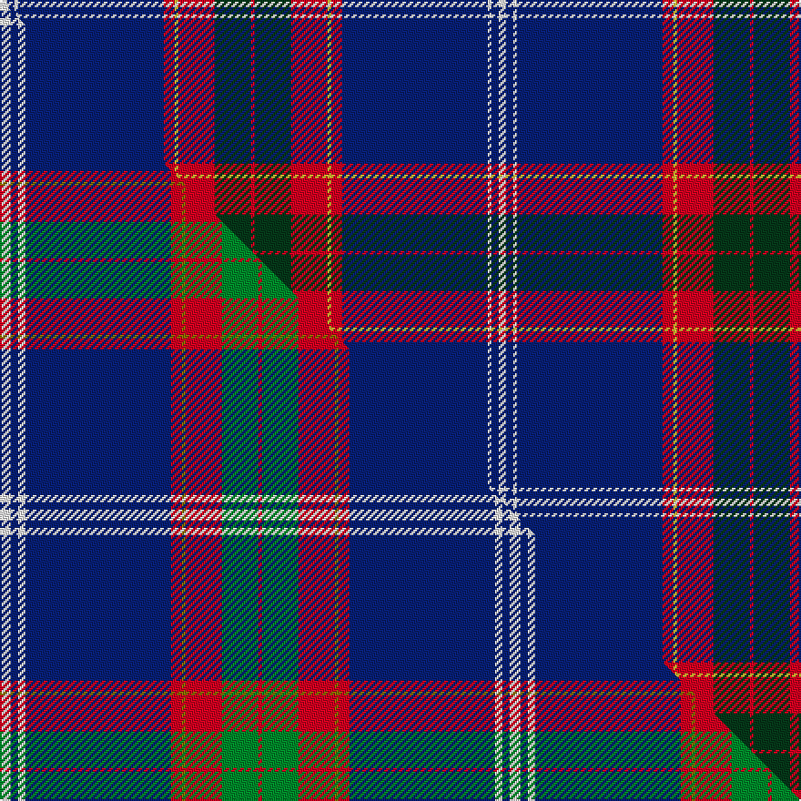

This page is one **sett** — a single exact thread-count. It belongs to the [tartan](/setts/w2db2w1db40r3ly1r10dg10r1/)
(the same proportion at any scale), whose colour order is pattern [RGRYRBWBW](/stripes/rgryrbwbw/).

Part of the [Russian Scottish](/tartans/russian-scottish/) tartan — the named design grouping this sett with its other cloths.

Sourced from tartans-authority.  It is a [9 stripe tartan](/stripes/stripes9/).

Original link http://www.tartansauthority.com/tartan-ferret/display/7254/

## Register references

External register numbers recorded for this tartan.

- Scottish Tartans Authority (ITI): 7254

## Thread count
W/4 DB4 W2 DB80 R6 LY2 R20 DG20 R/2

One full sett is **274 threads**.

## Palette
<table><thead><tr><th>Colour</th><th>Shade</th><th>OKLCh</th></tr></thead><tbody><tr><td>DB</td><td><code style="background-color:#082077;">#082077</code> <small style="color:#888">#082077</small></td><td><small style="color:#888">oklch(30.0% 0.149 265.1)</small></td></tr><tr><td>DG</td><td><code style="background-color:#053819;">#053819</code> <small style="color:#888">#053819</small></td><td><small style="color:#888">oklch(30.0% 0.075 151.3)</small></td></tr><tr><td>W</td><td><code style="background-color:#F7F7F7;">#F7F7F7</code> <small style="color:#888">#F7F7F7</small></td><td><small style="color:#888">oklch(97.6% 0.000 89.9)</small></td></tr><tr><td>R</td><td><code style="background-color:#D60020;">#D60020</code> <small style="color:#888">#D60020</small></td><td><small style="color:#888">oklch(55.2% 0.224 25.5)</small></td></tr><tr><td>LY</td><td><code style="background-color:#DCBC32;">#DCBC32</code> <small style="color:#888">#DCBC32</small></td><td><small style="color:#888">oklch(80.0% 0.150 95.2)</small></td></tr></tbody></table>

# Sample pattern

## Compared to the master

This cloth is one sett of its design; the master sett (the exemplar the design is anchored on) is below for comparison.

Its **ΔTartan distance** from the master is **0.67** — the same measure the nearest-tartans table ranks by (0 is identical; a re-scale of the same cloth is near 0, a recolour or a different proportion further).

<figure class="master-compare" style="margin:0">

this sett
master sett ★

<figcaption style="color:#888;font-size:smaller">One weave of this sett against the <a href="/setts/w3db2w2db40r3y1r10g10r1/">master sett ★</a>, split on the diagonal: a shared proportion runs seamlessly across it with only the shades shifting; a different proportion breaks on it.</figcaption>
</figure>

## Nearest variants

The nearest existing variants by ΔTartan distance, with this cloth at the top so the swatches line up against it.

ΔTartan

Threads

Variant

Sett

—

274

<a href="/variants/s9/w2db2w1db40r3ly1r10dg10r1~x2/">Russian Scottish (District)</a>

<a href="/ttd/edit/#slug=w3db2w2db40r3y1r10g10r1~x2&amp;base=w2db2w1db40r3ly1r10dg10r1~x2" title="compare in the TTD">0.03</a>

280

<a href="/variants/s9/w3db2w2db40r3y1r10g10r1~x2/">Russian Scottish</a>

<a href="/ttd/edit/#slug=db58w2db1w1db6g3r3g6r24y3~x2&amp;base=w2db2w1db40r3ly1r10dg10r1~x2" title="compare in the TTD">2.31</a>

306

<a href="/variants/s10/db58w2db1w1db6g3r3g6r24y3~x2/">Chinese Scottish (Corporate)</a>

<a href="/ttd/edit/#slug=db58w2db1w1db6g3r3g6r24y3~x2~g2408144&amp;base=w2db2w1db40r3ly1r10dg10r1~x2" title="compare in the TTD">2.31</a>

306

<a href="/variants/s10/db58w2db1w1db6g3r3g6r24y3~x2~g2408144/">Chinese Scottish District Tartan</a>

## Neighbour map

Every grey dot is one of 13620 variants placed by the first two principal components of the ΔTartan feature space (42% of its variance). Red is this tartan; blue dots are its nearest — click one to open its page.

<svg viewBox="0 0 640 380" role="img" style="max-width:100%;height:auto;border:1px solid #e0e0e0;border-radius:4px;display:block" xmlns="http://www.w3.org/2000/svg"><image href="/nn/cloud.v1.png" width="640" height="380"/><a href="/variants/s9/w3db2w2db40r3y1r10g10r1~x2/"><circle cx="340.5" cy="83.7" r="4" fill="#3465a4"><title>Russian Scottish</title></circle></a><a href="/variants/s10/db58w2db1w1db6g3r3g6r24y3~x2/"><circle cx="383.3" cy="67.4" r="4" fill="#3465a4"><title>Chinese Scottish (Corporate)</title></circle></a><a href="/variants/s10/db58w2db1w1db6g3r3g6r24y3~x2~g2408144/"><circle cx="380.0" cy="66.4" r="4" fill="#3465a4"><title>Chinese Scottish District Tartan</title></circle></a><circle cx="370.4" cy="84.4" r="5" fill="#c00000"/><text x="320" y="376" text-anchor="middle" font-size="11" fill="#999">ground</text><text x="11" y="190" text-anchor="middle" font-size="11" fill="#999" transform="rotate(-90 11 190)">complexity</text></svg>

ID: /variants/s9/w2db2w1db40r3ly1r10dg10r1~x2/
