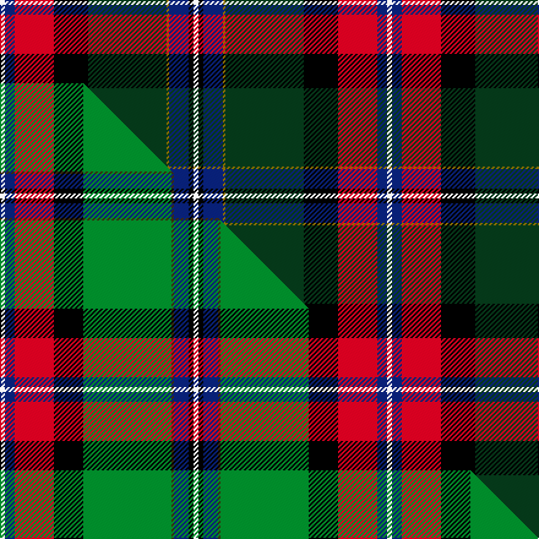

This is one **variant** — a specific cloth: this exact thread count and colourway, with its own
provenance below. It is one weaving of the [sett](/setts/w2db4r16k14dg32y1db8k2w2/) (the scale-free proportion — the
same cloth at any scale or shade), whose colour order is pattern [WBRKGGBKW](/stripes/wbrkggbkw/).

Part of the [National Millennium](/tartans/national-millennium/) tartan — the named design grouping this sett with its other cloths.

Sourced from weddslist.  It is a [9 stripe tartan](/stripes/stripes9/).

Original link [http://www.weddslist.com/cgi-bin/tartans/pg.pl?source=sts](http://www.weddslist.com/cgi-bin/tartans/pg.pl?source=sts)

Dataset <small>— provenance for this record, inherited from the source manifest</small>

<dl class="dataset-prov">
<dt>source</dt><dd><a href="/sources/weddslist/">Weddslist</a></dd>
<dt>data captured from</dt><dd><a href="https://github.com/thetartan/tartan-database/blob/master/data/weddslist/data.csv">https://github.com/thetartan/tartan-database/blob/master/data/weddslist/data.csv</a></dd>
<dt>data date</dt><dd>2016-11-17 <small>(dataset default)</small></dd>
<dt>licence</dt><dd><a href="https://creativecommons.org/licenses/by-nc-nd/4.0/">CC BY-NC-ND 4.0</a></dd>
</dl>

Capture chain <small>— the hands this data passed through, oldest first; each capture carries its own licence</small>

<ol class="capture-chain">
<li><a href="https://www.weddslist.com/tartans/">Weddslist</a> <small>the living privately compiled reference</small></li>
<li><a href="https://github.com/thetartan/tartan-database">thetartan/tartan-database</a> <small>2016-2017</small> · <a href="https://creativecommons.org/licenses/by-nc-nd/4.0/">CC BY-NC-ND 4.0</a> <small>Levko Kravets's frozen compilation — the capture we vendored, and where its CC licence text came from</small></li>
<li>this dictionary <small>captured 2026-06-10 · commit 5bf86c7566</small> <small>each re-capture is a git commit to data/sources</small></li>
</ol>

## Thread count
W/4 DB8 R32 K28 DG64 Y2 DB16 K4 W/4

One full sett is **316 threads**.

## Palette
<table><thead><tr><th>Colour</th><th>Shade</th><th>OKLCh</th></tr></thead><tbody><tr><td>DB</td><td><code style="background-color:#082077;">#082077</code> <small style="color:#888">#082077</small></td><td><small style="color:#888">oklch(30.0% 0.149 265.1)</small></td></tr><tr><td>DG</td><td><code style="background-color:#053819;">#053819</code> <small style="color:#888">#053819</small></td><td><small style="color:#888">oklch(30.0% 0.075 151.3)</small></td></tr><tr><td>K</td><td><code style="background-color:#000000;">#000000</code> <small style="color:#888">#000000</small></td><td><small style="color:#888">oklch(0.0% 0.000 0.0)</small></td></tr><tr><td>W</td><td><code style="background-color:#F7F7F7;">#F7F7F7</code> <small style="color:#888">#F7F7F7</small></td><td><small style="color:#888">oklch(97.6% 0.000 89.9)</small></td></tr><tr><td>R</td><td><code style="background-color:#D60020;">#D60020</code> <small style="color:#888">#D60020</small></td><td><small style="color:#888">oklch(55.2% 0.224 25.5)</small></td></tr><tr><td>Y</td><td><code style="background-color:#8B6E00;">#8B6E00</code> <small style="color:#888">#8B6E00</small></td><td><small style="color:#888">oklch(55.1% 0.113 90.4)</small></td></tr></tbody></table>

# Sample pattern

## Compared to the master

This cloth is one sett of its design; the master sett (the exemplar the design is anchored on) is below for comparison.

Its **ΔTartan distance** from the master is **0.33** — the same measure the nearest-tartans table ranks by (0 is identical; a re-scale of the same cloth is near 0, a recolour or a different proportion further).

<figure class="master-compare" style="margin:0">

this sett
master sett ★

<figcaption style="color:#888;font-size:smaller">One weave of this sett against the <a href="/setts/w2db4r16k12g36dy1db6k2w2/">master sett ★</a>, split on the diagonal: a shared proportion runs seamlessly across it with only the shades shifting; a different proportion breaks on it.</figcaption>
</figure>

## Nearest tartan variants

The nearest existing variants by ΔTartan distance, with this cloth at the top so the swatches line up against it.

ΔTartan

Threads

Variant

Sett

—

316

<a href="/variants/s9/w2db4r16k14dg32y1db8k2w2~x2/">National Millennium</a>

<a href="/ttd/edit/#slug=w2db4r16k12g36dy1db6k2w2~x2&amp;base=w2db4r16k14dg32y1db8k2w2~x2" title="compare in the TTD">0.33</a>

316

<a href="/variants/s9/w2db4r16k12g36dy1db6k2w2~x2/">National Millennium</a>

<a href="/ttd/edit/#slug=y1k6g32k12dr12dp9db6w1~x2&amp;base=w2db4r16k14dg32y1db8k2w2~x2" title="compare in the TTD">1.53</a>

312

<a href="/variants/s8/y1k6g32k12dr12dp9db6w1~x2/">Fujitsu</a>

<a href="/ttd/edit/#slug=r4do4r4do12k32o15ri1o7ly1ri1~x2~r1706009-o2503076-ri2607041-ly2705081&amp;base=w2db4r16k14dg32y1db8k2w2~x2" title="compare in the TTD">1.62</a>

314

<a href="/variants/s10/r4do4r4do12k32ly15ri1ly7lyi1ri1~x2~r1706009-ly2503076-ri2607041-lyi2705081/">Hard Rock Cafe (Corporate)</a>

<a href="/ttd/edit/#slug=dp3n3dp3n27w1t15k22r3~x2&amp;base=w2db4r16k14dg32y1db8k2w2~x2" title="compare in the TTD">1.72</a>

296

<a href="/variants/s8/dp3n3dp3n27w1t15k22r3~x2/">Beauly Firth and Glens</a>

<a href="/ttd/edit/#slug=lo3k2n15k10dt23r2dt1w2~x2&amp;base=w2db4r16k14dg32y1db8k2w2~x2" title="compare in the TTD">1.83</a>

222

<a href="/variants/s8/lo3k2n15k10dt23r2dt1w2~x2/">Vienna Highlander (Fashion)</a>

<a href="/ttd/edit/#slug=k6w3k2db30r9k4g20dy3~x2&amp;base=w2db4r16k14dg32y1db8k2w2~x2" title="compare in the TTD">2.11</a>

290

<a href="/variants/s8/k6w3k2db30r9k4g20dy3~x2/">Minnesota (District)</a>

<a href="/ttd/edit/#slug=k6w3k2db30r9k4g20dy3~x2~g2408144&amp;base=w2db4r16k14dg32y1db8k2w2~x2" title="compare in the TTD">2.11</a>

290

<a href="/variants/s8/k6w3k2db30r9k4g20dy3~x2~g2408144/">Minnesota American District Tartan</a>

<a href="/ttd/edit/#slug=y1k6g32k12r12b9k6w1~x2&amp;base=w2db4r16k14dg32y1db8k2w2~x2" title="compare in the TTD">2.37</a>

312

<a href="/variants/s8/y1k6g32k12r12b9k6w1~x2/">McGeachie (Personal)</a>

<a href="/ttd/edit/#slug=o4dyi4o4dyi12k31dy16r1dy6ly1r1~x2~o2307033-dyi1603076-dy1503076-r2607041&amp;base=w2db4r16k14dg32y1db8k2w2~x2" title="compare in the TTD">2.38</a>

310

<a href="/variants/s10/r4dyi4r4dyi12k31dy16ri1dy6ly1ri1~x2~r2307033-dyi1603076-dy1503076-ri2607041/">Unnamed C20th - National Archives`</a>

<a href="/ttd/edit/#slug=k3r2db30r1k18o30r2o3~x2&amp;base=w2db4r16k14dg32y1db8k2w2~x2" title="compare in the TTD">2.40</a>

344

<a href="/variants/s8/k3r2db30r1k18o30r2o3~x2/">Bannockbane Navy Fashion Tartan</a>

## Neighbour map

Every grey dot is one of 13621 variants placed by the first two principal components of the ΔTartan feature space (42% of its variance). Red is this tartan; blue dots are its nearest — click one to open its page.

<svg viewBox="0 0 640 380" role="img" style="max-width:100%;height:auto;border:1px solid #e0e0e0;border-radius:4px;display:block" xmlns="http://www.w3.org/2000/svg"><image href="/nn/cloud.v1.png" width="640" height="380"/><a href="/variants/s9/w2db4r16k12g36dy1db6k2w2~x2/"><circle cx="186.3" cy="76.1" r="4" fill="#3465a4"><title>National Millennium</title></circle></a><a href="/variants/s8/y1k6g32k12dr12dp9db6w1~x2/"><circle cx="147.9" cy="94.8" r="4" fill="#3465a4"><title>Fujitsu</title></circle></a><a href="/variants/s10/r4do4r4do12k32ly15ri1ly7lyi1ri1~x2~r1706009-ly2503076-ri2607041-lyi2705081/"><circle cx="175.7" cy="80.6" r="4" fill="#3465a4"><title>Hard Rock Cafe (Corporate)</title></circle></a><a href="/variants/s8/dp3n3dp3n27w1t15k22r3~x2/"><circle cx="168.7" cy="107.9" r="4" fill="#3465a4"><title>Beauly Firth and Glens</title></circle></a><a href="/variants/s8/lo3k2n15k10dt23r2dt1w2~x2/"><circle cx="184.6" cy="115.2" r="4" fill="#3465a4"><title>Vienna Highlander (Fashion)</title></circle></a><a href="/variants/s8/k6w3k2db30r9k4g20dy3~x2/"><circle cx="134.3" cy="129.4" r="4" fill="#3465a4"><title>Minnesota (District)</title></circle></a><a href="/variants/s8/k6w3k2db30r9k4g20dy3~x2~g2408144/"><circle cx="129.0" cy="128.0" r="4" fill="#3465a4"><title>Minnesota American District Tartan</title></circle></a><a href="/variants/s8/y1k6g32k12r12b9k6w1~x2/"><circle cx="159.2" cy="101.8" r="4" fill="#3465a4"><title>McGeachie (Personal)</title></circle></a><a href="/variants/s10/r4dyi4r4dyi12k31dy16ri1dy6ly1ri1~x2~r2307033-dyi1603076-dy1503076-ri2607041/"><circle cx="189.8" cy="86.6" r="4" fill="#3465a4"><title>Unnamed C20th - National Archives`</title></circle></a><a href="/variants/s8/k3r2db30r1k18o30r2o3~x2/"><circle cx="196.2" cy="107.8" r="4" fill="#3465a4"><title>Bannockbane Navy Fashion Tartan</title></circle></a><circle cx="168.1" cy="88.7" r="5" fill="#c00000"/><text x="320" y="376" text-anchor="middle" font-size="11" fill="#999">ground</text><text x="11" y="190" text-anchor="middle" font-size="11" fill="#999" transform="rotate(-90 11 190)">complexity</text></svg>

ID: /variants/s9/w2db4r16k14dg32y1db8k2w2~x2/
