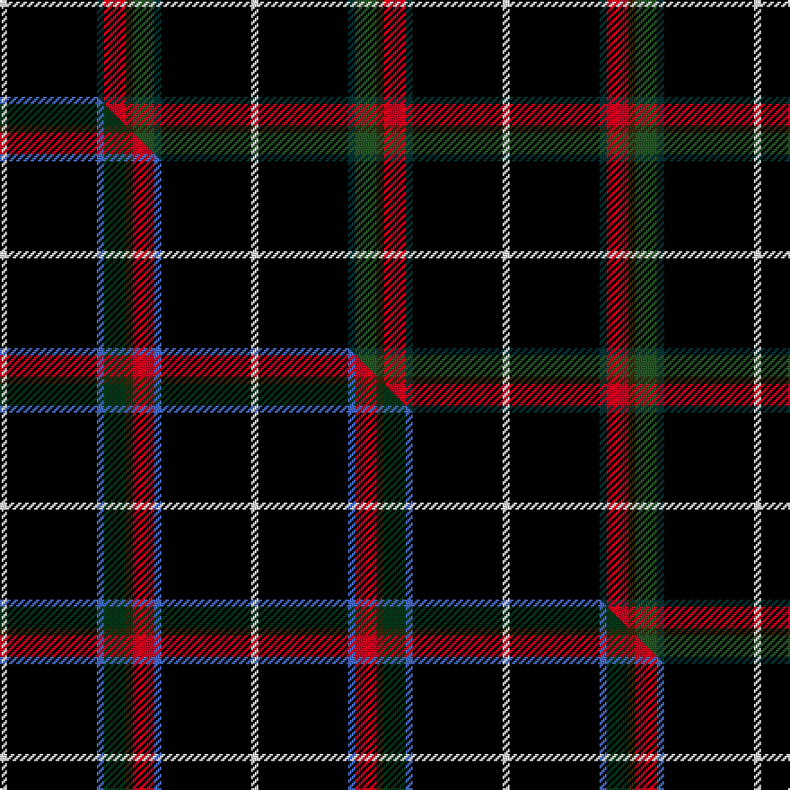

This is one **variant** — a specific cloth: this exact thread count and colourway, with its own
provenance below. It is one weaving of the [sett](/setts/w2k25dt2dg6dy2r6dt2k25w2/) (the scale-free proportion — the
same cloth at any scale or shade), whose colour order is pattern [WKBGGRBKW](/stripes/wkbggrbkw/).

Part of the [Stott](/tartans/s/st/stott/) tartan — the named design grouping this sett with its other cloths.

Sourced from house-of-tartan.  It is a [9 stripe tartan](/stripes/stripes9/).

Original link [http://www.house-of-tartan.scotland.net/house/TartanViewjs.asp?colr=Def&tnam=7112](http://www.house-of-tartan.scotland.net/house/TartanViewjs.asp?colr=Def&tnam=7112)

## Provenance

Earliest known date: 2007 The design includes the white Cross of St Piran, the Cornish flag which has connections with the family name.

Dataset <small>— provenance for this record, inherited from the source manifest</small>

<dl class="dataset-prov">
<dt>source</dt><dd><a href="/sources/house-of-tartan/">House of Tartan</a></dd>
<dt>data captured from</dt><dd><a href="https://github.com/thetartan/tartan-database/blob/master/data/house-of-tartan/data.csv">https://github.com/thetartan/tartan-database/blob/master/data/house-of-tartan/data.csv</a></dd>
<dt>data date</dt><dd>2007 <small>(this record)</small></dd>
<dt>licence</dt><dd><a href="https://creativecommons.org/licenses/by-nc-nd/4.0/">CC BY-NC-ND 4.0</a></dd>
</dl>

Capture chain <small>— the hands this data passed through, oldest first; each capture carries its own licence</small>

<ol class="capture-chain">
<li><a href="http://www.house-of-tartan.scotland.net/">House of Tartan</a> <small>the weaver/retailer's database — the site is now offline; the URL is kept as the ultimate source's identity</small></li>
<li><a href="https://github.com/thetartan/tartan-database">thetartan/tartan-database</a> <small>2016-2017</small> · <a href="https://creativecommons.org/licenses/by-nc-nd/4.0/">CC BY-NC-ND 4.0</a> <small>Levko Kravets's frozen compilation — the capture we vendored, and where its CC licence text came from</small></li>
<li>this dictionary <small>captured 2026-06-10 · commit 5bf86c7566</small> <small>each re-capture is a git commit to data/sources</small></li>
</ol>

## Thread count
W/4 K50 DT4 R12 DY4 DG12 DT4 K50 W/4

One full sett is **280 threads**.

## Palette
<table><thead><tr><th>Colour</th><th>Shade</th><th>OKLCh</th></tr></thead><tbody><tr><td>DT</td><td><code style="background-color:#023535;">#023535</code> <small style="color:#888">#023535</small></td><td><small style="color:#888">oklch(29.8% 0.050 194.8)</small></td></tr><tr><td>T</td><td><code style="background-color:#00879F;">#00879F</code> <small style="color:#888">#00879F</small></td><td><small style="color:#888">oklch(57.4% 0.102 216.1)</small></td></tr><tr><td>DB</td><td><code style="background-color:#082077;">#082077</code> <small style="color:#888">#082077</small></td><td><small style="color:#888">oklch(30.0% 0.149 265.1)</small></td></tr><tr><td>DG</td><td><code style="background-color:#20483C;">#20483C</code> <small style="color:#888">#20483C</small></td><td><small style="color:#888">oklch(36.9% 0.050 171.5)</small></td></tr><tr><td>R</td><td><code style="background-color:#D60020;">#D60020</code> <small style="color:#888">#D60020</small></td><td><small style="color:#888">oklch(55.2% 0.224 25.5)</small></td></tr><tr><td>LY</td><td><code style="background-color:#DCBC32;">#DCBC32</code> <small style="color:#888">#DCBC32</small></td><td><small style="color:#888">oklch(80.0% 0.150 95.2)</small></td></tr><tr><td>DG</td><td><code style="background-color:#285828;">#285828</code> <small style="color:#888">#285828</small></td><td><small style="color:#888">oklch(41.4% 0.093 143.7)</small></td></tr><tr><td>K</td><td><code style="background-color:#000000;">#000000</code> <small style="color:#888">#000000</small></td><td><small style="color:#888">oklch(0.0% 0.000 0.0)</small></td></tr><tr><td>W</td><td><code style="background-color:#F7F7F7;">#F7F7F7</code> <small style="color:#888">#F7F7F7</small></td><td><small style="color:#888">oklch(97.6% 0.000 89.9)</small></td></tr><tr><td>Y</td><td><code style="background-color:#8B6E00;">#8B6E00</code> <small style="color:#888">#8B6E00</small></td><td><small style="color:#888">oklch(55.1% 0.113 90.4)</small></td></tr><tr><td>DY</td><td><code style="background-color:#3A2B0D;">#3A2B0D</code> <small style="color:#888">#3A2B0D</small></td><td><small style="color:#888">oklch(30.0% 0.049 82.0)</small></td></tr></tbody></table>

# Sample pattern

## Compared to the master

This cloth is one sett of its design; the master sett (the exemplar the design is anchored on) is below for comparison.

Its **ΔTartan distance** from the master is **0.90** — the same measure the nearest-tartans table ranks by (0 is identical; a re-scale of the same cloth is near 0, a recolour or a different proportion further).

<figure class="master-compare" style="margin:0">

this sett
master sett ★

<figcaption style="color:#888;font-size:smaller">One weave of this sett against the <a href="/setts/w2k25b2dg6dy2r6b2k25w2/">master sett ★</a>, split on the diagonal: a shared proportion runs seamlessly across it with only the shades shifting; a different proportion breaks on it.</figcaption>
</figure>

## Nearest tartan variants

The nearest existing variants by ΔTartan distance, with this cloth at the top so the swatches line up against it.

ΔTartan

Threads

Variant

Sett

—

280

<a href="/variants/s9/w2k25dt2dg6dy2r6dt2k25w2~x2~dg1704144/">Stott Personal Tartan</a>

<a href="/ttd/edit/#slug=w2k25b2dg6dy2r6b2k25w2~x2&amp;base=w2k25dt2dg6dy2r6dt2k25w2~x2~dg1704144" title="compare in the TTD">0.90</a>

280

<a href="/variants/s9/w2k25b2dg6dy2r6b2k25w2~x2/">Stott (Personal)</a>

<a href="/ttd/edit/#slug=w2k25b2dg6dy2r6b2k25w2~x2~dg1704144&amp;base=w2k25dt2dg6dy2r6dt2k25w2~x2~dg1704144" title="compare in the TTD">0.90</a>

280

<a href="/variants/s9/w2k25b2dg6dy2r6b2k25w2~x2~dg1704144/">Stott (Personal)</a>

<a href="/ttd/edit/#slug=k1w1y2g1k10db1r2w1~x10&amp;base=w2k25dt2dg6dy2r6dt2k25w2~x2~dg1704144" title="compare in the TTD">1.98</a>

360

<a href="/variants/s8/k1w1y2g1k10db1r2w1~x10/">Kaptain Family (Personal)</a>

<a href="/ttd/edit/#slug=k16n4lb3k2db1w1r1k2lb3n4k12~x4&amp;base=w2k25dt2dg6dy2r6dt2k25w2~x2~dg1704144" title="compare in the TTD">2.38</a>

280

<a href="/variants/s11/k16n4lb3k2db1w1r1k2lb3n4k12~x4/">Iron Horse</a>

<a href="/ttd/edit/#slug=y2k2db3w2dy3g4k50g5dy3w2~x2&amp;base=w2k25dt2dg6dy2r6dt2k25w2~x2~dg1704144" title="compare in the TTD">2.45</a>

296

<a href="/variants/s10/y2k2db3w2dy3g4k50g5dy3w2~x2/">Hawes (2014)</a>

<a href="/ttd/edit/#slug=w2dr3g5k50g4dr3w2lb3k2ly2~x2&amp;base=w2k25dt2dg6dy2r6dt2k25w2~x2~dg1704144" title="compare in the TTD">2.46</a>

296

<a href="/variants/s10/w2dr3g5k50g4dr3w2lb3k2ly2~x2/">Hawes (Personal)</a>

<a href="/ttd/edit/#slug=k2dr3k36n2k5n7ly3lb5g2~x2&amp;base=w2k25dt2dg6dy2r6dt2k25w2~x2~dg1704144" title="compare in the TTD">2.55</a>

252

<a href="/variants/s9/k2dr3k36n2k5n7ly3lb5g2~x2/">Victory</a>

<a href="/ttd/edit/#slug=k50g6db6r6n6w3~x2&amp;base=w2k25dt2dg6dy2r6dt2k25w2~x2~dg1704144" title="compare in the TTD">2.56</a>

202

<a href="/variants/s6/k50g6db6r6n6w3~x2/">Friends of Nordegg</a>

<a href="/ttd/edit/#slug=k5r1y1k1y1r1k8db1w1~x6&amp;base=w2k25dt2dg6dy2r6dt2k25w2~x2~dg1704144" title="compare in the TTD">2.64</a>

204

<a href="/variants/s9/k5r1y1k1y1r1k8db1w1~x6/">Muylle, Jelle (Personal)</a>

<a href="/ttd/edit/#slug=r5dg3y6w3y5k55w5~x2~dg1806142&amp;base=w2k25dt2dg6dy2r6dt2k25w2~x2~dg1704144" title="compare in the TTD">2.71</a>

308

<a href="/variants/s7/r5dg3y6w3y5k55w5~x2~dg1806142/">Avalon</a>

## Neighbour map

Every grey dot is one of 13656 variants placed by the first two principal components of the ΔTartan feature space (42% of its variance). Red is this tartan; blue dots are its nearest — click one to open its page. The map is a flat projection of a many-dimensional space — [how to read it](/posts/neighbourhood-maps/).

<svg viewBox="0 0 640 380" role="img" style="max-width:100%;height:auto;border:1px solid #e0e0e0;border-radius:4px;display:block" xmlns="http://www.w3.org/2000/svg"><image href="/nn/cloud.v1.png" width="640" height="380"/><a href="/variants/s9/w2k25b2dg6dy2r6b2k25w2~x2/"><circle cx="309.0" cy="108.0" r="4" fill="#3465a4"><title>Stott (Personal)</title></circle></a><a href="/variants/s9/w2k25b2dg6dy2r6b2k25w2~x2~dg1704144/"><circle cx="307.0" cy="107.5" r="4" fill="#3465a4"><title>Stott (Personal)</title></circle></a><a href="/variants/s8/k1w1y2g1k10db1r2w1~x10/"><circle cx="214.4" cy="113.9" r="4" fill="#3465a4"><title>Kaptain Family (Personal)</title></circle></a><a href="/variants/s11/k16n4lb3k2db1w1r1k2lb3n4k12~x4/"><circle cx="266.6" cy="92.0" r="4" fill="#3465a4"><title>Iron Horse</title></circle></a><a href="/variants/s10/y2k2db3w2dy3g4k50g5dy3w2~x2/"><circle cx="343.9" cy="46.7" r="4" fill="#3465a4"><title>Hawes (2014)</title></circle></a><a href="/variants/s10/w2dr3g5k50g4dr3w2lb3k2ly2~x2/"><circle cx="336.8" cy="44.0" r="4" fill="#3465a4"><title>Hawes (Personal)</title></circle></a><a href="/variants/s9/k2dr3k36n2k5n7ly3lb5g2~x2/"><circle cx="305.5" cy="80.1" r="4" fill="#3465a4"><title>Victory</title></circle></a><a href="/variants/s6/k50g6db6r6n6w3~x2/"><circle cx="298.3" cy="104.9" r="4" fill="#3465a4"><title>Friends of Nordegg</title></circle></a><a href="/variants/s9/k5r1y1k1y1r1k8db1w1~x6/"><circle cx="305.2" cy="136.5" r="4" fill="#3465a4"><title>Muylle, Jelle (Personal)</title></circle></a><a href="/variants/s7/r5dg3y6w3y5k55w5~x2~dg1806142/"><circle cx="331.8" cy="94.9" r="4" fill="#3465a4"><title>Avalon</title></circle></a><circle cx="311.1" cy="108.9" r="5" fill="#c00000"/><text x="320" y="376" text-anchor="middle" font-size="11" fill="#999">ground</text><text x="11" y="190" text-anchor="middle" font-size="11" fill="#999" transform="rotate(-90 11 190)">complexity</text></svg>

ID: /variants/s9/w2k25dt2dg6dy2r6dt2k25w2~x2~dg1704144/
