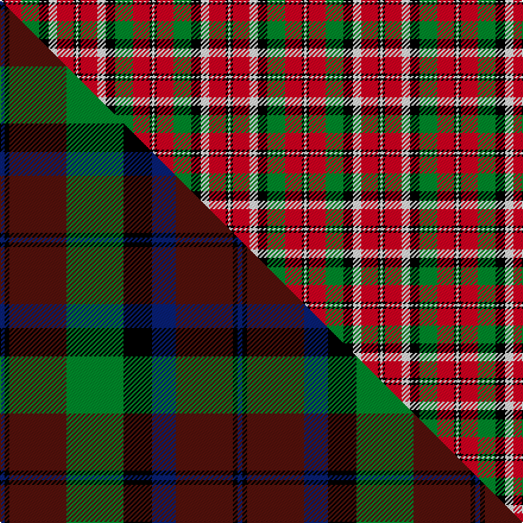

This is one **variant** — a specific cloth: this exact thread count and colourway, with its own
provenance below. It is one weaving of the [sett](/setts/w2k2r14g15k8w7r14k2w2/) (the scale-free proportion — the
same cloth at any scale or shade), whose colour order is pattern [WKRGKWRKW](/stripes/wkrgkwrkw/).

Part of the [Montrose](/tartans/m/mo/montrose-2/) tartan — the named design grouping this sett with its other cloths.

Sourced from weddslist.  It is a [9 stripe tartan](/stripes/stripes9/).

Original link [http://www.weddslist.com/cgi-bin/tartans/pg.pl?source=rb](http://www.weddslist.com/cgi-bin/tartans/pg.pl?source=rb)

Dataset <small>— provenance for this record, inherited from the source manifest</small>

<dl class="dataset-prov">
<dt>source</dt><dd><a href="/sources/weddslist/">Weddslist</a></dd>
<dt>data captured from</dt><dd><a href="https://github.com/thetartan/tartan-database/blob/master/data/weddslist/data.csv">https://github.com/thetartan/tartan-database/blob/master/data/weddslist/data.csv</a></dd>
<dt>data date</dt><dd>2016-11-17 <small>(dataset default)</small></dd>
<dt>licence</dt><dd><a href="https://creativecommons.org/licenses/by-nc-nd/4.0/">CC BY-NC-ND 4.0</a></dd>
</dl>

Capture chain <small>— the hands this data passed through, oldest first; each capture carries its own licence</small>

<ol class="capture-chain">
<li><a href="https://www.weddslist.com/tartans/">Weddslist</a> <small>the living privately compiled reference</small></li>
<li><a href="https://github.com/thetartan/tartan-database">thetartan/tartan-database</a> <small>2016-2017</small> · <a href="https://creativecommons.org/licenses/by-nc-nd/4.0/">CC BY-NC-ND 4.0</a> <small>Levko Kravets's frozen compilation — the capture we vendored, and where its CC licence text came from</small></li>
<li>this dictionary <small>captured 2026-06-10 · commit 5bf86c7566</small> <small>each re-capture is a git commit to data/sources</small></li>
</ol>

## Thread count
W/2 K2 R14 G15 K8 W7 R14 K2 W/2

One full sett is **128 threads**.

## Palette
<table><thead><tr><th>Colour</th><th>Shade</th><th>OKLCh</th></tr></thead><tbody><tr><td>G</td><td><code style="background-color:#008B2A;">#008B2A</code> <small style="color:#888">#008B2A</small></td><td><small style="color:#888">oklch(55.4% 0.170 145.9)</small></td></tr><tr><td>K</td><td><code style="background-color:#000000;">#000000</code> <small style="color:#888">#000000</small></td><td><small style="color:#888">oklch(0.0% 0.000 0.0)</small></td></tr><tr><td>W</td><td><code style="background-color:#F7F7F7;">#F7F7F7</code> <small style="color:#888">#F7F7F7</small></td><td><small style="color:#888">oklch(97.6% 0.000 89.9)</small></td></tr><tr><td>R</td><td><code style="background-color:#D60020;">#D60020</code> <small style="color:#888">#D60020</small></td><td><small style="color:#888">oklch(55.2% 0.224 25.5)</small></td></tr></tbody></table>

# Sample pattern

## Compared to the master

This cloth is one sett of its design; the master sett (the exemplar the design is anchored on) is below for comparison.

Its **ΔTartan distance** from the master is **5.16** — the same measure the nearest-tartans table ranks by (0 is identical; a re-scale of the same cloth is near 0, a recolour or a different proportion further).

<figure class="master-compare" style="margin:0">

this sett
master sett ★

<figcaption style="color:#888;font-size:smaller">One weave of this sett against the <a href="/setts/db1k1dr12g12k6db5dr12k1db1/">master sett ★</a>, split on the diagonal: a shared proportion runs seamlessly across it with only the shades shifting; a different proportion breaks on it.</figcaption>
</figure>

## Nearest tartan variants

The nearest existing variants by ΔTartan distance, with this cloth at the top so the swatches line up against it.

ΔTartan

Threads

Variant

Sett

—

128

<a href="/variants/s9/w2k2r14g15k8w7r14k2w2/">Montrose</a>

<a href="/ttd/edit/#slug=lb1k1r10g10k5lb5r10k1lb1~x4&amp;base=w2k2r14g15k8w7r14k2w2" title="compare in the TTD">1.95</a>

344

<a href="/variants/s9/lb1k1r10g10k5lb5r10k1lb1~x4/">Graham Red</a>

<a href="/ttd/edit/#slug=lb2k2r14g15k8lb7r14k2lb2~x2&amp;base=w2k2r14g15k8w7r14k2w2" title="compare in the TTD">2.00</a>

256

<a href="/variants/s9/lb2k2r14g15k8lb7r14k2lb2~x2/">Montrose</a>

<a href="/ttd/edit/#slug=lb2k2r14g15k8lb7r14k2lb2&amp;base=w2k2r14g15k8w7r14k2w2" title="compare in the TTD">2.00</a>

128

<a href="/variants/s9/lb2k2r14g15k8lb7r14k2lb2/">Montrose</a>

<a href="/ttd/edit/#slug=r4o30k6w13k13w3~x2&amp;base=w2k2r14g15k8w7r14k2w2" title="compare in the TTD">2.32</a>

262

<a href="/variants/s6/r4o30k6w13k13w3~x2/">Thom(p)son camel</a>

<a href="/ttd/edit/#slug=g3r22lb5g10k10g2~x2&amp;base=w2k2r14g15k8w7r14k2w2" title="compare in the TTD">2.48</a>

198

<a href="/variants/s6/g3r22lb5g10k10g2~x2/">Strathspey, Check</a>

<a href="/ttd/edit/#slug=k4w26k10lo8k3lo8k10r26w4~x2&amp;base=w2k2r14g15k8w7r14k2w2" title="compare in the TTD">2.48</a>

380

<a href="/variants/s9/k4w26k10lo8k3lo8k10r26w4~x2/">Lord Laird</a>

<a href="/ttd/edit/#slug=g14k5db2r21g18k4db18r9k2r12&amp;base=w2k2r14g15k8w7r14k2w2" title="compare in the TTD">2.66</a>

184

<a href="/variants/s10/g14k5db2r21g18k4db18r9k2r12/">Ruben Delanghe (Personal)</a>

<a href="/ttd/edit/#slug=dy6o2dy2o4dy13k12lo13o4lo2o2lo6~x2&amp;base=w2k2r14g15k8w7r14k2w2" title="compare in the TTD">2.71</a>

240

<a href="/variants/s11/dy6o2dy2o4dy13k12lo13o4lo2o2lo6~x2/">Glenmorangie (Corporate)</a>

<a href="/ttd/edit/#slug=w23k4w4k4w4k22o23ly5~x2~o2005046&amp;base=w2k2r14g15k8w7r14k2w2" title="compare in the TTD">2.72</a>

300

<a href="/variants/s8/w23k4w4k4w4k22o23ly5~x2~o2005046/">Aberlour</a>

<a href="/ttd/edit/#slug=y6k8g7r6k2r18w6~x4&amp;base=w2k2r14g15k8w7r14k2w2" title="compare in the TTD">2.72</a>

376

<a href="/variants/s7/y6k8g7r6k2r18w6~x4/">Thirkill (Dalgliesh)</a>

## Neighbour map

Every grey dot is one of 13656 variants placed by the first two principal components of the ΔTartan feature space (42% of its variance). Red is this tartan; blue dots are its nearest — click one to open its page. The map is a flat projection of a many-dimensional space — [how to read it](/posts/neighbourhood-maps/).

<svg viewBox="0 0 640 380" role="img" style="max-width:100%;height:auto;border:1px solid #e0e0e0;border-radius:4px;display:block" xmlns="http://www.w3.org/2000/svg"><image href="/nn/cloud.v1.png" width="640" height="380"/><a href="/variants/s9/lb1k1r10g10k5lb5r10k1lb1~x4/"><circle cx="177.3" cy="170.0" r="4" fill="#3465a4"><title>Graham Red</title></circle></a><a href="/variants/s9/lb2k2r14g15k8lb7r14k2lb2~x2/"><circle cx="145.3" cy="187.0" r="4" fill="#3465a4"><title>Montrose</title></circle></a><a href="/variants/s9/lb2k2r14g15k8lb7r14k2lb2/"><circle cx="145.3" cy="187.0" r="4" fill="#3465a4"><title>Montrose</title></circle></a><a href="/variants/s6/r4o30k6w13k13w3~x2/"><circle cx="166.2" cy="183.0" r="4" fill="#3465a4"><title>Thom(p)son camel</title></circle></a><a href="/variants/s6/g3r22lb5g10k10g2~x2/"><circle cx="178.8" cy="188.2" r="4" fill="#3465a4"><title>Strathspey, Check</title></circle></a><a href="/variants/s9/k4w26k10lo8k3lo8k10r26w4~x2/"><circle cx="89.5" cy="177.5" r="4" fill="#3465a4"><title>Lord Laird</title></circle></a><a href="/variants/s10/g14k5db2r21g18k4db18r9k2r12/"><circle cx="153.4" cy="186.7" r="4" fill="#3465a4"><title>Ruben Delanghe (Personal)</title></circle></a><a href="/variants/s11/dy6o2dy2o4dy13k12lo13o4lo2o2lo6~x2/"><circle cx="98.3" cy="192.0" r="4" fill="#3465a4"><title>Glenmorangie (Corporate)</title></circle></a><a href="/variants/s8/w23k4w4k4w4k22o23ly5~x2~o2005046/"><circle cx="105.6" cy="195.2" r="4" fill="#3465a4"><title>Aberlour</title></circle></a><a href="/variants/s7/y6k8g7r6k2r18w6~x4/"><circle cx="133.4" cy="186.5" r="4" fill="#3465a4"><title>Thirkill (Dalgliesh)</title></circle></a><circle cx="136.4" cy="184.5" r="5" fill="#c00000"/><text x="320" y="376" text-anchor="middle" font-size="11" fill="#999">ground</text><text x="11" y="190" text-anchor="middle" font-size="11" fill="#999" transform="rotate(-90 11 190)">complexity</text></svg>

ID: /variants/s9/w2k2r14g15k8w7r14k2w2/
