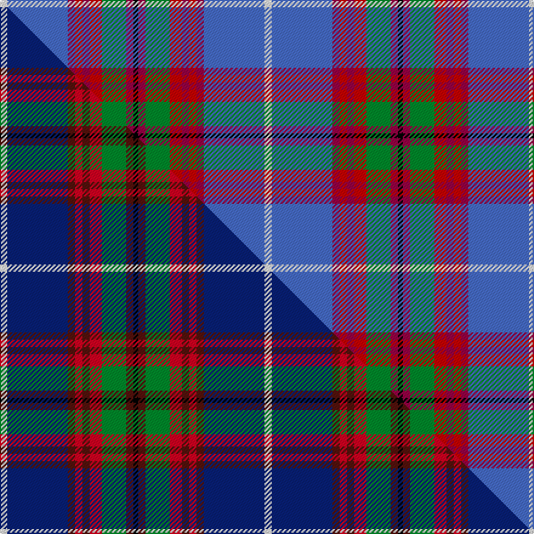

This is one **variant** — a specific cloth: this exact thread count and colourway, with its own
provenance below. It is one weaving of the [sett](/setts/w3b25r3ri3r3ri5g10r3k2/) (the scale-free proportion — the
same cloth at any scale or shade), whose colour order is pattern [KRGRRRRBW](/stripes/krgrrrrbw/).

Part of the [Edinburgh District](/tartans/edinburgh-district/) tartan — the named design grouping this sett with its other cloths.

Sourced from tartans-authority.  It is a [9 stripe tartan](/stripes/stripes9/).

Original link [https://www.tartanregister.gov.uk/tartanDetails.aspx?ref=1163](https://www.tartanregister.gov.uk/tartanDetails.aspx?ref=1163)

Dataset <small>— provenance for this record, inherited from the source manifest</small>

<dl class="dataset-prov">
<dt>source</dt><dd><a href="/sources/tartans-authority/">Scottish Tartans Authority</a></dd>
<dt>data captured from</dt><dd><a href="https://github.com/thetartan/tartan-database/blob/master/data/tartans-authority/data.csv">https://github.com/thetartan/tartan-database/blob/master/data/tartans-authority/data.csv</a></dd>
<dt>data date</dt><dd>1970 <small>(this record)</small></dd>
<dt>licence</dt><dd><a href="https://creativecommons.org/licenses/by-nc-nd/4.0/">CC BY-NC-ND 4.0</a></dd>
</dl>

Capture chain <small>— the hands this data passed through, oldest first; each capture carries its own licence</small>

<ol class="capture-chain">
<li><a href="https://www.tartansauthority.com/">Scottish Tartans Authority</a> <small>the heritage body's archive — its tartan-ferret record browser is retired (links repaired to the SRT, above)</small></li>
<li><a href="https://github.com/thetartan/tartan-database">thetartan/tartan-database</a> <small>2016-2017</small> · <a href="https://creativecommons.org/licenses/by-nc-nd/4.0/">CC BY-NC-ND 4.0</a> <small>Levko Kravets's frozen compilation — the capture we vendored, and where its CC licence text came from</small></li>
<li>this dictionary <small>captured 2026-06-10 · commit 5bf86c7566</small> <small>each re-capture is a git commit to data/sources</small></li>
</ol>

## Register references

External register numbers recorded for this tartan.

- Scottish Tartans Authority (ITI): 1163

## Thread count
W/6 B50 R6 Ri6 R6 Ri10 G20 R6 K/4

One full sett is **218 threads**.

## Palette
<table><thead><tr><th>Colour</th><th>Shade</th><th>OKLCh</th></tr></thead><tbody><tr><td>B</td><td><code style="background-color:#466CC8;">#466CC8</code> <small style="color:#888">#466CC8</small></td><td><small style="color:#888">oklch(55.1% 0.149 265.0)</small></td></tr><tr><td>G</td><td><code style="background-color:#008B2A;">#008B2A</code> <small style="color:#888">#008B2A</small></td><td><small style="color:#888">oklch(55.4% 0.170 145.9)</small></td></tr><tr><td>K</td><td><code style="background-color:#000000;">#000000</code> <small style="color:#888">#000000</small></td><td><small style="color:#888">oklch(0.0% 0.000 0.0)</small></td></tr><tr><td>R</td><td><code style="background-color:#980044;">#980044</code> <small style="color:#888">#980044</small></td><td><small style="color:#888">oklch(43.7% 0.175 5.3)</small></td></tr><tr><td>R</td><td><code style="background-color:#C80000;">#C80000</code> <small style="color:#888">#C80000</small></td><td><small style="color:#888">oklch(52.3% 0.215 29.2)</small></td></tr><tr><td>W</td><td><code style="background-color:#F7F7F7;">#F7F7F7</code> <small style="color:#888">#F7F7F7</small></td><td><small style="color:#888">oklch(97.6% 0.000 89.9)</small></td></tr></tbody></table>

# Sample pattern

## Compared to the master

This cloth is one sett of its design; the master sett (the exemplar the design is anchored on) is below for comparison.

Its **ΔTartan distance** from the master is **0.19** — the same measure the nearest-tartans table ranks by (0 is identical; a re-scale of the same cloth is near 0, a recolour or a different proportion further).

<figure class="master-compare" style="margin:0">

this sett
master sett ★

<figcaption style="color:#888;font-size:smaller">One weave of this sett against the <a href="/setts/w3db25dr3r3dr3r5g10dr3k2/">master sett ★</a>, split on the diagonal: a shared proportion runs seamlessly across it with only the shades shifting; a different proportion breaks on it.</figcaption>
</figure>

## Nearest tartan variants

The nearest existing variants by ΔTartan distance, with this cloth at the top so the swatches line up against it.

ΔTartan

Threads

Variant

Sett

—

218

<a href="/variants/s9/w3b25r3ri3r3ri5g10r3k2~x2~r1707008-ri2109032/">Edinburgh District (District)</a>

<a href="/ttd/edit/#slug=w3db25r3ri3r3ri5g10r3k2~x2~r1506028-ri2008029&amp;base=w3b25r3ri3r3ri5g10r3k2~x2~r1707008-ri2109032" title="compare in the TTD">0.18</a>

218

<a href="/variants/s9/w3db25r3ri3r3ri5g10r3k2~x2~r1506028-ri2008029/">Edinburgh District</a>

<a href="/ttd/edit/#slug=w3db25dr3r3dr3r5g10dr3k2~x2&amp;base=w3b25r3ri3r3ri5g10r3k2~x2~r1707008-ri2109032" title="compare in the TTD">0.19</a>

218

<a href="/variants/s9/w3db25dr3r3dr3r5g10dr3k2~x2/">Edinburgh District</a>

<a href="/ttd/edit/#slug=w3lb25dr3r3dr3r8g21dr3k2~x2&amp;base=w3b25r3ri3r3ri5g10r3k2~x2~r1707008-ri2109032" title="compare in the TTD">0.69</a>

274

<a href="/variants/s9/w3lb25dr3r3dr3r8g21dr3k2~x2/">Dunedin (USA) (District)</a>

<a href="/ttd/edit/#slug=w8db50k4r8k6r12g17dp7k4&amp;base=w3b25r3ri3r3ri5g10r3k2~x2~r1707008-ri2109032" title="compare in the TTD">2.15</a>

220

<a href="/variants/s9/w8db50k4r8k6r12g17dp7k4/">Edinburgh</a>

<a href="/ttd/edit/#slug=w3db22k2r3k2r5g7b2k2~x2&amp;base=w3b25r3ri3r3ri5g10r3k2~x2~r1707008-ri2109032" title="compare in the TTD">2.20</a>

182

<a href="/variants/s9/w3db22k2r3k2r5g7b2k2~x2/">Edinburgh</a>

<a href="/ttd/edit/#slug=k3ri3g21r8ri3r4k3db26w3~x2~ri2008029-r1707016&amp;base=w3b25r3ri3r3ri5g10r3k2~x2~r1707008-ri2109032" title="compare in the TTD">2.36</a>

284

<a href="/variants/s9/k3ri3g21r8ri3r4k3db26w3~x2~ri2008029-r1707016/">Dunedin</a>

<a href="/ttd/edit/#slug=db46y4db4y4db6k16n66w11r6&amp;base=w3b25r3ri3r3ri5g10r3k2~x2~r1707008-ri2109032" title="compare in the TTD">2.64</a>

274

<a href="/variants/s9/db46y4db4y4db6k16n66w11r6/">Scottish Association for N.S. (Corp)</a>

<a href="/ttd/edit/#slug=r4t3lr2k2lr12k2db10ti25w2~x2~lr2800000-ti2503227&amp;base=w3b25r3ri3r3ri5g10r3k2~x2~r1707008-ri2109032" title="compare in the TTD">2.70</a>

236

<a href="/variants/s9/r4t3lr2k2lr12k2db10ti25w2~x2~lr2800000-ti2503227/">O'Reilly (Estimated threadcount)</a>

<a href="/ttd/edit/#slug=db46y4db4y4db6k16n66lb11r6&amp;base=w3b25r3ri3r3ri5g10r3k2~x2~r1707008-ri2109032" title="compare in the TTD">2.70</a>

274

<a href="/variants/s9/db46y4db4y4db6k16n66lb11r6/">Scottish Association for Neurological Sciences</a>

<a href="/ttd/edit/#slug=db4dy3db22r6w2k6w2db6n20k3n4~x2~db1406275-w4000000&amp;base=w3b25r3ri3r3ri5g10r3k2~x2~r1707008-ri2109032" title="compare in the TTD">2.76</a>

296

<a href="/variants/s11/db4dy3db22r6w2k6w2db6n20k3n4~x2~db1406275-w4000000/">Asman Hunting Family Tartan</a>

## Neighbour map

Every grey dot is one of 13621 variants placed by the first two principal components of the ΔTartan feature space (42% of its variance). Red is this tartan; blue dots are its nearest — click one to open its page.

<svg viewBox="0 0 640 380" role="img" style="max-width:100%;height:auto;border:1px solid #e0e0e0;border-radius:4px;display:block" xmlns="http://www.w3.org/2000/svg"><image href="/nn/cloud.v1.png" width="640" height="380"/><a href="/variants/s9/w3db25r3ri3r3ri5g10r3k2~x2~r1506028-ri2008029/"><circle cx="167.3" cy="123.4" r="4" fill="#3465a4"><title>Edinburgh District</title></circle></a><a href="/variants/s9/w3db25dr3r3dr3r5g10dr3k2~x2/"><circle cx="171.7" cy="127.6" r="4" fill="#3465a4"><title>Edinburgh District</title></circle></a><a href="/variants/s9/w3lb25dr3r3dr3r8g21dr3k2~x2/"><circle cx="134.8" cy="135.4" r="4" fill="#3465a4"><title>Dunedin (USA) (District)</title></circle></a><a href="/variants/s9/w8db50k4r8k6r12g17dp7k4/"><circle cx="141.2" cy="120.1" r="4" fill="#3465a4"><title>Edinburgh</title></circle></a><a href="/variants/s9/w3db22k2r3k2r5g7b2k2~x2/"><circle cx="156.1" cy="119.3" r="4" fill="#3465a4"><title>Edinburgh</title></circle></a><a href="/variants/s9/k3ri3g21r8ri3r4k3db26w3~x2~ri2008029-r1707016/"><circle cx="110.0" cy="144.5" r="4" fill="#3465a4"><title>Dunedin</title></circle></a><a href="/variants/s9/db46y4db4y4db6k16n66w11r6/"><circle cx="188.1" cy="117.4" r="4" fill="#3465a4"><title>Scottish Association for N.S. (Corp)</title></circle></a><a href="/variants/s9/r4t3lr2k2lr12k2db10ti25w2~x2~lr2800000-ti2503227/"><circle cx="152.5" cy="128.5" r="4" fill="#3465a4"><title>O'Reilly (Estimated threadcount)</title></circle></a><a href="/variants/s9/db46y4db4y4db6k16n66lb11r6/"><circle cx="204.6" cy="122.7" r="4" fill="#3465a4"><title>Scottish Association for Neurological Sciences</title></circle></a><a href="/variants/s11/db4dy3db22r6w2k6w2db6n20k3n4~x2~db1406275-w4000000/"><circle cx="164.5" cy="140.1" r="4" fill="#3465a4"><title>Asman Hunting Family Tartan</title></circle></a><circle cx="182.6" cy="129.2" r="5" fill="#c00000"/><text x="320" y="376" text-anchor="middle" font-size="11" fill="#999">ground</text><text x="11" y="190" text-anchor="middle" font-size="11" fill="#999" transform="rotate(-90 11 190)">complexity</text></svg>

ID: /variants/s9/w3b25r3ri3r3ri5g10r3k2~x2~r1707008-ri2109032/
