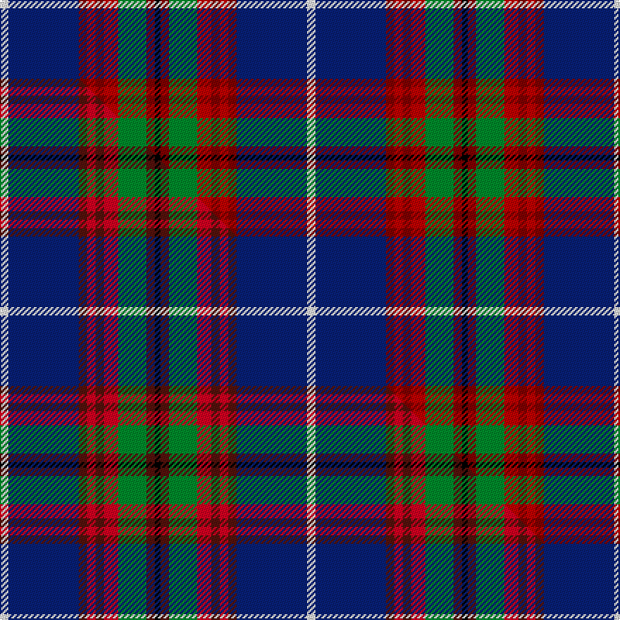

This page is one **sett** — a single exact thread-count. It belongs to the [tartan](/setts/w3db25r3ri3r3ri5g10r3k2/)
(the same proportion at any scale), whose colour order is pattern [KRGRRRRBW](/stripes/krgrrrrbw/).

Part of the [Edinburgh District](/tartans/edinburgh-district/) tartan — the named design grouping this sett with its other cloths.

Sourced from weddslist.  It is a [9 stripe tartan](/stripes/stripes9/).

Original link http://www.weddslist.com/cgi-bin/tartans/pg.pl?source=sts

## Thread count
W/6 DB50 R6 Ri6 R6 Ri10 G20 R6 K/4

One full sett is **218 threads**.

## Palette
<table><thead><tr><th>Colour</th><th>Shade</th><th>OKLCh</th></tr></thead><tbody><tr><td>DB</td><td><code style="background-color:#082077;">#082077</code> <small style="color:#888">#082077</small></td><td><small style="color:#888">oklch(30.0% 0.149 265.1)</small></td></tr><tr><td>R</td><td><code style="background-color:#800000;">#800000</code> <small style="color:#888">#800000</small></td><td><small style="color:#888">oklch(37.7% 0.155 29.2)</small></td></tr><tr><td>G</td><td><code style="background-color:#008B2A;">#008B2A</code> <small style="color:#888">#008B2A</small></td><td><small style="color:#888">oklch(55.4% 0.170 145.9)</small></td></tr><tr><td>K</td><td><code style="background-color:#000000;">#000000</code> <small style="color:#888">#000000</small></td><td><small style="color:#888">oklch(0.0% 0.000 0.0)</small></td></tr><tr><td>W</td><td><code style="background-color:#F7F7F7;">#F7F7F7</code> <small style="color:#888">#F7F7F7</small></td><td><small style="color:#888">oklch(97.6% 0.000 89.9)</small></td></tr><tr><td>R</td><td><code style="background-color:#C00000;">#C00000</code> <small style="color:#888">#C00000</small></td><td><small style="color:#888">oklch(50.7% 0.208 29.2)</small></td></tr></tbody></table>

# Sample pattern

## Compared to the master

This cloth is one sett of its design; the master sett (the exemplar the design is anchored on) is below for comparison.

Its **ΔTartan distance** from the master is **0.42** — the same measure the nearest-tartans table ranks by (0 is identical; a re-scale of the same cloth is near 0, a recolour or a different proportion further).

<figure class="master-compare" style="margin:0">

this sett
master sett ★

<figcaption style="color:#888;font-size:smaller">One weave of this sett against the <a href="/setts/w3db25dr3r3dr3r5g10dr3k2/">master sett ★</a>, split on the diagonal: a shared proportion runs seamlessly across it with only the shades shifting; a different proportion breaks on it.</figcaption>
</figure>

## Nearest variants

The nearest existing variants by ΔTartan distance, with this cloth at the top so the swatches line up against it.

ΔTartan

Threads

Variant

Sett

—

218

<a href="/variants/s9/w3db25r3ri3r3ri5g10r3k2~x2~r1506028-ri2008029/">Edinburgh District</a>

<a href="/ttd/edit/#slug=w3db25dr3r3dr3r5g10dr3k2~x2&amp;base=w3db25r3ri3r3ri5g10r3k2~x2~r1506028-ri2008029" title="compare in the TTD">0.00</a>

218

<a href="/variants/s9/w3db25dr3r3dr3r5g10dr3k2~x2/">Edinburgh District</a>

<a href="/ttd/edit/#slug=w3b25r3ri3r3ri5g10r3k2~x2~r1707008-ri2109032&amp;base=w3db25r3ri3r3ri5g10r3k2~x2~r1506028-ri2008029" title="compare in the TTD">0.00</a>

218

<a href="/variants/s9/w3b25r3ri3r3ri5g10r3k2~x2~r1707008-ri2109032/">Edinburgh District (District)</a>

<a href="/ttd/edit/#slug=w8db50k4r8k6r12g17dp7k4&amp;base=w3db25r3ri3r3ri5g10r3k2~x2~r1506028-ri2008029" title="compare in the TTD">2.13</a>

220

<a href="/variants/s9/w8db50k4r8k6r12g17dp7k4/">Edinburgh</a>

<a href="/ttd/edit/#slug=w3db22k2r3k2r5g7b2k2~x2&amp;base=w3db25r3ri3r3ri5g10r3k2~x2~r1506028-ri2008029" title="compare in the TTD">2.23</a>

182

<a href="/variants/s9/w3db22k2r3k2r5g7b2k2~x2/">Edinburgh</a>

<a href="/ttd/edit/#slug=k3ri3g21r8ri3r4k3db26w3~x2~ri2008029-r1707016&amp;base=w3db25r3ri3r3ri5g10r3k2~x2~r1506028-ri2008029" title="compare in the TTD">2.30</a>

284

<a href="/variants/s9/k3ri3g21r8ri3r4k3db26w3~x2~ri2008029-r1707016/">Dunedin</a>

## Neighbour map

Every grey dot is one of 13620 variants placed by the first two principal components of the ΔTartan feature space (42% of its variance). Red is this tartan; blue dots are its nearest — click one to open its page.

<svg viewBox="0 0 640 380" role="img" style="max-width:100%;height:auto;border:1px solid #e0e0e0;border-radius:4px;display:block" xmlns="http://www.w3.org/2000/svg"><image href="/nn/cloud.v1.png" width="640" height="380"/><a href="/variants/s9/w3db25dr3r3dr3r5g10dr3k2~x2/"><circle cx="171.7" cy="127.5" r="4" fill="#3465a4"><title>Edinburgh District</title></circle></a><a href="/variants/s9/w3b25r3ri3r3ri5g10r3k2~x2~r1707008-ri2109032/"><circle cx="182.6" cy="129.1" r="4" fill="#3465a4"><title>Edinburgh District (District)</title></circle></a><a href="/variants/s9/w8db50k4r8k6r12g17dp7k4/"><circle cx="141.2" cy="120.0" r="4" fill="#3465a4"><title>Edinburgh</title></circle></a><a href="/variants/s9/w3db22k2r3k2r5g7b2k2~x2/"><circle cx="156.1" cy="119.2" r="4" fill="#3465a4"><title>Edinburgh</title></circle></a><a href="/variants/s9/k3ri3g21r8ri3r4k3db26w3~x2~ri2008029-r1707016/"><circle cx="110.0" cy="144.4" r="4" fill="#3465a4"><title>Dunedin</title></circle></a><circle cx="167.3" cy="123.3" r="5" fill="#c00000"/><text x="320" y="376" text-anchor="middle" font-size="11" fill="#999">ground</text><text x="11" y="190" text-anchor="middle" font-size="11" fill="#999" transform="rotate(-90 11 190)">complexity</text></svg>

ID: /variants/s9/w3db25r3ri3r3ri5g10r3k2~x2~r1506028-ri2008029/
