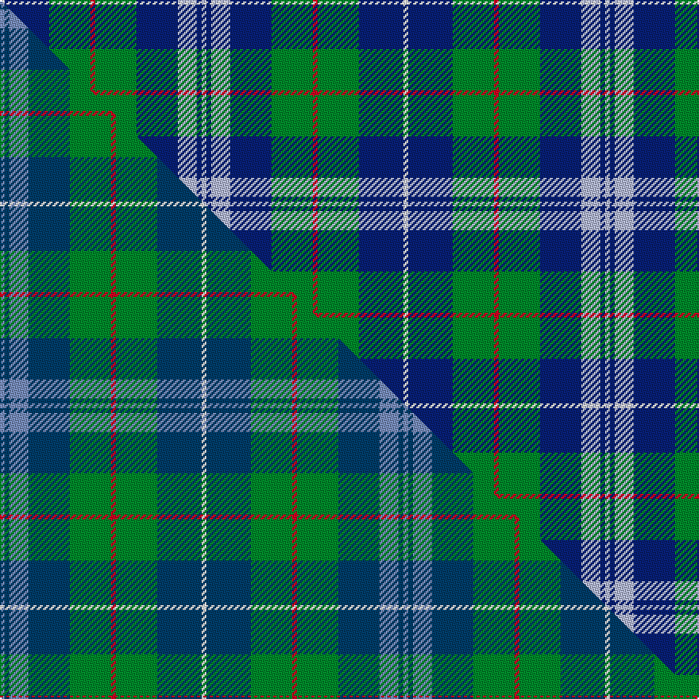

This is one **variant** — a specific cloth: this exact thread count and colourway, with its own
provenance below. It is one weaving of the [sett](/setts/w3db28g26r3g26db26lb12db3lb3/) (the scale-free proportion — the
same cloth at any scale or shade), whose colour order is pattern [WBGRGBWBW](/stripes/wbgrgbwbw/).

Part of the [Seaford House](/tartans/s/se/seaford-house/) tartan — the named design grouping this sett with its other cloths.

Sourced from tartans-authority.  It is a [9 stripe tartan](/stripes/stripes9/).

Original link [https://www.tartanregister.gov.uk/tartanDetails.aspx?ref=11045](https://www.tartanregister.gov.uk/tartanDetails.aspx?ref=11045)

Dataset <small>— provenance for this record, inherited from the source manifest</small>

<dl class="dataset-prov">
<dt>source</dt><dd><a href="/sources/tartans-authority/">Scottish Tartans Authority</a></dd>
<dt>data captured from</dt><dd><a href="https://github.com/thetartan/tartan-database/blob/master/data/tartans-authority/data.csv">https://github.com/thetartan/tartan-database/blob/master/data/tartans-authority/data.csv</a></dd>
<dt>data date</dt><dd>2014 <small>(this record)</small></dd>
<dt>licence</dt><dd><a href="https://creativecommons.org/licenses/by-nc-nd/4.0/">CC BY-NC-ND 4.0</a></dd>
</dl>

Capture chain <small>— the hands this data passed through, oldest first; each capture carries its own licence</small>

<ol class="capture-chain">
<li><a href="https://www.tartansauthority.com/">Scottish Tartans Authority</a> <small>the heritage body's archive — its tartan-ferret record browser is retired (links repaired to the SRT, above)</small></li>
<li><a href="https://github.com/thetartan/tartan-database">thetartan/tartan-database</a> <small>2016-2017</small> · <a href="https://creativecommons.org/licenses/by-nc-nd/4.0/">CC BY-NC-ND 4.0</a> <small>Levko Kravets's frozen compilation — the capture we vendored, and where its CC licence text came from</small></li>
<li>this dictionary <small>captured 2026-06-10 · commit 5bf86c7566</small> <small>each re-capture is a git commit to data/sources</small></li>
</ol>

## Register references

External register numbers recorded for this tartan.

- Scottish Register of Tartans: [11045](https://www.tartanregister.gov.uk/tartanDetails?ref=11045)
- Scottish Tartans Authority (ITI): 11045

## Thread count
W/3 DB28 G26 R3 G26 DB26 LB12 DB3 LB/3

One full sett is **254 threads**.

## Palette
<table><thead><tr><th>Colour</th><th>Shade</th><th>OKLCh</th></tr></thead><tbody><tr><td>DB</td><td><code style="background-color:#082077;">#082077</code> <small style="color:#888">#082077</small></td><td><small style="color:#888">oklch(30.0% 0.149 265.1)</small></td></tr><tr><td>G</td><td><code style="background-color:#008B2A;">#008B2A</code> <small style="color:#888">#008B2A</small></td><td><small style="color:#888">oklch(55.4% 0.170 145.9)</small></td></tr><tr><td>LB</td><td><code style="background-color:#B5BBDE;">#B5BBDE</code> <small style="color:#888">#B5BBDE</small></td><td><small style="color:#888">oklch(79.9% 0.050 277.6)</small></td></tr><tr><td>R</td><td><code style="background-color:#D60020;">#D60020</code> <small style="color:#888">#D60020</small></td><td><small style="color:#888">oklch(55.2% 0.224 25.5)</small></td></tr><tr><td>W</td><td><code style="background-color:#F7F7F7;">#F7F7F7</code> <small style="color:#888">#F7F7F7</small></td><td><small style="color:#888">oklch(97.6% 0.000 89.9)</small></td></tr></tbody></table>

# Sample pattern

## Compared to the master

This cloth is one sett of its design; the master sett (the exemplar the design is anchored on) is below for comparison.

Its **ΔTartan distance** from the master is **0.10** — the same measure the nearest-tartans table ranks by (0 is identical; a re-scale of the same cloth is near 0, a recolour or a different proportion further).

<figure class="master-compare" style="margin:0">

this sett
master sett ★

<figcaption style="color:#888;font-size:smaller">One weave of this sett against the <a href="/setts/b3db3b12db26g26r3g26db28w3/">master sett ★</a>, split on the diagonal: a shared proportion runs seamlessly across it with only the shades shifting; a different proportion breaks on it.</figcaption>
</figure>

## Nearest tartan variants

The nearest existing variants by ΔTartan distance, with this cloth at the top so the swatches line up against it.

ΔTartan

Threads

Variant

Sett

—

254

<a href="/variants/s9/w3db28g26r3g26db26lb12db3lb3/">Seaford House</a>

<a href="/ttd/edit/#slug=b3db3b12db26g26r3g26db28w3~b2603265-db1404245&amp;base=w3db28g26r3g26db26lb12db3lb3" title="compare in the TTD">0.11</a>

254

<a href="/variants/s9/b3db3b12db26g26r3g26db28w3~b2603265-db1404245/">Seaford House</a>

<a href="/ttd/edit/#slug=db1dy4g8y1g8db12w1db2r1~x4&amp;base=w3db28g26r3g26db26lb12db3lb3" title="compare in the TTD">1.65</a>

296

<a href="/variants/s9/db1dy4g8y1g8db12w1db2r1~x4/">Connor (Personal)</a>

<a href="/ttd/edit/#slug=db3g4db24g6w3g4r3g8ly3~x2&amp;base=w3db28g26r3g26db26lb12db3lb3" title="compare in the TTD">1.88</a>

220

<a href="/variants/s9/db3g4db24g6w3g4r3g8ly3~x2/">Scottish Borders Tourist Board (Corp</a>

<a href="/ttd/edit/#slug=g21db4w4db32g12y4g8r4g6db12&amp;base=w3db28g26r3g26db26lb12db3lb3" title="compare in the TTD">2.04</a>

181

<a href="/variants/s10/g21db4w4db32g12y4g8r4g6db12/">Harkness Hunting</a>

<a href="/ttd/edit/#slug=g5db2g14db14r2db14w2g14r2g4lo3~x2&amp;base=w3db28g26r3g26db26lb12db3lb3" title="compare in the TTD">2.09</a>

288

<a href="/variants/s11/g5db2g14db14r2db14w2g14r2g4lo3~x2/">Hunter of Hunterston (Clan)</a>

<a href="/ttd/edit/#slug=k7db4g31db3y2db27lb4~x2&amp;base=w3db28g26r3g26db26lb12db3lb3" title="compare in the TTD">2.21</a>

290

<a href="/variants/s7/k7db4g31db3y2db27lb4~x2/">Wishart Htg (Clan)</a>

<a href="/ttd/edit/#slug=db15w2g2ly15r3db21r3g15~x2&amp;base=w3db28g26r3g26db26lb12db3lb3" title="compare in the TTD">2.26</a>

244

<a href="/variants/s8/db15w2g2ly15r3db21r3g15~x2/">Loyalhanna</a>

<a href="/ttd/edit/#slug=w4g28db18r4db18y3~x2&amp;base=w3db28g26r3g26db26lb12db3lb3" title="compare in the TTD">2.33</a>

286

<a href="/variants/s6/w4g28db18r4db18y3~x2/">Inglis Family Tartan</a>

<a href="/ttd/edit/#slug=db3r3db36g17y2g21w2r3~x2&amp;base=w3db28g26r3g26db26lb12db3lb3" title="compare in the TTD">2.34</a>

336

<a href="/variants/s8/db3r3db36g17y2g21w2r3~x2/">Singh Name Tartan</a>

<a href="/ttd/edit/#slug=db22g6db5lb2g22r6g5r4g9w3~x2&amp;base=w3db28g26r3g26db26lb12db3lb3" title="compare in the TTD">2.36</a>

286

<a href="/variants/s10/db22g6db5lb2g22r6g5r4g9w3~x2/">MacConnell Clan Tartan</a>

## Neighbour map

Every grey dot is one of 13621 variants placed by the first two principal components of the ΔTartan feature space (42% of its variance). Red is this tartan; blue dots are its nearest — click one to open its page. The map is a flat projection of a many-dimensional space — [how to read it](/posts/neighbourhood-maps/).

<svg viewBox="0 0 640 380" role="img" style="max-width:100%;height:auto;border:1px solid #e0e0e0;border-radius:4px;display:block" xmlns="http://www.w3.org/2000/svg"><image href="/nn/cloud.v1.png" width="640" height="380"/><a href="/variants/s9/b3db3b12db26g26r3g26db28w3~b2603265-db1404245/"><circle cx="250.1" cy="213.6" r="4" fill="#3465a4"><title>Seaford House</title></circle></a><a href="/variants/s9/db1dy4g8y1g8db12w1db2r1~x4/"><circle cx="215.1" cy="169.6" r="4" fill="#3465a4"><title>Connor (Personal)</title></circle></a><a href="/variants/s9/db3g4db24g6w3g4r3g8ly3~x2/"><circle cx="221.2" cy="181.9" r="4" fill="#3465a4"><title>Scottish Borders Tourist Board (Corp</title></circle></a><a href="/variants/s10/g21db4w4db32g12y4g8r4g6db12/"><circle cx="223.8" cy="196.4" r="4" fill="#3465a4"><title>Harkness Hunting</title></circle></a><a href="/variants/s11/g5db2g14db14r2db14w2g14r2g4lo3~x2/"><circle cx="224.2" cy="199.5" r="4" fill="#3465a4"><title>Hunter of Hunterston (Clan)</title></circle></a><a href="/variants/s7/k7db4g31db3y2db27lb4~x2/"><circle cx="222.6" cy="155.8" r="4" fill="#3465a4"><title>Wishart Htg (Clan)</title></circle></a><a href="/variants/s8/db15w2g2ly15r3db21r3g15~x2/"><circle cx="195.7" cy="190.2" r="4" fill="#3465a4"><title>Loyalhanna</title></circle></a><a href="/variants/s6/w4g28db18r4db18y3~x2/"><circle cx="236.0" cy="214.9" r="4" fill="#3465a4"><title>Inglis Family Tartan</title></circle></a><a href="/variants/s8/db3r3db36g17y2g21w2r3~x2/"><circle cx="275.2" cy="156.9" r="4" fill="#3465a4"><title>Singh Name Tartan</title></circle></a><a href="/variants/s10/db22g6db5lb2g22r6g5r4g9w3~x2/"><circle cx="235.7" cy="179.5" r="4" fill="#3465a4"><title>MacConnell Clan Tartan</title></circle></a><circle cx="207.3" cy="197.8" r="5" fill="#c00000"/><text x="320" y="376" text-anchor="middle" font-size="11" fill="#999">ground</text><text x="11" y="190" text-anchor="middle" font-size="11" fill="#999" transform="rotate(-90 11 190)">complexity</text></svg>

ID: /variants/s9/w3db28g26r3g26db26lb12db3lb3/
