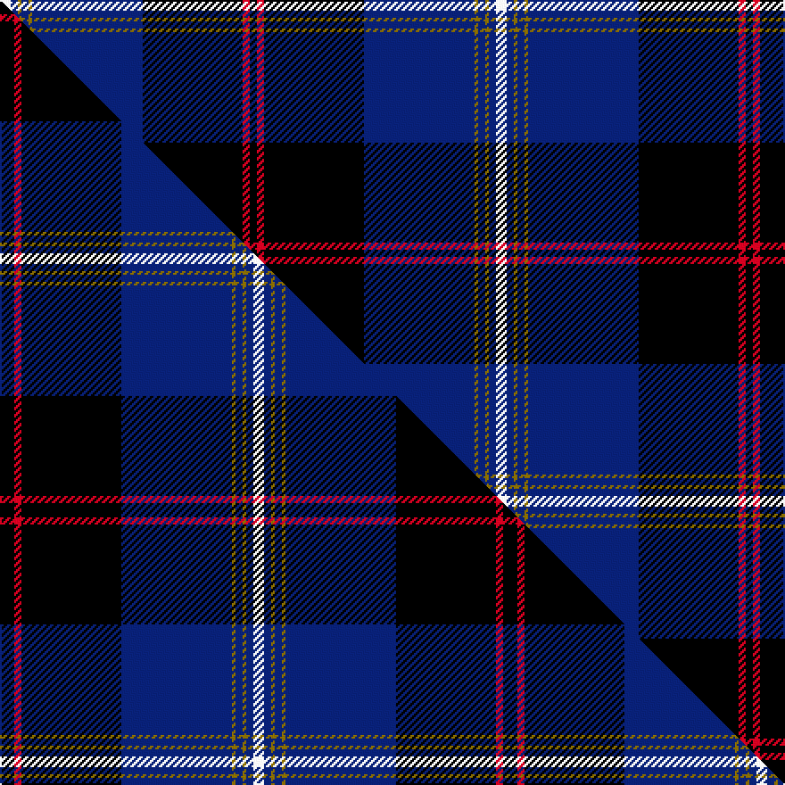

This is one **variant** — a specific cloth: this exact thread count and colourway, with its own
provenance below. It is one weaving of the [sett](/setts/w3db2y1db2y1db31k28r2k2/) (the scale-free proportion — the
same cloth at any scale or shade), whose colour order is pattern [KRKBGBGBW](/stripes/krkbgbgbw/).

Part of the [Hill](/tartans/h/hi/hill/) tartan — the named design grouping this sett with its other cloths.

Sourced from tartans-authority.  It is a [9 stripe tartan](/stripes/stripes9/).

Original link [https://www.tartanregister.gov.uk/tartanDetails.aspx?ref=10013](https://www.tartanregister.gov.uk/tartanDetails.aspx?ref=10013)

## Provenance

Earliest known date: Mar. 2009 An important branch of the Hills was based in Angus from the mid 15th century and this design by James Hill reflects that with its use of the Angus District tartan as its inspiration. The blue, silver and gold are features of the arms of the designer's family and other such families as Hill of Lambhill, Hill of Merrylees and the designer.

2 attestations — the source records this cloth was collapsed from (oldest owns this page)

<ul>
<li>Mar. 2009 — Hill (Name) (tartans-authority, <a href="https://www.tartanregister.gov.uk/tartanDetails.aspx?ref=10013">record</a>)  <em>Can be worn by all of the name. An important branch of the Hills was based in Angus from the mid 15th century and this design by James Hill reflects that with its use of the Angus District tartan as its inspiration. The blue, silver and gold are features of the arms of the designer's family and other such families as Hill of Lambhill, Hill of Merrylees and the designer.</em></li>
<li>undated — Hill Name Tartan (house-of-tartan, <a href="http://www.house-of-tartan.scotland.net/house/TartanViewjs.asp?colr=Def&tnam=10013">record</a>) </li>
</ul>

Dataset <small>— provenance for this record, inherited from the source manifest</small>

<dl class="dataset-prov">
<dt>source</dt><dd><a href="/sources/tartans-authority/">Scottish Tartans Authority</a></dd>
<dt>data captured from</dt><dd><a href="https://github.com/thetartan/tartan-database/blob/master/data/tartans-authority/data.csv">https://github.com/thetartan/tartan-database/blob/master/data/tartans-authority/data.csv</a></dd>
<dt>data date</dt><dd>Mar. 2009 <small>(this record)</small></dd>
<dt>licence</dt><dd><a href="https://creativecommons.org/licenses/by-nc-nd/4.0/">CC BY-NC-ND 4.0</a></dd>
</dl>

Capture chain <small>— the hands this data passed through, oldest first; each capture carries its own licence</small>

<ol class="capture-chain">
<li><a href="https://www.tartansauthority.com/">Scottish Tartans Authority</a> <small>the heritage body's archive — its tartan-ferret record browser is retired (links repaired to the SRT, above)</small></li>
<li><a href="https://github.com/thetartan/tartan-database">thetartan/tartan-database</a> <small>2016-2017</small> · <a href="https://creativecommons.org/licenses/by-nc-nd/4.0/">CC BY-NC-ND 4.0</a> <small>Levko Kravets's frozen compilation — the capture we vendored, and where its CC licence text came from</small></li>
<li>this dictionary <small>captured 2026-06-10 · commit 5bf86c7566</small> <small>each re-capture is a git commit to data/sources</small></li>
</ol>

## Register references

External register numbers recorded for this tartan.

- Scottish Register of Tartans: [10013](https://www.tartanregister.gov.uk/tartanDetails?ref=10013)
- Scottish Tartans Authority (ITI): 10013

## Thread count
W/6 DB4 Y2 DB4 Y2 DB62 K56 R4 K/4

One full sett is **278 threads**.

## Palette
<table><thead><tr><th>Colour</th><th>Shade</th><th>OKLCh</th></tr></thead><tbody><tr><td>DB</td><td><code style="background-color:#082077;">#082077</code> <small style="color:#888">#082077</small></td><td><small style="color:#888">oklch(30.0% 0.149 265.1)</small></td></tr><tr><td>K</td><td><code style="background-color:#000000;">#000000</code> <small style="color:#888">#000000</small></td><td><small style="color:#888">oklch(0.0% 0.000 0.0)</small></td></tr><tr><td>W</td><td><code style="background-color:#F7F7F7;">#F7F7F7</code> <small style="color:#888">#F7F7F7</small></td><td><small style="color:#888">oklch(97.6% 0.000 89.9)</small></td></tr><tr><td>R</td><td><code style="background-color:#D60020;">#D60020</code> <small style="color:#888">#D60020</small></td><td><small style="color:#888">oklch(55.2% 0.224 25.5)</small></td></tr><tr><td>Y</td><td><code style="background-color:#8B6E00;">#8B6E00</code> <small style="color:#888">#8B6E00</small></td><td><small style="color:#888">oklch(55.1% 0.113 90.4)</small></td></tr></tbody></table>

# Sample pattern

## Compared to the master

This cloth is one sett of its design; the master sett (the exemplar the design is anchored on) is below for comparison.

Its **ΔTartan distance** from the master is **0.07** — the same measure the nearest-tartans table ranks by (0 is identical; a re-scale of the same cloth is near 0, a recolour or a different proportion further).

<figure class="master-compare" style="margin:0">

this sett
master sett ★

<figcaption style="color:#888;font-size:smaller">One weave of this sett against the <a href="/setts/k4r2k28db31y1db2y1db2w3/">master sett ★</a>, split on the diagonal: a shared proportion runs seamlessly across it with only the shades shifting; a different proportion breaks on it.</figcaption>
</figure>

## Nearest tartan variants

The nearest existing variants by ΔTartan distance, with this cloth at the top so the swatches line up against it.

ΔTartan

Threads

Variant

Sett

—

278

<a href="/variants/s9/w3db2y1db2y1db31k28r2k2~x2/">Hill (Name)</a>

<a href="/ttd/edit/#slug=k4r2k28db31y1db2y1db2w3~x2&amp;base=w3db2y1db2y1db31k28r2k2~x2" title="compare in the TTD">0.07</a>

282

<a href="/variants/s9/k4r2k28db31y1db2y1db2w3~x2/">Hill</a>

<a href="/ttd/edit/#slug=db18w2db2r3db21k28dy1k1g2~x2&amp;base=w3db2y1db2y1db31k28r2k2~x2" title="compare in the TTD">1.69</a>

272

<a href="/variants/s9/db18w2db2r3db21k28dy1k1g2~x2/">St Andrew's College</a>

<a href="/ttd/edit/#slug=k1db5w2k30db30k1db1k1~x2&amp;base=w3db2y1db2y1db31k28r2k2~x2" title="compare in the TTD">1.72</a>

280

<a href="/variants/s8/k1db5w2k30db30k1db1k1~x2/">Binder Wedding (Personal) Name Tartan</a>

<a href="/ttd/edit/#slug=db30r2db2r4db9k26w2k4~x2&amp;base=w3db2y1db2y1db31k28r2k2~x2" title="compare in the TTD">1.86</a>

248

<a href="/variants/s8/db30r2db2r4db9k26w2k4~x2/">Murdoch Celebration (Personal)</a>

<a href="/ttd/edit/#slug=k8y1k1db28k12g2k1lb2~x2&amp;base=w3db2y1db2y1db31k28r2k2~x2" title="compare in the TTD">1.98</a>

200

<a href="/variants/s8/k8y1k1db28k12g2k1lb2~x2/">Weir Clan Tartan</a>

<a href="/ttd/edit/#slug=db5lb2w1lb2k32db3k4db29k2dbi1k3db3~x2~db1404245-dbi1406275&amp;base=w3db2y1db2y1db31k28r2k2~x2" title="compare in the TTD">2.09</a>

332

<a href="/variants/s12/db5lb2w1lb2k32db3k4db29k2dbi1k3db3~x2~db1404245-dbi1406275/">Grampian Police</a>

<a href="/ttd/edit/#slug=k1w1k18db20w1r1y1~x4&amp;base=w3db2y1db2y1db31k28r2k2~x2" title="compare in the TTD">2.23</a>

336

<a href="/variants/s7/k1w1k18db20w1r1y1~x4/">Fuller of Hopewell (Personal)</a>

<a href="/ttd/edit/#slug=g1db1k1db30k30w2db5ly1~x2~g2505139-ly3708101&amp;base=w3db2y1db2y1db31k28r2k2~x2" title="compare in the TTD">2.26</a>

280

<a href="/variants/s8/y1db1k1db30k30w2db5ly1~x2~y2505139-ly3708101/">Binder Wedding (Personal)</a>

<a href="/ttd/edit/#slug=k1w1k18db20w1r1lo1~x4&amp;base=w3db2y1db2y1db31k28r2k2~x2" title="compare in the TTD">2.30</a>

336

<a href="/variants/s7/k1w1k18db20w1r1lo1~x4/">Fuller of Hopewell (Personal)</a>

<a href="/ttd/edit/#slug=k3r1k30w1db28r1db1w3~x2&amp;base=w3db2y1db2y1db31k28r2k2~x2" title="compare in the TTD">2.31</a>

260

<a href="/variants/s8/k3r1k30w1db28r1db1w3~x2/">Dunlop</a>

## Neighbour map

Every grey dot is one of 13621 variants placed by the first two principal components of the ΔTartan feature space (42% of its variance). Red is this tartan; blue dots are its nearest — click one to open its page.

<svg viewBox="0 0 640 380" role="img" style="max-width:100%;height:auto;border:1px solid #e0e0e0;border-radius:4px;display:block" xmlns="http://www.w3.org/2000/svg"><image href="/nn/cloud.v1.png" width="640" height="380"/><a href="/variants/s9/k4r2k28db31y1db2y1db2w3~x2/"><circle cx="276.4" cy="83.3" r="4" fill="#3465a4"><title>Hill</title></circle></a><a href="/variants/s9/db18w2db2r3db21k28dy1k1g2~x2/"><circle cx="274.8" cy="91.0" r="4" fill="#3465a4"><title>St Andrew's College</title></circle></a><a href="/variants/s8/k1db5w2k30db30k1db1k1~x2/"><circle cx="316.7" cy="94.0" r="4" fill="#3465a4"><title>Binder Wedding (Personal) Name Tartan</title></circle></a><a href="/variants/s8/db30r2db2r4db9k26w2k4~x2/"><circle cx="288.8" cy="150.4" r="4" fill="#3465a4"><title>Murdoch Celebration (Personal)</title></circle></a><a href="/variants/s8/k8y1k1db28k12g2k1lb2~x2/"><circle cx="301.3" cy="103.8" r="4" fill="#3465a4"><title>Weir Clan Tartan</title></circle></a><a href="/variants/s12/db5lb2w1lb2k32db3k4db29k2dbi1k3db3~x2~db1404245-dbi1406275/"><circle cx="291.5" cy="76.0" r="4" fill="#3465a4"><title>Grampian Police</title></circle></a><a href="/variants/s7/k1w1k18db20w1r1y1~x4/"><circle cx="266.3" cy="114.7" r="4" fill="#3465a4"><title>Fuller of Hopewell (Personal)</title></circle></a><a href="/variants/s8/y1db1k1db30k30w2db5ly1~x2~y2505139-ly3708101/"><circle cx="310.8" cy="95.3" r="4" fill="#3465a4"><title>Binder Wedding (Personal)</title></circle></a><a href="/variants/s7/k1w1k18db20w1r1lo1~x4/"><circle cx="267.6" cy="116.8" r="4" fill="#3465a4"><title>Fuller of Hopewell (Personal)</title></circle></a><a href="/variants/s8/k3r1k30w1db28r1db1w3~x2/"><circle cx="294.4" cy="99.5" r="4" fill="#3465a4"><title>Dunlop</title></circle></a><circle cx="281.7" cy="80.4" r="5" fill="#c00000"/><text x="320" y="376" text-anchor="middle" font-size="11" fill="#999">ground</text><text x="11" y="190" text-anchor="middle" font-size="11" fill="#999" transform="rotate(-90 11 190)">complexity</text></svg>

ID: /variants/s9/w3db2y1db2y1db31k28r2k2~x2/
