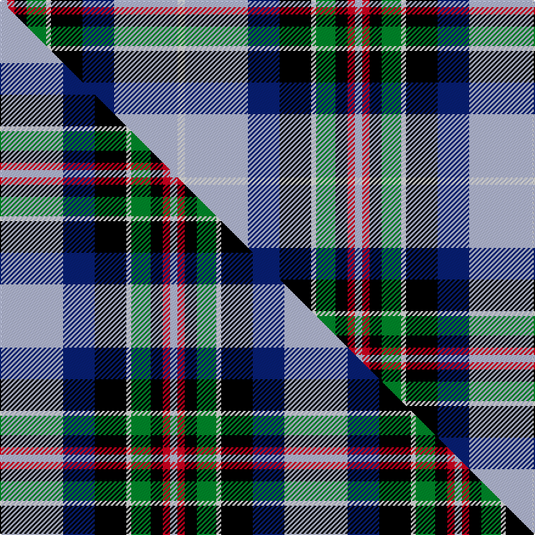

This page is one **sett** — a single exact thread-count. It belongs to the [tartan](/setts/w3lb26db13k13w2g8k5r3lb3/)
(the same proportion at any scale), whose colour order is pattern [WRKGWKBWW](/stripes/wrkgwkbww/).

Part of the [Moran](/tartans/moran/) tartan — the named design grouping this sett with its other cloths.

Sourced from tartans-authority.  It is a [9 stripe tartan](/stripes/stripes9/).

Original link https://www.tartanregister.gov.uk/tartanDetails.aspx?ref=3901

Dataset <small>— provenance for this record, inherited from the source manifest</small>

<dl class="dataset-prov">
<dt>source</dt><dd><a href="/sources/tartans-authority/">Scottish Tartans Authority</a></dd>
<dt>data captured from</dt><dd><a href="https://github.com/thetartan/tartan-database/blob/master/data/tartans-authority/data.csv">https://github.com/thetartan/tartan-database/blob/master/data/tartans-authority/data.csv</a></dd>
<dt>data date</dt><dd>2001 <small>(this record)</small></dd>
<dt>licence</dt><dd><a href="https://creativecommons.org/licenses/by-nc-nd/4.0/">CC BY-NC-ND 4.0</a></dd>
</dl>

Capture chain <small>— the hands this data passed through, oldest first; each capture carries its own licence</small>

<ol class="capture-chain">
<li><a href="https://www.tartansauthority.com/">Scottish Tartans Authority</a> <small>the heritage body's archive — its tartan-ferret record browser is retired (links repaired to the SRT, above)</small></li>
<li><a href="https://github.com/thetartan/tartan-database">thetartan/tartan-database</a> <small>2016-2017</small> · <a href="https://creativecommons.org/licenses/by-nc-nd/4.0/">CC BY-NC-ND 4.0</a> <small>Levko Kravets's frozen compilation — the capture we vendored, and where its CC licence text came from</small></li>
<li>this dictionary <small>captured 2026-06-10 · commit 5bf86c7566</small> <small>each re-capture is a git commit to data/sources</small></li>
</ol>

## Register references

External register numbers recorded for this tartan.

- Scottish Tartans Authority (ITI): 3901

## Thread count
LB/6 R6 K10 G16 W4 K26 DB26 LB52 W/6

One full sett is **292 threads**.

## Palette
<table><thead><tr><th>Colour</th><th>Shade</th><th>OKLCh</th></tr></thead><tbody><tr><td>LB</td><td><code style="background-color:#B5BBDE;">#B5BBDE</code> <small style="color:#888">#B5BBDE</small></td><td><small style="color:#888">oklch(79.9% 0.050 277.6)</small></td></tr><tr><td>DB</td><td><code style="background-color:#082077;">#082077</code> <small style="color:#888">#082077</small></td><td><small style="color:#888">oklch(30.0% 0.149 265.1)</small></td></tr><tr><td>G</td><td><code style="background-color:#008B2A;">#008B2A</code> <small style="color:#888">#008B2A</small></td><td><small style="color:#888">oklch(55.4% 0.170 145.9)</small></td></tr><tr><td>K</td><td><code style="background-color:#000000;">#000000</code> <small style="color:#888">#000000</small></td><td><small style="color:#888">oklch(0.0% 0.000 0.0)</small></td></tr><tr><td>W</td><td><code style="background-color:#F7F7F7;">#F7F7F7</code> <small style="color:#888">#F7F7F7</small></td><td><small style="color:#888">oklch(97.6% 0.000 89.9)</small></td></tr><tr><td>R</td><td><code style="background-color:#D60020;">#D60020</code> <small style="color:#888">#D60020</small></td><td><small style="color:#888">oklch(55.2% 0.224 25.5)</small></td></tr></tbody></table>

# Sample pattern

## Compared to the master

This cloth is one sett of its design; the master sett (the exemplar the design is anchored on) is below for comparison.

Its **ΔTartan distance** from the master is **0.30** — the same measure the nearest-tartans table ranks by (0 is identical; a re-scale of the same cloth is near 0, a recolour or a different proportion further).

<figure class="master-compare" style="margin:0">

this sett
master sett ★

<figcaption style="color:#888;font-size:smaller">One weave of this sett against the <a href="/setts/lb26db13k13w2g8k5r3lb3/">master sett ★</a>, split on the diagonal: a shared proportion runs seamlessly across it with only the shades shifting; a different proportion breaks on it.</figcaption>
</figure>

## Nearest tartan variants

The nearest existing variants by ΔTartan distance, with this cloth at the top so the swatches line up against it.

ΔTartan

Threads

Variant

Sett

—

292

<a href="/variants/s9/w3lb26db13k13w2g8k5r3lb3~x2/">Moran (Virgin Islands) (Personal)</a>

<a href="/ttd/edit/#slug=lb26db13k13w2g8k5r3lb3~x2&amp;base=w3lb26db13k13w2g8k5r3lb3~x2" title="compare in the TTD">0.30</a>

234

<a href="/variants/s8/lb26db13k13w2g8k5r3lb3~x2/">Moran (Coilessan) (Personal)</a>

<a href="/ttd/edit/#slug=b2w1b12db6k3dg1w1dg4w2k1w1r1~x4&amp;base=w3lb26db13k13w2g8k5r3lb3~x2" title="compare in the TTD">1.37</a>

268

<a href="/variants/s12/b2w1b12db6k3dg1w1dg4w2k1w1r1~x4/">Diana Princess of Wales Memorial, The</a>

<a href="/ttd/edit/#slug=g5db22g6k10w24y2db2w2r2~x2&amp;base=w3lb26db13k13w2g8k5r3lb3~x2" title="compare in the TTD">1.39</a>

286

<a href="/variants/s9/g5db22g6k10w24y2db2w2r2~x2/">Haymarket, dress Blue</a>

<a href="/ttd/edit/#slug=dp4k2w3k2db30g9k4w20dy3~x2~g2408144&amp;base=w3lb26db13k13w2g8k5r3lb3~x2" title="compare in the TTD">1.72</a>

294

<a href="/variants/s9/dp4k2w3k2db30g9k4w20dy3~x2~g2408144/">Minnesota Dress American District Tartan</a>

<a href="/ttd/edit/#slug=dp4k2w3k2db30g9k4w20dy3~x2&amp;base=w3lb26db13k13w2g8k5r3lb3~x2" title="compare in the TTD">1.76</a>

294

<a href="/variants/s9/dp4k2w3k2db30g9k4w20dy3~x2/">Minnesota Dress</a>

<a href="/ttd/edit/#slug=k16w6k4b64m19k8g42y6&amp;base=w3lb26db13k13w2g8k5r3lb3~x2" title="compare in the TTD">1.78</a>

308

<a href="/variants/s8/k16w6k4b64m19k8g42y6/">Unidentified (Woven sample)</a>

<a href="/ttd/edit/#slug=g5o2g2o9k9lb9db30w5~x2&amp;base=w3lb26db13k13w2g8k5r3lb3~x2" title="compare in the TTD">1.79</a>

264

<a href="/variants/s8/g5o2g2o9k9lb9db30w5~x2/">Alexander of Menstry (Personal)</a>

<a href="/ttd/edit/#slug=db48ly25dy15dr7w5db7k10w10~x2&amp;base=w3lb26db13k13w2g8k5r3lb3~x2" title="compare in the TTD">1.85</a>

392

<a href="/variants/s8/db48ly25dy15dr7w5db7k10w10~x2/">State Seal of Utah (Fashion)</a>

<a href="/ttd/edit/#slug=r3w2db27k19w27dp2y3~x2&amp;base=w3lb26db13k13w2g8k5r3lb3~x2" title="compare in the TTD">1.87</a>

320

<a href="/variants/s7/r3w2db27k19w27dp2y3~x2/">Christian Dress (Personal)</a>

<a href="/ttd/edit/#slug=db28r3w3r3w3r3db14k12lb38y8&amp;base=w3lb26db13k13w2g8k5r3lb3~x2" title="compare in the TTD">1.93</a>

194

<a href="/variants/s10/db28r3w3r3w3r3db14k12lb38y8/">GYL (Personal)</a>

## Neighbour map

Every grey dot is one of 13620 variants placed by the first two principal components of the ΔTartan feature space (42% of its variance). Red is this tartan; blue dots are its nearest — click one to open its page.

<svg viewBox="0 0 640 380" role="img" style="max-width:100%;height:auto;border:1px solid #e0e0e0;border-radius:4px;display:block" xmlns="http://www.w3.org/2000/svg"><image href="/nn/cloud.v1.png" width="640" height="380"/><a href="/variants/s8/lb26db13k13w2g8k5r3lb3~x2/"><circle cx="106.3" cy="141.0" r="4" fill="#3465a4"><title>Moran (Coilessan) (Personal)</title></circle></a><a href="/variants/s12/b2w1b12db6k3dg1w1dg4w2k1w1r1~x4/"><circle cx="120.1" cy="117.3" r="4" fill="#3465a4"><title>Diana Princess of Wales Memorial, The</title></circle></a><a href="/variants/s9/g5db22g6k10w24y2db2w2r2~x2/"><circle cx="93.1" cy="130.0" r="4" fill="#3465a4"><title>Haymarket, dress Blue</title></circle></a><a href="/variants/s9/dp4k2w3k2db30g9k4w20dy3~x2~g2408144/"><circle cx="122.6" cy="113.9" r="4" fill="#3465a4"><title>Minnesota Dress American District Tartan</title></circle></a><a href="/variants/s9/dp4k2w3k2db30g9k4w20dy3~x2/"><circle cx="123.2" cy="113.9" r="4" fill="#3465a4"><title>Minnesota Dress</title></circle></a><a href="/variants/s8/k16w6k4b64m19k8g42y6/"><circle cx="135.1" cy="128.3" r="4" fill="#3465a4"><title>Unidentified (Woven sample)</title></circle></a><a href="/variants/s8/g5o2g2o9k9lb9db30w5~x2/"><circle cx="130.8" cy="127.5" r="4" fill="#3465a4"><title>Alexander of Menstry (Personal)</title></circle></a><a href="/variants/s8/db48ly25dy15dr7w5db7k10w10~x2/"><circle cx="121.5" cy="155.0" r="4" fill="#3465a4"><title>State Seal of Utah (Fashion)</title></circle></a><a href="/variants/s7/r3w2db27k19w27dp2y3~x2/"><circle cx="111.1" cy="138.7" r="4" fill="#3465a4"><title>Christian Dress (Personal)</title></circle></a><a href="/variants/s10/db28r3w3r3w3r3db14k12lb38y8/"><circle cx="117.9" cy="124.1" r="4" fill="#3465a4"><title>GYL (Personal)</title></circle></a><circle cx="95.1" cy="132.8" r="5" fill="#c00000"/><text x="320" y="376" text-anchor="middle" font-size="11" fill="#999">ground</text><text x="11" y="190" text-anchor="middle" font-size="11" fill="#999" transform="rotate(-90 11 190)">complexity</text></svg>

ID: /variants/s9/w3lb26db13k13w2g8k5r3lb3~x2/
