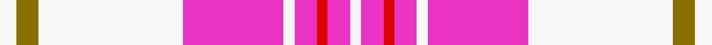

This page is one **sett** — a single exact thread-count. It belongs to the [tartan](/setts/w3y4w26m18w2m4r2m4w2/)
(the same proportion at any scale), whose colour order is pattern [WGWRWRRRW](/stripes/wgwrwrrrw/).

Sourced from register-of-tartans.  It is a [9 stripe tartan](/stripes/stripes9/).

Original link https://www.tartanregister.gov.uk/tartanDetails.aspx?ref=11509

## Register references

External register numbers recorded for this tartan.

- Scottish Register of Tartans: [11509](https://www.tartanregister.gov.uk/tartanDetails.aspx?ref=11509)

## Thread count
W/6 Y8 W52 M36 W4 M8 R4 M8 W/4

One full sett is **250 threads**.

## Palette
<table><thead><tr><th>Colour</th><th>Shade</th><th>OKLCh</th></tr></thead><tbody><tr><td>LR</td><td><code style="background-color:#EC34C4;">#EC34C4</code> <small style="color:#888">#EC34C4</small></td><td><small style="color:#888">oklch(65.8% 0.255 338.8)</small></td></tr><tr><td>R</td><td><code style="background-color:#DC0000;">#DC0000</code> <small style="color:#888">#DC0000</small></td><td><small style="color:#888">oklch(56.2% 0.230 29.2)</small></td></tr><tr><td>W</td><td><code style="background-color:#F7F7F7;">#F7F7F7</code> <small style="color:#888">#F7F7F7</small></td><td><small style="color:#888">oklch(97.6% 0.000 89.9)</small></td></tr><tr><td>Y</td><td><code style="background-color:#8B6E00;">#8B6E00</code> <small style="color:#888">#8B6E00</small></td><td><small style="color:#888">oklch(55.1% 0.113 90.4)</small></td></tr></tbody></table>

# Sample pattern

ID: /variants/s9/w3y4w26m18w2m4r2m4w2~x2~m2610337-r2209032/
